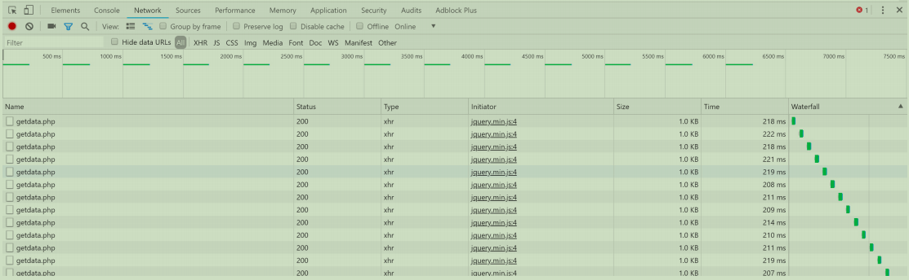

# Swoole基础
## 1.Swoole 理解
````
woole官网：https://www.swoole.com/ 
swoole文档：https://wiki.swoole.com/ 
开源中国源码：https://gitee.com/swoole/swoole/tree/master/
````
根据swoole的介绍：Swoole是一个为PHP用C和C++编写的基于事件的高性能异步& 协程并行网络通信引擎

拆分理解：
- swoole是一个php的扩展， 是由C/C++编辑的
- swoole是基于事件的 高性能异步&协程并行的网络通信引擎 

根据关键词理解事件，异步-协程并行，网络通信引擎;
- 什么是事件？
>就是某一个动作发生的时候就可以称之为事件，例子：前台js的鼠标点击事件
- 异步-协程并行
>暂时可以理解为只是一种程序执行的模式
- 网络通信引擎
>网络就是程序之间的数据交流的连接，从而达到资源共享和通信的目的。通信是人与人之间通过某种媒体进行的信息交流与传递。网络通信是通过网络将各个鼓励的设备进行连接，通过信息交换实现人与人，人与计算 机，计算机u计算机兼职的通信，网络通信最终要的就是网络通信协议。

#### 1.1 swoole具备什么功能？
- http服务 ，编写一个简单的web server。 
- TCP/UDP服务 ，编写一个消息接受处理系统。 
- 异步，可以异步的处理请求。 并发 ，可以并发的处理同一个业务逻辑。 
- socket，socket通讯处理技术。 
- 毫秒级别定时器，可以在php中使用定时器了。 
- 协程，相比线程更稳定和好用。
#### 1.2 swoole的应用
关于 b/s 与 c/s


``本质就在于c/s(客户端/服务端)应用``,swoole更趋向于c/s的服务,但是b/s模型服务也可以做
>关于 c/s 这是一个相对而论的概念,谁需要服务谁就是客户端,谁提供服务谁就是服务端


学习swoole就是在学习``网络通信``

如果你的业务中，有用到以上等特性，你又在用使用php，那么完全可以用swoole来完成了
````
1. 互联网 
2. 移动通信 
3. 企业软件 
4. 云计算 
5. 网络游戏 
6. 物联网（IOT）
 7. 车联网 
8. 智能家居等领域
````
可以配合与传统型框架比如laravel，thinkphp6.0进行加速（注意这些框架是ioc容器为核心的）
#### 1.3 基于swoole框架
Swoft
>首个基于 Swoole 原生协程的新时代 PHP 高性能协程全栈框架，内置协程网络服务器及常用的协程客户端，常驻内存，不依赖传统的 PHP-FPM，全异步非阻塞 IO 实现，以类似于同步客户端的写法实现异步客户端的 使用，没有复杂的异步回调，没有繁琐的 yield, 有类似 Go 语言的协程、灵活的注解、强大的全局依赖注入容器、完善的服务治理、灵活强大的 AOP、标准的 PSR 规范实现等等，可以用于构建高性能的Web系统、 API、中间件、基础服务等等。

EasySwoole EasySwoole
>是一款基于Swoole Server 开发的常驻内存型PHP框架，专为API而生，摆脱传统PHP运行模式在进程唤起和文件加载上带来的性能损失。EasySwoole 高度封装了Swoole Server 而依旧维持Swoole Server 原有特性，支持 同时混合监听HTTP、自定义TCP、UDP协议，让开发者以最低的学习成本和精力编写出多进程，可异步，高可用的应用服务。

SwooleDistributed SwooleDistributed
>老牌Swoole框架拥有最完善的开发工具以及最强大的功能，首创SDHelper开发者工具包和开发者调试命令集，可以进行单元测试，捕获客户端流量分析，可视化的进行远程断点联调，还具备代码覆盖率检测的功能 （swoole与xdebug扩展不兼容，SDHelper无需xdebug扩展），并且内置组件极其丰富（类MQTT强悍的订阅发布/Actor模型/内存高速缓存/事件派发/进程管理/定时任务/AMQP任务调度/后台监控/集群/微服务/RPC/异 步连接池/自定义命令等等），开发者可以直接使用加快开发进度。几乎所有的功能都支持集群化，单机切换到集群无需对代码做任何的修改。如果业务开发比较复杂比如（游戏开发）那么SD框架将是你的不二之选

#### 1.4 什么是socket?
>“网络上的两个程序通过一个双向的通信连接实现数据的交换，这个连接的一端称为一个socket。建立网络通信连接至少要一对端口号(socket)。socket本质是编程接口(API)，
对TCP/IP的封装，TCP/IP也要提供可供程序员做网络开发所用的接口，这就是Socket编程接口；HTTP是轿车，提供了封装或者显示数据的具体形式；Socket是发动机，提供了网络通信的能力"

socket与swoole的区别是什么?
>socket是系统提供的对tcp/ip操作的接口，swoole这是对socket在进行一个封装并提供php操作接口的php扩展

#### 1.5 swoole体验及客户端与服务端
``注意在练习的时候建议设置可以关闭防火墙``

以tcp服务为例解释：
>server
````
<?php 
// 1. 创建swoole 默认创建的是一个同步的阻塞tcp服务 
$host = "192.168.186.129"; // 0.0.0.0 代表接听所有 
// 创建Server对象，监听 127.0.0.1:9501端口 
// 默认是tcp 
$serv = new Swoole\Server($host, 9501); 

// 2. 注册事件 
$serv->on('Start', function($serv){ 
    echo "启动swoole 监听的信息tcp:$host:9501\n"; 
}); 

//监听连接进入事件 
$serv->on('Connect', function ($serv, $fd) { 
    echo "Client: Connect.\n"; 
}); 

//监听数据接收事件 
$serv->on('Receive', function ($serv, $fd, $from_id, $data) { 
    $serv->send($fd, "Server: ".$data); 
}); 

//监听连接关闭事件 
$serv->on('Close', function ($serv, $fd) { 
    echo "Client: Close.\n"; 
}); 

// 3. 启动服务器 
// 阻塞 
$serv->start(); // 阻塞与非阻塞
````

计算中的client与server
>这样的事情在计算中也是有的，其实我们每天都在接触和使用只是没有这个概念，比如php连接MySQL，我们的连接方式就是通过pdo 传递用户名，密码，MySQL服务ip，端口号3306的方式连接了；
>
>这个过程中MySQL就是服务端，PHP就是客户端；

对于计算机来说
>计算在运行程序的时候会分配一个端口号来运行而一台计算机可分配的端口号有1-65535的范围，访问计算的方式就是通过在该计算的网络段去进行访问的。
>
>在服务端与客户端通信中主要是根据与服务端提供的可访问的ip地址，以及端口号；
>
>但是在通信的时候我们需要一个通信的方式 这个方式我们称之为协议；比如http协议；该协议方式的是最为常见的方式，而然除了这种方式以外还存在于其他的方式比如tcp，udp等，有时候为了通信的安全会选择对于 协议设置一些加密的手段
>
>但是在服务中还存在于一些功能就是，服务就需要接收和主动向关联它的客户端发送一些信息；比如微信公众号的群发，同样客户端也会发送和接收稍息
>
>在服务端的设置-》 因为服务端与客户端是一对多的方式，因此为了全部监听接收到稍息那么就需要配置监听为0.0.0.0；
>
>对于服务端和客户端，在进行交互的时候主要是以事件的方式作为驱动，发送事件，接收事件，连接事件，关闭事件

---
## 2.[同步与异步](https://www.cnblogs.com/orez88/articles/2513460.html)
>对于程序的执行流程来说，一般是从上而下的方式来执行， 除非遇到流程控制语句会有一些变化， 但是原则上都会遵循这个原则； 对于PHP来说在单线程的模式下那么一个进程在执行PHP代码的时候就会从第一行执
 行到最后一行，那么这个过程我们就可以认为这是同步的，如果中间遇到了sleep()就不得不等待一下执行； 这种模式基本上可以满足于很多的应用场景；
>
>但是并不是绝对的比如：像微信 在网站上登入的时候就会发一条信息在自己的微信账号上提醒你登入了 ， 再比如一份订单生成了之后对于用户来说并不会立即收到货，而这个发货的过程我们就可以做成异步的任务由
 库存模块处理 等等操作；

## 3.阻塞与非阻塞
>阻塞：意思就是在哪里等待，要等别人执行完成才能往下去执行；
>
> 非阻塞：就是程序可以不用等待执行的结果， 就可以进行下一步的操作；
````
例子:
你打电话问书店老板有没有《分布式系统》这本书，你如果是阻塞式调用，你会一直把自己“挂起”，
直到得到这本书有没有的结果，如果是非阻塞式调用，你不管老板有没有告诉你，你自己先一边去玩了， 
当然你也要偶尔过几分钟check一下老板有没有返回结果。在这里阻塞与非阻塞与是否同步异步无关。
跟老板通过什么方式回答你结果无关。
````
代码获取
````
链接：https://pan.baidu.com/s/1CahM-icasHWO4pdhgeouAg 
提取码：qfhu
````
演示:
>那么在这个过程中对于对于order.php来说， 在我们向控制台输入了一个任务之后


>程序就在等待任务下一个信息的输入，那么这个过程我们就可以认为它是同步阻塞的； 但是对于inventory.php来说，他并不需要等待order.php是否执行完才执行


>对于阻塞与非阻塞的专有称呼有，``同步阻塞``，``同步非阻塞``，``异步阻塞``，``异步非阻塞``；而实际上我们并``不需要关注同步非阻塞与异步阻塞``，同步非阻塞在实现的过程中会存在一些复杂度可以采用异步非阻塞的方式巧妙地解决好；而``异步阻塞其实本身意义就并不大``

## 4.swoole中的异步回调


上面这种方式在新版本里面已经不支持了


对照你的swoole版本[安装](https://github.com/swoole/ext-async/),这里是4.4.5的

````
安装过程:
1. unzip ext-async-4.4.5.zip
2. cd ext-async-4.4.5
3. phpize
4. find / -name php-config(找到php-config目录)
5. ./configure --with-php-config=/usr/local/php/bin/php-config
6.  make && make install
7. find / -name php.ini
8.  vim /usr/local/php/etc/php.ini , 添加 ``extension=swoole_async.so``
9. 重启php-fpm
10. [root@localhost ext-async-4.4.5]# php -m | grep swoole
 swoole
 swoole_async
````
服务端:
````
<?php
// 1. 创建swoole 默认创建的是一个同步的阻塞tcp服务
//$host = "0.0.0.0"; // 0.0.0.0 代表接听所有
// 创建Server对象，监听 127.0.0.1:9501端口
// 默认是tcp
$serv = new Swoole\Server("0.0.0.0", 9000);
// 添加配置
//$serv->set([
//  'heartbeat_idle_time' => 10,
//  'heartbeat_check_interval' => 3,
//]);
// 2. 注册事件
$serv->on('Start', function($serv){
    echo "启动swoole 监听的信息tcp:0.0.0.0:9000\n";
});

//监听连接进入事件
$serv->on('Connect', function ($serv, $fd) {
    echo "Client: Connect.\n";
});

//监听数据接收事件
$serv->on('Receive', function ($serv, $fd, $from_id, $data) {
    $serv->send($fd, "Server: ".$data);
});

//监听连接关闭事件
$serv->on('Close', function ($serv, $fd) {
    echo "QQ离线.\n";
});
// 3. 启动服务器
// 阻塞
$serv->start(); // 阻塞与非阻塞

````
创建一个同步客户端
````
<?php
$client = new swoole_client(SWOOLE_SOCK_TCP);
//连接到服务器
if (!$client->connect('127.0.0.1', 9000,0.5)){
    die("connect failed.");
}
//向服务器发送数据
if (!$client->send("hello world")){
    die("send failed.");
}
//从服务器接收数据
$data = $client->recv();
if (!$data){
    die("recv failed.");
}
echo $data."\n";
//关闭连接
$client->close();
echo "欢迎连接\n";
?>
````


[创建一个异步客户端](https://wiki.swoole.com/wiki/page/1524.html)
````
use Swoole\Async\Client;

$client = new Client(SWOOLE_SOCK_TCP);

$client->on("connect", function(Client $cli) {
    $cli->send("GET / HTTP/1.1\r\n\r\n");
});
$client->on("receive", function(Client $cli, $data){
    echo "Receive: $data";
    $cli->send(str_repeat('A', 100)."\n");
    sleep(1);
});
$client->on("error", function(Client $cli){
    echo "error\n";
});
$client->on("close", function(Client $cli){
    echo "Connection close\n";
});
$client->connect('127.0.0.1', 9501);
````


>发现同步的``echo``内容在后面,异步的``echo``在前面

## 5.长连接与心跳检测
### 5.1 长连接
>须知：服务器建立和关闭连接均是会有资源的消耗的

>长连接：其实就是一直连接的方式
>
>短连接：主要是建立一次连接，就没有了 ajax
````
ajax的特点就是主动向服务器发送请求，获取数据之后处理；那么我们为什么需要长连接呢？

比如：在做即时聊天的时候-》QQ，不管是客户端还是服务端；在用户发送了消息之后就需要能接收到并且又能够接收到服务器发送的消息；

我们可以通过与ajax来实现这个功能；—》代码 ， 但是ajax在实现代码的时候因为它的特点只能是主动请求, 因此如果我们需要用ajax来实现的话那么这个时候就不得不让ajax进行轮询；
````

````
可以看到前台不断的通过ajax请求与后台获取数据;并进行响应和输出;如果说是单台服务器并且只是单个连接,其实问题不大;
但是如果说链接很多那么服务器就会存在这很大的压力； 在这个过程中服务器会不断
的创建连接关闭连接会消耗很多不必要的资源； =》 这个时候短连接就无法满足与我们项目的功能的需要 因此就需要长连接的帮助了；
其实还存在一个问题服务端也需要主动发送消息给客户端；
````
### 5.2 心跳检测
>首先须知： 对于服务端来说信息“基本”是公开的 比如ip地址，状态基本是在运行状态； 那么客户端呢？实际上客户端并不是这么一回事，他的运行状态，ip地址不是固定的；

而对于长连接这种断开的问题；主要的点就在于服务端会保存客户端会话的有效性以及平台上监控所有客户端的网络状况；对于这种功能的实现我们可以通过两种方式实现
- 轮询机制
>轮询：``概括来说是服务端定时主动的去与要监控状态的客户端（或者叫其他系统）通信，询问当前的某种状态，客户端返回状态信息``，客户端没有返回或返回错误、失效信息、则认为客户端已经宕机，然后服务端自己内部把这个客户端的状态保存下来（宕机或者其他），如果客户端正常，那么返回正常状态，如果客户端宕机或者返回的是定义的失效状态那么当前的客户端状态是能够及时的监控到的，如果客户端宕机之后重启了那么当服务端定时来轮询的时候，还是可以正常的获取返回信息，把其状态重新更新。
- 心跳机制
>心跳：最终得到的结果是与轮询一样的但是实现的方式有差别，心跳不是服务端主动去发信息检测客户端状态，而是``在服务端保存下来所有客户端的状态信息，然后等待客户端定时来访问服务端，更新自己的当前状态``，如果客户端超过指定的时间没有来更新状态，则认为客户端已经宕机或者其状态异常。

>心跳机制与轮询的比较，在我们的应用中，采用的是心跳，这样``一是避免服务端的压力，二是灵活好控制``，上一篇文章中提到过，我们的外网服务端（服务端）不知道内网服务端（客户端）的地址，有虽然有保存客户端的socket会话，但是客户端宕机会话就失效了。所以只能等着他主动来报告状态
>
>注意：在``客户端向服务端发送的标识我们可以称之为叫心跳包``

什么是心跳包呢?
>从客户端到服务器这条巨大的链路中会经过无数的路由器，每个路由器都可能会检测多少秒时间内没有数据包，则会自动关闭连接的节能机制。为了让这个可能会出现的节能机制失效,客户端可以设置一个定时器，每隔固定时间发送一个随机字符一 字节的数据包，这种数据包就是心跳包。

### 5.3 [swoole中的心跳检测](https://wiki.swoole.com/#/server/setting)
在swoole中我们可以通过set的方式来设置参数值(以秒为单位)
- ``heartbeat_check_interval`` 设置服务器定时检测在线列表的时间间隔
- ``heartbeat_idle_time`` 设置连接最大的空闲时间，如果最后一个心跳包的时间与当前时间只差超过设定值则认为连接失效。
>建议``heartbeat_idle_time ``比``heartbeat_check_interval`` 的值多两倍多，两倍是为了进行容错允许丢包，多一点儿是考虑到网络延时的情况，这个可以根据实际的业务情况调整容错率。


测试:
````
服务端:

<?php
// 1. 创建swoole 默认创建的是一个同步的阻塞tcp服务
//$host = "0.0.0.0"; // 0.0.0.0 代表接听所有
// 创建Server对象，监听 127.0.0.1:9501端口
// 默认是tcp
$serv = new Swoole\Server("0.0.0.0", 9000);
// 添加配置
$serv->set([
  //设置服务器定时检测在线列表的时间间隔
  'heartbeat_check_interval' => 3,
   //设置客户端连接最大的空闲时间
  'heartbeat_idle_time' => 10,
]);
// 2. 注册事件
$serv->on('Start', function($serv){
    echo "启动swoole 监听的信息 tcp:0.0.0.0:9000\n";
});

//监听连接进入事件
$serv->on('Connect', function ($serv, $fd) {
    echo "Client: Connect,id为".$fd."\n";
});

//监听数据接收事件
$serv->on('Receive', function ($serv, $fd, $from_id, $data) {
    $serv->send($fd, "Server: ".$data);
});

//监听连接关闭事件
$serv->on('Close', function ($serv, $fd) {
    echo "您已离线.\n";
});
// 3. 启动服务器
// 阻塞
$serv->start(); 
````
````
客户端:
<?php
// 异步客户端
use Swoole\Async\Client;

$client = new Client(SWOOLE_SOCK_TCP);

$client->on("connect", function(Client $cli) {
    $cli->send("我已连接到服务端\r\n\r\n");
});
$client->on("receive", function(Client $cli, $data){
      echo "Receive $data";
});
$client->on("error", function(Client $cli){
    echo "error\n";
});
$client->on("close", function(Client $cli){
    echo "Connection close\n";
});
$client->connect('127.0.0.1', 9000);
````
>效果：根据如上的代码来说就是服务端会检测客户端的访问，如果说服务端在10秒内没有收到信息，就关闭客户端的连接


### 5.4 [swoole客户端下的处理](https://wiki.swoole.com/#/timer?id=tick)
>可以看到如上的效果就是服务端，就会通过检测发现用户在``10秒内没有收到client的请求的时候就断开了连接``；我们就可以通过让客户端定时的向服务端发送一个心跳包，提醒服务端；``双方是建立了连接的关系的定时器可以放在服务器中也可以放在客户端中``


可以看到swoole的定时可以直接定位到毫秒级别，相比起linux的定时器更加的精确（linux定时器是 精确到分）；而在其中swoole提供的两个定时器类型有
- swoole_timer_tick : 每隔固定时间执行某一个方法，会返回定时器id
- swoole_timer_after : 在规定的时间后执行，只执行一次，会返回定时器id
- swoole_timer_clear ：清空定时器，条件是定时器的id

测试:
````
服务端:

<?php
// 默认是tcp
$serv = new Swoole\Server("0.0.0.0", 9000);
// 添加配置
$serv->set([
  'heartbeat_idle_time' => 10,
  'heartbeat_check_interval' => 3,
]);
// 2. 注册事件
$serv->on('Start', function($serv){
    echo "启动swoole 监听的信息 tcp:0.0.0.0:9000\n";
});

//监听连接进入事件
$serv->on('Connect', function ($serv, $fd) {
    echo "Client ".$fd.": Connect.\n";
});

//监听数据接收事件
$serv->on('Receive', function ($serv, $fd, $from_id, $data) {
    $serv->send($fd, "Server: ".$data);
});

//监听连接关闭事件
$serv->on('Close', function ($serv, $fd) {
    echo "Client: ".$fd."已经下线.\n" ;
});
// 3. 启动服务器
// 阻塞
$serv->start(); // 阻塞与非阻塞
````
````
客户端:

<?php
// 异步客户端
use Swoole\Async\Client;

$client = new Client(SWOOLE_SOCK_TCP);

$client->on("connect", function(Client $cli) {
    $cli->send("我已连接到服务端\r\n\r\n");
});
$client->on("receive", function(Client $cli, $data){
      //echo "Receive $data";
});
$client->on("error", function(Client $cli){
    echo "error\n";
});
$client->on("close", function(Client $cli){
    echo "Connection close\n";
});
$client->connect('127.0.0.1', 9000);

//旧版本写法
//swoole_timer_tick(8000, function($timer_id) use ($client) {
//    echo "定时发送信息";
//    $client->send(1);
//});

//新版本写法
Swoole\Timer::tick(1000, function()use ($client){
    $client->send(1);
});
````


## 6.[udp](https://wiki.swoole.com/#/start/start_udp_server)与[tcp](https://wiki.swoole.com/#/start/start_tcp_server)

创建一个udp服务端
````
服务端:

<?php
//创建Server对象，监听 127.0.0.1:9502端口，类型为SWOOLE_SOCK_UDP
$serv = new Swoole\Server("127.0.0.1", 9502, SWOOLE_PROCESS, SWOOLE_SOCK_UDP); 

//监听数据接收事件
$serv->on('Packet', function ($serv, $data, $clientInfo) {
    $serv->sendto($clientInfo['address'], $clientInfo['port'], "Server ".$data);
    var_dump($clientInfo);
});

//启动服务器
$serv->start();
````
>我们可以看到在官网中是存在这一个问题， 那就是upd与tcp不同，就是``upd可以不用客户进行connect``  ，就可以直接访问服务端的信息；而在服务端中就会存在只有对应接收信息的``onPacket``方法
>
>创建upd客户端，对于客户端的创建方式实际上并不是特别难，``与tcp的同步客户端创建有一些类似``
````
客户端(手册中没有udp的客户端):

<?php
$client = new swoole_client(SWOOLE_SOCK_UDP);
// 为什么不需要连接
//向服务器发送数据
$client->sendTo("127.0.0.1", 9502, "你好我是udp客户端");
//从服务器接收数据
$data = $client->recv();
echo "其他事情\n";
?>
````


>注意如果udp没有执行 $serv->sendto($clientInfo['address'], $clientInfo['port'], "Server ".$data); 也就是向客户端发送消息那么这个时候就会，客户端阻塞

