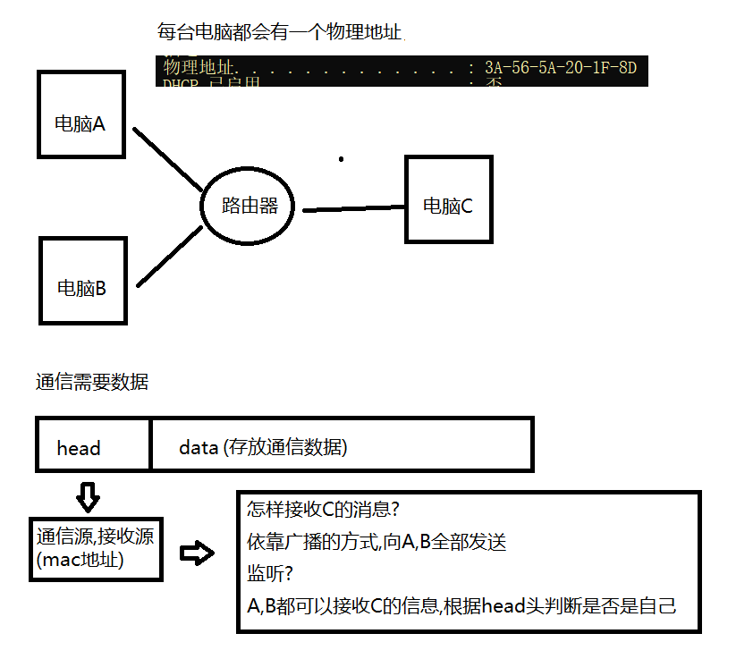

# 网络协议与tcp问题
## 0.补充
1.我们可以通过tcp的服务端访问swoole的服务端


2.http服务端的访问:
````
<?php
use Swoole\Http\Server;

$http = new Server("0.0.0.0", 9501);
$http->on('request', function ($request, $response) {
    $response->end("<h1>Hello Swoole. #".rand(1000, 9999)."</h1>");
});
$http->start();
````


通过nginx访问swoole的http服务端:
````
location / {
          proxy_pass http://192.168.100.138:9501/;
        }
````
>当请求80端口的时候进行一个服务的转发(nginx是在另一台服务器上)


## 1.协议分层


### (早期)物理层:


### 数据链路层:


### 网络层
这样看来,我们可以凭借mac地址完成不同地区的通信(北京->上海),输出全靠吼(广播),但是这种通信方式如果放在全国范围内,你向具体的对象发送消息,但是所有人都能接受到,可能不是很私密,这是我们就诞生了``IP协议``


### 传输层


### 应用层 及 socket


---
>TCP/IP协议族是一个四层协议系统，``自底而上``分別是``数据链路层``、``网络层``、``传输层``和``应用层``。每一层完成不同的功能，且通过若干协议来实现，上层协议使用下层协议提供的服务


- 数据链路层
>数据链路层实现了网卡接口的网络驱动程序，以处理数据在物理媒介上的传输。
>
>数据链路展两个常用的协议是ARP协议（Address Resolve Protocol,地址解析协议）和RARP协议（Reverse Address Resolve Protocol,逆地址解析协议）.它们实现了 IP地址和机器物理地址（MAC地址）之间的相互转换
>
>当数据交换时上层网络层使用IP地址寻找一台机器，而数据链路层使用物理地址寻找一台机器，因此网络层必须先将目标标机器的IP地址转化成其物理地址,才能使用数据链路提供的服务，这就 ARP协议的用途
- 网络层
>网络层实现数据包的选路和转发，网络层最核心的协议是IP协议（Internet Protocol,因特网协议）。IP协议根据数据包的目的IP地址来决定如何投递它。
>
>网络层另外一个重要的协议足ICMP协议（Internet Control Message Protocol»因特网控制制报文协议）。它是IP协议的重要要补充，主要用于检测网络连接，比如可以通过发送报文来检测目标是否可达
- 传输层
>网络层当中的IP协议为了解决传输当中的路径选择的问题，只需要按照此路径传输数据即可，传输层利用udp或者tcp协议以及网络层提供的路径信息为基础完成实际的数据传输，所以称为传输层
- 应用层
>应用层负责处理应用程序的逻辑。数据链路层、网络层和传输层负责处理网络通讯细节，这部分必须既稳定又高效,因此它们都在内核空间中实现，应用层则负责在用户户空间实现，因为为它负责处理众多逻辑。

应用层协议举例：FTP文件传输协议是TCP/IP网络上两台计算机传送文件的协议

## 2. tcp与udp介绍与区别
TCP:


>***TCP(Transmission Control Protocol传输控制协议): *** 是一 种面向连接的、可靠的、基于字节流的传输层通信协议，使用``三次握手协议建立连接、四次挥手断开连接``。面向连接意味着两个使用TCP的应用(通常是一个客户端和一 个服务器)在彼此交换数据包之前必须先建立一一个TCP连接。
>
>在一个TCP连接中，仅有两方进行彼此通信，广播和多播不能用TCP。``TCP协议的作用是，保证数据通信的完整性和可靠性，防止丢包``。
>
>TCP把连接作为最基本的对象,每一条TCP连接都有两个端点, 这种端点我们叫作套接字(socket),端口号拼接到IP地址即构成了套接字

UDP


>***UDP(User Datagram Protocol用户数据报协议): *** 是OSI(Open System Interconnection开放式系统互联)参考模型中- -种无连接的传输层协议，``提供面向事务的简单不可靠信息传送服务``。``UDP协议的主要作用是将网络数据流量压缩成数据包的形式``。

区别:
- ``TCP``提供的是``面向连接的、可靠的数据流传输``; ``UDP``提供的是``非面向连接的、不可靠的数据流传输``。
- ``TCP``提供可靠的服务，通过TCP连接传送的数据，``无差错、不丢失、不重复，按序到达``; ``UDP``尽最大努力交付，即``不保证可靠交付``。
- TCP面向字节流; UDP面向报文。
- ``TCP``连接只能是``点到点``的; ``UDP``支持``一对一、一对多 多对一和多对多``的交互通信。
- ``UDP``具有较好的实时性，``工作效率比TCP高``，适用于对高速传输和实时性有较高的通信或广播通信。
- TCP对系统资源要求较多，UDP对系统资源要求较少。TCP首部有20字节; UDP的首部只有8个字节。
- TCP的逻辑通信信道是全双工的可靠信道; UDP的逻辑通信信道是不可靠信道
### 2.1 tcp详解
TCP协议简介 TCP是TCP/IP体系中非常复杂的一个协议，TCP最主要的特点有:
- TCP面向连接的运输层协议。``应用程序在使用TCP协议之前``，必须``先建立TCP连接``。在``传递数据完毕后``，``必须释放``已建立的TCP连接。
- 每一条TCP连接只能有两个端点，只能说``点对点``的。
- TCP提供可靠交付的服务，通过TCP连接传送的数据，``无差错，不丢失，不重复，并且按序到达``。
- ``TCP提供全双工通信``。TCP允许通信双方的应用进程在任何时候都能发送数据。TCP连接的两端都设有发送缓存和接收缓存，用来临时存放双向通信的数据。
- 面向字节流。TCP中的“流”指的是流入到进程或从进程流出的字节序列。“面向字节流”的含义是:虽然应用程序和TCP的交互是一次一个数据块(大小不等)，但TCP把应用程序交下来的数据看成仅仅是一连串的无结构的字节流。TCP并不知道所传送的字节流的含义。TCP不保证接收方应用程序所收到的数据块和发送方应用程序所发出的数据块具有对应大小的关系。但接收方应用程序收到的字节流必须和发送方应用程序发出的字节流完全一样。 当然，接收方的应用程序必须有能力识别收到的字节流，把它还原成有意义的应用层数据

- 可靠传输
- 流量控制
- 拥塞控制
### 2.2 tcp 问题
数据发送问题:
>tcp在发送数据的时候因为存在数据缓存的关系，对于数据在发送的时候在 短时间内 如果连续发送很多小的数据的时候就会有可能一次性一起发送，还有就是对于大的数据就会分开连续发送多次

演示:
````
服务端:

<?php
//创建Server对象，监听 127.0.0.1:9501端口
$serv = new Swoole\Server("0.0.0.0", 9501);

//这里需要一个心跳的检测
$serv->set([
        'heartbeat_check_interval'=>3, //服务器定时检查
        'heartbeat_idle_time'=>6//连接最大的空闲时间
 ]);

//监听连接进入事件
$serv->on('Connect', function ($serv, $fd) {
    echo "Client: Connect.\n";
});

//监听数据接收事件
$serv->on('Receive', function ($serv, $fd, $from_id, $data) {
    echo "接收到".$fd."的信息,数据包为".$data."\n";
    $serv->send($fd, "Server: ".$data);
});

//监听连接关闭事件
$serv->on('Close', function ($serv, $fd) {
    echo "Client: Close.\n";
});

//启动服务器
$serv->start();
````
````
客户端:

<?php
$client = new swoole_client(SWOOLE_SOCK_TCP);

//连接到服务器
if (!$client->connect('0.0.0.0', 9501, 0.5))
{
    die("connect failed.");
}
//向服务器发送数据
for($i = 0 ; $i <= 10 ; $i++){
   // sleep(1);
    $client->send($i);
};

//从服务器接收数据
$data = $client->recv();
if (!$data)
{
    die("recv failed.");
}
echo $data;
//关闭连接
$client->close();
````
>当客户端发送消息不设置``sleep``属性的时候


如上的情况就是多份数据变成了一份然后进行发送给了客服端，这种情况用一种专业的词：粘包

所谓粘包就是，一个数据在发送的时候跟上了另一个数据的信息，另一个数据的信息可能是完整的也可能是不完整的；

出现的原因：
- 出现粘包现象的原因是多方面的，它既可能由发送方造成，也可能由接收方造成。发送方引|起的粘包是由TCP协议本身造成的, TCP为提高传输效率,发送方往往要收集到足够多的数据后才发送一包数据。 若连续几次发送的数据都很少，通常TCP会根据优化算法把这些数据合成- -包后- 次发送出去，这样接收方就收到了粘包数据。
- 接收方引起的粘包是由于接收方用户进程不及时接收数据，从而导致粘包现象。这是因为接收方先把收到的数据放在系统接收缓冲区，用户进程从该缓冲区取数据，若下一-包数据到达时前一-包数据尚未被用户进程取走,则下一包数据放到系统接收缓冲区时就接到前一包数据之后，而用户进程根据预先设定的缓冲区大小从系统接收缓冲区取数据，这样就一-次取到了 多包数据。


>当设置了``sleep``属性之后


>数据会暂时的存放在缓冲区(这了sleep(1))1秒钟