# tcp粘包问题以及swoole的运行
## 1.tcp问题
数据发送问题：
>tcp在发送数据的时候因为存在数据缓存的关系，对于数据在发送的时候在 短时间内 如果连续发送很多小的数据的时候就会有可能一次性一起发送，还有就是对于大的数据就会分开连续发送多次,udp不会出现粘包问题

### 1.1 一起发演示:
````
服务端:

<?php
//创建Server对象，监听 127.0.0.1:9501端口
$serv = new Swoole\Server("127.0.0.1", 9501);
$serv->set([
    //心跳检测,每三秒检测一次，10秒没活动就断开
    'heartbeat_idle_time'=>6,//连接最大的空闲时间
    'heartbeat_check_interval'=>3 //服务器定时检查
]);
//监听连接进入事件
$serv->on('Connect', function ($serv, $fd) {
echo "Client ".$fd.": Connect.\n";
});
//监听数据接收事件
$serv->on('Receive', function ($serv, $fd, $from_id, $data) {
    // 接收客户端的想你想
    echo "接收到".$fd."信息的".$data."\n";
    $serv->send($fd, "Server: ");
});
//监听连接关闭事件
$serv->on('Close', function ($serv, $fd) {
    echo "Client: ".$fd."Close.\n" ;
});
echo "启动swoole tcp server 访问地址 127.0.0.1:9501 \n";
//启动服务器
$serv->start();
````
````
客户端:

$client = new swoole_client(SWOOLE_SOCK_TCP);
//连接到服务器
if (!$client->connect('127.0.0.1', 9501, 0.5))
{
    die("connect failed.");
}
//向服务器发送数据
for ($i=0; $i < 100; $i++) {
    $client->send("hello world");
}
//从服务器接收数据
$data = $client->recv();
if (!$data)
{
    die("recv failed.");
}
echo $data."\n";
//关闭连接
$client->close();
````
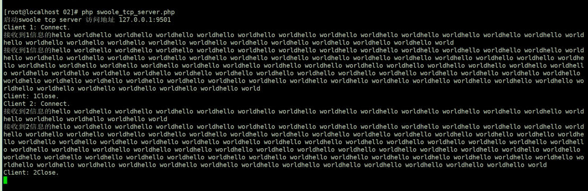
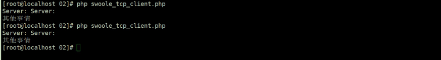

如上的情况就是多份数据变成了一份然后进行发送给了客服端，这种情况用一种专业的词：``粘包``
>所谓粘包就是，一个数据在发送的时候跟上了另一个数据的信息，另一个数据的信息``可能是完整的也可能是不完整的``；

出现的原因：
````
出现粘包现象的原因是多方面的，它既可能由发送方造成，也可能由接收方造成。发送方引|起的粘包是由TCP协议本身造成的, TCP为提高传输效率,发送方往往要收集到足够多的数据后才发送一包数据。 
若连续几次发送的数据都很少，通常TCP会根据优化算法把这些数据合成- -包后- 次发送出去，这样接收方就收到了粘包数据。


接收方引起的粘包是由于接收方用户进程不及时接收数据，从而导致粘包现象。这是因为接收方先把收到的数据放在系统接收缓冲区，用户进程从该缓冲区取数据，若下一包数据到达时前一包数据
尚未被用户进程取走,则下一包数据放到系统接收缓冲区时就接到前一包数据之后，而用户进程根据预先设定的缓冲区大小从系统接收缓冲区取数据，这样就一次取到了 多包数据。
````
### 1.2 多次发送演示:
````
服务端:

<?php

<?php
//创建Server对象，监听 127.0.0.1:9501端口
$serv = new Swoole\Server("127.0.0.1", 9501);
$serv->set([
    //心跳检测,每三秒检测一次，10秒没活动就断开
    'heartbeat_idle_time'=>6,//连接最大的空闲时间
    'heartbeat_check_interval'=>3 //服务器定时检查
]);
//监听连接进入事件
$serv->on('Connect', function ($serv, $fd) {
    echo "Client ".$fd.": Connect.\n";
});

// 监听数据接收事件
$serv->on('Receive', function ($serv, $fd, $from_id, $data) {
    // 接收客户端的想你想
    // echo "接收到".$fd."信息的".$data."\n";
    echo "接收到".$fd."信息"."\n";
    $serv->send($fd, "Server: ");
});

//监听连接关闭事件
$serv->on('Close', function ($serv, $fd) {
    echo "Client: ".$fd."Close.\n" ;
});
echo "启动swoole tcp server 访问地址 127.0.0.1:9501 \n";
//启动服务器
$serv->start();

--------------------------------------------------------------------------------
客户端:

<?php
$client = new Swoole\Client(SWOOLE_SOCK_TCP | SWOOLE_KEEP);
$client->connect('127.0.0.1', 9501);
$client->set([
//心跳检测,每三秒检测一次，10秒没活动就断开
    'heartbeat_idle_time'=>6,//连接最大的空闲时间
    'heartbeat_check_interval'=>3 //服务器定时检查
]);
//向服务器发送数据
$client->send(str_repeat('hello World', 100000));

//从服务器接收数据
$data = $client->recv();
if (!$data)
{
    die("recv failed.");
}
echo $data."\n";
````
以上可能报出一个客户端的错误,这里我们只需要将客户端和服务端建立长连接就可以了,并注释掉``$client->close();``
- [swoole_keep](https://wiki.swoole.com/#/client?id=%e5%9c%a8-php-fpmapache-%e4%b8%ad%e5%88%9b%e5%bb%ba%e9%95%bf%e8%bf%9e%e6%8e%a5)

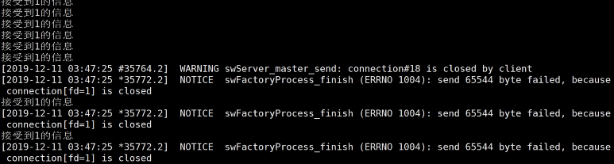

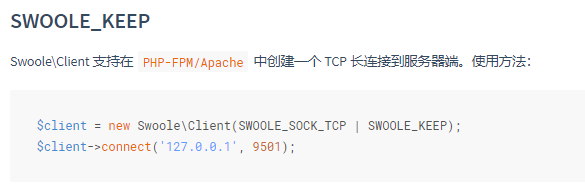

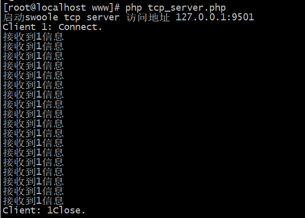

注意因为是一份大的数据因此看起来还是比较头疼的，因此在如上的代码中主要是根据请求的次数来判断；对于这样的问题就会造成的现象就是一次就有多次的请求；对于这个问题的处理就是我们可以``采用分包的方式处理``,``分包操作主要是由程序处理而并非tcp``
### 1.3 解决方案1(特殊字符方式)
- 当时``短连接``的情况下，``不用考虑粘包``的情况 
- 如果``发送数据无结构``，``如文件传输``，这样发送方只管发送，接收方只管接收存储就ok,``也不用考虑粘包``
- 如果``双方建立长连接``,需要在``连接后一段时间内发送不同结构数据接收方创建预处理线程``，对接收到的数据包进行预处理，``将粘连的包分开``;

分包是指在出现粘包的时候我们的接收方要进行分包处理。(在长连接中都会出现) 数据包的边界发生错位，导致读出错误的数据分包，进而曲解原始数据含义。

粘包情况有两种，
- 一种是粘在一起的包都是完整的数据包
- 一种情况是粘在一起的包有不完整的包。

通过定义一个特殊的符号，注意是客户端与服务端相互约定的； 然后呢下一步就是客户端每次发送的时候都会在后面添加这个数据，服务端做数据的字符串处理

测试:
````
客户端:

for ($i=0; $i < 100; $i++) {
 $client->send("hello world\i");
}
--------------------------------------------------------------------
服务端:

// 监听数据接收事件
$serv->on('Receive', function ($serv, $fd, $from_id, $data) {
    // 接收客户端的想你想
    var_dump(explode('\i', $data));
    $serv->send($fd, "Server: ");
});

````
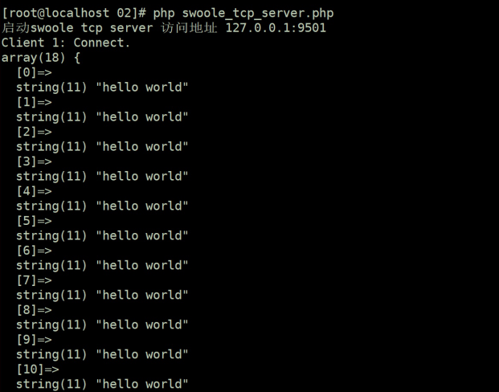

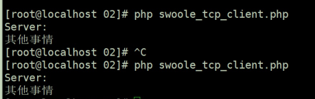

### 1.4 swoole的解决方式：
swoole的解决办法就是通过EOF的方式处理；在swoole中提供了一个[open_eof_split的选项](https://wiki.swoole.com/#/server/setting?id=open_eof_split) 

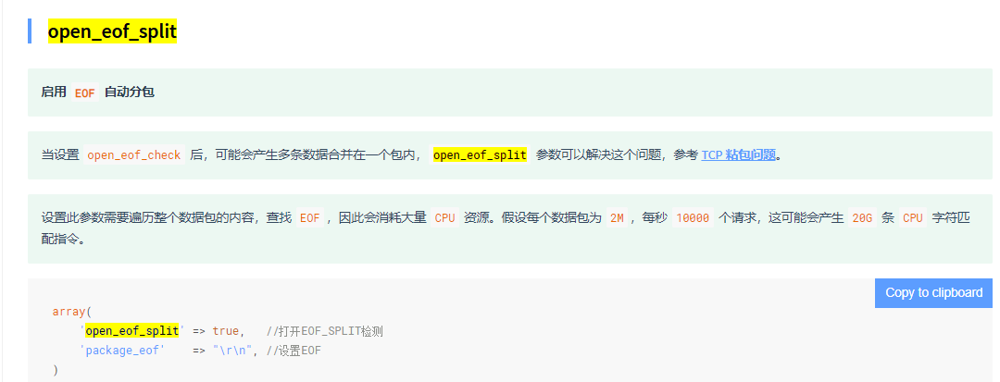

不过这种方式会存在着一个问题，那就是在内容中不能存在于package_eof的指定的字符串，因为对于swoole来说它就是通过遍历整个数据包的内容，查找EOF然后进行分割，同时也会对于CPU的资源消耗比较大。

``这种方式并不是特别的推荐``

### 1.5 统一标准（固定包头+包体协议）
对于这样的问题情况，实际上我们可以通过定义好发送消息的tcp数据包的格式，而这个对于服务端和客户端相互之间就遵守这个规范

这种方式就是通过与在数据传输之后会在tcp的数据包中携带上数据的长度，然后呢服务端就可以根据这个长度，对于数据进行截取；
- 对于[pack的解释](https://php.golaravel.com/function.pack.html)
- 对于[unpack的解释](https://php.golaravel.com/function.unpack.html)
>须知：一个字节 = 8个二进制位

pack() 格式字符
````
n	无符号短整型(16位，大端字节序)
N	无符号长整型(32位，大端字节序)
````
简单应用
````
<?php
$test = "hello worldfsdffsdfsdf";// gbk => 二进制方式
var_dump(strlen($test)); //int(22)

$len = pack("N", strlen($test)); // 整个数据 => 转化为二进制数据

var_dump($len); //string(4) ""

$r = $len.$test;
var_dump($r); //string(26) "hello worldfsdffsdfsdf"

var_dump(unpack("N", $len));
//array(1) {
//    [1]=>
//  int(22)
//}
````
与内容结合:
````
// client 通过pack进行组包
for ($i=0; $i < 10; $i++) {
    // 组包
    $context = "123";
    $len = pack("n", strlen($context));
    var_dump($len);
    $send = $len . $context;
    // var_dump($send);
    $client->send($send);
}


// server
//监听数据接收事件
$serv->on('Receive', function ($serv, $fd, $from_id, $data){
    var_dump($data);
    $fooLen = unpack("n", substr($data, $count, 2))[1];
    var_dump($fooLen);
    $foo = substr($data, $count + 2, $fooLen);
    var_dump($foo);
    $serv->send($fd, "Server: ");
});
?>

````
>不过如上的服务端还需要负责对于不同的数据进行解包的处理;

### 1.6 swoole的处理方式：
````
<?php
$server->set([
    'open_length_check' => true,
    'package_max_length' => 2 * 1024 * 1024 ,
    'package_length_type' => 'N',
    'package_length_offset' => 0,
    'package_body_offset' => 4
]);

````
相关配置：
- open_length_check： 打开包长检测特性
- package_length_type： 长度字段的类型，固定包头中用一个4字节或2字节表示包体长度。
- package_length_offset：从第几个字节开始是长度，比如包头长度为120字节，第10个字节为长度值，这里填入9（从0开始计数）
- package_body_offset： 从第几个字节开始计算长度，比如包头为长度为120字节，第10个字节为长度值，包体长度为1000。如果长度包含包头，这里填入0，如果不包含包头，这里填入120
- package_max_length： 最大允许的包长度。因为在一个请求包完整接收前，需要将所有数据保存在内存中，所以需要做保护。避免内存占用过大。

测试:
````
服务端:

// 创建Server对象，监听 127.0.0.1:9501端口
$serv = new Swoole\Server("127.0.0.1", 9501);
$serv->set([
    'open_length_check' => true,
    'package_max_length' => 1024 * 1024 * 4,
    'package_length_type' => 'N',
    'package_length_offset' => 0,
    'package_body_offset' => 4,
]);

//监听连接进入事件
$serv->on('Connect', function ($serv, $fd) {
    echo "Client ".$fd.": Connect.\n";
});

//监听数据接收事件
$serv->on('Receive', function ($serv, $fd, $from_id, $data) {
    // 接收客户端的想你想
    echo substr($data, 4)."\n";
    $serv->send($fd,pack("N", strlen("Server: ")). "Server: ");
});

//监听连接关闭事件
$serv->on('Close', function ($serv, $fd) {
    echo "Client: ".$fd."Close.\n" ;
});

echo "启动swoole tcp server 访问地址 127.0.0.1:9501 \n";

//启动服务器
$serv->start();
````
````
客户端:

// client
$client = new swoole_client(SWOOLE_SOCK_TCP);
$client->set([
    'open_length_check' => 1,
    'package_max_length' => 1024 * 1024 * 3,
    'package_length_type' => 'N',
    'package_length_offset' => 0,
    'package_body_offset' => 4,
]);

//连接到服务器
if (!$client->connect('127.0.0.1', 9501, 0.5)){
    die("connect failed.");
}

//向服务器发送数据
for ($i=0; $i < 10; $i++) {
    $send = "123";
    $send = (pack("N", strlen($send))) . $send;
    $client->send($send);
}
//从服务器接收数据
$data = $client->recv();
if (!$data){
    die("recv failed.");
}
echo $data."\n";

//关闭连接
$client->close();
````
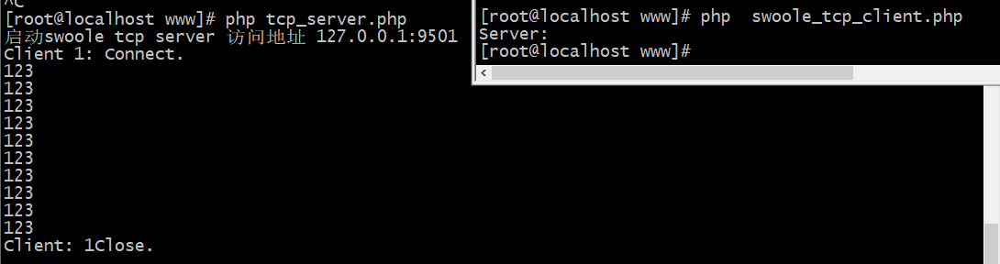

## 2. 进程-线程
### 2.1 进程
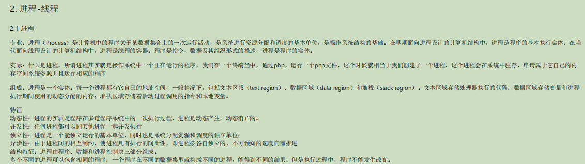
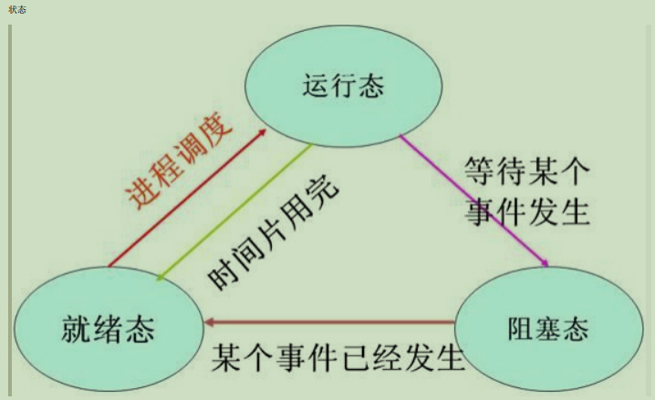
>对于一个进程来说，它的核心内容分为两个部分，一个是它的内存，这个内存是这进程创建之初从系统分配的，它所有创建的变量都会存储在这一片内存环境当中一个是它的上下文环境我们知道进程是运行在操作系统的，那么对于程序来说，它的运行依赖操作系统分配给它的资源，操作系统的一些
>
>在操作系统中可以运行多个进程的，对于一个进程来说，它可以创建自己的子进程，那么当我们在一个进程中创建出若干个子进程的时候那么可以看到如图，子进程和父进程一样，拥有自己的内存空间和上下文环境
### 2.2 子进程-线程
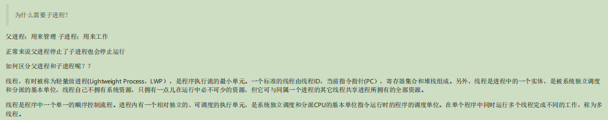
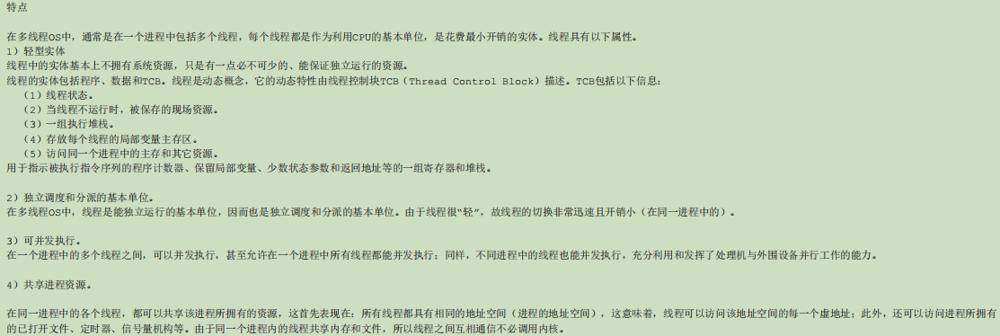
### 2.3 协程
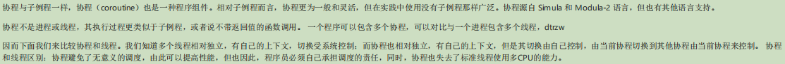
### 2.4 进程和线程的关系与区别
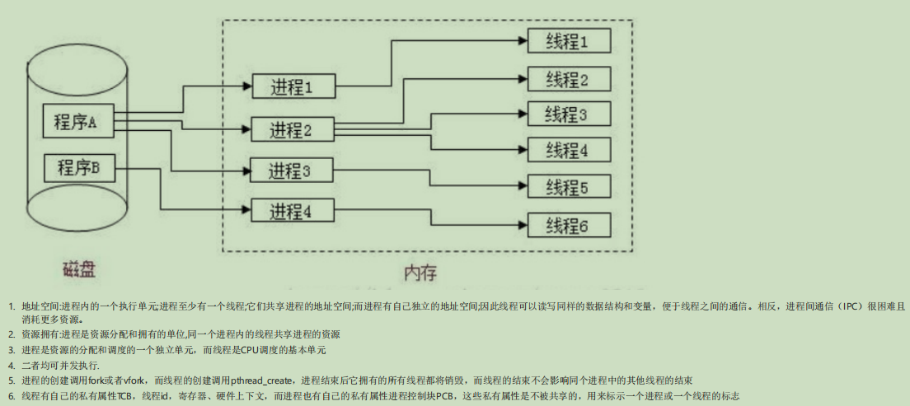

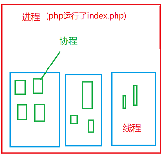

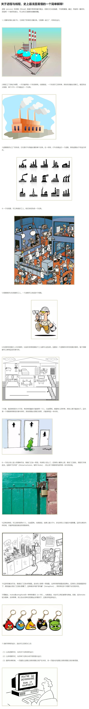