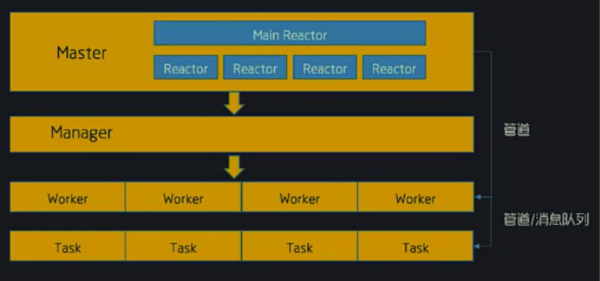

# swoole结构与网络io模型
````
pstree使用:
yum -y install psmisc

[root@localhost ~]# pstree  -an | grep php 
  |   |   |   `-php tcp_server.php
  |   |   |       |-php tcp_server.php
  |   |   |       |   |-php tcp_server.php
  |   |   |       |   `-php tcp_server.php
  |   |   |       `-2*[{php}]
  |   |       `-grep --color=auto php
````
## 1.[swoole面向对象的写法](https://wiki.swoole.com/wiki/page/397.html)
````
<?php
class Http
{
    protected $http;
    protected $r;
   
    protected $events = [
      //...
    ];
    protected $config = [
        // 'worker_num' => 1
    ];

    public function __construct($ip, $port)
    {
        $this->http = new Swoole\Http\Server($ip, $port);
        $this->http->set($this->config);
        // echo $ip.":".$port."\n";
         
         $this->r = "pppppp";


        //这里注册的事件类型不变,request,connect...
        // 传递闭包的方式,给一个数组,   [当前swoole对象 , 方法名] , 方法名自定义
        $this->http->on('request', [$this, 'willyin']);

    }

    public function willyin($request, $response)
    {
        $response->header("Content-Type", "text/html; charset=utf-8");
        $response->end("<h1>Hello Swoole. #".$this->r."</h1>");
    }

    public function start()
    {
        $this->http->start();
    }
}
$http = new Http('0.0.0.0', 9000);
$http->start();
````


参考地址:https://github.com/qq1596329937/swooleQQ/blob/master/Chat.php
## 2. swoole进程结构
>Swoole的高效不仅仅于底层使用c编写，他的进程结构模型也使其可以高效的处理业务，我们想要深入学习，并且在实际的场景当中使用必须了解，下面我们先看一下结构图：



如上分为四层:
- master：主进程
- Manger：管理进程
- worker：工作进程
- task：异步任务工作进程


>如果不设置工作进程默认时4个


### 2.1 master
第一层，Master进程，这个是swoole的主进程,这个进程是用于处理swoole的核心事件驱动的，那么在这个进程当中可以看到它拥有一个MainReactor[线程]以及若干个Reactor[线程]，swoole所有对于事件的监听都会在这
 些线程中实现，比如来自客户端的连接，信号处理等。
 
 
 
 每一个线程都有自己的用途，下面对每个线程有一个了解
 
 MainReactor（主线程）
>主线程会负责监听server socket，如果有新的连接accept，主线程会评估每个Reactor线程的连接数量。将此连接分配给连接数最少的reactor线程，做一个负载均衡

Reactor线程组
>Reactor线程负责维护客户端机器的TCP连接、处理网络IO、收发数据完全是异步非阻塞的模式。 swoole的主线程在Accept新的连接后，会将这个连接分配给一个固定的Reactor线程，在socket可读时读取数据，并进行协
 议解析，将请求投递到Worker进程。在socket可写时将数据发送给TCP客户端

心跳包检测线程（HeartbeatCheck）
>Swoole配置了心跳检测之后，心跳包线程会在固定时间内对所有之前在线的连接发送检测数据包

UDP收包线程（UdpRecv）
>接收并且处理客户端udp数据包

### 2.2 manager
Swoole想要实现最好的性能必须创建出多个工作进程帮助处理任务，但Worker进程就必须fork操作，但是fork操作是不安全的，如果没有管理会出现很多的僵尸进程，进而影响服务器性能，同时worker进程被误杀或者由于程序的原因会异常退出，为了保证服务的稳定性，需要重新创建worker进程

Swoole在运行中会创建一个单独的管理进程，所有的worker进程和task进程都是从管理进程Fork出来的。管理进程会监视所有子进程的退出事件，当worker进程发生致命错误或者运行生命周期结束时，管理进程会回收
此进程，并创建新的进程。换句话也就是说，对于worker、task进程的创建、回收等操作全权有“保姆”Manager进程进行管理。

再来一张图梳理下Manager进程和Worker/Task进程的关系


### 2.3 worker
worker 进程属于swoole的主逻辑进程，用户处理客户端的一系列请求，接受由Reactor线程投递的请求数据包，并执行PHP回调函数处理数据生成响应数据并发给Reactor线程，由Reactor线程发送给TCP客户端可以是异
步非阻塞模式，也可以是同步阻塞模式
### 2.4 task
taskWorker进程这一进城是swoole提供的异步工作进程，这些进程主要用于处理一些耗时较长的同步任务，在worker进程当中投递过来


## 3. 进程查看及流程梳理
当启动一个Swoole应用时，一共会创建``2 + n + m``个进程，2为一个Master进程和一个Manager进程，其中n为Worker进程数。m为TaskWorker进程数

默认如果不设置，swoole底层会根据当前机器有多少CPU核数，启动对应数量的Reactor线程和Worker进程。我机器为1核的。Worker为1


这三个进程中，所有进程的根进程，也就是例子中的9960进程，就是所谓的Master进程；而29961进程，则是Manager进程；最后的9966,9967,9968,9969进程，是Worker进程

当然我们也可以对于swoole的进程限制
````
<?php
    $server->set([
        'worker_num'=>1, //设置进程
    ]);
?>
````

## 4. swoole进程函数


如上的表格就是swoole的进程可以绑定的时间， 并不是所有的；比如在启动的时候做的操作，那么就会触发启动的事件，发送信息的时候会触发的事件；

swoole对于不同的进程，在不同的情况下就定义了不同的事件，这里可以像大家介绍一下事件的使用与其效果，但是并不是所有的事件

swoole在官方所提供的swoole运行流程图


- 服务器关闭程序终止时最后一次事件是onShutdown。
- 服务器启动成功后，onStart/onManagerStart/onWorkerStart会在不同的进程内并发执 行，并不是顺序的。
- 所有事件回调均在$server->start后发生，start之后写的代码是无效代码。
- onStart/onManagerStart/onWorkerStart 3个事件的执行顺序是不确定的

Swoole的Reactor、Worker、TaskWorker之间可以紧密的结合起来，提供更高级的使用方式

一个更通俗的比喻，假设Server就是一个工厂，那Reactor就是销售，接受客户订单。而Worker就是工人，当销售接到订单后，Worker去工作生产出客户要的东西。而TaskWorker可以理解为行政人员，可以帮助Worker干
些杂事，让Worker专心工作。

比如我们可以尝试对于swoole的进程更名称
````
<?php
//创建Server对象，监听 127.0.0.1:9501端口
$serv = new Swoole\Server("127.0.0.1", 9501);

    $serv->set([
         'worker_num' => 1
    ]);

$serv->on('start', function () {
    swoole_set_process_name("swoole:start");
    echo "设置swoole 进程 xxx swoole:start \n";
});

$serv->on('managerStart', function () {
    swoole_set_process_name("swoole:managerStart");
    echo "设置swoole 进程 xxx swoole:managerStart \n";
});

$serv->on('workerStart', function () {
    swoole_set_process_name("swoole:workerStart");
    echo "设置swoole 进程 xxx swoole:workerStart \n";
});

//监听连接进入事件
$serv->on('Connect', function ($serv, $fd) {
    echo "Client: Connect.\n";
});

//监听数据接收事件
$serv->on('Receive', function ($serv, $fd, $from_id, $data) {
    $serv->send($fd, "Server: ".$data);
});

//监听连接关闭事件
$serv->on('Close', function ($serv, $fd) {
    echo "Client: Close.\n";
});

echo "启动swoole tcp server 访问地址 127.0.0.1:9501\n";

//启动服务器
$serv->start();
?>
````


##### 此时使用pstree工具可能会出现以下问题


### 4.1 补充
swoole中的Reactor https://wiki.swoole.com/wiki/page/163.html

- Reactor是管理tcp连接的， 并向worker进程投递请求，投递方式根据dispatch_mode配置。
- worker进程可以自己处理任务，也可以投递给taskworker进程来做。


