# 网络io模型及阻塞模型
## 1. stream-socket简单体验与socket连接处理的阻塞状态
### 1.1 函数补充
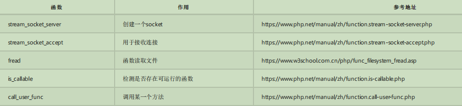
### 1.2 [stream-socket](https://php.golaravel.com/function.stream-socket-client.html)简单体验
````
server:

<?php
$host = "tcp://0.0.0.0:9000";
$server = stream_socket_server($host);
//echo $host."已创建";

//用一个死循环来保持持续监听
while (true) {
    //建立客户端的连接
    //此时服务处于一个挂起的状态,等待连接进入
    //stream_socket_accept 是阻塞的
    $conn = stream_socket_accept($server);
    //输出接收内容
    var_dump(fread($conn,65535));
    //返回信息
    fwrite($conn, 'The local time is ' . date('n/j/Y g:i a') . "\n");
    //关闭连接
    fclose($conn);
}
  //关闭资源
   fclose($server);
-----------------------------------------------------------------
client:

<?php
// 是建立连接
$server = stream_socket_client("tcp://127.0.0.1:9000");
$new = time();

// 给socket通写信息
fwrite($server, "hello world");

// 读取信息
var_dump(fread($server , 65535));

// 关闭连接
fclose($server);

echo "\n".time()- $new;
````
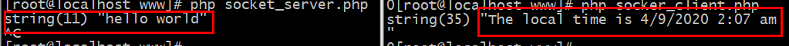

## 2. 五大io模型
参照地址:https://www.cnblogs.com/wlwl/p/10291397.html

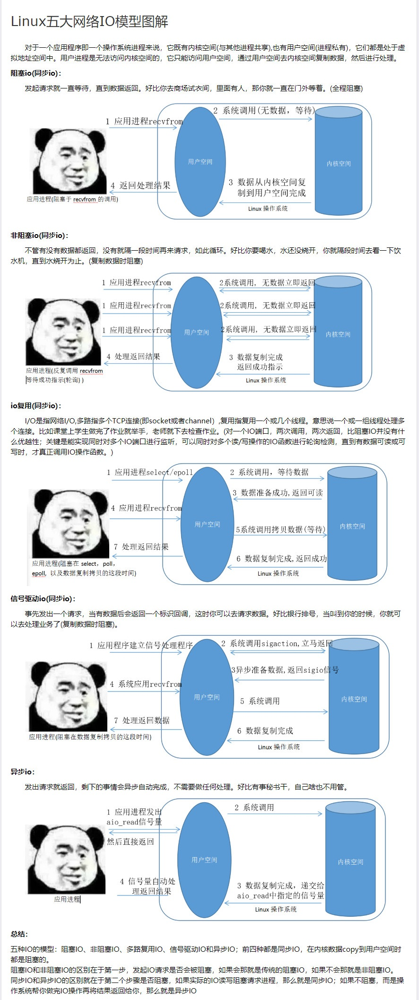
### 2.1  阻塞式I/O模型(blocking i/o)
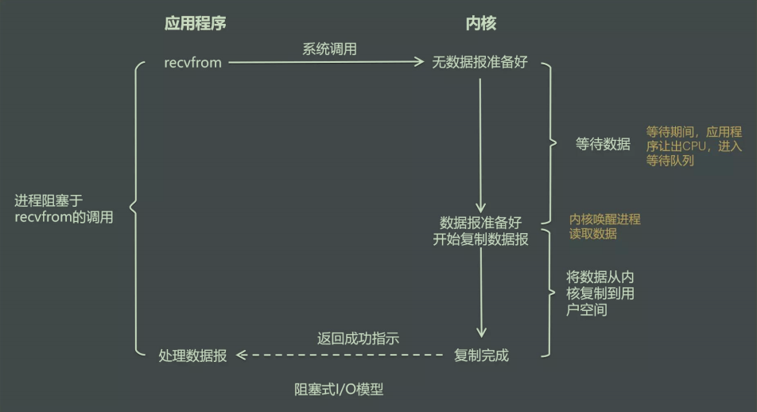

>在阻塞式I/O模型中，应用程序在从调用recvfrom开始到它返回有数据报准备好这段时间是阻塞的，recvfrom返回成功后，应用进程开始处理数据报

>举例:一个人在等公交车,车没来,就一直在等
### 2.2 非阻塞式I/O模型(non-blocking i/o)
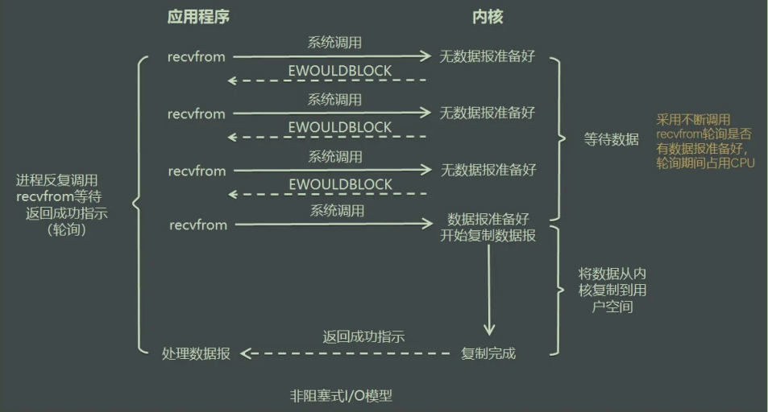

>在非阻塞式I/O模型中，应用程序把一个套接口设置为非阻塞就是告诉内核，当所请求的I/O操作 无法完成时，不要将进程睡眠，而是返回-一个错误，应用程序基于I/O操作函数将不断的轮询数据 是否已经准备好，如
 果没有准备好，继续轮询，直到数据准备好为止

>举例:一个人在等公交车,一边等车,一边在玩手机,隔一段时间看车子有没有来,来了就上车 
### 2.3 I/O复用模型(i/o multiplexing)
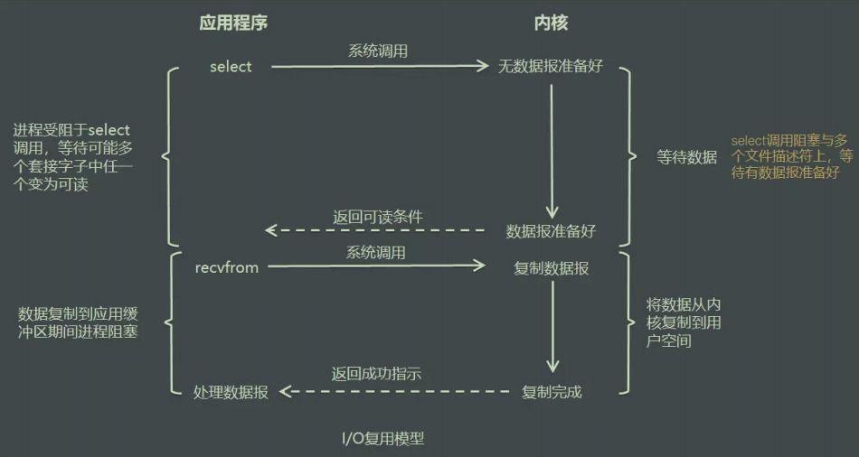

>在I/O复用模型中，会用到select或poll函数或epoll函数(Linux2.6以后的内核开始支持)， 这两个函数也会使进程阻塞，但是和阻塞I/O所不同的的，这两个函数可以同时阻塞多个I/O操作，而且可以同时对多个读操作，多
 个写操作的I/0函数进行检测，直到有数据可读或可写时，才填正调用I/O操作函数

>岸边钓鱼,放了一堆鱼竿,在岸边一直守着这堆鱼竿，直到有鱼上钩
### 2.4 信号驱动式I/O模型(signal-driven i/o)
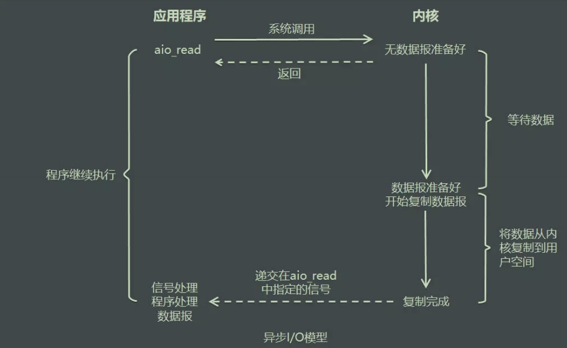

>由POSIX规范定义，应用程序告知内核启动某个操作，并让内核在整个操作( 包括将数据从内核拷贝到应用程序的缓冲区)完成后通知应用程序。这种模型与信号驱动模型的主要区别在于:信号驱动I/O是由内核通知应用程
 序何时启动一个I/O操作， 而异步I/O模型是由内核通知应用程序I/O操作何时完成
### 2.5 异步I/O模型(asynchronous i/o)
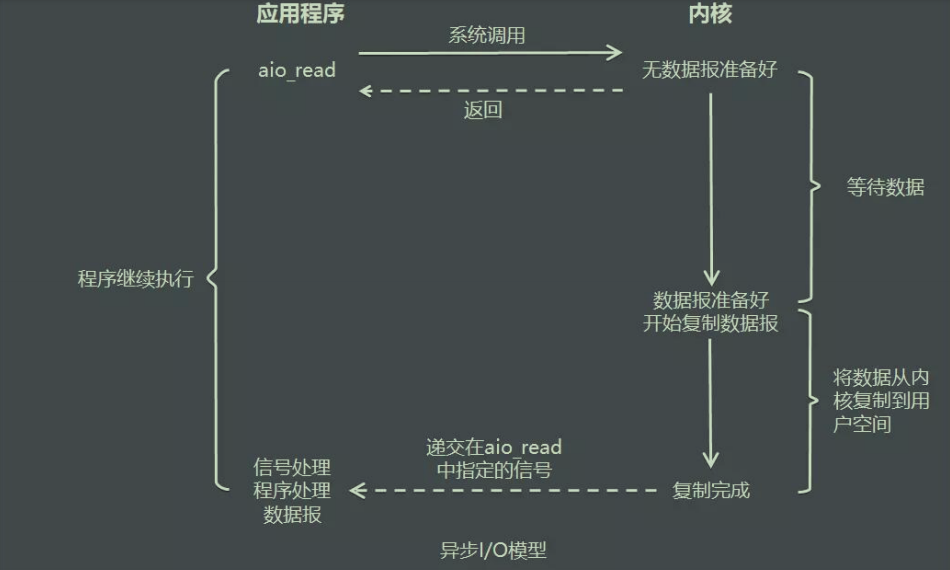

>由POSIX规范定义，应用程序告知内核启动某个操作，并让内核在整个操作( 包括将数据从内核 拷贝到应用程序的缓冲区)完成后通知应用程序。这种模型与信号驱动模型的主要区别在于:信 号驱动I/O是由内核通知应用
 程序何时启动一个I/O操作， 而异步I/O模型是由内核通知应用程序 I/O操作何时完成

## 3. 编辑io模型
这里要借助composer工具
````
// 下载
curl -sS https://getcomposer.org/installer | php

// 设置全局
mv composer.phar /usr/local/bin/composer

composer config -g repo.packagist composer https://packagist.phpcomposer.com

注意：如果是root用户，会出现
Do not run Composer as root/super user! See https://getcomposer.org/root for details
这个是因为composer为了防止非法脚本在root下执行，解决办法随便切换到非root用户即可

// 查看有哪些用户
cat /etc/passwd|grep -v nologin|grep -v halt|grep -v shutdown|awk -F":" '{ print $1"|"$3"|"$4 }'|more
// 切换用户
su www
再执行
composer config -g repo.packagist composer https://packagist.phpcomposer.com 就行了
````
目录结构
````
io-
    - src
        - Blocking
        - NonBlockin
        - Multiplexi
        - SingnalDriv
        - Asynchrono
    - test
        - blocking
        - nonBlockin
        - multiplexi
        - singnal-dr
        - asynchrono
    - vendor
    - composer.js
````
使用composer init构建
````
{
    "name": "willyin/io",
    "type": "library",
    "license": "MIT",
    "authors": [
        {
            "name": "will",
            "email": "826895143@qq.com"
        }
    ],
    "autoload": {
        "psr-4": {
            "Willyin\\Io\\": "./src/"
        }
    },
    "require": {}
}
````
添加psr-4规范后,执行``composer update``生成``vender``自动加载目录

测试:
````
<?php
namespace Willyin\Io\Blocking;
class Worker{
    public function index()
    {
        echo 11232;
    }
}
````
````
<?php
require __DIR__.'/../../vendor/autoload.php';
use Willyin\Io\Blocking\Worker;
$a = new Worker();
$a->index();
````
````
[root@localhost blocking]# php server.php 
11232
````
## 4. 阻塞IO模型
````
Worker.php:

<?php
namespace Willyin\Io\Blocking;
class Worker{
  //自定义服务的事件注册函数
    //这里接受时是三个闭包
    public $onConnect = null;
    public $onReceive = null;
    public $onColose = null;

    //socket资源
    public $socket = null;

    public function __construct($socket_add)
    {
        $this->socket = stream_socket_server($socket_add);
        echo "已创建socket服务".$socket_add."\n";
    }

    public function on()
    {
        //
    }

    //接收客户端连接的请求
    public function accept()
    {
        while (true) {
            //建立客户端的连接
            $conn = @stream_socket_accept($this->socket);


            if (is_callable($this->onConnect)) {
                // 执行函数
                ($this->onConnect)($this,$conn);
            }

            // tcp 处理 大数据 重复多发几次
            //  $buffer = "";
            // while (!feof($client)) {
            // $buffer = $buffer.fread($client, 65535);
            //  }

            $data = fread($conn, 65535);

            if (is_callable($this->onReceive)) {
                ($this->onReceive)($this,$conn, $data);
            }

            //关闭连接
            fclose($conn);
        }
    }

    //发送信息
    public function send($conn,$data)
    {
        //返回信息
        fwrite($conn, $data."\n");
    }
    
    //启动服务
    public function start()
    {
        $this->accept();
    }
}
````
````
Server.php:

<?php
require __DIR__.'/../../vendor/autoload.php';
use Willyin\Io\Blocking\Worker;

$host = "tcp://0.0.0.0:9000";
$server = new Worker($host);

 $server->onConnect = function($socket, $conn=null){
     echo "有一个连接进来了\n";
     var_dump($conn);
 };
// 接收和处理信息

$server->onReceive = function($socket,$conn, $data){
    //echo "接受到了客户端的连接信息\n";
    // fwrite($conn, "server hellow");
    $socket->send($conn, "hello world client \n");
};
$server->start();
````
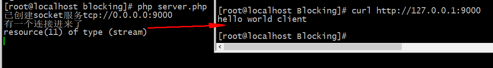

但是在浏览器请求时会出现问题?

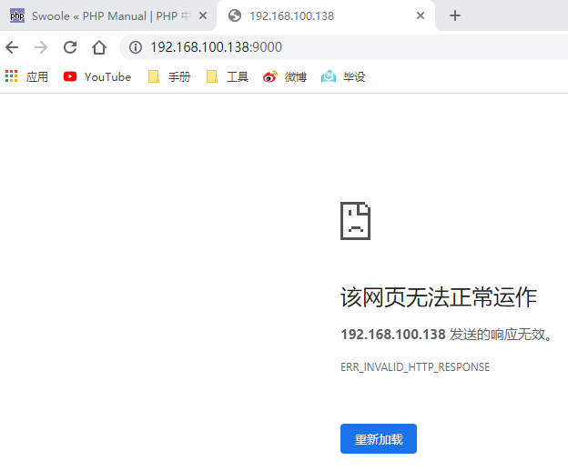

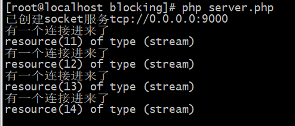

这里时因为协议不同的问题
````
public function send($conn,$data){
     $reponse = "HTTP/1.1 200 OK\r\n";
     $reponse .= "Content-Type: text/html;charset=utf-8\r\n";
     $reponse .= "Connection: keep-alive\r\n";
     $reponse .= "Content-length:".strlen($data).\r\n\r\n\r\n";
     $reponse .= $data;
     fwrite($conn,$reponse);
}
````
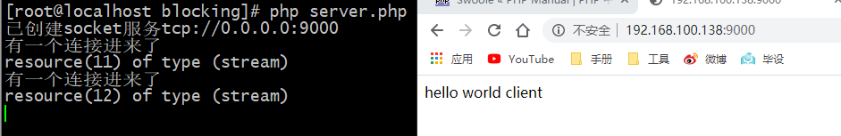
````
<?php
namespace Willyin\Io\Blocking;
class Worker{
  //自定义服务的事件注册函数
    //这里接受时是三个闭包
    public $onConnect = null;
    public $onReceive = null;
    public $onColose = null;

    //socket资源
    public $socket = null;

    public function __construct($socket_add)
    {
        $this->socket = stream_socket_server($socket_add);
        echo "已创建socket服务".$socket_add."\n";
    }

    public function on()
    {
        //
    }

    //接收客户端连接的请求
    public function accept()
    {
        while (true) {
            //建立客户端的连接
            $conn = @stream_socket_accept($this->socket);


            if (is_callable($this->onConnect)) {
                // 执行函数
                ($this->onConnect)($this,$conn);
            }

            // tcp 处理 大数据 重复多发几次
            //  $buffer = "";
            // while (!feof($client)) {
            // $buffer = $buffer.fread($client, 65535);
            //  }

            $data = fread($conn, 65535);

            if (is_callable($this->onReceive)) {
                ($this->onReceive)($this,$conn, $data);
            }

            //关闭连接
            fclose($conn);
        }
    }

    //发送信息
    public function send($conn,$data)
    {
        //返回信息
        //fwrite($conn, $data."\n");

        //相应htt请求
        $reponse = "HTTP/1.1 200 OK\r\n";
        $reponse .= "Content-Type: text/html;charset=utf-8\r\n";
        $reponse .= "Connection: keep-alive\r\n";
        $reponse .= "Content-length:".strlen($data)."\r\n\r\n\r\n";
        $reponse .= $data;
        fwrite($conn,$reponse);
    }
    
    //启动服务
    public function start()
    {
        $this->accept();
    }
}
````