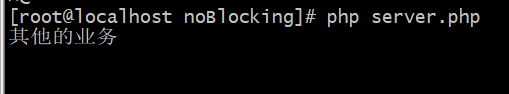
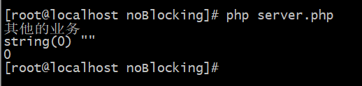
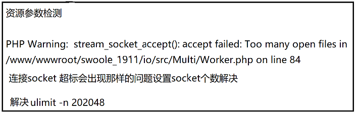
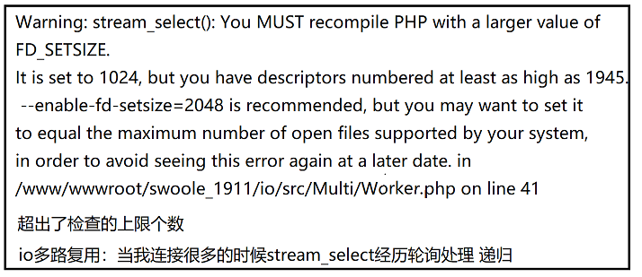

# 非阻塞与多路复用
## 1. 非阻塞模型
>这种实现比较简单核心就在于轮询不断的查看进程的状态，并不会阻塞与其他进程的操作，如果说当前进程模型没有处理完就会做其他事情；但是缺点就是会不断地询问内核，这将占用大量的CPU时间，系统资源利用
 率较低，所以一般web服务器不适用这种I/O模型；

>首先我们可以保持之前阻塞模型的服务不改-》因为咋们这个功能主要是体现在于客户端对于服务端的信息获取

### 1.1 [stream_set_blocking](https://php.golaravel.com/function.stream-set-blocking.html)
>``stream_set_blocking`` 非阻塞影响的是``fwrite``和``fread``,不影响``stream_socket_accept``
````
stream_set_blocking:

// 此函数适用于支持非阻塞模式的任何资源流  stream_set_blocking ( resource $stream , int $mode ) : bool
//如果 mode 为0，资源流将会被转换为非阻塞模式；如果是1，资源流将会被转换为阻塞模式。
//stream_set_blocking($client , 0);
````
````
<?php
$host = "tcp://0.0.0.0:9000";

$client = stream_socket_server($host);
//var_dump($client); //resource(5) of type (stream)
//echo (int)$client; //5

stream_set_blocking($client , 0);

@fwrite($client, "hello world",65535);//实际的业务部分,比如订单部分

echo "其他的业务\n"; // 响应 --

    // 模拟定时器
    while (!feof($client)) {
        // 接收的数据包的大小65535
        $read[] = $client;
        var_dump(fread($client, 65535));
        echo $r++."\n";
        sleep(1);
    }
````


使用了stream_set_blocking函数后,就不会发生阻塞,以至于连客户端信息都没来得及等待输出




### 1.2 非阻塞模块代码复现
````
<?php
namespace Willyin\Io\NoBlocking;
class Worker{
  //自定义服务的事件注册函数
    //这里接受时是三个闭包
    public $onConnect = null;
    public $onReceive = null;
    public $onColose = null;

    //socket资源
    public $socket = null;

    public function __construct($socket_add)
    {
        $this->socket = stream_socket_server($socket_add);
        echo "已创建socket服务".$socket_add."\n";
        stream_set_blocking($this->socket , 0);
    }

    public function on()
    {
        //
    }

    //接收客户端连接的请求
    public function accept()
    {
        while (true) {
            //建立客户端的连接
            $conn = @stream_socket_accept($this->socket);
            //stream_set_blocking( $conn , 0);

            if (is_callable($this->onConnect)) {
                // 执行函数
                ($this->onConnect)($this,$conn);
            }

            // tcp 处理 大数据 重复多发几次
            //  $buffer = "";
            // while (!feof($client)) {
            // $buffer = $buffer.fread($client, 65535);
            //  }

            $data = @fread($conn, 65535);

            if (is_callable($this->onReceive)) {
                ($this->onReceive)($this,$conn, $data);
            }

            //为了保持服务端长连接,可注释下内容
            //fclose($conn); //关闭连接
        }
    }

    //发送信息
    public function send($conn,$data)
    {
        //返回信息
        //fwrite($conn, $data."\n");

        //相应htt请求
        $reponse = "HTTP/1.1 200 OK\r\n";
        $reponse .= "Content-Type: text/html;charset=utf-8\r\n";
        $reponse .= "Connection: keep-alive\r\n";
        $reponse .= "Content-length:".strlen($data)."\r\n\r\n\r\n";
        $reponse .= $data;
        @fwrite($conn,$reponse);
    }
    
    //启动服务
    public function start()
    {
        $this->accept();
    }
}
````
````
<?php
require __DIR__.'/../../vendor/autoload.php';
use Willyin\Io\NoBlocking\Worker;

$host = "tcp://0.0.0.0:9000";
$server = new Worker($host);

$server->onConnect = function($socket, $conn=null){
    echo "有一个连接进来了\n";
    var_dump($conn);
};
// 接收和处理信息

$server->onReceive = function($socket,$conn, $data){
    //echo "接受到了客户端的连接信息\n";
    // fwrite($conn, "server hellow");
   // sleep(4);
    $socket->send($conn, "hello world client \n");
};
$server->start();
````
## 2.[stream_select函数作用](https://php.golaravel.com/function.stream-select.html) 
>就是过滤出可读取的连接

````
client.php:

<?php
// 是建立连接
$client = stream_socket_client("tcp://127.0.0.1:9000");

stream_set_blocking($client, 0);

fwrite($client, "hello world");// 创建订单


$read = $write = $except = [];
// stream_select
// 检测的方式根据数组 -》 去进行检测socket状态

    while (!feof($client)) {
        $read[] = $client;
        fread($client, 65535);
        sleep(1);
        echo "检查socket :\n";
        // 返回一个结果 0 //连接未发生变化 1 //连接发生变化 
        var_dump(stream_select($read, $write, $except, 1));
    }

------------------------------------------------------------------
[root@localhost noBlocking]# php client.php 
检查socket :
int(1)  
检查socket :
int(0)  
检查socket :
int(0)
检查socket :
int(0)
````
## 3. 多路复用模型
>这种模式我们又可以称之为io多路复用

服务监听流程如上
- 保存所有的socket,通过select系统调用，监听socket描述符的可读事件
- Select会在内核空间监听一旦发现socket可读，会从内核空间传递至用户空间，在用户空间通过逻辑判断是服务端socket可读，还是客户端的socket可读
- 如果是服务端的socket可读，说明有新的客户端建立，将socket保留到监听数组当中
- 如果是客户端的socket可读，说明当前已经可以去读取客户端发送过来的内容了，服务端读取内容，然后响应给客户端对应的内容。


缺点：
- select模式本身的缺点（1. 循环遍历处理事件、2. 内核空间传递数据的消耗）
- 单进程对于大量任务处理乏力

````
<?php
namespace Willyin\Io\Multiplexing;

Class Worker{
    // 自定义服务的事件注册函数，
    // 这三个是闭包函数
    public $onReceive = null;
    public $onConnect = null;
    public $onClose = null;
    //新的客户端建立，将socket保留到监听数组当中
    protected $sockets = [];
    // 连接
    public $socket = null;

    public function __construct($socket_add)
    {
        $this->socket = stream_socket_server($socket_add);
        stream_set_blocking($this->socket, 0);

        // 咋们的server也有忙的时候
        $this->sockets[(int) $this->socket] = $this->socket;
    }

    //当客户端请求时的处理
    public function accept()
    {
        // 接收连接和处理使用
        while (true) {
            $read = $this->sockets;
        // 校验池子是否有可用的连接 -》 校验传递的数组中是否有可以用的连接 socket
        // 把连接放到$read
        // 它返回值其实并不是特别可靠

            $this->debug('stream_select检测  start 的 $read');
             $this->debug($read, true);

            stream_select($read, $w, $e, 1);
            
            $this->debug('stream_select检测 end 的 $read');
             $this->debug($read, true);

            foreach ($read as $socket) {
                // $socket 可能为 1. worker 主连接  2. 也可能是通过stream_socket_accept()创建的
                     if ($socket === $this->socket) {
                     // 创建与客户端的连接
                         $this->createSocket();
                     } else {
                     // 发送信息
                      $this->sendMessage($socket);
                     }
                 }
        }
    }

    public function createSocket()
    {
        $client = stream_socket_accept($this->socket);
        if(is_callable($this->onConnect)){
            ($this->onConnect)($this,$client);
        }
        //把创建的客户端的socket资源放置的sockets数组中
        $this->sockets[(int)$client] = $client;
   }
    public function sendMessage($client) {
        //读取客户端数据
        $data = fread($client, 65535);

        if ($data === '' || $data == false) {
                //关闭连接
                 fclose($client);
                 //销毁使用完的客户端记录
                 unset($this->sockets[(int)$client]);
                 //这里需要给一个返回值
                 return null;
             }

            if(is_callable($this->onReceive)) {
              ($this->onReceive)($this, $client, $data);
             }
    }

    //发送信息
    public function send($conn,$data)
    {
        //返回信息
        //fwrite($conn, $data."\n");

        //相应htt请求
        $reponse = "HTTP/1.1 200 OK\r\n";
        $reponse .= "Content-Type: text/html;charset=utf-8\r\n";
        $reponse .= "Connection: keep-alive\r\n";
        $reponse .= "Content-length:".strlen($data)."\r\n\r\n\r\n";
        $reponse .= $data;
        @fwrite($conn,$reponse);
    }
    //信息输出
    public function debug($data, $flag = false) {
        if ($flag) {
            var_dump($data);
        } else {
            echo "==== >>>> : ".$data." \n\r\n\r";
        }
    }
    //启动服务
    public function start()
    {
        $this->accept();
    }
}

````
````
<?php
require __DIR__.'/../../vendor/autoload.php';
use Willyin\Io\Multiplexing\Worker;

$host = "tcp://0.0.0.0:9000";
$server = new Worker($host);

$server->onConnect = function($socket, $conn=null){
    echo "有一个连接进来了\n";
    var_dump($conn);
};

$server->onReceive = function($socket,$conn, $data){
    //echo "接受到了客户端的连接信息\n";
    // fwrite($conn, "server hellow");
    $socket->send($conn, "hello world client \n");
};
$server->start();
````

#### 进行压力测试:
ab -c 10000 -n 10000 -k http://127.0.0.1:9000/

````
[root@localhost Multiplexing]# ab -c 10000 -n 10000 -k http://127.0.0.1:9000/
This is ApacheBench, Version 2.3 <$Revision: 1430300 $>
Copyright 1996 Adam Twiss, Zeus Technology Ltd, http://www.zeustech.net/
Licensed to The Apache Software Foundation, http://www.apache.org/

Benchmarking 127.0.0.1 (be patient)
socket: Too many open files (24)

-----------------------------------------------------------
通过  ulimit  -a(n) 来查看
open files                      (-n) 1024

通过  ulimit -n + 数量     来设置
````






