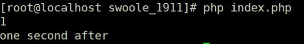
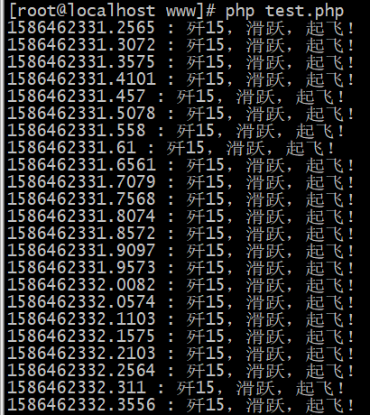
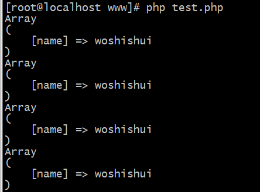
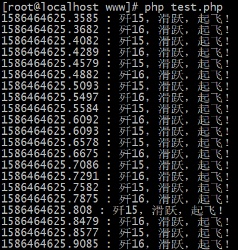
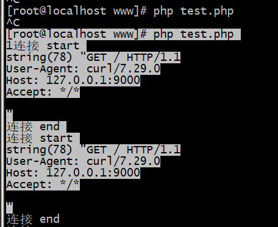
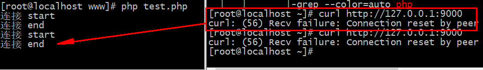
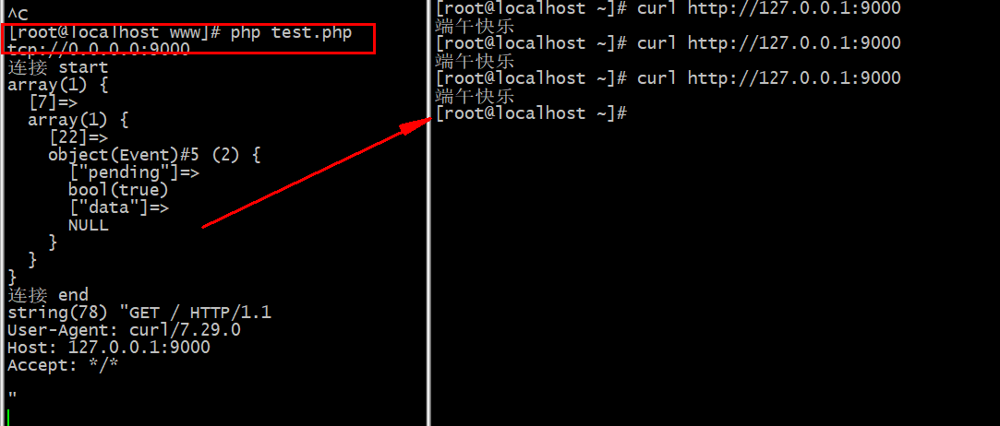
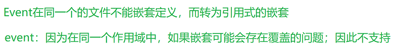

# 信号驱动模型与event事件
## 1.[信号模型](pcntl_signa:https://php.golaravel.com/function.pcntl-signa.html)
- [posix_kill](https://php.golaravel.com/function.posix-kill.html)
- [pcntl_signal_dispatch](https://php.golaravel.com/function.pcntl-signa-dispatch.html)
````
<?php
// 准备一个信号
pcntl_signal(SIGIO,"sig_handler");

function sig_handler($sig)
{
    sleep(2);
    echo "one second after\n";
}

echo "1\n";

// 安装信号 -》 给某某进程安装某某信号
posix_kill(posix_getpid(),SIGIO);

// 分发
pcntl_signal_dispatch();
````


### 1.1 信号模型
````
<?php
namespace Willyin\Io\SingnalDriven;
class Worker
{
    // 自定义服务的事件注册函数，
    // 这三个是闭包函数
    public $onReceive = null;
    public $onConnect = null;
    public $onClose = null;
    // 连接
    public $socket = null;
    public function __construct($socket_address)
    {
        $this->socket = stream_socket_server($socket_address);
        echo $socket_address."\n";
    }
    // 需要处理事情
    public function accept()
    {
        // 接收连接和处理使用
        while (true) {
       debug("accept start");
        // 监听的过程是阻塞的
        $client = stream_socket_accept($this->socket);
        pcntl_signal(SIGIO, $this->sigHander($client));
        posix_kill(posix_getpid(), SIGIO);
        // 分发
        pcntl_signal_dispatch();
        debug("accept end");
        // 处理完成之后关闭连接
        // 心跳检测 - 自己的心跳
         fclose($client);
        }
    }
    public function sigHander($client)
    {
        return function($sig) use ($client){
    // is_callable判断一个参数是不是闭包
            if (is_callable($this->onConnect)) {
    // 执行函数
                ($this->onConnect)($this, $client);
            }
            $data = fread($client, 65535);
            if (is_callable($this->onReceive)) {
                ($this->onReceive)($this, $client, $data);
            }
        };
    }
        // 启动服务的
    public function start()
    {
        $this->accept();
    }
}
````
````
<?php
require __DIR__.'/../../vendor/autoload.php';
use Willyin\Io\SingnalDriven\Worker;

$host = "tcp://0.0.0.0:9000";
$server = new Worker($host);

$server->onConnect = function($socket, $conn=null){
    echo "有一个连接进来了\n";
    //var_dump($conn);
};

// 接收和处理信息
$server->onReceive = function($socket,$conn, $data){
    //echo "接受到了客户端的连接信息\n";
    // fwrite($conn, "server hellow");
   send($conn, "hello world client \n");
};
$server->start();
````
缺点:
>信号I/O在大量IO操作时可能会因为信号队列溢出导致没法通知信号驱动I/O尽管对于处理UDP套接字来说有用，即这种信号通知意味着到达一个数据报，或者返回一个异步错误。但是，对于TCP而言，信号驱动的I/O方近乎无用，因为导致这种通知的条件为数众多，每一个来进行判别会消耗很大资源，与前几种方式相比优势尽失
---

## 2. [event](https://php.golaravel.com/book.event.html)安装
````
1.安装libevent(官网 : http://libevent.org/)

　　下载稳定版：wget -c https://github.com/libevent/libevent/releases/download/release-2.1.8-stable/libevent-2.1.8-stable.tar.gz

　　解压：tar -zxvf libevent-2.1.8-stable.tar.gz

　　进入目录，配置一下安装目录，然后安装

　　cd libevent-2.1.8

　　./configure --prefix=/usr/local/libevent

　　make && make install

2.安装event扩展

 　　下载文件：wget -c http://pecl.php.net/get/event-2.3.0.tgz

　　 解压：tar -zxvf event-2.3.0.tar.tgz

　　进入目录 ：cd  event-2.3.0.tar

　　运行phpize： /usr/local/php7/bin/phpize

　　配置 ：./configure --with-php-config=/usr/local/php/bin/php-config --with-event-libevent-dir=/usr/local/libevent/

　　安装：make && make install

　　配置文件添加扩展：echo extension = event.so >> /usr/local/php7/etc/php.ini

　　查看是否安装完成：php -m
````
---

## 3.使用event及问题(坑)
>这个函数呢 -》 其实是类似于laravel框架中的event,也就是事件操作区别就在于event是一个原生的依赖于libevent而实现的；这个函数就是PHP中的事件函数，而[事件标签可以看手册](https://php.golaravel.com/event.flags.html)了解 

### 3.1 event原型:
>帮助文档:https://segmentfault.com/a/1190000016254243
````
public Event::__construct(EventBase $base,mixed $fd, int $what,callable $cb[,mixed $arg = NULL])
-----------------------------------------------------------------------------------------------
base
要关联的事件库

fd:
流资源，套接字资源或数字文件描述符。对于计时器事件，请通过 -1 。对于信号事件，请传递信号编号，例如 SIGHUP 

what
事件标志。请参阅 事件标志 。

cb
事件回调。请参阅 事件回调 。

arg
自定义数据。如果指定，它将在事件触发时传递给回调
````
- 第一个参数是一个eventBase对象即可

- 第二个参数是文件描述符，``可以是一个监听socket``、``一个连接socket``、``一个fopen打开的文件``或者``stream流``等。如果是``时钟时间``，则``传入-1``。如果是其他信号事件，用相应的信号常量即可，比如SIGHUP、SIGTERM等等
- 第三个参数表示事件类型，依次是Event::READ、Event::WRITE、Event::SIGNAL、Event::TIMEOUT。其中，加上Event::PERSIST则表示是持久发生，而不是只发生一次就再也没反应了。比如Event::READ | Event::PERSIST就表示某个文件描述第一次可读的时候发生一次，后面如果又可读就绪了那么还会继续发生一次。
- 第四个参数就熟悉的很了，就是事件回调了，意思就是当某个事件发生后那么应该具体做什么相应
- 第五个参数是自定义数据，这个数据会传递给第四个参数的回调函数，回调函数中可以用这个数据。

### 3.2 初体验:
````
<?php
// 初始化一个EventConfig（舰岛），虽然是个仅用于演示的空配置
$eventConfig = new EventConfig();

// 根据EventConfig初始化一个EventBase（辽宁舰，根据舰岛配置下辽宁舰）
$eventBase = new EventBase( $eventConfig );

// 初始化一个定时器event（歼15，然后放到辽宁舰机库中）
$timer = new Event( $eventBase, -1, Event::TIMEOUT | Event::PERSIST, function(){
        echo microtime( true )." : 歼15，滑跃，起飞！".PHP_EOL;
} );

// tick间隔为0.05秒钟，我们还可以改成0.5秒钟甚至0.001秒，也就是毫秒级定时器
$tick = 0.05;

// 将定时器event添加（将歼15拖到甲板加上弹射器）
$timer->add( $tick );

// eventBase进入loop状态（辽宁舰！走你！）
$eventBase->loop();

//EventBase 事件库 =>存储创建的事件
//event 是一个事件
//$event->add() 添加一个事件
//$eventBase->loop(); 执行事件
//Event::PERSIST 表示事件循环执行
//Event::TIMEOUT 表示间隔多久执行
// | 表示事件的累加
````


如果你有一些自定义用户数据传递给回调函数，可以利用new Event()的第五个参数，这五个参数可以给回调函数用，如下所示：
````
$timer = new Event( $eventBase, -1, Event::TIMEOUT | Event::PERSIST, function() use( &$custom ){
    //echo microtime( true )." : 歼15，滑跃，起飞！".PHP_EOL;
    print_r( $custom );
}, $custom = array(
    'name' => 'woshishui',
) );
````


可以循环执行多个事件
````

$eventConfig = new EventConfig();

$eventBase = new EventBase( $eventConfig );

$timer = new Event( $eventBase, -1, Event::TIMEOUT | Event::PERSIST, function(){
        echo microtime( true )." : 歼15，滑跃，起飞！".PHP_EOL;
} );
$timer1 = new Event( $eventBase, -1, Event::TIMEOUT | Event::PERSIST, function(){
        echo microtime( true )." : 歼16，滑跃，起飞！".PHP_EOL;
} );
$tick = 0.05;
$tick1 = 0.06;

$timer->add( $tick );
$timer1->add( $tick1 );

$eventBase->loop();
````

### 3.3 基本流程：
- 创建EventConfig（非必需）
- 创建EventBase
- 创建Event
- 将Event挂起，也就是执行了Event对象的add方法，不执行add方法那么这个event对象就无法挂起，也就不会执行
- 将EventBase执行进入循环中，也就是loop方法
### 3.4 event与socket结合
````
<?php
$socket = stream_socket_server("tcp://0.0.0.0:9000", $errno, $errstr);
stream_set_blocking($socket, 0);

$eventBase = new EventBase;

$event = new Event($eventBase, $socket, Event::READ | Event::PERSIST, function($socket) use ($eventBase) {
    echo "连接 start \n";

    $conn = stream_socket_accept($socket);
    stream_set_blocking($conn, false);
    var_dump(fread($conn, 65535));
    fwrite($conn, "hello event");
    echo "连接 end \n";
});

$event->add();
$eventBase->loop();
````

>事件标识:https://php.golaravel.com/event.flags.html
>
>运行 ``php test.php`` 即可以看到效果，不过这个event``存在嵌套定义事件的问题``；比如现在需要针对于socket再定义一个write的事件；那么这个时候就是如下的方式调整；
````
<?php
$socket = stream_socket_server("tcp://0.0.0.0:9000", $errno, $errstr);
stream_set_blocking($socket, 0);

$eventBase = new EventBase;

$event = new Event($eventBase, $socket, Event::READ | Event::PERSIST, function($socket) use ($eventBase) {

    echo "连接 start \n";

    $conn = stream_socket_accept($socket);
    stream_set_blocking($conn, 0);

            //嵌套的WRITE事件 ,关于事件标识:https://php.golaravel.com/event.flags.html
            $event = new Event($eventBase, $conn, Event::WRITE | Event::PERSIST, function($conn) use ($eventBase) {
                echo "WRITE start \n";
                var_dump(fread($conn, 65535));
                fwrite($conn, "hello event");
                echo "WRITE end \n";
        });

        $event->add();
        echo "连接 end \n";
});

$event->add();
$eventBase->loop();
````


>可以看到效果是不行的；这个和event这个对象有关系，因为它在同作用域下在重新定义不生效避免覆盖原有的event；因此我们需要做一个额外操作；可以创建另一个文件 比如E.php,还有为了与生效我们还需要额外的在``server.php``中定义一个额外的参数作为记录，属性名不要管event类需要
````
server.php:

<?php

use \Event as Event;

class Server
{
    protected $client;
    protected $eventBase;

    function __construct($eventBase, $client, &$count)
    {
        $this->eventBase = $eventBase;
        $this->client = $client;
    }

    public function handler()
    {
        $event = new Event($this->eventBase, $this->client, Event::PERSIST | Event::READ | Event::WRITE, function ($socket) {
// 对于建立处理时间
            var_dump(fread($socket, 65535));
            fwrite($socket, "端午快乐 \n");
            fclose($socket);
            ($this->count[(int)$socket][Event::PERSIST | Event::READ | Event::WRITE])->free();
        });
        $event->add();
        $this->count[(int)$this->client][Event::PERSIST | Event::READ | Event::WRITE] = $event;
        var_dump($this->count);
    }
}
````
````
test.php:

<?php
require_once "server.php";
use \Event as Event;
use \EventBase as EventBase;
$socket_address = "tcp://0.0.0.0:9000";
$server = stream_socket_server($socket_address);
echo $socket_address."\n";
$eventBase = new EventBase();
// 记录我们所创建的这样事件 让 $eventBase 可以找到这个事件
$count = [];// 变量没有要求 随便
$event = new Event($eventBase, $server, Event::PERSIST | Event::READ | Event::WRITE , function($socket) use ($eventBase, &$count){
// 在闭包中的 function($socket) 的$socket 就是
// 在构造函数中传递的 $server 这个属性
// 也就是 $socket = $server
// 建立与用户的连接
    echo "连接 start \n";
    $client = stream_socket_accept($socket);
    (new Server($eventBase, $client, $count))->handler();
    echo "连接 end \n";
});
$event->add();
$count[(int) $server][Event::PERSIST | Event::READ | Event::WRITE] = $event;
//var_dump($count);
$eventBase->loop();
````





