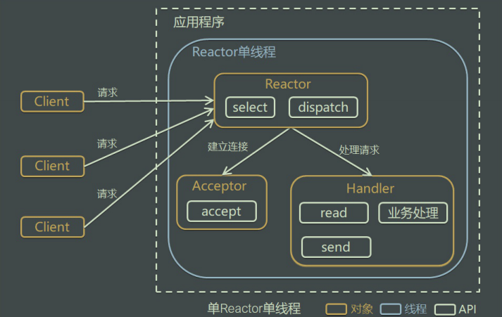

# 异步io模型
## 0. 代码优化
为了与方便操作，我们定义一个该组件的助手函数方式，只需要在composer.json中增加一项操作即可

修改``composer.json``
````
{
    "name": "willyin/io",
    "type": "library",
    "license": "MIT",
    "authors": [
        {
            "name": "will",
            "email": "826895143@qq.com"
        }
    ],
    "autoload": {
        "psr-4": {
            "Willyin\\Io\\": "./src/"
        },
        "files":[
            "src/Helper.php"
        ]
    },
    "require": {}
}
````    
在``src``下添加``Helper.php``
````
<?php
function debug($data, $flag = false)
{
    if ($flag) {
        var_dump($data);
    } else {
        echo "==== >>>> : ".$data." \n";
    }
}
// 发送信息
function send($client, $data, $flag = true)
{
    if ($flag) {
        fwrite($client, $data);
    } else {
        $response = "HTTP/1.1 200 OK\r\n";
        $response .= "Content-Type: text/html;charset=UTF-8\r\n";
        $response .= "Connection: keep-alive\r\n";
        $response .= "Content-length: ".strlen($data)."\r\n\r\n";
        $response .= $data;
        fwrite($client, $response);
    }
}
````
执行``composer update``,此时全局使用的方式`` send($conn, "hello world client \n");   dubug($arr);``

---

## 1. [swoole\Event实现](https://wiki.swoole.com/#/event)


>使用原生的event的方式相对来说比较麻烦所以还是使用swoole的方式
>
>关于[feof](https://php.golaravel.com/function.feof.html),测试文件指针是否到了文件结束的位。
````
<?php
/**
 * Create By: Will Yin
 * Date: 2020/6/27
 * Time: 11:06
 **/
namespace Willyin\Io\Asynchronous;
use Swoole\Event;

class Worker{
     //自定义服务的事件注册函数，
     // 这三个是闭包函数
    public $onReceive = null;
    public $onConnect = null;
    // 连接
    public $socket = null;

    public function __construct($socket_add)
    {
        $this->socket = stream_socket_server($socket_add);
    }
    //当客户端请求时的处理
    public function accept()
    {
        Event::add($this->socket, $this->createSocket());
    }

    //创建连接
    public function createSocket() {
        return function($socket){
            // $client 是不是资源 socket
            $client = stream_socket_accept($this->socket);
            // is_callable判断一个参数是不是闭包
            if (is_callable($this->onConnect)) {
                // 执行函数
                ($this->onConnect)($this, $client);
            }
            // 默认就是循环操作
            Event::add($client, $this->sendClient());
        };
    }
  //发送消息
    public function sendClient()
    {
        return function($socket){
            //从连接当中读取客户端的内容
            $buffer=fread($socket,1024);
            //如果数据为空，或者为false,不是资源类型
            if(empty($buffer)){
                if(feof($socket) || !is_resource($socket)){
                    //触发关闭事件
                    swoole_event_del($socket);
                    fclose($socket);
                }
            }
            //正常读取到数据,触发消息接收事件,响应内容
            if(!empty($buffer) && is_callable($this->onReceive)){
                ($this->onReceive)($this, $socket, $buffer);
                swoole_event_del($socket);
                fclose($socket);
            }
        };
    }

    // 启动服务的
    public function start()
    {
        $this->accept();
    }
}
````
````
<?php
/**
 * Create By: Will Yin
 * Date: 2020/6/27
 * Time: 11:18
 **/

require __DIR__.'/../../vendor/autoload.php';
use Willyin\Io\Asynchronous\Worker;
$host = "tcp://0.0.0.0:9000";
$server = new Worker($host);
$server->onReceive = function($socket, $client, $data){
   debug($data);
    // sleep(3);
    // echo "给连接发送信息\n";
    send($client, "hello world client \n");
};
debug($host);
$server->start();
````
可进行压力测试 ab -n 10000 -c 10000 -k http://127.0.0.1:9000/

#### 问题
````
    public function accept()
    {  
        debug("accept start");
        Event::add($this->socket, $this->createSocket()); //这个过程已异步的
        debug("accept end");
    }
````
>说其是非阻塞的原因是因为``Event::add``的执行过程不影响``debug``的输出过程

>但是以下这个过程会阻塞
````
require __DIR__.'/../../vendor/autoload.php';
use Willyin\Io\Asynchronous\Worker;
$host = "tcp://0.0.0.0:9000";
$server = new Worker($host);
$server->onReceive = function($socket, $client, $data){

     sleep(3);  //过程阻塞

    send($client, "hello world client \n");
};
debug($host);
$server->start();
````
>因为以上这过程是一个``单线程``,执行需要等待


## 2. Reactor理解
>以上的``异步io``其实也是``Reactor模型``的一种
### 2.1 传统的方式

#### 特点
- 采用阻塞式I/O模型获取输入数据
- 每个连接都需要独立的线程完成数据输入，业务处理，数据返回的完整操作
存在问题
- 当并发数较大时，需要创建大量线程来处理连接，系统资源占用较大
- 连接建立后，如果当前线程暂时没有数据可读，则线程就阻塞在read操作上，造成线程资源浪费
### 2.2 Reactor模式

>Reactor模式，是指通过一个或多个输入同时传递给服务处理器的服务请求的事件驱动处理模式。 服务端程序处理传入多路请求，并将它们同步分派给请求对应的处理线程，Reactor模式也叫Dispatcher模式，即I/O多了
 复用统一监听事件，收到事件后分发(Dispatch给某进程)，是编写高性能网络服务器的必备技术之一

#### Reactor模式中有2个关键组成：
- Reactor在一个单独的线程中运行，负责监听和分发事件，分发给适当的处理程序来对IO事件做出反应。 它就像公司的电话接线员，它接听来自客户的电话并将线路转移到适当的联系人
- Handlers处理程序执行I/O事件要完成的实际事件，类似于客户想要与之交谈的公司中的实际官员。Reactor通过调度适当的处理程序来响应I/O事件，处理程序执行非阻塞操作
### 2.3 Reactor单线程

#### 方案说明
- Reactor对象通过select监控客户端请求事件，收到事件后通过dispatch进行分发
- 如果是建立连接请求事件，则由Acceptor通过accept处理连接请求，然后创建一个Handler对象处理连接完成后的后续业务处理
- 如果不是建立连接事件，则Reactor会分发调用连接对应的Handler来响应
- Handler会完成read->业务处理->send的完整业务流程
#### 优点
- 模型简单，没有多线程、进程通信、竞争的问题，全部都在一个线程中完成
#### 缺点
- 性能问题：只有一个线程，无法完全发挥多核CPU的性能Handler在处理某个连接上的业务时，整个进程无法处理其他连接事件，很容易导致性能瓶颈
- 可靠性问题：线程意外跑飞，或者进入死循环，会导致整个系统通信模块不可用，不能接收和处理外部消息，造成节点故障
#### 使用场景
客户端的数量有限，业务处理非常快速，比如Redis，业务处理的时间复杂度O(1)


