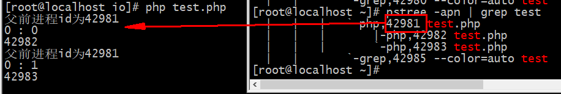

# Reactor模型
>在windows下不支持pcntl,宝塔环境下默认是禁止pcntl的,需要手动开启
## 1. 多进程
### 1.1 fork函数
>fork函数在调用一次之后就会返回两次，他可能有三种不同的返回值
- 在``父进程``中，fork返回新创建子进程的``进程id(值>0)``
- 在``子进程``中，fork``返回0``
- 如果``出现错误``，fork返回一个``负值``
>在fork函数执行完毕后，如果创建新进程成功，则出现两个进程，一个是子进程，- -个是父进程。在子进程中，fork函 数返回0，在父进程中，fork返回新创建子进程的进程ID。我们可以通过fork返回的值来判断当前进程是子进程还是父进程。

#### 问题:释fpid的值为什么在父子进程中不同。
>“其实就相当于链表，进程形成了链表，父进程的fpid(p意味point)指向子进程的进程id,因为子进程没有子进程，所以其fpid为0

#### fork出错可能有两种原因:
- 当前的进程数已经达到了系统规定的上限，这时errno的值被设置为EAGAIN。
- 系统内存不足，这时errno的值被设置为ENOMEM。
>创建新进程成功后，系统中出现两个基本完全相同的进程，这两个进程执行没有固定的先后顺序，哪个进程先执行要看系统的进程调度策略。每个进程都有一个独特(互不相同)的进程标识符(process ID)，可以通过``getpid()``函数获得，还有一个记录``父进程pid``的变量，可以通过``getppid()``函数获得变量的值。
### 1.2 php创建子进程演示
>PHP中关于创建进程的方法主要是通过与pcntl_fork()函数创建的， 可以通过``posix_getpid()``获取到进程的id 如下示例：

关于[pcntl拓展的安装](https://www.cnblogs.com/flzs/p/12593367.html)

案例:
````
<?php
$curr_pid = posix_getpid();//获取当前的进程id
// 将当前进程的id写入文件中
echo '当前父进程的id：'.$curr_pid."\n";
// pcntl_fork 创建子进程
// 返回子进程的id
$son_pid = pcntl_fork();
echo '创建的子进程的id：'.$son_pid."\n";
echo '创建子进程之后当前的进程为：'.posix_getpid()."\n";
echo "1\n";
````


### 1.3 进程回收
>在一些情况下,当父进程被``kill``掉,子进程还存在,此时程这些子进程为僵尸进程(孤儿进程)


````
<?php
/**
 * Create By: Will Yin
 * Date: 2020/6/28
 * Time: 21:41
 **/

for($i = 0 ; $i < 2 ; $i++){
    $son1 = pcntl_fork();
    if( $son1 > 0 ){
        //父进程空间
        echo "父前进程id为".posix_getpid()."\n";
    } else if($son1 < 0 ){
        //创建失败
        echo "创建失败";
    } else{
        echo $son1." : $i\n";
        echo posix_getpid()."\n";
 //因为在循环创建的过程中,子进程也会进入循环,为了更好的控制子进程的个数,加入break(或者exit);
        break;
       
    }
}
while(true){
}


````
#### 加入 ``break`` 前


#### 加入 ``break`` 后



#### 使用 [pcntl_wait](https://php.golaravel.com/function.pcntl-wait.html) 回收子进程
>父进程必须等待一个子进程退出后，再创建下一个子进程,也就是回收``kill``的子进程,过程阻塞.
````
for($i = 0 ; $i < 2 ; $i++){
    $son1 = pcntl_fork();
    if( $son1 > 0 ){
        //父进程空间
        //echo "父进程id为".posix_getppid()."\n";
        //echo "父前进程id为".posix_getpid()."\n";
    } else if($son1 < 0 ){
        //创建失败

        echo "创建失败";
    } else{
        echo "当前进程的父进程id为".posix_getppid()."\n";
        echo $son1." : $i\n";
        echo "当前进程id为".posix_getpid()."\n";
        break;
        //因为在循环创建的过程中,子进程也会进入循环;
    }
    //pcntl_wait($status); // 父进程必须等待一个子进程退出后，再创建下一个子进程。 也就是阻塞过程
}

while(true){
}
````
## 2. 预派生子进程(多进程)
``早期的php-fpm``就是一个[预派生子进程模型](https://www.bookstack.cn/read/swoft-doc-v2.x/ready-tradition.md#%E9%A2%84%E6%B4%BE%E7%94%9F%E5%AD%90%E8%BF%9B%E7%A8%8B%E6%A8%A1%E5%BC%8F),简单来说就是``多进程``
>程序启动后就会创建N个进程。每个子进程进入Accept，等待新的连接进入。当客户端连接到服务器时，其中一个子进程会被唤醒，开始处理客户端请求，并且不再接受新的TCP连接。当此连接关闭时，子进程会释放，重新进入Accept，参与处理新的连接。这个模型的优势是完全可以复用进程，不需要太多的上下文切换

````
<?php
namespace Willyin\Io\PcntlModel;

// 这是等会自个要写的服务
class Worker
{

    // 自定义服务的事件注册函数，
    // 这三个是闭包函数
    public $onReceive = null;
    public $onConnect = null;
    public $onClose = null;
    // 连接
    public $socket = null;

    // 创建多个子进程 -》 是不是可以自定义
    protected $config = [
        'worker_num' => 4
    ];

    public function __construct($socket_address)
    {
        $this->socket = stream_socket_server($socket_address);
        stream_set_blocking($this->socket, 0);
    }

    // 启动服务的
    public function start()
    {
        $this->fork();
    }
    // 创建多个子进程，并且让子进程可以去运行accept函数
    public function fork()
    {
        for ($i=0; $i < $this->config['worker_num']; $i++) {
            $son11 = pcntl_fork();
            if ($son11 > 0) {
                // 父进程空间
            } else if($son11 < 0){
                // 进程创建失败的时候
            } else {

                $this->accept();
                // 处理接收请求
                exit;
            }

        }

        $status = 0;
        $son = pcntl_wait($status);


    }
    // 需要处理事情
    public function accept()
    {
        // 接收连接和处理使用
        while (true) {
            $a =  posix_getpid();
            debug($a); // 阻塞
            debug("准备就绪");

            // 监听的过程是阻塞的
            $client = @stream_socket_accept($this->socket);


            if (is_callable($this->onConnect)) {
                // 执行函数
                ($this->onConnect)($this, $client);
            }
            $data = @fread($client, 65535);
            if (is_callable($this->onReceive)) {
                ($this->onReceive)($this, $client, $data);
                debug($a);
                debug("完成工作");
            }

        }
    }
    public function set($value)
    {
        // ..
    }

    // 发送信息
    public function send($client, $data)
    {
        $response = "HTTP/1.1 200 OK\r\n";
        $response .= "Content-Type: text/html;charset=UTF-8\r\n";
        $response .= "Connection: keep-alive\r\n";
        $response .= "Content-length: ".strlen($data)."\r\n\r\n";
        $response .= $data;
        @fwrite($client, $response);
    }
}
````
````
<?php
/**
 * Create By: Will Yin
 * Date: 2020/6/28
 * Time: 22:43
 **/

require __DIR__ . '/../../vendor/autoload.php';

use Willyin\Io\PcntlModel\Worker;

$host = "tcp://0.0.0.0:9000";
$server = new Worker($host);
$server->onConnect = function($socket, $client){
    echo "有一个连接进来了\n";
};
// 接收和处理信息
$server->onReceive = function($socket, $client, $data){
    $socket->send($client, "hello world client \n");
};
$server->start();
````


## 3. 单Reactor多线程/进程
### 3.0 单线程的问题


### 3.1 函数补充
#### 3.1.1 [stream_context_set_option](https://php.golaravel.com/function.stream-context-set-option.html)
>在workerman中对于短空的重复监听的方式就是通过与设置stream_context_set_option参数，这个参数的作用就是``设置端口可以复用监听``；``开启监听端口复用后允许多个无亲缘关系的进程监听相同的端口``,不过如果我们是直接设置的话会出现[惊群效应](https://blog.csdn.net/second60/article/details/81252106)，不过并无特别大的影响
>
>惊群效应：通俗点说，往鸡群里仍一颗稻谷，鸡群争抢，只有一个成功，其它失败。


#### 3.1.2 [stream-context-create](https://php.golaravel.com/function.stream-context-create.html)
>创建资源流上下文,简单来说就是创建一个资源,这里需要的使一个socket的文本资源,写法类似于``curl``

#### 3.1.3 如下是workerman中的代码示例:
````
if($this->reusePort){
     \stream_context_set_option($this->_context ,'socket',so_reuseport,1);
}
````


因为使socket资源,所以要调整[$pots选项](https://php.golaravel.com/context.socket.html)
````
$opts = array(
    'socket' => array(
        'bindto' => '192.168.0.100:0',
    ),
);
----------------------------------------------
仿照workerman:

$opts = array(
    'socket' => array(
        'backlog' => '102400',
    ),
);
````
#### 3.1.4 [与stream_socket_server结合](https://php.golaravel.com/function.stream-socket-server.html)
``stream_socket_server ( string $local_socket [, int &$errno [, string &$errstr [, int $flags = STREAM_SERVER_BIND | STREAM_SERVER_LISTEN [, resource $context ]]]] ) ``


>将创建的文本资源安要求放置最后,并且补充上前面所需要的所有参数
````  
  public function __construct($socket_address)
    {
        $this->socket_address = $socket_address;
    }
    // 需要处理事情
    public function accept()
    {
        Event::add($this->initServer(), $this->createSocket());
    }


    public function initServer()
    {
        // 并不会起到太大的影响
        // 这里是参考与workerman中的写法
        $opts = [
            'socket' => [
                // 设置等待资源的个数
                'backlog' => '102400',
            ],
        ];

        $context = stream_context_create($opts);
        // 设置端口可以重复监听
        \stream_context_set_option($context, 'socket', 'so_reuseport', 1);

        // 传递一个资源的文本 context
        return $this->socket = stream_socket_server($this->socket_address , $errno , $errstr, STREAM_SERVER_BIND | STREAM_SERVER_LISTEN, $context);
    }

    public function createSocket()
    {
        return function($socket){
            $client = stream_socket_accept($this->socket);
            // is_callable判断一个参数是不是闭包
            if (is_callable($this->onConnect)) {
                // 执行函数
                ($this->onConnect)($this, $client);
            }
            // 默认就是循环操作
            Event::add($client, $this->sendClient());
        };
    }
````
### 3.2 复现 Reactor 多进程方式


方案说明
- Reactor对象通过``select监控客户端请求``事件，收到事件后``通过dispatch进行分发``
- 如果是``建立连接请求事件``，则``由Acceptor通过accept处理连接请求``，然后创建一个``Handler对象处理连接``完成后的续各种事件
- 如果不是建立连接事件，则Reactor会分发调用连接对应的Handler来响应
``Handler只负责响应事件``，不做具体业务处理，通过read读取数据后，会分发给后面的Worker线程池进行业务处理
- ``Worker线程池会分配独立的线程完成真正的业务处理``，然后``将响应结果发给Handler进行处理``
- Handler收到响应结果后通过send将响应结果返回给client
````
<?php
/**
 * Create By: Will Yin
 * Date: 2020/6/29
 * Time: 15:08
 **/
namespace Willyin\Io\Reactor\Swoole\Mulit;
use Swoole\Event;

class WorkerMulit
{
//监听socket
    protected $sockets = NULL;
//连接事件回调
    public $onConnect = NULL;
//接收消息事件回调
    public $onReceive = NULL;

    protected $config = [
        'workerNum' => 4,
    ];

    protected $socket_address;

    public function __construct($socket_address) {
        // $this->socket = stream_socket_server($socket_address);
        $this->socket_address = $socket_address;
    }
    public function set($data){
        $this->config = $data;
    }
    public function start(){
        $this->fork();
    }
    /**
     * 创建进程完成事情
     */
    public function fork() {
        $son_pid = pcntl_fork();
        for ($i=0; $i < $this->config['workerNum']; $i++) {
            if ($son_pid > 0) {
                $son_pid = pcntl_fork();
            } else if($son_pid < 0){
                // 异常
            } else {
                $this->accept();
                break;
            }
        }
        // 父进程监听子进程情况并回收进程
        for ($i=0; $i < $this->config['workerNum']; $i++) {
            $status = 0;
            $sop = pcntl_wait($status);
        }
    }
// 接收连接，并处理连接
    public function accept(){
        // $this->sockets[(int) $socket] = $socket;
        // 第一个需要监听的事件(服务端socket的事件),一旦监听到可读事件之后会触发
        Event::add($this->initServer(), $this->createSocket());
    }
    /**
     * 初始化话server
     */
    public function initServer()
    {
        $opts = [
            'socket' => [
                // 连接成功之后的等待个数
                'backlog' => '102400',
            ]
        ];
        $context = stream_context_create($opts);
        // 设置端口可以被多个进程重复的监听
        stream_context_set_option($context, 'socket', 'so_reuseport', 1);
        return stream_socket_server($this->socket_address, $errno, $errstr, STREAM_SERVER_BIND | STREAM_SERVER_LISTEN, $context);
    }

    /**
     * 建立与客户端的连接
     */
    public function createSocket(){
        return function($socket){
            // 测试端口监听的效果
             debug(posix_getpid());
            $client=stream_socket_accept($socket);
            //触发事件的连接的回调
            if(!empty($client) && is_callable($this->onConnect)){
                call_user_func($this->onConnect, $client);
            }
            Event::add($client, $this->sendMessage());
        };
    }
    public function sendMessage(){
        return function($socket){
            //从连接当中读取客户端的内容
            $buffer=fread($socket,1024);
            //如果数据为空，或者为false,不是资源类型
            if(empty($buffer)){
                if(feof($socket) || !is_resource($socket)){
                    // 触发关闭事件
                     swoole_event_del($socket);
                     fclose($socket);
                }
            }
            //正常读取到数据,触发消息接收事件,响应内容
            if(!empty($buffer) && is_callable($this->onReceive)){
                call_user_func($this->onReceive,$this,$socket,$buffer);
                //swoole_event_del($socket);
                //fclose($socket);
            }
        };
    }
}
````
````
<?php
require __DIR__.'/../../../vendor/autoload.php';
use Willyin\Io\Reactor\Swoole\Mulit\WorkerMulit;
$host = "tcp://0.0.0.0:9000";
$server = new WorkerMulit($host);

$server->onConnect = function($socket, $conn=null){
    echo "有一个连接进来了\n";
    //var_dump($conn);
};
$server->onReceive = function($socket, $client, $data){
   send($client, "hello world client \n",false);
};
// debug($host);
$server->start();

// require __DIR__.'/../../../../vendor/autoload.php';
//
// $host = "0.0.0.0"; // 0.0.0.0 代表接听所有
// $serv = new Swoole\Server($host, 9000);
// $serv->on('Receive', function ($serv, $fd, $from_id, $data) {
//     $serv->send($fd, "Server: ".$data);
// });
// $serv->start();
````


## 4. 热加载
````
[root@localhost multi]# kill -l
 1) SIGHUP       2) SIGINT       3) SIGQUIT      4) SIGILL       5) SIGTRAP
 6) SIGABRT      7) SIGBUS       8) SIGFPE       9) SIGKILL     10) SIGUSR1
11) SIGSEGV     12) SIGUSR2     13) SIGPIPE     14) SIGALRM     15) SIGTERM
16) SIGSTKFLT   17) SIGCHLD     18) SIGCONT     19) SIGSTOP     20) SIGTSTP
21) SIGTTIN     22) SIGTTOU     23) SIGURG      24) SIGXCPU     25) SIGXFSZ
26) SIGVTALRM   27) SIGPROF     28) SIGWINCH    29) SIGIO       30) SIGPWR
31) SIGSYS      34) SIGRTMIN    35) SIGRTMIN+1  36) SIGRTMIN+2  37) SIGRTMIN+3
38) SIGRTMIN+4  39) SIGRTMIN+5  40) SIGRTMIN+6  41) SIGRTMIN+7  42) SIGRTMIN+8
43) SIGRTMIN+9  44) SIGRTMIN+10 45) SIGRTMIN+11 46) SIGRTMIN+12 47) SIGRTMIN+13
48) SIGRTMIN+14 49) SIGRTMIN+15 50) SIGRTMAX-14 51) SIGRTMAX-13 52) SIGRTMAX-12
53) SIGRTMAX-11 54) SIGRTMAX-10 55) SIGRTMAX-9  56) SIGRTMAX-8  57) SIGRTMAX-7
58) SIGRTMAX-6  59) SIGRTMAX-5  60) SIGRTMAX-4  61) SIGRTMAX-3  62) SIGRTMAX-2
63) SIGRTMAX-1  64) SIGRTMAX
````

````
<?php
/**
 * Create By: Will Yin
 * Date: 2020/6/29
 * Time: 15:38
 **/
namespace Willyin\Io\SingnalDriven;
class Test{
    public function index() {
        echo 1;
        debug('oo oo11');
    }
}
````
````
<?php
/**
 * Create By: Will Yin
 * Date: 2020/6/29
 * Time: 15:40
 **/
require __DIR__.'/../../vendor/autoload.php';
use Willyin\Io\SingnalDriven\Test;

$http = new Swoole\Http\Server("0.0.0.0", 9501);
$http->on('request', function ($request, $response) {
    (new Test())->index();
    $response->header("Content-Type", "text/html; charset=utf-8");
    $response->end("<h1>Hello Swoole. #".rand(1000, 9999)."</h1>");

});

$http->start();
````


## 5 实现 ``stop``和``reload``功能
````
<?php
function debug($data, $flag = false)
{
    if ($flag) {
        var_dump($data);
    } else {
        echo "==== >>>> : ".$data." \n";
    }
}
// 发送信息
function send($client, $data, $flag = false)
{
    if ($flag) {
        fwrite($client, $data);
    } else {
        $response = "HTTP/1.1 200 OK\r\n";
        $response .= "Content-Type: text/html;charset=UTF-8\r\n";
        $response .= "Connection: keep-alive\r\n";
        $response .= "Content-length: ".strlen($data)."\r\n\r\n";
        $response .= $data;
        fwrite($client, $response);
    }
}
/**
 * 用来写入 pid的函数
 */
function pidPut($data, $path){
    (empty($data)) ? file_put_contents($path, null) : file_put_contents($path, $data.'|', 8) ;
}
/**
 * 获取pid的函数
 */
function pidGet($path){
    $string = file_get_contents($path);
    return explode("|",  substr($string, 0 , strlen($string) - 1));
}

````
````
<?php
namespace Willyin\Io\Reactor\Swoole\Mulit;
use Swoole\Event;

class Worker
{
    // 自定义服务的事件注册函数，
    // 这三个是闭包函数
    public $onReceive = null;
    public $onConnect = null;
    public $onClose = null;

    // 连接
    public $socket = null;
    // 创建多个子进程 -》 是不是可以自定义
    protected $config = [
        'worker_num' => 4
    ];
    protected $socket_address = null;
    // 记录子进程pid地址
    protected $workerPidFiles = "/www/io/test/reactor/pid/workerPids.txt";
    // 以内存的方式存pids
    protected $workerPids = [];

    public function __construct($socket_address)
    {
        $this->socket_address = $socket_address;
    }
    // 需要处理事情
    public function accept()
    {
        Event::add($this->initServer(), $this->createSocket());
    }


    public function initServer()
    {
        // 并不会起到太大的影响
        // 这里是参考与workerman中的写法
        $opts = [
            'socket' => [
                // 设置等待资源的个数
                'backlog' => '102400',
            ],
        ];

        $context = stream_context_create($opts);
        // 设置端口可以重复监听
        \stream_context_set_option($context, 'socket', 'so_reuseport', 1);

        // 传递一个资源的文本 context
        return $this->socket = stream_socket_server($this->socket_address , $errno , $errstr, STREAM_SERVER_BIND | STREAM_SERVER_LISTEN, $context);
    }

    public function createSocket()
    {
        return function($socket){
            // debug(posix_getpid());
            // $client 是不是资源 socket
            $client = stream_socket_accept($this->socket);
            // is_callable判断一个参数是不是闭包
            if (is_callable($this->onConnect)) {
                // 执行函数
                ($this->onConnect)($this, $client);
            }
            // 默认就是循环操作
            Event::add($client, $this->sendClient());
        };
    }

    public function sendClient()
    {
        return function($socket){
            //从连接当中读取客户端的内容
            $buffer=fread($socket,1024);
            //如果数据为空，或者为false,不是资源类型
            if(empty($buffer)){
                if(feof($socket) || !is_resource($socket)){
                    //触发关闭事件
                    swoole_event_del($socket);
                    fclose($socket);
                }
            }
            //正常读取到数据,触发消息接收事件,响应内容
            if(!empty($buffer) && is_callable($this->onReceive)){
                ($this->onReceive)($this, $socket, $buffer);
            }
        };
    }

    public function reloadCli()
    {
        // 先停止运行的进程
        $this->stop();
        pidPut(null, $this->workerPidFiles);
        // 清空记录
        $this->fork();
    }
    //通过信号传递信息,杀死一个子进程就随之创建一个
    public function reloadSig($workerNum =null )
    {
        $workerNum = (empty($workerNum)) ? $this->config['worker_num'] : $workerNum ;
        $this->stop();
        $this->fork($workerNum);
        //$workerPids = pidGet($this->workerPidFiles);
        // foreach ($workerPids as $index => $workerPids) {
        //   posix_kill($workerPids,9);
        //   $this->fork(1);
        //}
    }

    public function sigHandler($sig)
    {
        switch ($sig) {
          case SIGUSR1:
            //重启
            $this->reloadSig();
            break;
          case SIGKILL:
            // 停止
            $this->stop();
            break;
        }
    }

    public function stop()
    {
        $workerPids = pidGet($this->workerPidFiles);
        foreach ($workerPids  as $key => $workerPid) {
            posix_kill($workerPid, 9);
        }
    }

    // 启动服务的
    public function start()
    {
        debug('start 开始 访问：'.$this->socket_address);
        pidPut(null, $this->workerPidFiles);
        $this->fork();

        // 答案是后
        $this->monitorWorkersForLinux();
    }
    //就是把fork方法中的子进程回收提取了出来,下面内容时仿照workerman的写法
    public function monitorWorkersForLinux()
    {
         // 信号安装
         pcntl_signal(SIGUSR1, [$this, 'sigHandler'], false);
         while (1) {
             // Calls signal handlers for pending signals.
             \pcntl_signal_dispatch();
             // Suspends execution of the current process until a child has exited, or until a signal is delivered
             \pcntl_wait($status);
             // Calls signal handlers for pending signals again.
             \pcntl_signal_dispatch();
         }
    }
    public function fork($workerNum = null)
    {
        $workerNum = (empty($workerNum)) ? $this->config['worker_num'] : $workerNum ;
        for ($i=0; $i < $workerNum; $i++) {
            $son11 = pcntl_fork();
            if ($son11 > 0) {
                // 父进程空间
                pidPut($son11, $this->workerPidFiles);
                $this->workerPids[] = $son11;
            } else if($son11 < 0){
                // 进程创建失败的时候
            } else {
                // debug(posix_getpid()); // 阻塞
                $this->accept();
                // 处理接收请求
                break;
            }
        }
        // for ($i=0; $i < $this->config['worker_num']; $i++) {
        //     $status = 0;
        //     $son = pcntl_wait($status);
        //     debug('回收子进程：'.$son);
        // }
    }
}

````
````
<?php
require __DIR__.'/../../../vendor/autoload.php';
use Willyin\Io\Reactor\Swoole\Mulit\Worker;
$host = "tcp://0.0.0.0:9000";
$server = new Worker($host);
$server->stop();// 暂时只是停止子进程

````
````
<?php
require __DIR__.'/../../../vendor/autoload.php';
use Willyin\Io\Reactor\Swoole\Mulit\Worker;
$host = "tcp://0.0.0.0:9000";
$server = new Worker($host);

$server->onConnect = function($socket, $conn=null){
    echo "有一个连接进来了\n";
    //var_dump($conn);
};
$server->onReceive = function($socket, $client, $data){
   send($client, "hello world client \n",false);
};
// debug($host);
$server->start();

// require __DIR__.'/../../../../vendor/autoload.php';
//
// $host = "0.0.0.0"; // 0.0.0.0 代表接听所有
// $serv = new Swoole\Server($host, 9000);
// $serv->on('Receive', function ($serv, $fd, $from_id, $data) {
//     $serv->send($fd, "Server: ".$data);
// });
// $serv->start();

````
````
<?php
require __DIR__.'/../../../../vendor/autoload.php';
use Willyin\Io\Reactor\Swoole\Mulit\Worker;
$host = "tcp://0.0.0.0:9000";

$server = new Worker($host);
$server->onReceive = function($socket, $client, $data){
    (new Index)->index();
    send($client, "hello world client \n");
}; 
$server->reloadCli();// 暂时只是停止子进程

````


问题:
>当curl请求会出现阻塞问题,需要``fork``子进程中使用``exit``停止``monitorWorkersForLinux``造成的循环问题
````
 for ($i=0; $i < $workerNum; $i++) {
            $son11 = pcntl_fork();
            if ($son11 > 0) {
                // 父进程空间
                pidPut($son11, $this->workerPidFiles);
                $this->workerPids[] = $son11;
            } else if($son11 < 0){
                // 进程创建失败的时候
            } else {
                // debug(posix_getpid()); // 阻塞
                $this->accept();
                // 处理接收请求
                //break;
                exit;
            }
        }
````