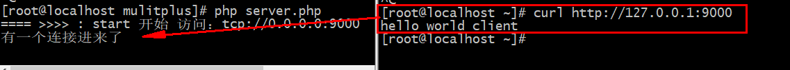

## 1. 模型完善
### 1.0 配置文件的内容提取
将这些配置信息统一放置在config中,方便管理
````
 // 创建多个子进程 -》 是不是可以自定义
    protected $config = [
        'worker_num' => 4,
        // 记录子进程pid地址
        'workerPidFiles' => '/www/io/test/reactor/pid/workerPids.txt',
        'opts' =>[
            'socket' => [
                // 设置等待资源的个数
                'backlog' => '102400',
            ],
        ]
    ];
````
### 1.1 客户端发送信息没有反应


>解决方法 : 主要是子进程通过break跳出for之后进入了 monitorWorkersForLinux中阻塞了，通过修改fork方法解决,将``break``跳出方式更换为``exit``
````
 public function fork($workerNum = null)
    {
        $workerNum = (empty($workerNum)) ? $this->config['worker_num'] : $workerNum ;
        for ($i=0; $i < $workerNum; $i++) {
            $son11 = pcntl_fork();
            if ($son11 > 0) {
                // 父进程空间
                pidPut($son11, $this->config['workerPidFiles']);
                $this->workerPids[] = $son11;
            } else if($son11 < 0){
                // 进程创建失败的时候
            } else {
                // debug(posix_getpid()); // 阻塞
                $this->accept();
                // 处理接收请求
                //break;
                exit;
            }
        }
````

````
原因: swoole中的``event``是一个非阻塞,当其执行完就会进入monitorWorkersForLinux方法中

 public function accept()
    {
        Event::add($this->initServer(), $this->createSocket());
    }

阻塞发生的位置(monitorWorkersForLinux 是一个死循环):

 //就是把fork方法中的子进程回收提取了出来,下面内容时仿照workerman的写法
    public function monitorWorkersForLinux()
    {
         // 信号安装
         pcntl_signal(SIGUSR1, [$this, 'sigHandler'], false);
         while (1) {
             \pcntl_signal_dispatch();
             \pcntl_wait($status);
             \pcntl_signal_dispatch();
         }
    }
````
````
问题所在就是 break与exit的区别

for($i = 1 ; $i < 10 ; $i++){
    for ($i = 1 ; $i < 10 ; $i++){
        echo $i;
        //break;
        exit;
    }
    echo "这是外层的".$i;
}
````

### 1.2 stop不能停止整个程序


>解决方法 : 记录主进程pid然后停止
````
    protected $config = [
        //据录父进程pid地址
        'masterPidFiles' => '/www/io/test/reactor/pid/masterPidFiles.txt',
    ];
    
    
    // 启动服务的
    public function start()
    {
        //记录父进程id,先清空,在记录
        pidPut(null, $this->config['masterPidFiles']);
        pidPut(posix_getpid(), $this->config['masterPidFiles']);
    
    }
    
    //停止服务
    public function stop()
    {
        //读取父进程pid
        $masterPids = pidGet($this->config['masterPidFiles'])[0];
        posix_kill($masterPids, 9);
    }
    
    

````


>当``kill -10``传递主进程的重启命令的时候，发现进程全部被杀死了
 

````
    public function stop($masterKill = true)
    {
       if($masterKill){
            //读取父进程pid
            $masterPids = pidGet($this->config['masterPidFiles'])[0];
            posix_kill($masterPids, 9);
        }

    }

  public function reloadSig($workerNum =null )
    {
        $workerNum = (empty($workerNum)) ? $this->config['worker_num'] : $workerNum ;

       //这里添加false值
        $this->stop(false);

        $this->fork($workerNum);
    }
````

### 1.3 通过信号重启worker进程之后杀死父进程而子进程还会存在的


>swoole中当``event事件``写入后,就会注册在内核中,不会立即中断,还会继续执行,不去手动清空他就会一直存在


>解决方法 : 调整添加``对于 ctrl+c 操作的监听``,``kill -l``中`` SIGINT ``关联`` ctrl+c ``,
````
public function sigHandler($sig)
{
    switch ($sig) {
        case SIGUSR1:
        //重启
        $this->reloadSig();
        break;

        case SIGKILL:
        // 停止
        $this->stop();
        break;
        
        case SIGINT:
        // 停止
        $this->stop();
        break;
    }
}

public function monitorWorkersForLinux()
{
    // 信号安装
    pcntl_signal(SIGUSR1, [$this, 'sigHandler'], false);

    //SIGINT关联ctrl+c
    pcntl_signal(SIGINT, [$this, 'sigHandler'], false);

    while (1) {
    \pcntl_signal_dispatch();
    \pcntl_wait($status);
    \pcntl_signal_dispatch();
}
````


### 1.4 关于monitorWorkersForLinux方法
````
 //就是把fork方法中的子进程回收提取了出来,下面内容时仿照workerman的写法
public function monitorWorkersForLinux()
{
    // 信号安装
    pcntl_signal(SIGUSR1, [$this, 'sigHandler'], false);

    //SIGINT关联ctrl+c
    pcntl_signal(SIGINT, [$this, 'sigHandler'], false);

    while (1) {
        \pcntl_signal_dispatch();
        \pcntl_wait($status);
        \pcntl_signal_dispatch();
    }
}
````
>这里写成死循环,如果不书写成死循环就只能回收一个进程,用一个死循环,使``pcntl_wait``函数有几个子进程就回收几个子进程,又因为要不断的重启,不断回收,书写成死循环的方式更加合理些    

### 1.5 Reactor模型的multi升级完整版
````
<?php
namespace Willyin\Io\Reactor\Swoole\MulitPlus;
use Swoole\Event;

class Worker
{
    // 自定义服务的事件注册函数，
    // 这三个是闭包函数
    public $onReceive = null;
    public $onConnect = null;
    public $onClose = null;

    // 连接
    public $socket = null;
    // 创建多个子进程 -》 是不是可以自定义
    protected $config = [
    'worker_num' => 4,
    // 记录子进程pid地址
    'workerPidFiles' => '/www/io/test/reactor/pid/workerPids.txt',
    //据录父进程pid地址
    'masterPidFiles' => '/www/io/test/reactor/pid/masterPidFiles.txt',
    'opts' =>[
        'socket' => [
            // 设置等待资源的个数
            'backlog' => '102400',
        ],
    ]
    ];
    protected $socket_address = null;

        // 以内存的方式存pids
    protected $workerPids = [];

    public function __construct($socket_address)
    {
        $this->socket_address = $socket_address;
    }
    // 需要处理事情
    public function accept()
    {
        Event::add($this->initServer(), $this->createSocket());
    }

    public function initServer()
    {
        $context = stream_context_create($this->config['opts']);
        // 设置端口可以重复监听
        \stream_context_set_option($context, 'socket', 'so_reuseport', 1);

        // 传递一个资源的文本 context
        return $this->socket = stream_socket_server($this->socket_address , $errno , $errstr, STREAM_SERVER_BIND | STREAM_SERVER_LISTEN, $context);
    }

    public function createSocket()
    {
        return function($socket){
            // $client 是不是资源 socket
            $client = stream_socket_accept($this->socket);
            // is_callable判断一个参数是不是闭包
            if (is_callable($this->onConnect)) {
                // 执行函数
                ($this->onConnect)($this, $client);
            }
            // 默认就是循环操作
            Event::add($client, $this->sendClient());
        };
    }

    public function sendClient()
    {
        return function($socket){
            //从连接当中读取客户端的内容
            $buffer=fread($socket,1024);
            //如果数据为空，或者为false,不是资源类型
            if(empty($buffer)){
                if(feof($socket) || !is_resource($socket)){
                //触发关闭事件
                swoole_event_del($socket);
                fclose($socket);
                }
            }
            //正常读取到数据,触发消息接收事件,响应内容
            if(!empty($buffer) && is_callable($this->onReceive)){
                ($this->onReceive)($this, $socket, $buffer);
            }
        };
    }

    //通过信号传递信息,杀死一个子进程就随之创建一个
    public function reloadSig($workerNumber = null)
    {
        $workerNum = (empty($workerNumber)) ? $this->config['worker_num'] : $workerNum ;
        $this->stop(false);
        $this->fork($workerNum);
    }

    public function sigHandler($sig)
    {
        switch ($sig) {
            case SIGUSR1:
            //重启
            $this->reloadSig();
            break;
            case SIGKILL:
            // 停止
            $this->stop();
            break;

            case SIGINT:
            // 停止
            $this->stop();
            break;
        }
    }

    public function stop($masterKill = true)
    {
        $workerPids = pidGet($this->config['workerPidFiles']);

        foreach ($workerPids  as $key => $workerPid) {
            posix_kill($workerPid, 9);
        }
        pidPut(null, $this->config['workerPidFiles']);
       if($masterKill){
            //读取父进程pid
            $masterPids = pidGet($this->config['masterPidFiles'])[0];
            posix_kill($masterPids, 9);
        }

    }

    // 启动服务的
    public function start()
    {
        debug('start 开始 访问：'.$this->socket_address);
        pidPut(null, $this->config['workerPidFiles']);

        //记录父进程id,先清空,在记录
        pidPut(null, $this->config['masterPidFiles']);
        pidPut(posix_getpid(), $this->config['masterPidFiles']);


        $this->fork();

        $this->monitorWorkersForLinux();
    }
    //就是把fork方法中的子进程回收提取了出来,下面内容时仿照workerman的写法
    public function monitorWorkersForLinux()
    {
         // 信号安装
         pcntl_signal(SIGUSR1, [$this, 'sigHandler'], false);
         //SIGINT关联ctrl+c
         pcntl_signal(SIGINT, [$this, 'sigHandler'], false);
         while (1) {
             \pcntl_signal_dispatch();
             \pcntl_wait($status);
             \pcntl_signal_dispatch();
         }
    }
    public function fork($workerNum = null)
    {
        $workerNum = (empty($workerNum)) ? $this->config['worker_num'] : $workerNum ;
        for ($i=0; $i < $workerNum; $i++) {
            $son11 = pcntl_fork();
            if ($son11 > 0) {
                // 父进程空间
                pidPut($son11, $this->config['workerPidFiles']);
                $this->workerPids[] = $son11;
            } else if($son11 < 0){
                // 进程创建失败的时候
            } else {
                $this->accept();
                exit;
            }
        }
    }
}
````
````
<?php
require __DIR__.'/../../../vendor/autoload.php';
use Willyin\Io\Reactor\Swoole\MulitPlus\Worker;
$host = "tcp://0.0.0.0:9000";
$server = new Worker($host);

$server->onConnect = function($socket, $conn=null){
    echo "有一个连接进来了\n";
    //var_dump($conn);
};
$server->onReceive = function($socket, $client, $data){
   send($client, "hello world client \n",false);
};
$server->start();
````
````
<?php
require __DIR__.'/../../../vendor/autoload.php';
use Willyin\Io\Reactor\Swoole\MulitPlus\Worker;
$host = "tcp://0.0.0.0:9000";
$server = new Worker($host);
//停止所有运行进程
$server->stop();
````