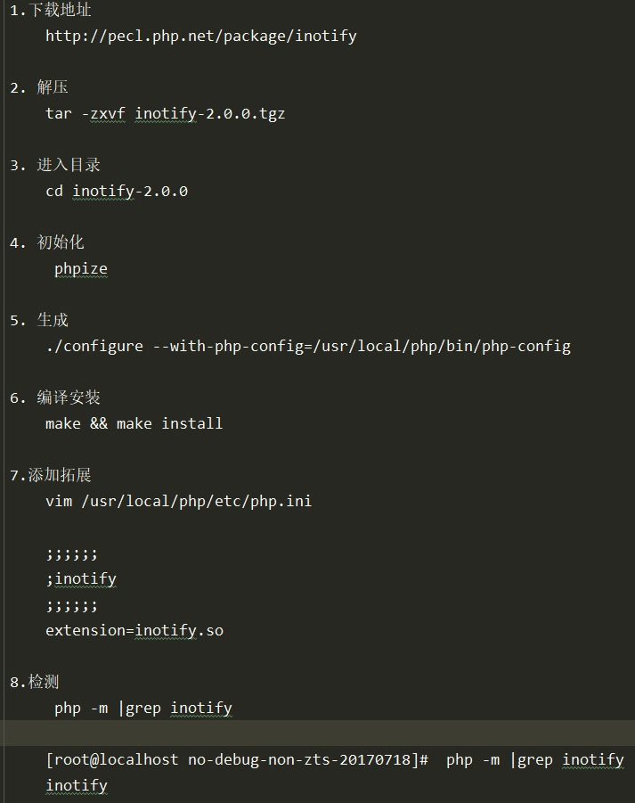
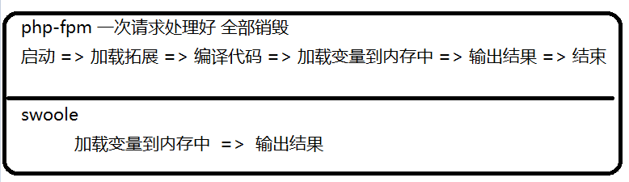
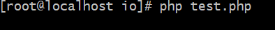
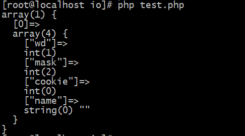
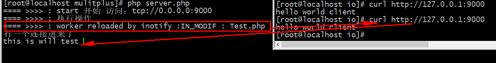
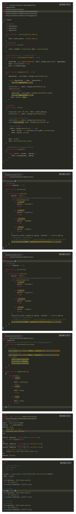

# 热加载 与 心跳检测
## 1 实现模型的reload功能
### 1.1 inotify安装

### 1.2 [inotify体验](https://php.golaravel.com/book.inotify.html)
为什么代码修改后,不会及时生效,需要重启才可以
>swoole当先的运行方式是``常驻内存``的


#### 那么如何实现代码的热加载呢?
>用到了inotify拓展
- [inotify_init](https://php.golaravel.com/function.inotify-init.html)初始化监听工具inotify
- [inotify_add_watc](https://php.golaravel.com/function.inotify-add-watch.html),针对于某一个问价进行监听
````
inotify_add_watch ( resource $inotify_instance , string $pathname , int $mask ) 

$inotify_instance 监听的资源 (inotify_init初始化的资源)
$pathname  监听文件的路径
$mask   预定义常量 (详情 : https://php.golaravel.com/inotify.constants.html)
````
- [inotify_read](https://php.golaravel.com/function.inotify-read.html),从inotify实例读取事件,``过程阻塞``

演示:
````
index.php

<?php
echo 1;
````
````
test.php

<?php
$fd = inotify_init();

$watch = inotify_add_watch($fd,__DIR__.'/index.php',2);

$event = inotify_read($fd);

var_dump($event);
````
##### 运行``test.php``

##### 当给``index.php``添加``echo 2;``后


>这里不能重复监听,加入``while``死循环,这里我们使用``swoole_event_add``
````
<?php

$fd = inotify_init();
$watch = inotify_add_watch($fd,__DIR__.'/index.php',2);

//while(1){
//    $event = inotify_read($fd);
//    var_dump($event);
//}
swoole_event_add($fd,function($fd){
    $event = inotify_read($fd);
    var_dump($event);
});
````
## 2.实现热加载
添加工具类
````
<?php
/**
 * Create By: Will Yin
 * Date: 2020/7/1
 * Time: 16:30
 **/
namespace Willyin\IO\Tools;

class Inotify
{
    private $fd;
    private $watchPath;
    private $watchMask;
    private $watchHandler;
    private $doing        = false;
    // 确定需要检测的文件类型
    private $fileTypes    = [
        '.php' => true
    ];
    private $wdPath       = [];
    private $pathWd       = [];

    public function __construct($watchPath, callable $watchHandler, $watchMask = IN_CREATE | IN_DELETE | IN_MODIFY | IN_MOVE)
    {
        if (!extension_loaded('inotify')) {
            debug('请安装inotify扩展');
            exit;
        }
        $this->fd = inotify_init();
        $this->watchPath = $watchPath;
        $this->watchMask = $watchMask;
        $this->watchHandler = $watchHandler;
        $this->watch();
        // debug("写完了");
    }
    // 添加需要校验的文件类型
    public function addFileType($type)
    {
        $type = '.' . trim($type, '.');
        $this->fileTypes[$type] = true;
    }

    public function addFileTypes(array $types)
    {
        foreach ($types as $type) {
            $this->addFileType($type);
        }
    }

    public function watch()
    {
        $this->_watch($this->watchPath);
    }
    /**
     * 通过递归去获取指定的目录下的文件，然后一一进行监控
     * 对每一个文件进行inotify_add_watch 文件事件注册
     */
    protected function _watch($path)
    {
        $wd = inotify_add_watch($this->fd, $path, $this->watchMask);
        if ($wd === false) {
            return false;
        }
        $this->bind($wd, $path);

        if (is_dir($path)) {
            $wd = inotify_add_watch($this->fd, $path, $this->watchMask);
            if ($wd === false) {
                return false;
            }
            $this->bind($wd, $path);
            // 列出 $path中 目录中的文件和目录：
            $files = scandir($path);
            foreach ($files as $file) {
                if ($file === '.' || $file === '..') {
                    continue;
                }
                $file = $path . DIRECTORY_SEPARATOR . $file;
                if (is_dir($file)) {
                    // 利用递归把子文件也一并的写入
                    $this->_watch($file);
                }
            }
        }
        return true;
    }

    protected function clearWatch()
    {
        foreach ($this->wdPath as $wd => $path) {
            @inotify_rm_watch($this->fd, $wd);
        }
        $this->wdPath = [];
        $this->pathWd = [];
    }

    protected function bind($wd, $path)
    {
        $this->pathWd[$path] = $wd;
        $this->wdPath[$wd] = $path;
    }

    protected function unbind($wd, $path = null)
    {
        unset($this->wdPath[$wd]);
        if ($path !== null) {
            unset($this->pathWd[$path]);
        }
    }

    public function start()
    {
        swoole_event_add($this->fd, function ($fp) {
            $events = inotify_read($fp);
            if (empty($events)) {
                return null;
            }

            // debug($events, true);
            foreach ($events as $event) {
                if ($event['mask'] == IN_IGNORED) {
                    continue;
                }

                $fileType = strchr($event['name'], '.');
                if (!isset($this->fileTypes[$fileType])) {
                    continue;
                }

                if ($this->doing) {
                    continue;
                }
                // 延迟更新，做缓冲
                swoole_timer_after(100, function () use ($event) {
                    debug("执行操作");

                    // 回调自定义函数方法(这里传递进来的是一个闭包函数,方便使用)
                    call_user_func_array($this->watchHandler, [$event]);

                    //  标记当前以重启结束
                    $this->doing = false;
                });
                $this->doing = true;
                break;
            }
        });
    }

    public function stop()
    {
        swoole_event_del($this->fd);
        fclose($this->fd);
    }

    public function getWatchedFileCount()
    {
        return count($this->wdPath);
    }

    public function __destruct()
    {
        $this->stop();
    }
}
````
工具类的修改
````
    protected $config = [
        //是否开启文件的额监听
        'watch_file' => false,
    ];
    
    //记录inotify
    protected $inotify = null;

    public function start()
    {
        ..........
        
        //判断是否开启监听
        if($this->config['watch_file']){
            $this->inotify = new Inotify(baseDir(),$this->watchEvent());
            $this->inotify->start();
        }
        
        $this->fork();
        $this->monitorWorkersForLinux();
    }

    public function watchEvent()
    {
    return function ($event){
        $action = 'file:';
        //以下均为inotify事件(https://php.golaravel.com/inotify.constants.html)
        switch ($event['mask']) {
            case IN_CREATE:
            $action = 'IN_CREATE';
            break;
            
            case IN_DELETE:
            $action = 'IN_DELETE';
            break;
            
            case \IN_MODIFY:
            $action = 'IN_MODIF';
            break;
            
            case \IN_MOVE:
            $action = 'IN_MOVE';
            break;
        }
        debug('worker reloaded by inotify :'.$action." : ".$event['name']);
        // posix_kill — 向进程发送信号
        // 这是整个方法中最核心的方法 ， 其余的全部是做装饰的,当监控文件发生变化,就重启进程
        posix_kill((pidGet($this->config['masterPidFiles']))[0], SIGUSR1);
    };
    }

    //设置配置的变变量,类似swoole中的set功能
    public function set($data)
    {
        foreach ($data as $index => $datum) {
        $this->config[$index] = $datum;
        }
    }
````
````
<?php
require __DIR__.'/../../../vendor/autoload.php';
use Willyin\Io\Reactor\Swoole\MulitPlus\Worker;
use Willyin\Io\Test;  

$host = "tcp://0.0.0.0:9000";
$server = new Worker($host);
$server->set([
    'watch_file' => true
]);

$server->onConnect = function($socket, $conn=null){
    echo "有一个连接进来了\n";

};
$server->onReceive = function($socket, $client, $data){
    (new Test())->index();
    send($client, "hello world client \n",true);
};
$server->start();
````
````
<?php
namespace Willyin\Io;
Class Test{
    public function index()
    {
        echo "this is will test 1";
    }
}
````
>开启服务,对``test``类进行修改,发现报出信息,``curl``访问,实时变化


优化代码,可以使用超物类,如:
````
<?php
/**
 * Create By: Will Yin
 * Date: 2020/7/1
 * Time: 17:43
 **/
namespace Willyin\Io\Reactor\Swoole\Traits;

trait InotifyTait{
    public function sigHandler($sig)
    {
        switch ($sig) {
            case SIGUSR1:
                //重启
                $this->reloadSig();
                break;
            case SIGKILL:
                // 停止
                $this->stop();
                break;

            case SIGINT:
                // 停止
                $this->stop();
                break;
        }
    }
}
````
````
use Willyin\Io\Reactor\Swoole\Traits\ServerTait;

class Worker
{
    //使用超物类
    use ServerTait;
````
## 3. [心跳检测](https://wiki.swoole.com/#/timer)
- 实际上只需要延时去进行关闭连接即可
- 然后在规定的时间内清空定时器即可

````
 protected $config = [
        //心跳检测
        'heartbeat_check_interval' => ''
    ];

 /**
     * 记录客户端的信息 比如上一次连接的时间
     */
    protected $clients = [];

    /**
     * 记录产生的定时器
     */
    protected $timeIds = [];

     public function sendClient()
        {
            return function($socket){
                // 如果能接收到信息，那么这个程序一定在心跳检测的范围内
                if (!empty($this->timeIds[(int) $socket])) {
                    swoole_timer_clear($this->timeIds[(int) $socket]);
                    debug("清空: ". $this->timeIds[(int) $socket]. "定时器");
                }
    
                //从连接当中读取客户端的内容
                $buffer=fread($socket,1024);
                //如果数据为空，或者为false,不是资源类型
                if(empty($buffer)){
                    if(feof($socket) || !is_resource($socket)){
                        //触发关闭事件
                        swoole_event_del($socket);
                        fclose($socket);
                        return null;
                    }
                }
                //正常读取到数据,触发消息接收事件,响应内容
                if(!empty($buffer) && is_callable($this->onReceive)){
                    ($this->onReceive)($this, $socket, $buffer);
                    //swoole_event_del($socket);
                    //fclose($socket);
                }
                // 定时器
                $this->heartbeatCheck($socket);
            };
        }

  /**
    * 用于心跳检测 默认不开启
    */
    protected function heartbeatCheck($socket)
    {
        $time = $this->config['heartbeat_check_interval'];
        if (!empty($time)) {
            // 记录客户端上一次信息的发送时间
            $this->clients[(int) $socket] = time();
            // 设置在多久后检测是否还有在连接,是以毫秒为单位,所以要乘以1000
            $timeId = swoole_timer_after($time * 1000, function() use ($time,$socket) {
                // 判断客户端是否，在heartbeat_check_interval 这个时间内是否还有信息的动作
                // 实际上当这个函数执行的时候已经端口连接了 -》超出了心跳检测的时间；原则上说下面的判断实际是无意义的
                if ((time() - ($this->clients[(int)$socket])) >= $time) {
                    swoole_event_del($socket);
                    \fclose($socket);
                    unset($this->clients[(int)$socket]);
                    debug("结束：" . (int)$socket . " 连接");
                }
            });
            $this->timeIds[(int) $socket] = $timeId;
        }
    }
````

#### 最终代码:


