# task进程
## 1. swoole结构
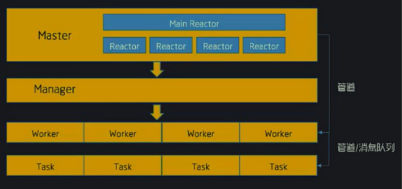
### 1.1 task进程介绍
>``Task进程``是``独立与worker进程``的一个进程.他主要``处理耗时较长的业务逻辑``.并且``不影响worker进程``处理客户端的请求,这大大提高了swoole的并发能力当有耗时较长的任务时,``worker进程通过task()函数把数据投递到Task进程去处理``

适合运用场景
- 情景一：管理员需要给100W用户发送邮件，当点击发送，浏览器会一直转圈，直到邮件全部发送完毕。
- 情景二：千万微博大V发送一条微博，其关注的粉丝相应的会接收到这个消息，是不是大V需要一直等待消息发送完成，才能执行其它操作
- 情景三：处理几TB数据
- 情景四: 数据库插入(50万以上)
>php进程一直被阻塞，客户端才一直在等待服务端的响应，我们的代码就是同步执行的。对于用户而言，这就是漫长的等待,这里就可以使用task进程帮助我们优雅的完成任务

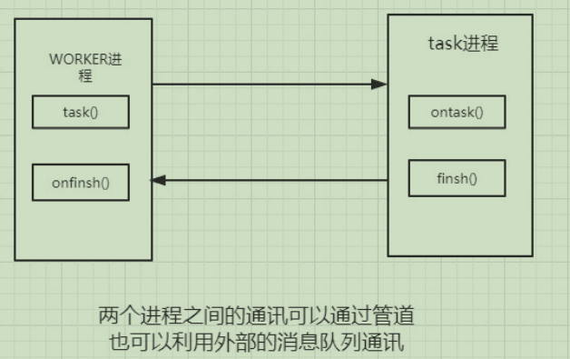

- worker进程当中，我们调用对应的task()方法发送数据通知到task worker进程
- task worker进程会在onTask()回调中接收到这些数据，并进行处理。
- 处理完成之后通过调用finsh()函数或者直接return返回消息给worker进程
- worker进程在onFinsh()进程收到这些消息并进行处理
### 1.2 [task初体验](https://wiki.swoole.com/#/start/start_task)
- [$serv->task](https://wiki.swoole.com/#/server/methods?id=task)

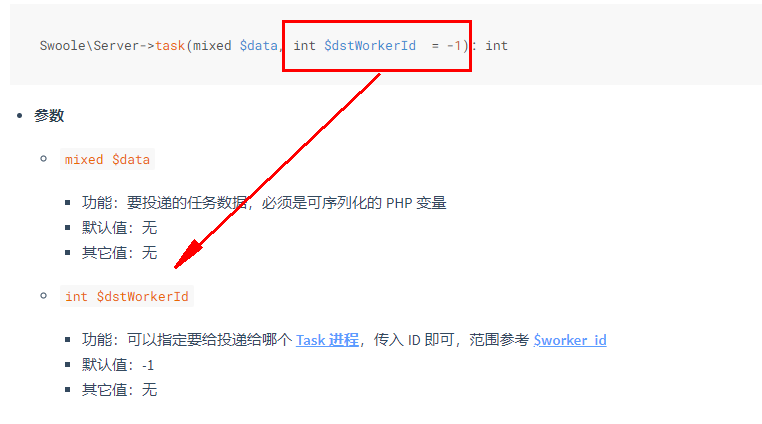
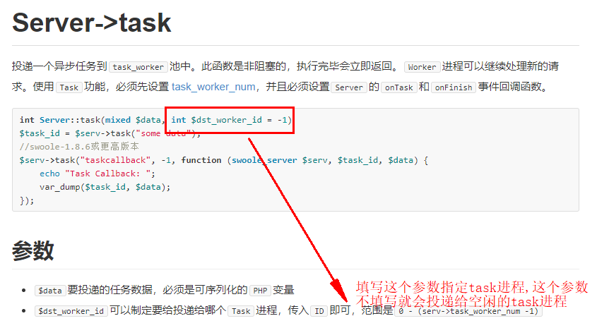
````
task.php

<?php
$serv = new Swoole\Server("127.0.0.1", 9501, SWOOLE_BASE);
$serv->set(array(
    'worker_num' => 2,
    'task_worker_num' => 4,
));

$serv->on('Receive', function(Swoole\Server $serv, $fd, $from_id, $data) {
    echo "接收数据" . $data . "\n";
    $data = trim($data);

     //这第二个参数可以指定需要的task进程进行任务的消费,如果不指定第二个参数,就会找合适的空闲的task进程任务的消费
    $task_id = $serv->task($data, 0);

    $serv->send($fd, "分发任务，任务id为$task_id\n");
});

$serv->on('Task', function (Swoole\Server $serv, $task_id, $from_id, $data) {
    echo "Tasker进程接收到数据";
    echo "#{$serv->worker_id}\tonTask: [PID={$serv->worker_pid}]: task_id=$task_id, data_len=".strlen($data).".".PHP_EOL;
    $serv->finish($data);
});

$serv->on('Finish', function (Swoole\Server $serv, $task_id, $data) {
    echo "Task#$task_id finished, data_len=".strlen($data).PHP_EOL;
});


$serv->on('workerStart', function($serv, $worker_id) {
    global $argv;
    if($worker_id >= $serv->setting['worker_num']) {
         swoole_set_process_name("php {$argv[0]}: task_worker");
    } else {
         swoole_set_process_name("php {$argv[0]}: worker");
    }
});

$serv->start();
````
关于``SWOOLE_BASE``
- https://wiki.swoole.com/wiki/page/353.html
- https://wiki.swoole.com/wiki/diff/?id=353&version=2&compare=current

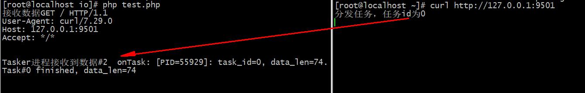
## 2. [task-ipc-mode](https://wiki.swoole.com/#/server/setting?id=task_ipc_mode)的消息队列通信模式
- 使用unix socket通信，默认模式
- 使用消息队列通信
- 使用消息队列通信，并设置为争抢模式

### 2.1 Task传递数据的大小问题
````
server.php

<?php
/**
 * Create By: Will Yin
 * Date: 2020/7/2
 * Time: 10:50
 **/
$serv = new Swoole\Server("127.0.0.1", 9501, SWOOLE_BASE);
$serv->set(array(
    'worker_num' => 2,
    'task_worker_num' => 4,
));

$serv->on('Receive', function(Swoole\Server $serv, $fd, $from_id, $data) {
   //投递10kb的任务
    $r = str_repeat("a", 10 * 1024 * 1024);
    $task_id = $serv->task($r,0);
    $serv->send($fd, "分发任务，任务id为$task_id\n");
});

$serv->on('Task', function (Swoole\Server $serv, $task_id, $from_id, $data) {
    echo "Tasker进程接收到数据";
    //echo "#{$serv->worker_id}\tonTask: [PID={$serv->worker_pid}]: task_id=$task_id, data_len=".strlen($data).".".PHP_EOL;
    sleep(5);
    $serv->finish($data);
});

$serv->on('Finish', function (Swoole\Server $serv, $task_id, $data) {
    echo "Task#$task_id finished, data_len=".strlen($data).PHP_EOL;
});

$serv->on('workerStart', function($serv, $worker_id) {
    global $argv;
    if($worker_id >= $serv->setting['worker_num']) {
        swoole_set_process_name("php {$argv[0]}: task_worker");
    } else {
        swoole_set_process_name("php {$argv[0]}: worker");
    }
});
echo "服务启动: 127.0.0.1:9501";
$serv->start();
````
````
client.php

<?php
/**
 * Create By: Will Yin
 * Date: 2020/7/2
 * Time: 10:51
 **/
// 同步客户端  //| SWOOLE_KEEP 保持长连接

$client = new swoole_client(SWOOLE_SOCK_TCP);

//连接到服务器
if (!$client->connect('127.0.0.1', 9501))
{
    die("connect failed.");
}
// $len = pack('N', strlen($i));
// $send = $len.$i;
// $client->send($send);

for ($i=0; $i < 100; $i++) {
    $len = pack('N', strlen($i));
    $send = $len.$i;
    $client->send($send);
 }


//sleep(10);
// $client->send(1);
//从服务器接收数据
$data = $client->recv();
if($data){
    // 另一个事情
    // 返回结果给用户
    echo '订单生成成功'."\n";

}

//$client->close();
//$client = new swoole_client(SWOOLE_SOCK_TCP );
//连接到服务器
//if (!$client->connect('127.0.0.1', 9501, 0.5))
//{
//    die("connect failed.");
//}
// $len = pack('N', strlen($i));
// $send = $len.$i;
// $client->send($send);

// for ($i=0; $i < 100; $i++) {
//$len = pack('N', 11);
//$send = $len;
//$client->send($send);
// }


//sleep(10);
// $client->send(1);
//从服务器接收数据
//$data = $client->recv();
//关闭连接
//$client->close();

// 另一个事情
// 返回结果给用户
//echo '订单生成成功'."\n";
````
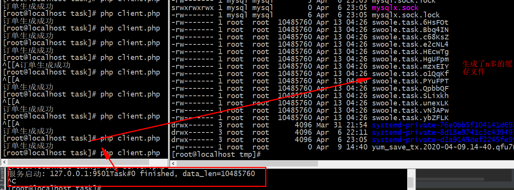

>数据小于8k直接通过管道传递,``数据大于8k写入临时文件(/tmp目录下)``传递onTask会读取这个文件,把他读出来

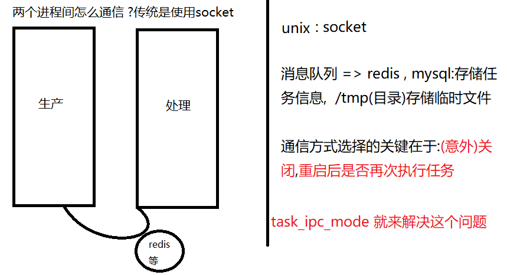

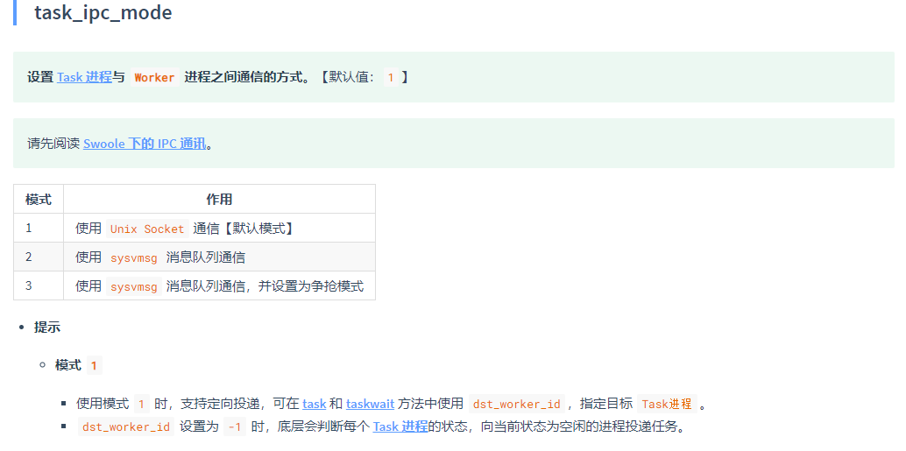
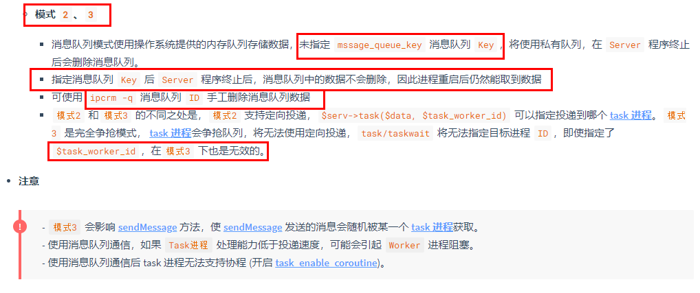
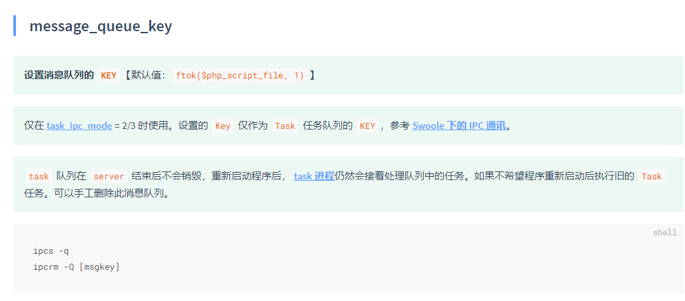

通过这个参数来进行设置，如下为设置方式：
````
$key = ftok(__DIR__, 1);
$serv->set(array(
    'worker_num' => 2,
    'task_worker_num' => 4,
    'task_ipc_mode' => 2,
    'message_queue_key' => $key
));
````
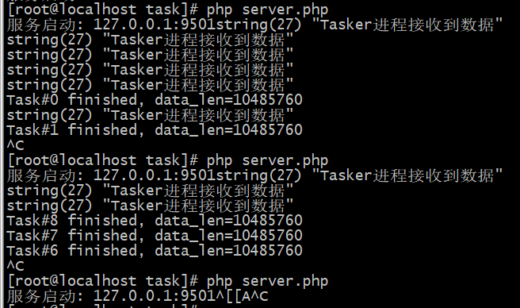

>重启后自动消费未执行完的任务

### 2.2 [message_queue_key](https://wiki.swoole.com/#/server/setting?id=message_queue_key) 解释
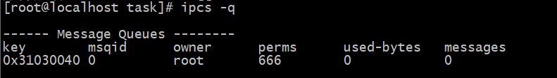

>实际使用的是系统内核的消息队列

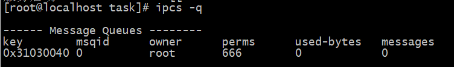

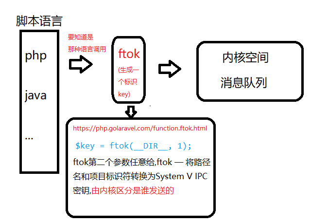

## 3. task问题
>如果``投递的任务量总是大于task进程的处理能力，建议适当的调大task_worker_num的数量，增加task进程数``，不然一旦``task塞满缓冲区，就会导致worker进程阻塞``，所以需要使用好task前期必须有所规划

task对worker的影响
>关于[task_worker的个数](https://wiki.swoole.com/#/server/setting?id=task_worker_num)问题:

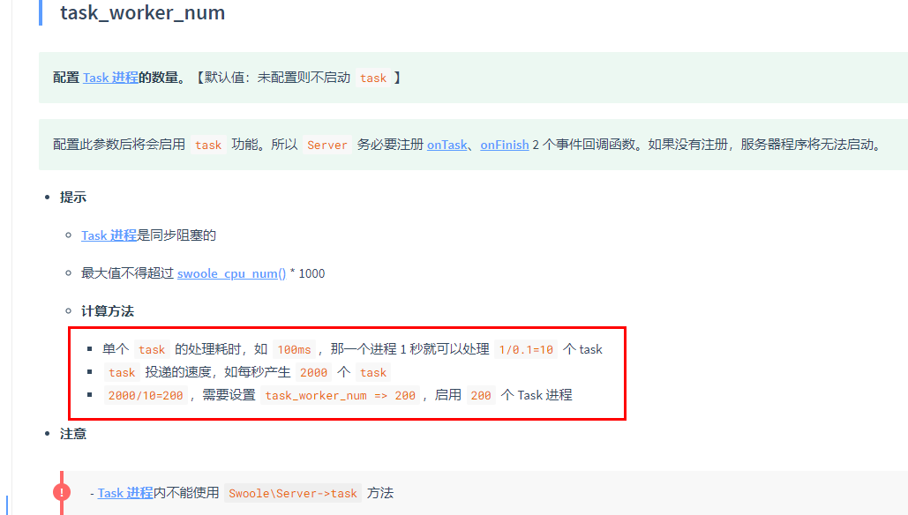

>除此之外还需要注意的是task可能会影响到worker的工作性能，我们可以看官方的中所提到的

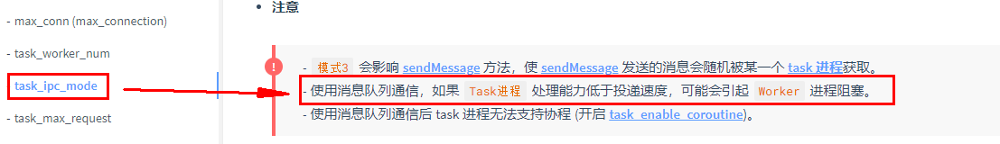

````
server.php

<?php
$host = "0.0.0.0:9501\n";
$serv = new Swoole\Server("0.0.0.0", 9501, SWOOLE_BASE);
$key = ftok(__DIR__, 1);

$serv->set(array(
    'worker_num' => 2,
    'task_worker_num' => 4,

    'task_ipc_mode' => 2,
    'message_queue_key' => $key,

    // 处理tcp打包问题
    'open_length_check' => true,
    'package_max_length' => 1024 * 1024 * 3,
    'package_length_type' => 'N',
    'package_length_offset' => 0,
    'package_body_offset' => 4,
));

$serv->on('Receive', function(Swoole\Server $serv, $fd, $from_id, $data) {
    $task_id = $serv->task($data);
    echo "测试阻塞 \n";
    $serv->send($fd, "分发任务，任务id为$task_id\n");
});

$serv->on('Task', function (Swoole\Server $serv, $task_id, $from_id, $data) {
    var_dump("Tasker进程接收到数据");
    $serv->finish($data);
});

$serv->on('Finish', function (Swoole\Server $serv, $task_id, $data) {
    echo "Task#$task_id finished, data_len=".strlen($data).PHP_EOL;
});

echo "服务".$host."开启";

$serv->start();
````
````
client.php

<?php
$client = new swoole_client(SWOOLE_SOCK_TCP );
//连接到服务器
$client->connect('127.0.0.1', 9501, 0.5);

//向服务器发送数据
$body = 'a';
$send = pack('N', strlen($body)) . $body;
for ($i=0; $i < 100; $i++) {
    $client->send($send);
}

//从服务器接收数据
$data = $client->recv();
echo $data."\n";

//关闭连接
$client->close();

echo "其他事情\n";
````
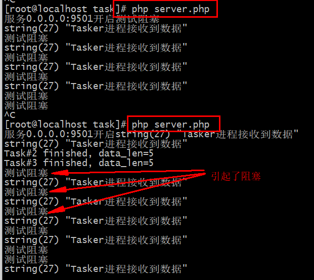

>其余问题
- ``task_max_request`` 设置task进程的最大任务数。一个task进程在处理完超过此数值的任务后将自动退出。这个参数是为了防止PHP进程内存溢出。如果不希望进程自动退出可以设置为0
- 每个woker都有可能投递任务给不同的task_worker处理, 不同的woker进程内存隔离,记录着worker_id, 标识woker进程任务处理数量
## 4. task任务切分
模拟信息读取短息发送
>从200w的MySQL中读取数据，获取到手机号码然后对于用户进行短息发送，通知xxxx事情，然后为了与友好根据性别进行判断‘先生’，‘女士’

防火墙端口设置，便于远程访问
````
//这里开放3306端口,（--permanent永久生效，没有此参数重启后失效）
[root@localhost mysql] firewall-cmd --zone=public --add-port=3306/tcp (--permanent)

//刷新防火墙,设置重置
[root@localhost mysql] firewall-cmd --reload
````
进入mysql,创建一个非root用户
````
mysql> grant all privileges on *.* to will@'%' identified by "0000";
mysql> flush privileges;
````
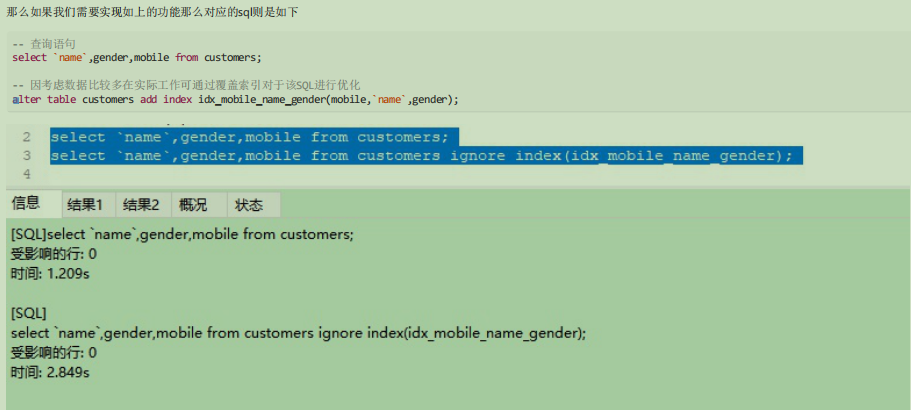
````
server.php

<?php
//引入db操作类
require 'db.php';

$host = "0.0.0.0:9501 start\n";
$serv = new Swoole\Server("0.0.0.0", 9501, SWOOLE_BASE);

$key = ftok(__DIR__, 1);

$serv->set(array(
    'worker_num' => 2,
    'task_worker_num' => 4,
  
     //设置task的消息队列
    'task_ipc_mode' => 2,
    'message_queue_key' => $key,

    // 处理tcp打包问题
    'open_length_check' => true,
    'package_max_length' => 1024 * 1024 * 3,
    'package_length_type' => 'N',
    'package_length_offset' => 0,
    'package_body_offset' => 4,
));

$serv->on('Receive', function(Swoole\Server $serv, $fd, $from_id, $data) use ($db){

        //进行任务的切分,发现在50W左右的数据可以一次被处理完成,那么200W数据我们就切分成四次处理
        for ($i = 0; $i < 4; $i++) {
            $data = $db->query('select id,gender,name,mobile from customers where id > '.($i * 500000).' and id <= '.(($i + 1) * 500000));
        
            $task_id = $serv->task($data, $i);
            
            //这里为了减缓内存的压力我们销毁变量
            unset($data);
        }

     //进行客户端的消息返回
    $serv->send($fd, "分发任务给了task".$task_id."执行,您计将收到短信提醒".PHP_EOF);
});


$serv->on('Task', function (Swoole\Server $serv, $task_id, $from_id, $data) {
   
    echo "处理: ".$from_id." 的任务，任务id为".$task_id."数据信息量".count($data)."\n";
    echo "当前处理进程:".posix_getpid()."\n";

    // 模拟发送短信
    file_put_contents(__DIR__.'/task_'.$task_id.'.log', '');

    foreach ($data as $key => $value) {
        try {
                if ($value['gender'] == 0) {
                // 女士
                $string = "尊敬的手机号为".$value['mobile']."的".$value['name']."_女士_你好，然后xxxxxx省....\n";
                    } else {
                // 先生
                $string = "尊敬的手机号为".$value['mobile']."的".$value['name']."_先生_你好，然后xxxxxx省....\n";
                }
    
            // 我们直接记录下来记录,因为信息太多
            file_put_contents(__DIR__.'/task_'.$task_id.'.log', $string, 8);
        } catch (\Exception $e) {
            // $serv->sendMessage($value, 1);
        }
    }


    $serv->finish($data);
});


$serv->on('Finish', function (Swoole\Server $serv, $task_id, $data) { });
    $serv->on('PipeMessage', function (Swoole\Server $server, $src_worker_id, $message){
    echo "来自".$src_worker_id."的信息\n";
    var_dump($message);
});

//$serv->on('workerStart', function($serv, $worker_id) {
//    global $argv;
//    if($worker_id >= $serv->setting['worker_num']) {
//        swoole_set_process_name("php {$argv[0]}: task_worker");
//    } else {
//        swoole_set_process_name("php {$argv[0]}: worker");
//    }
//});

echo $host;
$serv->start();
````
### 4.1 补充:
#### 4.1.1
- ``workerStart``函数在 ``task创建`` 的时候也会执行,这里注释
- ``select id,gender,name,mobile from customers where id > 0 and id <= 500000`` 的效果要好于``select id,gender,name,mobile from customers limit 0,500000``
#### 4.1.2
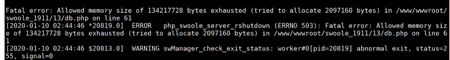

>出现以上报错,可能是``php内核过小``,设置``php.ini``即可,``vim /usr/local/php/etc/php.ini``
````
; Maximum amount of memory a script may consume (128MB)
; http://php.net/memory-limit
memory_limit = 128M  //修改为  2048M
````
### 4.2 测试结果
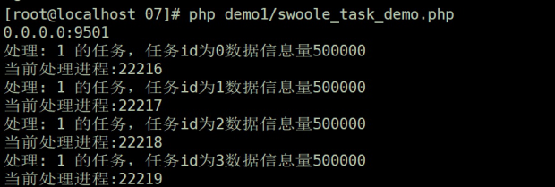

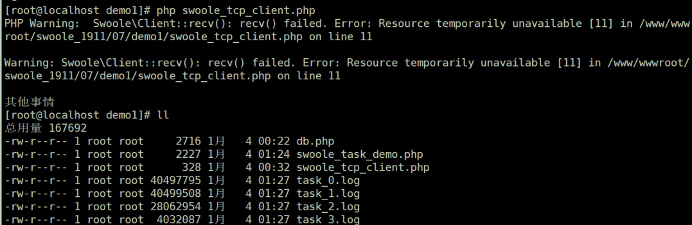