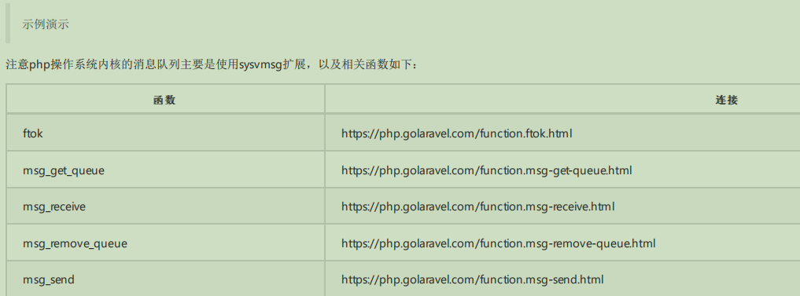
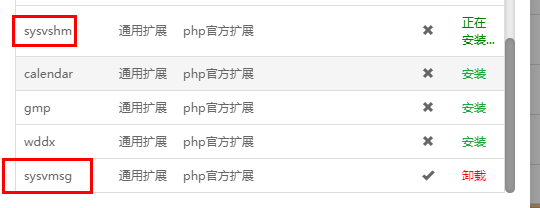
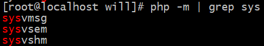
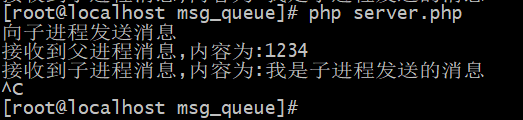
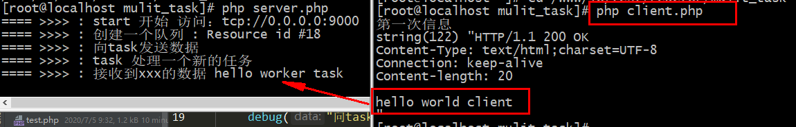
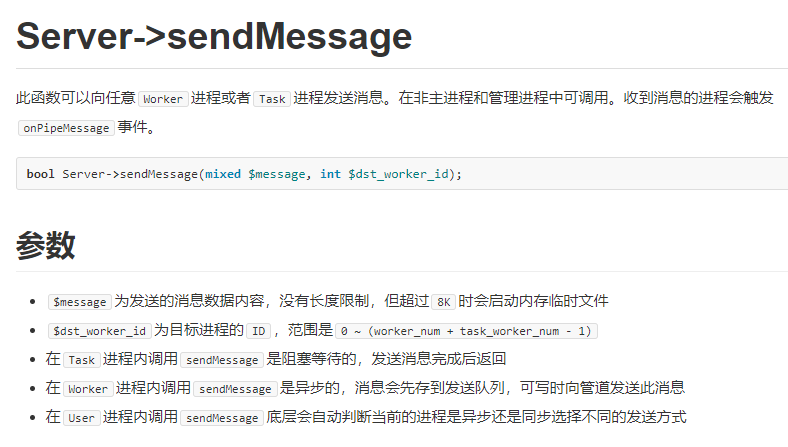
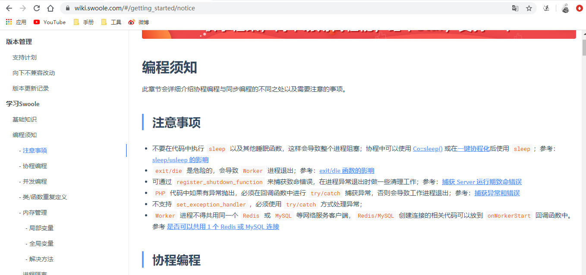

# 进程间通信
## 1. 进程间通信
进程间通信（IPC，Inter-Process Communication），指至少两个进程或线程间传送数据或信号的一些技术或方法。每个进程都有自己的一部分独立的系统资源，彼此是隔离的。为了能使不同的进程互相访问资源并进行协调工作，才有了进程间通信。

通信的方式:
- socket
- 消息队列
    - - 系统内核
    - - 用户空间
- 信号
- 共享内存
- 管道

进程通信有如下的目的：
- 数据传输: 一个进程需要将它的数据发送给另一个进程，发送的数据量在一个字节到几M之间；
- 共享数据: 多个进程想要操作共享数据，一个进程对数据的修改，其他进程应该立刻看到；
- 系统进行进程间通信（IPC）的时候，可用的方式包括管道、命名管道、消息队列、信号、信号量、共享内存、套接字(socket)等形式。
### 1.1. 消息队列
关于消息队列实际上是一种思想或者说是策略，而并非是某一个程序所独有，我们可以通过消息队列让php与java等其他语言程序对接交互；并且值得一提的是，最简单的实现方式就是通过与一个文件记录信息，然后通过另一个进程循环读取这个文件即可；
>比如可以利用 file_put_contents 与 file_get_contents 就可以简单实现，不过我们这里讲的是如何利用系统的消息队列

php操作Linux的消息队列,使用的第三方拓展``sysvmsg``



>使用宝塔直接安装




````
<?php
/**
 * Create By: Will Yin
 * Date: 2020/7/4
 * Time: 21:12
 **/
//父进程跟子进程实现消息发送

//注意在php创建消息队列，第二个参数会直接转成字符串，可能会导致通讯失败
$msg_key = ftok(__DIR__,'u');
$msg_queue = msg_get_queue($msg_key);

//创建子进程
$pid = pcntl_fork();

if( $pid == 0){
    // 子进程发送消息, msg_receive在没有接收到信息的时候会是一个阻塞的状态
    msg_receive($msg_queue,10,$message_type,1024,$message);

    //var_dump($message_type).PHP_EOL; //int(10)

    echo "接收到父进程消息,内容为:".$message.PHP_EOL;
    msg_send($msg_queue,10,"我是子进程发送的消息").PHP_EOL;
    exit();
} else if ($pid){


    echo "向子进程发送消息".PHP_EOL;
    $r = 1234;
    msg_send($msg_queue,10,$r);

    // 父进程接收消息
   // msg_receive在没有接收到信息的时候会是一个阻塞的状态
    msg_receive($msg_queue,10,$message_type,1024,$message);
    echo "接收到子进程消息,内容为:".$message.PHP_EOL;
    pcntl_wait($status);
    msg_remove_queue($msg_queue);
}
````
>注意：``msg_receive``在没有接收到信息的时候会是一个阻塞的状态



>我们用不同的程序访问操作:
````
client.php

<?php
/**
 * Create By: Will Yin
 * Date: 2020/7/4
 * Time: 21:33
 **/
//第一个参数也可以是__FILE__
//$msg_key = ftok(__DIR__,'u');
////var_dump($msg_key);

//为了方便测试连接,使用和服务端一样的key,即指定发送数据的队列
$msg_queue = msg_get_queue(1963150487);

msg_send($msg_queue, 10, "this is will  ");
````
````
server.php

<?php
//注意在php创建消息队列，第二个参数会直接转成字符串，可能会导致通讯失败
$msg_key = ftok(__DIR__,'u');
//var_dump($msg_key);
$msg_queue = msg_get_queue($msg_key);

msg_receive($msg_queue, 10, $message_type, 1024, $message);
var_dump($message);
// 父进程接收消息
msg_remove_queue($msg_queue);
````
函数说明
- [msg_send](https://php.golaravel.com/function.msg-send.html)  ( resource $queue , int $msgtype , mixed $message [, bool $serialize = true [, bool $blocking = true [, int &$errorcode ]]] )

>第1个参数 ： ``resource`` $queue 指定发送数据的队列
>
>第2个参数 ： ``int`` $msgtype 表示写入消息队列的消息类型(0或者任意类型)，这个参数是 配合``msg_receive``读取消息队列函数 使用的，
>
>第3个参数 ： ``mixed`` $message 你要发送的信息，最大为 65536 个字节。
- [msg_receive](https://php.golaravel.com/function.msg-receive.html) ( resource $queue , int $desiredmsgtype , int &$msgtype , int $maxsize , mixed &$message [, bool $unserialize = true [, int $flags = 0 [, int &$errorcode ]]] )
> 第1个参数 ： ``resource`` $queue 指定发送数据的队列
>
> 第2个参数 ： ``int`` $desiredmsgtype 读取的消息类型。这个``参数为 0 的时候``，你可以``读取 msg_send 以任意消息类型发送的消息``。 如果此参数和你发送的某个消息类型相同，比如你有2个消息一个是通过1类型发送的，一个是通过2类型发送的。你用0可以接收这两种消息 ，而你用1只能接收到以1类型发送的消息。
>
> 第3个参数 ： ``int`` &$msgtype 你读取到的信息，它发送时的消息类型会存储在该参数中。
>
> 第4个参数 ： ``int`` $maxsize 你以多大的字节去读取消息，如果这个值小于你要读取的内容的长度，你会读取失败。
>
> 第5个参数 ： ``mixed``  $message 读取的内容。

## 2. [php与swoole的task进行交互](https://wiki.swoole.com/wiki/version/?id=212&version=2) (swoole官方提供)
````
<?php
class SwooleTask
{
    protected $queueId;
    protected $workerId;
    protected $taskId = 1;

    const SW_TASK_TMPFILE = 1;  //tmp file
    const SW_TASK_SERIALIZE = 2;  //php serialize
    const SW_TASK_NONBLOCK = 4;  //task

    const SW_EVENT_TASK = 7;

    /**
     * SwooleTask constructor.
     * @param $key
     * @param int $workerId
     * @throws Exception
     */
    function __construct($key, $workerId = 0)
    {
        $this->queueId = msg_get_queue($key);
        if ($this->queueId === false)
        {
            throw new \Exception("msg_get_queue() failed.");
        }
        $this->workerId = $workerId;
    }

    protected static function pack($taskId, $data)
    {
        $flags = self::SW_TASK_NONBLOCK;
        $type = self::SW_EVENT_TASK;
        if (!is_string($data))
        {
            $data = serialize($data);
            $flags |= self::SW_TASK_SERIALIZE;
        }
        if (strlen($data) >= 8180)
        {
            $tmpFile = tempnam('/tmp/', 'swoole.task');
            file_put_contents($tmpFile, $data);
            $data = pack('l', strlen($data)) . $tmpFile . "\0";
            $flags |= self::SW_TASK_TMPFILE;
            $len = 128 + 24;
        }
        else
        {
            $len = strlen($data);
        }

        return pack('lSsCCS', $taskId, $len, 0, $type, 0, $flags) . $data;
    }

    function dispatch($data)
    {
        $taskId = $this->taskId++;
        if (!msg_send($this->queueId, 2, self::pack($taskId, $data), false))
        {
            return false;
        }
        else
        {
            return $taskId;
        }
    }
}

echo "Sending text to msg queue.\n";
$task = new SwooleTask(822133180, 3);
//普通字符串
$task->dispatch("Hello from PHP!");

````
````
server.php

<?php
//tcp协议
$server=new Swoole\Server("0.0.0.0",9000);   //创建server对象

$server->set([
    'worker_num'        => 1, //设置进程
    'task_worker_num'   => 1,  //task进程数
]);
//消息发送过来
$server->on('receive',function (swoole_server $server, int $fd, int $reactor_id, string $data){
    $server->task(7);
    $server->send($fd , 1);
});
//ontask事件回调
$server->on('task',function (swoole_server $server,$task_id,$form_id,$data){
    echo "接受到信息\n";
    var_dump($server->worker_id);
    $server->sendMessage("Task数据", 2);// 0 ~ (worker_num + task_worker_num - 1)
    $server->finish("执行完毕");
});
$server->on('finish',function ($server,$task_id,$data){
});
$server->on('PipeMessage',function (swoole_server $server,  $src_worker_id, $message){
    echo "\n接收到数据\n";
    var_dump($message);
});

//服务器开启
$server->start();
````
>以上是原生的php通信swoole的task消息队列,会存在一定的问题
## 3. 源码在worker中实现task
````
添加task配置

protected $config = [
    //设置task进程个数
    // 设置task进程的个数
    'task_worker_num' => 0,
    'message_queue_key' => null,
];
---------------------------------------------------------------------------------------------------
<?php
namespace Willyin\Io\Reactor\Swoole\MulitTask;
use Swoole\Event;
use Willyin\Io\Tools\Inotify;
use Willyin\Io\Reactor\Swoole\Traits\InotifyTait;
use Willyin\Io\Reactor\Swoole\Traits\ServerTait;
use Willyin\Io\Reactor\Swoole\Traits\SignalTait;
use Willyin\Io\Reactor\Swoole\Traits\TaskTait;

class Worker
{
    //使用超物类
    use InotifyTait;
    use ServerTait;
    use SignalTait;
    use TaskTait;

    public function __construct($socket_address)
    {
        $this->socket_address = $socket_address;
    }
    // 需要处理事情
    public function accept()
    {
        Event::add($this->initServer(), $this->createSocket());
    }

    //通过信号传递信息,杀死一个子进程就随之创建一个
    public function reloadSig($workerNumber = null)
    {
        $workerNum = (empty($workerNumber)) ? $this->config['worker_num'] : $workerNum ;
        $this->stop(false);
        $this->fork($workerNum);
    }

    public function stop($masterKill = true)
    {
        $workerPids = pidGet($this->config['workerPidFiles']);

        foreach ($workerPids  as $key => $workerPid) {
            posix_kill($workerPid, 9);
        }
        pidPut(null, $this->config['workerPidFiles']);

       if($masterKill){
            //读取父进程pid
            $masterPids = pidGet($this->config['masterPidFiles'])[0];
            posix_kill($masterPids, 9);
           $this->inotify->stop();
        }
    }

    // 启动服务的
    public function start()
    {
        debug('start 开始 访问：'.$this->socket_address);
        pidPut(null, $this->config['workerPidFiles']);

        //记录父进程id,先清空,在记录
        pidPut(null, $this->config['masterPidFiles']);
        pidPut(posix_getpid(), $this->config['masterPidFiles']);

        //判断是否开启监听
        if($this->config['watch_file'] == true){
            $this->inotify = new Inotify(baseDir(),$this->watchEvent());
            $this->inotify->start();
        }

        // 如果设置 task_worker_num 配置就开启task
        if ($this->config['task_worker_num'] > 0) {
            $this->forkTasks();
        }

        $this->fork();
        $this->monitorWorkersForLinux();
    }

     //设置配置的变变量,类似swoole中的set功能
    public function set($data)
    {
        foreach ($data as $index => $datum) {
            $this->config[$index] = $datum;
        }
    }
}
-------------------------------------------------------------------------------------------------

<?php
/**
 * Create By: Will Yin
 * Date: 2020/7/5
 * Time: 10:15
 **/
namespace Willyin\Io\Reactor\Swoole\Traits;

trait TaskTait{
    //回调函数
    public $onTask = null;
    public $onFinish = null;

    // 记录task的pid
    protected $taskPids = null;

    // 消息队列
    protected $msgQueue = null;

    /**
     * 创建task进程的函数
     */
    protected function forkTasks()
    {
        //$msg_key = ftok(__DIR__,'y');
        //$msg_queue = msg_get_queue($msg_key);
        //var_dump($msg_queue);

        // 等到一个key
        $msg_key = (empty($this->config['message_queue_key'])) ? ftok(__DIR__,'y') : $this->config['message_queue_key'];

        $this->msgQueue = msg_get_queue($msg_key);
        debug("创建一个队列 : ".$this->msgQueue);
        for ($i=0; $i < $this->config['task_worker_num']; $i++) {
            $son11 = pcntl_fork();
            if ($son11 > 0) {
                // 父进程空间
                $this->taskPids[] = $son11;
            } else if($son11 < 0){
                echo "进程创建失败的时候";
            } else {
                // 处理接收请求
                $this->msg_receive();
                exit;// 终止程序的执行
            }
        }
    }
    /**
     * 处理信息
     */
    protected function msg_receive()
    {
        $pid = posix_getpid();
        while (1) {
            msg_receive($this->msgQueue, $pid, $msgtype, 1024, $message);
            debug("task 处理一个新的任务");
            // 接收处理
            ($this->onTask)($this, $message);
        }
    }
    /**
     * 用于task进程的任务投递
     */
    public function task($data, $dst_worker_id = null)
    {
        $pid = 0;
        if (empty($dst_worker_id)) {
            $pid = $this->taskPids[\array_rand($this->taskPids)];
        } else {
            $pid = $dst_worker_id;
        }
        msg_send($this->msgQueue, $pid, $data);
    }
}

----------------------------------------------------------------------------------------------------------

关于各个pid获取:

$a = posix_getppid();
$b = pcntl_fork();
if($b >0){
    //获取父进程自身id
    var_dump($a);
    //父进程获取子进程id
    var_dump($b);
   echo "父进程空间\n";
}else if($b<0){
    echo "创建失败";
} else {
    echo "\n子进程空间\n";
    //子进程获取自身id
    echo posix_getpid().PHP_EOL;
    //子进程获取父进程id
    var_dump($a);

}
while(1){}
--------------------------------------------------------------------------------
结果:
int(41891)
int(43331)
父进程空间

子进程空间
43331
int(41891)
````
````
server.php:

<?php
/**
 * Create By: Will Yin
 * Date: 2020/7/5
 * Time: 10:18
 **/
require __DIR__.'/../../../vendor/autoload.php';
use Willyin\Io\Reactor\Swoole\MulitTask\Worker;

$host = "tcp://0.0.0.0:9000";
$server = new Worker($host);

$server->set([
    // 'watch_file' => true,
    'task_worker_num' => 3,
]);
// echo 1;
$server->onReceive = function(Worker $server, $client, $data){
    debug("向task发送数据 ");
    $server->task("hello worker task");
    send($client, "hello world client \n");
};
$server->onTask = function(Worker $server, $data){
    debug("接收到xxx的数据 ".$data);
};
// debug($host);
$server->start();
````
````
client.php

<?php
/**
 * Create By: Will Yin
 * Date: 2020/7/5
 * Time: 10:19
 **/
// 是建立连接
$client = stream_socket_client("tcp://127.0.0.1:9000");
$new = time();
// 第一次信息
fwrite($client, "hello world");
echo "第一次信息\n";
var_dump(fread($client, 65535));
````


>注意: ``swoole``中的``task``是功能上的补充,而不是完全可以代替``消息队列``
## 4. task的作用
- 注意关于swoole的task虽然有体现这种异步的效果，但是并不意味这它是用来替代消息中间件的；
- swoole中的task最大的特点在于帮助我们处理一些耗时任务的业务逻辑，完成之后就会通知给相应的进程；
- 而消息中间件-》在实际的工作中我们可能会考虑消息的优先级，延迟任务，存储，应答等等；
## 5. 关于[sendMessage](https://wiki.swoole.com/#/server/methods?id=sendmessage) 与 [swoole中的编程需知](https://wiki.swoole.com/#/getting_started/notice)

### 5.1 sendMessage


注意事项
- 使用sendMessage必须注册onPipeMessage事件回调函数
- 设置了task_ipc_mode = 3将无法使用sendMessage向特定的task进程发送消息
- $dst_worker_id为目标进程的ID，范围是0 ~ (worker_num + task_worker_num - 1)
````
<?php
//tcp协议
$server=new Swoole\Server("0.0.0.0",9000);   //创建server对象

$server->set([
    'worker_num'        => 1, //设置进程
    'task_worker_num'   => 1,  //task进程数
]);

//消息发送过来
$server->on('receive',function (swoole_server $server, int $fd, int $reactor_id, string $data){
    $server->task(7);
    $server->send($fd , 1);
});


//ontask事件回调
$server->on('task',function (swoole_server $server,$task_id,$form_id,$data){
    echo "接受到信息\n";
    var_dump($server->worker_id);

    //sendMessage第二个参数范围:  0 ~ (worker_num + task_worker_num - 1)
    $server->sendMessage("Task数据", 2);

    $server->finish("执行完毕");
});


$server->on('finish',function ($server,$task_id,$data){
});


$server->on('PipeMessage',function (swoole_server $server,  $src_worker_id, $message){
    echo "\n接收到数据\n";
    var_dump($message);
});

//服务器开启
$server->start();

-----------------------------------------------------------------------------------------------
结果:

[root@localhost mulit_task]# php /www/io/test.php 
接受到信息
int(1)

接收到数据
string(10) "Task数据"
````
### 5.2 编程须知



