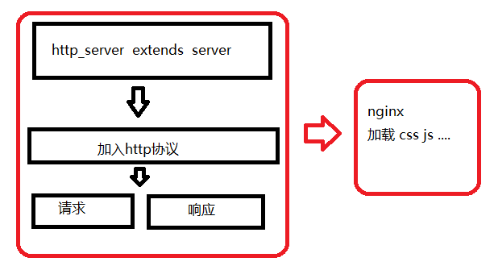

# http服务 及 php框架加速
## 0. swoole的变量回收
>swoole是常驻内存,我们应该适时考略变量的回收


## 1. swoole中的编程注意事项
### 1.1 swoole_server中对象的4层生命周期
开发Server程序与普通LAMP的Web编程有本质区别。在传统的Web编程中，PHP程序员只需要关注request到达，request结束即可。而在Server程序中程序员可以操控更大范围，变量/对象可以有四种生存周期。

>变量、对象、资源、``require/include``的文件等下面统称为对象


---

测试代码:
````
server.php

<?php
$serv = new Swoole\Server("0.0.0.0", 9501, SWOOLE_BASE);

$serv->set(array(
    'worker_num' => 2,
));

$serv->on('Connect', function(Swoole\Server $serv, $fd, $reactorId){
});

$serv->on('Receive', function(Swoole\Server $serv, $fd, $from_id, $data) {
});

$serv->on('Close', function(Swoole\Server $serv, $fd, $reactorId){
});

$serv->on('workerStart', function($serv, $worker_id) {
});

$serv->start();
?>
````
````
index.php

class Index
{
    function __construct()
    {
        echo "this is index .php\n";
    }
    
    public function index()
    {
        return "this is a test class";
    }   
}
````
#### 1.1.1 程序全局期


演示:


测试的方式：
- 先运行serve.php
- 然后看输出的内容
- 修改index类中的内容
- 通过信号重启服务``kill -10 进程号``,通过信号重启worker观察变化


>总结 : 程序全局期``include/require``的代码，必须在整个程序``shutdown时才会释放``，``reload无效``
#### 1.1.2 进程全局期

````
<?php
$serv = new Swoole\Server("0.0.0.0", 9501, SWOOLE_BASE);
$serv->set(array(
    'worker_num' => 2,
));

$serv->on('Connect', function(Swoole\Server $serv, $fd, $reactorId){
    include "index.php";
    var_dump((new Index)->index());
});

$serv->on('Receive', function(Swoole\Server $serv, $fd, $from_id, $data) {
});

$serv->on('Close', function(Swoole\Server $serv, $fd, $reactorId){
});

$serv->on('workerStart', function($serv, $worker_id) {
});

$serv->start();
````
测试的方式：
- 先运行serve.php
- 然后通过 curl http://127.0.0.1:9501/ 的方式访问看输出的内容
- 修改index类中的内容
- 通过信号重启worker
- 再次访问


#### 1.1.3 会话期

````
class Index
{
    public $r = 0;
    public function index()
    {
        return "this is a test class";
    }
}
-----------------------------------------------
<?php
$serv = new Swoole\Server("0.0.0.0", 9501, SWOOLE_BASE);
$serv->set(array(
    'worker_num' => 2,
));

$serv->on('Connect', function(Swoole\Server $serv, $fd, $reactorId){
    include "index.php";
    global  $obj ;
    $obj  = (new Index);
    $obj->r ++;

});

$serv->on('Receive', function(Swoole\Server $serv, $fd, $from_id, $data) {
       global $obj;
       echo $obj->r;
});

$serv->on('Close', function ($serv, $fd) {
    echo "Client: Close.\n";
});


$serv->start();
````

#### 1.1.4 请求期

### 1.2 总结
>``程序全局期`` 和 ``进程全局期`` 比较重要,至于 ``会话期`` 和 ``请求期`` 区别就是是否添加了 ``global``属性
- 会话期针对client连接
- 请求期针对函数的执行
---

## 2. 了解swoole_http_server
>swoole 内置实现了一个简单的httpServer类。swoole版的http server相对于php-fpm，最大优势在于高性能,代码一次载入内存，后续无需再解释执行，但是swoole_http_server对Http协议的支持并不完整，实际生产环境，一般是前面加一层Nginx，由Nginx解析一些静态css、js文件，php文件请求交由swoole处理

>``swoole_http_server 其实就是 继承于一般的 swoole_server 后进行的封装重写,所以再swoole_server中的所有方法,再swoole_http_server都可以使用``


>一般结合于nginx一起使用




### 2.1 http_server的请求和响应


>以上http_server中的事件等同于php中的超全局变量``$_GET...等``
````
$http = new Swoole\Http\Server("0.0.0.0", 9501);

$http->on('request', function ($request, $response) {

      if($request->get){
          //接收get请求数据
          var_dump($request->get);
      } else if($request->post){
          //接收post请求数据
          var_dump($request->post);
      } else{
         //接收其他类型数据(非正常类型,如json)
          var_dump($request->rawContent());
      }

    $response->header("Content-Type", "text/html; charset=utf-8");
    $response->end("<h1>Hello Swoole. #".rand(1000, 9999)."</h1>");
});
$http->start();
````
>用``postman``帮助执行 ``get`` 和 ``post`` 或者 ``json`` 等类型的请求


>传统框架(laravel/tp..)的底层依赖于超全局变量 ``$_GET`` ``$_POST``等,而``swoole``则回收重写了这些超全局变量,所以再加速传统框架的时候要注意这个问题 

## 3. 利用swoole加速框架
### 3.1 运行模式
FastCGI工作原理
>Web Server启动时载入FastCGI进程管理器； FastCGI进程管理器自身初始化，启动多个CGI解释器进程并等待来自Web Server的连接； 当客户端请求到达WebServer时，FastCGI进程管理器选择并连接到一个CGI解释器。Web server将CGI环境变量和标准输入发送到FastCGI子进程php-cgi。
>
>FastCGI子进程完成处理后将标准输出和错误信息从同一连接返回Web Server。当FastCGI子进程关闭连接时，请求便告处理完成。FastCGI子进程接着等待并处理来自FastCGI进程管理器的下一个连接。 在正常的CGI模式中，这就结束了，下次还要重新来过。但是在FastCGI，所有这些都只在进程启动时发生一次。一个额外的好处是，持续数据库连接（Persistent database connection）可以工作。

swoole
>前面的fastcgi模式，所做的事情就是对于配置文件事先加载到内存中，作为常驻内存的样子。用swoole加速主要是通过用swoole作为服务吧laravel运行放到swoole 中来运行。通过swoole开启一个web服务运行laravel框架，通过访问swoole的时候laravel则已经在swoole中作为常驻内存保存了所以就可以直接使用运行。

### 3.2 swoole加速框架核心要素点
要素点在于不需要在重新再去加载框架中的属性与文件，需要值得注意的是``swoole加速的是ioc类型的框架``：``ioc简单来说就是一个数组`` ，把我们在框架中所需要使用的数据库操作的类，redis操作对象，view视图操作类等等放置在数组中保存，根据标识做区别而

#### 3.2.1 传统框架 与 swoole的执行流程对比

#### 3.2.1 swoole加速实质
>swoole加速就是把ioc放到swoole中,作为全局变量


### 3.3 swoole加速laravel
````
<?php
define('LARAVEL_START', microtime(true));
require __DIR__.'/../vendor/autoload.php';

// laravel的应用程序的初始化
$app = require_once __DIR__.'/../bootstrap/app.php';

// 请求处理的初始化
$kernel = $app->make(Illuminate\Contracts\Http\Kernel::class);

// laravel请求的处理
echo "http://0.0.0.0:9700 \n";
$http = new \Swoole\Http\Server("0.0.0.0", 9700);

$http->on('request', function ($swoole_request, $swoole_response) use ($kernel){
    $_SERVER = [];
    if (isset($swoole_request->server)) {
        foreach ($swoole_request->server as $k => $v) {
            $_SERVER[strtoupper($k)] = $v;
        }
    }
    // 这个一定要写不然会报错
    $_SERVER['argv'] = [];
    if (isset($swoole_request->header)) {
        foreach ($swoole_request->server as $k => $v) {
            $_SERVER[strtoupper($k)] = $v;
        }
    }
    $_GET = [];
    if (isset($swoole_request->get)) {
        foreach ($swoole_request->get as $k => $v) {
            if($k == 's'){
                $_GET[$k] = $v;
            }else{
                $_GET[strtoupper($k)] = $v;
            }
        }
    }
    $_POST =[];
    if (isset($swoole_request->post)) {
        foreach ($swoole_request->post as $k => $v) {
            $_POST[strtoupper($k)] = $v;
        }
    }

         $laravel_response = $kernel->handle(
         $laravel_request = Illuminate\Http\Request::capture()
     );


     // 因为框架的输出方式默认是echo的输出
     // $laravel_response->send();  所以修改响应方式
     $swoole_response->end($laravel_response->getContent());


     $kernel->terminate($laravel_request, $laravel_response);
     // $response->end("<h1>Hello Swoole. #".rand(1000, 9999)."</h1>");
 });

 $http->start();
````


### 3.3 swoole加速tp框架
````
<?php
// [ 应用入口文件 ]
namespace think;
require __DIR__ . '/../vendor/autoload.php';

// 应用初始化
$think_http = (new App())->http;

// think请求的处理
echo "http://0.0.0.0:9600 \n";

$http = new \Swoole\Http\Server("0.0.0.0", 9600);
$http->on('request', function ($swoole_request, $swoole_response) use ($think_http){
    $_SERVER = [];
    if (isset($swoole_request->server)) {
        foreach ($swoole_request->server as $k => $v) {
            $_SERVER[strtoupper($k)] = $v;
        }
    }
    // 这个一定要写不然会报错
    $_SERVER['argv'] = [];
    if (isset($swoole_request->header)) {
        foreach ($swoole_request->server as $k => $v) {
            $_SERVER[strtoupper($k)] = $v;
        }
    }
    $_GET = [];
    if (isset($swoole_request->get)) {
        foreach ($swoole_request->get as $k => $v) {
            if($k == 's'){
                $_GET[$k] = $v;
            }else{
                $_GET[strtoupper($k)] = $v;
            }
        }
    }
    $_POST =[];
    if (isset($swoole_request->post)) {
        foreach ($swoole_request->post as $k => $v) {
            $_POST[strtoupper($k)] = $v;
        }
    }

    $think_response = $think_http->run();

     // 因为框架的输出方式默认是echo的输出 
    // $think_response->send(); 所以修改响应方式
    $swoole_response->end($think_response->getContent());


    $think_http->end($think_response);
});

$http->start();
````
>这里观察运行速度得到了明显的提升,但是尽量使用[第三方组件](https://packagist.org/),这样书写还是存在许多的问题
