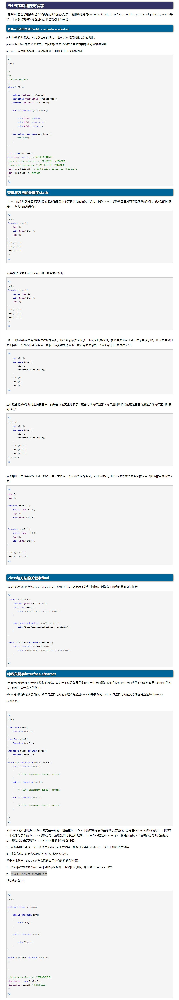
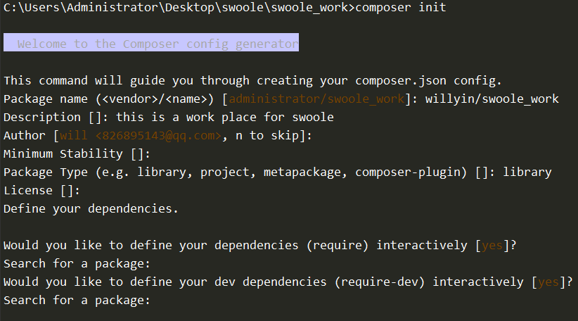
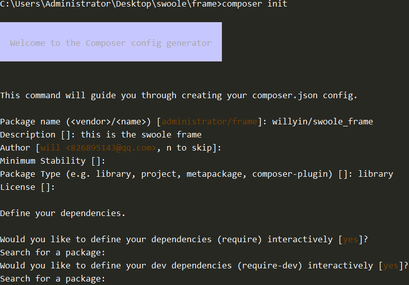
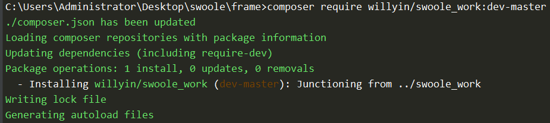
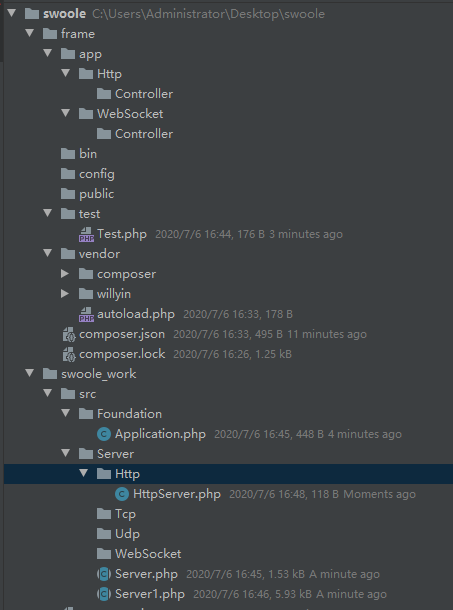
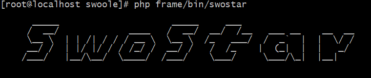

# Http架构服务(一)
## 知识补充

### 关于``abstract``
- 大多数情况下，抽象类至少含有一个抽象方法。抽象方法用abstract关键字声明，其中不能有具体内容。如:`` abstract protected function func1()``
- 可以像声明普通类方法那样声明抽象方法，但是要以分号而不是方法体结束。也就是说抽象方法在抽象类中不能被实现，也就是没有函数体“{some codes}”。
- 当一个类继承了抽象类,如果没有重写里面的所有的抽象方法,那么这个类只能是一个抽象类
- 继承了抽象类,重写了所有的方法后,可以添加自己的属性或者方法
- 抽象类中,如果一个方法没有方法体,那么一定要加``;``

### 关于``dirname(__DIR__)``
````
目录结构:
- will
    -yin
        - 1.php
    - 2.php
--------------------------------------------------------------------------
2.php:
<?php
echo "this is 2.php";


1.php
<?php
require dirname(__DIR__)."/2.php";  //  this is 2.php
echo PHP_EOL;
echo __DIR__;          //  /root/will/yin
echo PHP_EOL;
echo dirname(__DIR__);// /root/will


[root@localhost yin]# php 1.php 
this is 2.php
/root/will/yin
/root/will
````
### 关于``回调函数``
````
<?php
Class A{
    public function index($a){
        echo "this is index".$a;
    }
    public function call_back(){
         $a = 123;
        call_user_func([$this,'index'],$a);
    }
}
(new A)->call_back();

结果:
[root@localhost ~]# php test.php
this is index123
````
## 1.项目准备


````
{
    "name": "willyin/swoole_work",
    "description": "this is a work place for swoole",
    "type": "library",
    "authors": [
        {
            "name": "will",
            "email": "826895143@qq.com"
        }
    ],
    "require": {},
    "autoload": {
        "psr-4": {
            "SwooleWork\\":"./src/"
        }
    }
}
------------------------------------------------------------------------------
{
    "name": "willyin/swoole_frame",
    "description": "this is the swoole frame",
    "type": "library",
    "authors": [
        {
            "name": "will",
            "email": "826895143@qq.com"
        }
    ],
    "require": {
        "willyin/swoole_work": "dev-master"
    },
    "repositories": {
        "will": {
            "type": "path",
            "url": "../swoole_work"
        }
    },
    "autoload": {
        "psr-4": {
            "SwooleFrame\\":""
        }
    }
}
````
>执行命令``composer require willyin/swoole_work:dev-master``


### 1.1 目录结构


### 1.2 代码内容
````
Server.php:

<?php
namespace SwooleWork\Server;
/**
 * 所有服务的父类， 写一个公共的操作
 */

use SwooleWork\Support\Inotify;
use Swoole\Server as SwooleServer;
use SwooleWork\Foundation\Application;

abstract class Server
{
    // 属性
    protected $swooleServer;

    //记录Application传递内容
    protected $app ;

    //判断是否热加载,使用第三方类
    protected $watchFile = false;
    protected $inotify = null;

    //记录task进程数
    protected $config = [
        'task_worker_num' => 0,
    ];

    //记录进程id,方便后期的管理
    protected $pidMap = [
        'masterPid'  => 0,
        'managerPid' => 0,
        'workerPids' => [],
        'taskPids'   => []
    ];


    protected $port = 9000;

    protected $host = "0.0.0.0";

    /**
     * 因为服务需要自定义回调函数
     *
     * @var array
     */
    protected $events = [

        // 这是所有服务均会注册的的回调事件
        "server" => [
            // 事件名      => 事件函数
            "start"        => "onStart",
            "close"        => "onClose",
            "connect"      => "onConnect",
            "managerStart" => "onManagerStart",
            "managerStop"  => "onManagerStop",
            "shutdown"     => "onShutdown",
            "workerStart"  => "onWorkerStart",
            "workerStop"   => "onWorkerStop",
            "workerError"  => "onWorkerError",
        ],

        //记录继承类(子类服务)
        'sub' => [

        ],

        //记录额外的回调函数
        'ext'=>[]
    ];

    public function __construct(Application $app)
    {
        //就录了Application中传递的必要变量
        $this->app = $app;
    }

    //创建服务
    protected abstract function createServer();

    //初始化监听事件
    protected abstract function initEvent();

    // 设置swoole的回调事件
    protected function setSwooleEvent()
    {
        foreach ($this->events as $type => $events) {
            foreach ($events as $event => $func) {
                $this->swooleServer->on($event, [$this, $func]);
            }
        }
    }


    public function start()
    {
        //启动服务需要执行的事件
        $this->createServer();
        //设置配置信息
        $this->swooleServer->set($this->config);
        //设置需要注册的回调事件
        $this->initEvent();
        //设置swoole的回调函数
        $this->setSwooleEvent();
        //启动服务
        $this->swooleServer->start();

    }

    // ===================>通用的方法开始=============================>
    public function onStart(SwooleServer $server)
    {
        $this->pidMap['managerPid'] = $server->master_pid;
        $this->pidMap['managerPid'] = $server->manager_pid;

        //判断是否开启文件监听
        if($this->watchFile){
            //通过Application中的方法获取项目的根目录
            $this->inotify = new Inotify($this->app->getBasePath(), $this->watchEvent());
            $this->inotify->start();
        }
    }

    public function onClose(SwooleServer $server)
    {

    }
    public function onShutdown(SwooleServer $server)
    {

    }
    public function onWorkerStart(SwooleServer $server)
    {
        $this->pidMap['workerPids'] = [
            'id'  => $worker_id,
            'pid' => $server->worker_id
        ];
    }
    public function onWorkerStop(SwooleServer $server, int $worker_id)
    {

    }

    public function onWorkerError(SwooleServer $server, int $workerId, int $workerPid, int $exitCode, int $signal)
    {

    }

    public function onConnect(SwooleServer $server)
    {

    }

    public function onManagerStart(SwooleServer $server)
    {

    }
    public function onManagerStop(SwooleServer $server)
    {

    }
    // ===================>通用的方法结束=============================>

    //设置子类的回调方法
    public function setEvent($type, $event)
    {
        // 暂时不支持直接设置系统的回调事件
        if ($type == "server") {
            return $this;
        }
        $this->events[$type] = $event;
        return $this;
    }

    //设置config内容
    public function setConfig($config)
    {
        //array_map(必需 用户自定义函数的名称,数组1,数组2...)
        $this->config = array_map($this->config, $config);
        return $this;
    }

    //获取config内容
    public function getConfig()
    {
        return $this->config;
    }


    //inotify的回电函数
    protected function watchEvent()
    {
        return function($event){
            $action = 'file:';
            switch ($event['mask']) {
                case IN_CREATE:
                    $action = 'IN_CREATE';
                    break;

                case IN_DELETE:
                    $action = 'IN_DELETE';
                    break;
                case \IN_MODIFY:
                    $action = 'IN_MODIF';
                    break;
                case \IN_MOVE:
                    $action = 'IN_MOVE';
                    break;
            }
            $this->swooleServer->reload();
        };
    }
}
````
````
HttpServer.php:

<?php
namespace SwooleWork\Server\Http;

use SwooleWork\Server\Server;
use Swoole\Http\Server as SwooleServer;

Class HttpServer extends Server
{
    public function createServer()
    {
        $this->swooleServer = new SwooleServer($this->host, $this->port);
    }

    protected function initEvent(){
        $this->setEvent('sub', [
            'request' => 'onRequest'
        ]);
    }
    // onRequest
    public function onRequest($request, $response)
    {
        $response->end("<h1>Hello swostar</h1>");
    }
}
````
````
Application.php:

<?php
namespace SwooleWork\Foundation;

use SwooleWork\Server\Http\HttpServer;
/**
 *
 */
class Application
{

    const SWOSTAR_WELCOME = "
      _____                     _____     ___
     /  __/             ____   /  __/  __/  /__   ___ __    __  __
     \__ \  | | /| / / / __ \  \__ \  /_   ___/  /  _`  |  |  \/ /
     __/ /  | |/ |/ / / /_/ /  __/ /   /  /_    |  (_|  |  |   _/
    /___/   |__/\__/  \____/  /___/    \___/     \___/\_|  |__|
    ";

    //仿照laravel方式记录项目根目录位置并传递
    protected $basePath = "";

    public function __construct($path = null)
    {
        if (!empty($path)) {
            $this->setBasePath($path);
        }
        echo self::SWOSTAR_WELCOME."\n";
    }

    //服务的情动
    public function run()
    {
        $httpServer = new HttpServer($this);
        $httpServer->start();
    }
    //设置项目根目录
    public function setBasePath($path)
    {
        $this->basePath = rtrim($path,"\/");
    }
    //用户获取项目根目录
    public function getBasePath()
    {
       return $this->basePath;
    }
}
````
````
swostar:

<?php
require dirname(__DIR__).'/vendor/autoload.php';
(new \SwooleWork\Foundation\Application(dirname(__DIR__)))->run();
````
 

