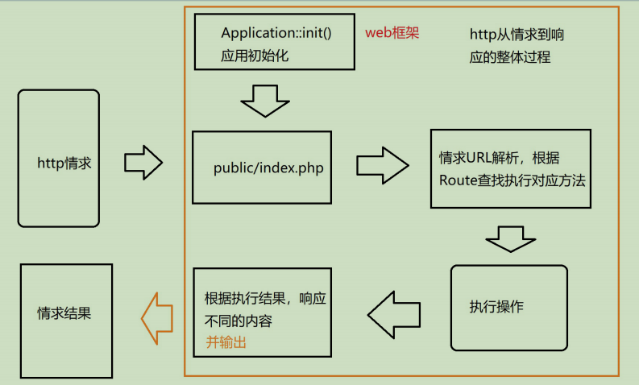
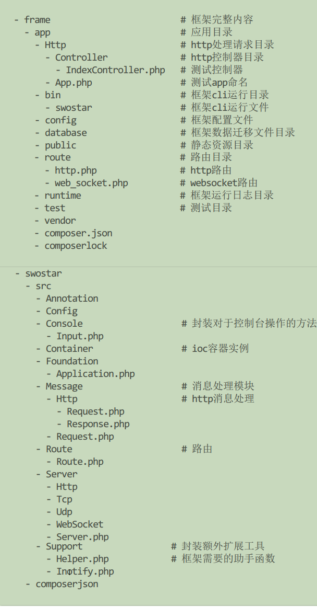
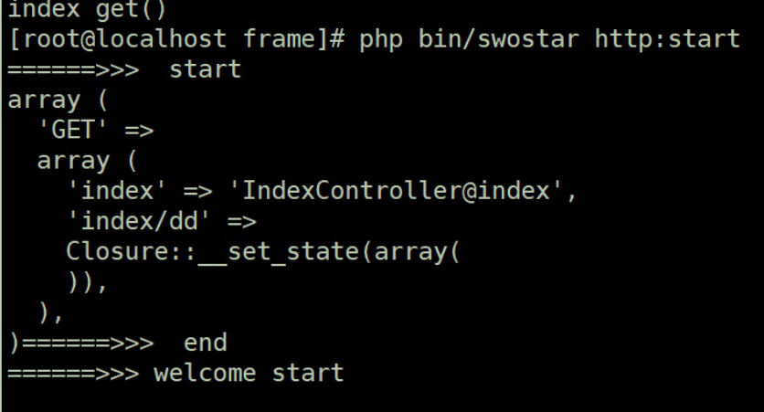
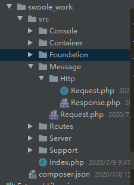
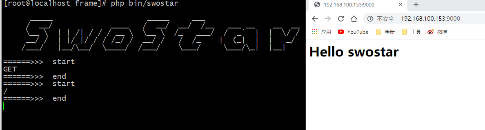

# Http架构服务(二)
## 内容补充
### 完善``composer.json``
````
{
    "name": "willyin/swoole_frame",
    "description": "this is the swoole frame",
    "type": "library",
    "authors": [
        {
            "name": "will",
            "email": "826895143@qq.com"
        }
    ],
    "require": {
        "willyin/swoole_work": "dev-master"
    },
    "repositories": {
        "will": {
            "type": "path",
            "url": "../swoole_work"
        }
    },
    "autoload": {
        "psr-4": {
            "App\\":"app/",
            "Database\\": "database/"
        }
    }
}
````
测试:
````
<?php
namespace App;
Class App{
    public function index()
    {
        echo "this is  app";
    }
}
--------------------------------------------------
<?php
require __DIR__."/../vendor/autoload.php";
use App\App;

echo (new App())->index();
--------------------------------------------------
结果:
[root@localhost frame]# php test/Test.php 
this is  app
````
## 1. 引入IOC 与 app助手函数
引入容器的实例类
````
<?php
namespace SwooleWork\Container;

use Closure;
use Exception;

/**
 *
 */
class Container
{
    // 0. 单例
    protected static $instance;
    // 1. 需要容器
    protected $bindings = [];
    protected $instances = [];
    /**
     * 容器绑定的方法
     * @param  string $abstract 标识
     * @param  object $object   实例对象或者闭包
     */
    public function bind($abstract, $object)
    {
        // 标识要绑定
        // 1. 就是一个对象
        // 2. 闭包的方式
        // 3. 类对象的字符串 (类的地址)
        $this->bindings[$abstract] = $object;
    }

    /**
     * 从容器中解析实例对象或者闭包
     * @param  string $abstract   标识
     * @param  array  $parameters 传递的参数
     * @return object             是一个闭包或者对象
     */
    public function make($abstract, $parameters = [])
    {
        return $this->resolve($abstract, $parameters);
    }

    public function resolve($abstract, $parameters = [])
    {
        if (isset($this->instances[$abstract])) {
            return $this->instances[$abstract];
        }

        if (!$this->has($abstract)) {
            // 如果不存在自行
            // 选择返回, 可以抛出一个异常
            throw new Exception('没有找到这个容器对象'.$abstract, 500);
        }

        $object = $this->bindings[$abstract];
        // 在这个容器中是否存在
        // 1. 判断是否一个为对象
        // 2. 闭包的方式
        if ($object instanceof Closure) {
            return $object();
        }
        // if (is_object($object)) {
        //     $this->instances[$abstract] = $object;
        // } else {
        //     $this->instances[$abstract] = new $object();
        // }
        // 3. 类对象的字符串 (类的地址)
        return $this->instances[$abstract] = (is_object($object)) ? $object :  new $object(...$parameters) ;
    }

    // 判断是否在容器中
    // 1. 容器很多便于扩展
    // 2. 可能在其他场景中会用到
    public function has($abstract)
    {
        return isset($this->bindings[$abstract]);
    }

    // 单例创建
    public static function getInstance()
    {
        if (is_null(static::$instance)) {
            static::$instance = new static;
        }
        return static::$instance;
    }

    public static function setInstance($container = null)
    {
        return static::$instance = $container;
    }
}
````
Application的继承
````
<?php
namespace SwooleWork\Foundation;
use SwooleWork\Container\Container;

class Application extends Container
{
    public function __construct($path = null)
    {
        //进行常用实例类的容器绑定
        $this->registerBaseBindings();
    }

    public function registerBaseBindings()
    {
        //确定绑定的所有内容
        $bind = [
            //需要绑定的内容写入其中
            // 标识 => 对象或闭包
            'index' => (new \SwooleWork\Index());
        ];
        //通过循环遍历
        foreach ($bind as $key => $val) {
            $this->bind($key,$val);
        }    
    } 
}
````
因为Application此时不是一个``单例模式``,我们要对其进行处理
````
  public function __construct($path = null)
     {
         //进行常用实例类的容器绑定
         $this->registerBaseBindings();
     }

 public function registerBaseBindings()
    {
        // 设置单列
        self::setInstance($this);

        //确定绑定的所有内容
        $bind = [
            //需要绑定的内容写入其中
            // 标识 => 对象或闭包
            'index' => (new \SwooleWork\Index())
        ];
        //通过循环遍历
        foreach ($bind as $key => $val) {
            $this->bind($key,$val);
        }
        
    }
````
测试:
````
<?php
namespace SwooleWork;
Class Index{
    public function index()
    {
        echo "this is test index()";
    }
}
-------------------------------------------------------------------------------------
<?php
require __DIR__."/../vendor/autoload.php";
use SwooleWork\Foundation\Application;
echo Application::getInstance()->make('index')->index();
-------------------------------------------------------------------------------------
测试结果:

[root@localhost ~]# php /www/swoole/frame/test/Test.php 

      _____                     _____     ___
     /  __/             ____   /  __/  __/  /__   ___ __    __  __
     \__ \  | | /| / / / __ \  \__ \  /_   ___/  /  _`  |  |  \/ /
     __/ /  | |/ |/ / / /_/ /  __/ /   /  /_    |  (_|  |  |   _/
    /___/   |__/\__/  \____/  /___/    \___/     \___/\_|  |__|
    
this is test index()
````
为了方便后续的操作,我们将Application封装成为助手函数app
````
<?php
use SwooleWork\Foundation\Application;

//封装成app助手函数
function app($val){
    if(empty($val)){
        return Application::getInstance();
    } else{
        return Application::getInstance()->make($val);
    }
}
````
再composer.json中载入(方便起见,我们再主目录的composer.json中直接引入)
````
 "autoload": {
        "psr-4": {
            "App\\":"app/",
            "Database\\": "database/"
        },
        "files": [
            "vendor/willyin/swoole_work/src/Support/Helper.php"
        ]
    }
````
## 2. 实现路由注册
### 2.1 http请求到响应流程解释
一般http请求过程(请求的url解析,根据解析url找控制器)
- 直接就是根据命名空间 
- 根据route



>对于传统型的很多框架在对于请求到响应这一块，基本都是先接收请求到路由解析，然后再输出结果给请求用户；
>
>而我们接下来要编辑的框架也会基于这几个点而展开进行设计，只是我们会依赖于swoole的httpserver；
#### 目录结构

### 2.2 路由加载
>作用：对于框架可以根据路由匹配对应的所需要执行的操作；实际上本质就是一个数组；key 作为路由标识，value作为路由对应需要执行的方法(闭包或者控制器方法)；

- 属性$routes
- get,post,any,addRoute,match

添加路由工具类
````
<?php
/**
 * Create By: Will Yin
 * Date: 2020/7/8
 * Time: 15:52
 **/
namespace SwooleWork\Routes;

Class Route{
    protected static $instance = null;
    // 路由本质实现是会有一个容器在存储解析之后的路由
    protected $routes = [];
    // 定义了访问的类型
    protected $verbs = ['GET', 'POST', 'PUT', 'PATCH', 'DELETE'];
    // 记录路由的文件地址
    protected $routeMap = [];

    protected function __construct( )
    {
        $this->routeMap = [
            'Http' => app()->getBasePath().'/route/http.php',
        ];
    }

    public static function getInstance()
    {
        if (\is_null(self::$instance)) {
            self::$instance = new static();
        }
        return self::$instance ;
    }

    public function get($uri, $action)
    {
        return $this->addRoute(['GET'], $uri, $action);
    }

    public function post($uri, $action)
    {
        return $this->addRoute(['POST'], $uri, $action);
    }

    public function any($uri, $action)
    {
        return $this->addRoute(self::$verbs, $uri, $action);
    }
    /**
     * 注册路由
     * @param [type] $methods [description]
     * @param [type] $uri     [description]
     * @param [type] $action  [description]
     */
    protected function addRoute($methods, $uri, $action)
    {
        foreach ($methods as $method ) {
            $this->routes[$method][$uri] = $action;
        }
        return $this;
    }
    /**
     * 根据请求校验路由，并执行方法
     * @return [type] [description]
     */
    public function match()
    {
       
    }

    public function registerRoute()
    {
        foreach ($this->routeMap as $key => $path) {
            require_once $path;
        }
        return $this;
    }

    public function getRoutes()
    {
        return $this->routes;
    }
}
````
>而在代码中增加了一些操作$verbs用于确定绑定的标识类型，而同时在构造函数中初始化路由文件加载地址，其次就是通过registerRoute()方法进行注册；
>
>注册的方式很简单就是通过require_once加载路由文件即可完成注册；
>
>过程就是，我们会在应用中通过Application加载route，然后通过registerRoute注册路由；
---
#### 补充1 关于静态调用
````
<?php
Class Index{
  public function static will(){
      echo "this is will";
    } 
  public function test(){
      echo "this is test";
    }
  public function demo(){
      //再当前类中,没有在意调用方法的类型,直接去找对应的方法
      echo  Index::test()."\n";
      echo self::test()."\n";
      echo Index::will();
    }
}
(new Index)->demo();
----------------------------------结果-------------------------------------

[root@localhost ~]# php test.php 
this is test
this is test
this is will
````
#### 补充2 new self() 与 new static() 区别
````
<?php
class Father {

    public function getNewFather() {
        return new self();
    }

    public function getNewCaller() {
        return new static();
    }

}
//$f = new Father();
//print get_class($f->getNewFather()); Father
//print get_class($f->getNewCaller()); Father

结论:从以上结果来看没有区别

class Sun1 extends Father {

}
class Sun2 extends Father {

}

$sun1 = new Sun1();
$sun2 = new Sun2();
print get_class($sun1->getNewFather())."\n";      //Father
print get_class($sun1->getNewCaller())."\n";      //Sun1
print get_class($sun2->getNewFather())."\n";      //Father
print get_class($sun2->getNewCaller());           //Sun2

--------------------------------结果-------------------------------------

[root@localhost ~]# php test.php 
Father
Sun1
Father
Sun2
---------------------------------总结------------------------------------

首先，
    他们的区别只有在继承中才能体现出来，如果没有任何继承，那么这两者是没有区别的。
然后， 
    new self()返回的实例是万年不变的，无论谁去调用，都返回同一个类的实例
    new static()则是由调用者决定的。

上面的$sun1->getNewCaller()的调用者是$sun1对吧！$sun1是类Sun1的实例，所以返回的是Sun1这个类的实例，$sun2同样的道理就不赘述了
````
### 添加一个控制器IndexController;
````
<?php
namespace App\Http\Controller;
//用于测试的控制器
Class IndexController{

    public function test($a)
    {
        echo "this is IndexController";
  }
}
````
### 路由： frame\route\http.php
````
<?php
use SwoStar\Route\Route;
Route::get('index', "IndexController@index");
Route::get('index/dd', function(){
return "hello";
});
````
### 修改Application ``swoole_work/src/Foundation/Application.php``
````
<?php
namespace SwooleWork\Foundation;
use SwooleWork\Console\Input;
use SwooleWork\Container\Container;
use SwooleWork\Route\Route;
use SwooleWork\Server\Http\HttpServer;

class Application extends Container
{
    protected $basePath = "";
    public function __construct($path)
    {
        // ..
        // 初始化系统
        $this->init();
        Input::info(self::SWOSTAR_WELCOME, "welcome");
    }
    /**
    * 把系统核心容器对象绑定到容器中
    */
     public function registerBaseBindings()
        {
            // 设置单列
            self::setInstance($this);
            //确定绑定的所有内容
            $bind = [
                //需要绑定的内容写入其中
                // 标识 => 对象或闭包
                'index' => (new \SwooleWork\Index()),
                'httpRequest' =>(new \SwooleWork\Message\Http\Request()),
            ];
    
            //通过循环遍历
            foreach ($bind as $key => $val) {
                $this->bind($key,$val);
            }
    
        }
    //初始化(路由)
    public function init()
    {
        //将注册的路由绑定进来
        $this->bind('route', Route::getInstance()->registerRoute());
        //进行打印测试
        //dd(Route::getInstance()->registerRoute()->getRoutes());
    }
}
````

## 3. 请求处理
>swoole实际上就已经提供了swoole\Http\Request对象；不过根据一般框架的应用swoole中的Request并不能完全满足实际需求；
>
>因此需要基与swoole\Http\Request进行一步封装，让它能够依据与框架运用而进行使用



``SwooleWork\Message\Http\Request``
````
<?php
/**
 * Create By: Will Yin
 * Date: 2020/7/8
 * Time: 15:53
 **/
namespace SwooleWork\Message\Http;
use Swoole\Http\Request as SwooleRequest;

class Request
{

    protected $method;

    protected $uriPath;

    protected $swooleRequest;

    public function getMethod()
    {
        return $this->method;
    }

    public function getUriPath()
    {
        return $this->uriPath;
    }
    /**
     * [init description]
     * @param  SwooleRequest $request [description]
     * @return \SwoStar\Message\Http\Request                 [description]
     */
    public static function init(SwooleRequest $request)
    {
        $self = app('httpRequest');

        $self->swooleRequest = $request;
        $self->server = $request->server;

        $self->method = $request->server['request_method'] ?? '';
        $self->uriPath = $request->server['request_uri'] ?? '';
        return $self;
    }

    public function get(){
    }
    public function post(){
    }
    public function input(){
    }
}
````
``SwooleWork\Server\Http``
````
<?php
namespace SwooleWork\Server\Http\HttpServer;

use SwooleWork\Index;
use SwooleWork\Server\Server;
use SwooleWork\Message\Http\Request as HttpRequest;
use Swoole\Http\Server as SwooleServer;
use Swoole\Http\Request as SwooleRequest;
use Swoole\Http\Response as SwooleResponse;

Class HttpServer extends Server
{
    public function createServer()
    {
        $this->swooleServer = new SwooleServer($this->host, $this->port);
    }

    protected function initEvent(){
        $this->setEvent('sub', [
            'request' => 'onRequest'
        ]);
    }
    // onRequest
    public function onRequest($request, $response)
    {
        /*
         * 请求地址: http://192.168.100.153:9000/index
         *
         * 结果:
        ======>>>  start
        /index
        ======>>>  end
        ======>>>  start
        /favicon.ico
        ======>>>  end
        */

        /*
        *Chrome 请求两次问题
        */
        if ($request->server['path_info'] == '/favicon.ico' || $request->server['request_uri'] == '/favicon.ico') {
            $response->end();
            return;
        }

        //响应请求的方法和路径
        $http_request = HttpRequest::init($request);

        dd($http_request->getMethod());
        dd($http_request->getUriPath());

        //响应结果
        $response->end("<h1>Hello swostar</h1>");
    }
}
````



