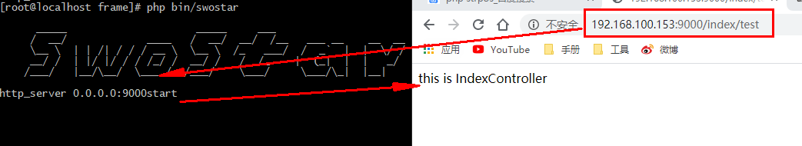
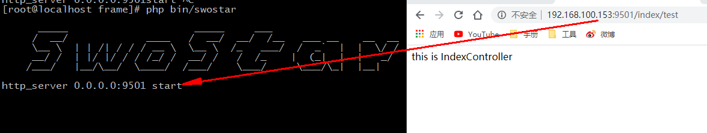
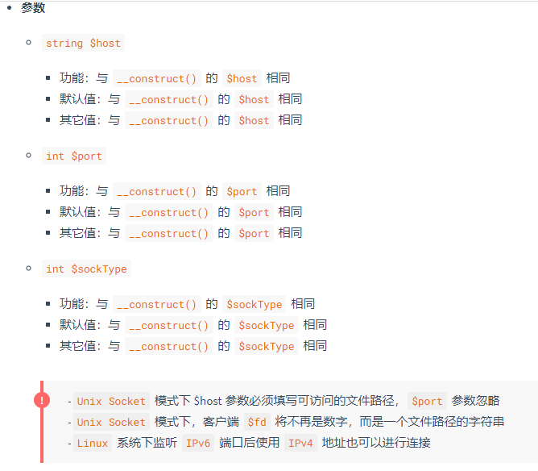
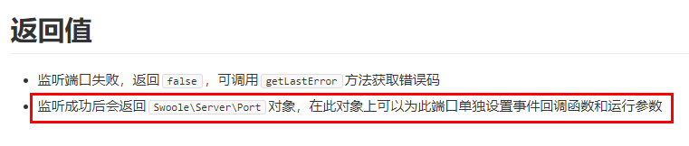
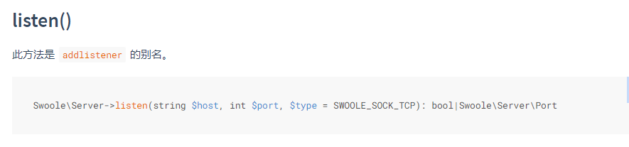
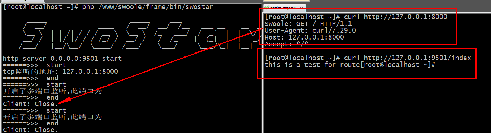

# Http架构服务(3)
## 补充
````
一.
strpos() 查找 指定字符串第一次出现的位置(从0开始计算)：

<?php
echo strpos("You love php, I love php too!","php");//9

--------------------------------------------------------------
二.
instanceof和判断闭包Closure

<?php
class MyClass
{}
class NotMyClass
{}
$a = new MyClass;
 
var_dump($a instanceof MyClass);        //bool(true)
var_dump($a instanceof NotMyClass);     //bool(false)

instanceof　
    也可用来确定一个变量是不是继承自某一父类的子类的实例
Closure 类
    用于代表 匿名函数 的类.
    匿名函数（在 PHP 5.3 中被引入）会产生这个类型的对象。在过去，这个类被认为是一个实现细节，但现在可以依赖它做一些事情。自 PHP 5.4 起，这个类带有一些方法，允许在匿名函数创建后对其进行更多的控制。
    除了此处列出的方法，还有一个 __invoke 方法。这是为了与其他实现了 __invoke()魔术方法 的对象保持一致性，但调用匿名函数的过程与它无关。

判断是不是闭包
 private function runAction($action)
    {
        // 跳过参数解析
        if ($action instanceof \Closure) {
            // 如果是闭包就执行
            /* 用于处理此类路由
             * Route::get('index',function(){
                return 'this is a test for route';
                });
             * */
            return $action();
        } else {
            /* 用于处理此类路由
             * Route::get('index/test',"IndexController@test");
             * */
            $namespace = "\App\Http\Controller\\";
            // 控制器的方法
            $string = explode("@", $action);
            $controller = $namespace.$string[0];
            $class = new $controller();
            return $class->{$string[1]}();
        }
    }
------------------------------------------------------------------------
三.
stristr() 函数
语法:stristr(string,search,before_search)
<?php
echo stristr("Hello world!","WORLD");  //world!(返回左右的剩余部分)
echo stristr("Hello world!",111);     //o world! (通过 "o" 的 ASCII 值搜索字符串，并返回字符串的剩余部分：)
echo stristr("Hello world!","WORLD",true); //Hello(返回 "world" 第一次出现之前的字符串部分：)
````
## 1.route解析过程
路由的解析，会经历如下几个过程；
- 获取请求
- 根据请求读取请求的地址
- 在根据请求地址匹配路由
- 执行操作
- 响应输出
>对于路由类来说就需要路由``校验``和``方法运行``

``swostar\src\Route\Route.php``
````
<?php
namespace SwooleWork\Route;

class Route
{
    protected $method;
    /**
    * 用于路由校验
    */
    public function match($path)
    {
        $action = null;
        foreach ($this->routes[$this->method] as $uri => $value) {
            if ($path === ((strpos($uri, "/") != 0 || !(strpos($uri, "/")))? "/".$uri : $uri)) {
                // 匹配到了路由
                $action = $value;
                break;
            }
        }
        if (!empty($action)) {
            // 执行匹配到的方法
            // 1. 判断类型
            // 2.1. 执行闭包
            // 2.2. 执行控制器的方法
            return $this->runAction($action);
        }
        dd("没有找到对应的路由");
        return "404";
        // 失败没有找到路由
    }
    /**
    * 运行路由的方法
    */
    private function runAction($action)
    {
        // 跳过参数解析
        if ($action instanceof \Closure) {
            // 如果是闭包就执行
            return $action();
        } else {
            $namespace = "\App\Http\Controller\\";
            // 控制器的方法
            $string = explode("@", $action);
            $controller = $namespace.$string[0];
            $class = new $controller();
            return $class->{$string[1]}();
        }
    }
    public function setMethod($method)
    {
        $this->method = $method;
        return $this;
    }
}
````
如上操作，通过``match()``, ``runAction()`` 运行方法；
````
<?php
namespace SwooleWork\Server\Http;

use SwooleWork\Index;
use SwooleWork\Server\Server;
use SwooleWork\Message\Http\Request as HttpRequest;
use Swoole\Http\Server as SwooleServer;
use Swoole\Http\Request as SwooleRequest;
use Swoole\Http\Response as SwooleResponse;

Class HttpServer extends Server
{
    public function createServer()
    {
        $this->swooleServer = new SwooleServer($this->host, $this->port);
        echo "http_server ".$this->host.":".$this->port ."start ";
    }

    protected function initEvent(){
        $this->setEvent('sub', [
            'request' => 'onRequest'
        ]);
    }
    // onRequest
    public function onRequest($request, $response)
    {
        /*
         * 请求地址: http://192.168.100.153:9000/index
         *
         * 结果:
        ======>>>  start
        /index
        ======>>>  end
        ======>>>  start
        /favicon.ico
        ======>>>  end
        */

        /*
        *Chrome 请求两次问题
        */
        if ($request->server['path_info'] == '/favicon.ico' || $request->server['request_uri'] == '/favicon.ico') {
            $response->end();
            return;
        }

        //响应请求的方法和路径
        $http_request = HttpRequest::init($request);

        //dd($http_request->getMethod());
       // dd($http_request->getUriPath());

        //执行控制的方法
        $res = app('route')->setMethod($http_request->getMethod())->match($http_request->getUriPath());
        //响应结果
        $response->end($res);
        //响应结果
       // $response->end("<h1>Hello swostar</h1>");
    }
}
````

## 2. 载入配置文件
配置文件:
````
<?php
/**
 * Create By: Will Yin
 * Date: 2020/7/9
 * Time: 16:33
 **/
return  [
    'http'=>[
        'host' => '0.0.0.0',
        'port' => 9000,
        'swoole' => [
         ],
        'tcpable' => 1, // 1为开启， 0 为关闭
        'rpc' => [
            'host' => '127.0.0.1',
            'port' => 8000,'swoole' => [
                'worker_num' => 1
            ]
        ]
    ],

];
````
配置文件加载核心类 ``swoole_work\src\Config\Config.php``
````
<?php
namespace SwooleWork\Config;
Class Config{
    protected $itmes = [];
    protected $configPath = '';
    function __construct()
    {
        //获取配置文件路径
        $this->configPath = app()->getBasePath().'/config';
        // 读取配置
        $this->itmes = $this->configread();
        //打印测试
         //dd($this->itmes);
    }
    /**
     * 读取PHP文件类型的配置文件
     * @return [type] [description]
     */
    protected function configread()
    {
        // 1. 找到文件
        // 此处跳过多级的情况
        $files = scandir($this->configPath);
        $data = null;
        // 2. 读取文件信息
        foreach ($files as $key => $file) {
            if ($file === '.' || $file === '..') {
                continue;
            }
            // 2.1 获取文件名(stristr查找 指定 字符 在 字符串 中的第一次出现，并返回字符串的剩余部分：,加true则返回)
            $filename = \stristr($file, ".php", true);
            // 2.2 读取文件信息
            if($filename){
                $data[$filename] = include $this->configPath."/".$file;
            }

        }
        // 3. 返回
            return $data;
    }
   //获取配置文件的方法
    public function getConfig($keys)
    {   //获取配置信息
        //getConfig('http.server.port');
        $data = $this->itmes;
        foreach (\explode('.', $keys) as $key => $value) {
            $data = $data[$value];
        }
        return $data;
    }
}
````
``Application``中注入``config``类
````
<?php
namespace SwooleWork\Foundation;

use SwooleWork\Container\Container;
use SwooleWork\Server\Http\HttpServer;
use SwooleWork\Routes\Route;

class Application extends Container
{
    public function registerBaseBindings()
        {
            //确定绑定的所有内容
            $bind = [
                'config' => (new \SwooleWork\Config\Config()),
            ];
    }
````
server中添加get方法
````
<?php
namespace SwooleWork\Server;
use SwooleWork\Support\Inotify;
use Swoole\Server as SwooleServer;
use SwooleWork\Foundation\Application;

abstract class Server
{
    public function start()
        {
            //配置文件信息的读取
            $this->configInit();
        }
    public function configInit()
        {
            $config = app('config');
            $this->port = $config->getConfig('http_server.http.host');
            $this->port = $config->getConfig('http_server.http.port');
        }
}
````

## 3. 多端口监听
### 3.1 [addListener](https://wiki.swoole.com/#/server/methods?id=addlistener)
语法:``Swoole\Server->addListener(string $host, int $port, $type = SWOOLE_SOCK_TCP): bool|Swoole\Server\Port``







>在实际运用场景中，服务器可能需要监听不同host下的不同端口。比如，一个应用服务器，可能需要监听外网的服务端口，同时也需要监听内网的管理端口。在Swoole中，可以轻松的实现这样的功能。 Swoole提供了 addlistener函数用于给服务器添加一个需要监听的host及port。关于函数的介绍官方文档已经说的比较清楚

场景：服务端可以接收硬件传感器通过tcp协议上报温度，同时服务端也允许用户端发送http请求，由服务器发送请求关闭掉硬件设备
````
----------------------------------server.php-----------------------------------------------

<?php
$http = new Swoole\Http\Server("0.0.0.0", 9000);
$http->set([
    'worker_num' => 2
]);
//============================监听9000=====================================>
//端口9000的响应
$http->on('request', function ($request, $response) {
    $response->end("<h1>this is 9000</h1>");
});
//============================监听8000=====================================>
// 会返回一个监听的服务
// Swoole\Server\Port
$port = $http->addListener('127.0.0.1', 8000, SWOOLE_SOCK_TCP);
$port->set([
    'worker_num' => 2
]);
$port->on('receive', function (Swoole\Server $serv, $fd, $reactor_id, $data) {
    echo "this is 8000 \n";
    // 先停止服务端运行
    // 设置用户的状态
    $serv->send($fd, "this is 8000");
});
//============================监听7000=====================================>
$other = $http->listen('0.0.0.0', 7000, SWOOLE_SOCK_TCP);
$other->set([
    'worker_num' => 2
]);
$other->on('receive', function (Swoole\Server $serv, $fd, $reactor_id, $data) {
    //echo "this is 8000 \n";
    // 先停止服务端运行
    // 设置用户的状态
    $serv->send($fd, "this is 7000");
});
//=================================================================>

echo "hello swoole";

$http->start();
----------------------------------client.php-----------------------------------------------
<?php
$client = new swoole_client(SWOOLE_SOCK_TCP);
//连接到服务器
$client->connect('127.0.0.1', 8000);
//向服务器发送数据
$client->send(1);
//从服务器接收数据
$client->recv();
//关闭连接
$client->close();
----------------------------------结果------------------------------------------
[root@localhost ~]# curl http://192.168.100.153:9000  //成功
<h1>this is 9000</h1>
[root@localhost ~]# curl http://192.168.100.153:8000   //拒接
curl: (7) Failed connect to 192.168.100.153:8000; Connection refused
[root@localhost ~]# curl http://127.0.0.1:8000       //成功,以为协议问题卡住
^C
[root@localhost ~]# php client                      //成功
this is 8000
[root@localhost ~]# php client                      //成功
this is 7000


[root@localhost ~]# pstree -apn | grep php
  |   |   |   `-php,57559 server.php
  |   |   |       |-php,57560 server.php
  |   |   |       |   |-php,57562 server.php
  |   |   |       |   `-php,57563 server.php
  |   |   |       `-{php},57561
  |   |       `-grep,57567 --color=auto php
````
## 4. 框架引入多端口监听
``SwooleWork\RPC\RPC``
````
<?php
/**
 * Create By: Will Yin
 * Date: 2020/7/9
 * Time: 21:30
 **/
namespace SwooleWork\RPC;
use Swoole\Server;
use SwooleWork\Console\Input;

Class RPC{
    protected $host ;
    protected $port;
    public function __construct(Server $server, $config)
    {
        $listen = $server->listen($config['host'], $config['port'], SWOOLE_SOCK_TCP);
        $listen->set($config['swoole']);
        $listen->on('connect', [$this, 'connect']);
        $listen->on('receive', [$this, 'receive']);
        $listen->on('close', [$this, 'close']);
        Input::info('tcp监听的地址: '.$config['host'].':'.$config['port'] );
    }
    public function connect($serv, $fd){
        dd("开启了多端口监听,此端口为".$this->port);
    }
    public function receive($serv, $fd, $from_id, $data) {
        $serv->send($fd, 'Swoole: '.$data);
        $serv->close($fd);
    }
    public function close($serv, $fd) {
        echo "Client: Close.\n";
    }
}
````
``SwooleWork\src\Server\Server.php``
````

<?php
namespace SwooleWork\Server;
use SwooleWork\RPC\RPC;

abstract class Server
{ 
    //.....
    public function __construct(Application $app)
    {
        //就录了Application中传递的必要变量
        $this->app = $app;
        //配置文件信息的读取
        $this->configInit();
        //启动服务需要执行的事件
        $this->createServer();
        //设置配置信息
        $this->swooleServer->set($this->config);
        //设置需要注册的回调事件
        $this->initEvent();
        //设置swoole的回调函数
        $this->setSwooleEvent();
    }
    public function start()
    {
        //判断是否开启多监听端口
        if (app('config')->getConfig('http_server.http.tcpable')) {
            new RPC($this->swooleServer, app('config')->getConfig('http_server.http.rpc'));
        }
        //启动服务
        $this->swooleServer->start();
    }
}
````

