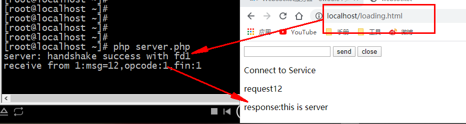

# Websocket
## 1. [websocket协议介绍](https://www.cnblogs.com/LWWTT/p/11073636.html)

### 1.1 websocket特点
- 相对于Http这种非持久连接而言，``websocket协议是一种持久化连接``，它是一种独立的，``基于TCP的协议``。基于websocket，我们可以``实现客户端和服务端双向通信``。
- 在websocket出现之前，为了解决此类问题，常用的解决方法有轮询(ajax)和long pull,这两种技术都是客户端和服务端建立源源不断的HTTP连接，非常消耗带宽和服务器资源。
- websocket是双向持久连接，客户端和服务端只需要第一次建立连接即可实现双向通信。

体验
````
---------------------------------------------------server.php:---------------------------------------------------

<?php
$address = "0.0.0.0";
$port = 9000; //调试的时候，可以多换端口来测试程序！

set_time_limit(0);
$sock = socket_create(AF_INET, SOCK_STREAM, SOL_TCP);
socket_set_block($sock);
socket_bind($sock, $address, $port);
socket_listen($sock, 4);
do
{
    echo "Waiting for Connection...\n";
    $msgsock = socket_accept($sock);
    echo "Waiting for Request...\n";
    $buf = socket_read($msgsock, 8192);     //读取请求
    echo "Request Received: $buf\n";
    $response = hand_shake($buf);
    socket_write($msgsock,$response,strlen($response)); //发送响应
    //正式开始通信...
    $buf = socket_read($msgsock, 8192);
    $msg = "WELCOME \n";
    $msg = code($msg);
    socket_write($msgsock, $msg, strlen($msg));

    sleep(3);

    $msg = true;
    $msg = code($msg);
    socket_write($msgsock, $msg, strlen($msg));

    sleep(1);

    socket_close($msgsock);
} while (true);
socket_close($sock);

function hand_shake($buf){
    $buf  = substr($buf,strpos($buf,'Sec-WebSocket-Key:')+18);
    $key  = trim(substr($buf,0,strpos($buf,"\r\n")));

    $new_key = base64_encode(sha1($key."258EAFA5-E914-47DA-95CA-C5AB0DC85B11",true));

    $new_message = "HTTP/1.1 101 Switching Protocols\r\n";
    $new_message .= "Upgrade: websocket\r\n";
    $new_message .= "Sec-WebSocket-Version: 13\r\n";
    $new_message .= "Connection: Upgrade\r\n";
    $new_message .= "Sec-WebSocket-Accept: " . $new_key . "\r\n\r\n";
    return $new_message;
}
function code($msg){
    $msg = preg_replace(array('/\r$/','/\n$/','/\r\n$/',), '', $msg);
    $frame = array();
    $frame[0] = '81';
    $len = strlen($msg);
    $frame[1] = $len<16?'0'.dechex($len):dechex($len);
    $frame[2] = ord_hex($msg);
    $data = implode('',$frame);
    return pack("H*", $data);
}

function ord_hex($data)  {
    $msg = '';
    $l = strlen($data);
    for ($i= 0; $i<$l; $i++) {
        $msg .= dechex(ord($data{$i}));
    }
    return $msg;
}
---------------------------------------------------request.html::---------------------------------------------------

<!doctype html>
<html lang="en">
 <head>
  <meta charset="UTF-8">
  <meta name="viewport" content="width=device-width,initial-scale=1, maximum-scale=1, user-scalable=no">
  <title>websocket</title>
 </head>
 <body>
 <input id="text" value="">
 <input type="submit" value="send" onclick="start()">
 <input type="submit" value="close" onclick="close()">
<div id="msg"></div>
 <script>
    /**
      *0：未连接
      *1：连接成功，可通讯
      *2：正在关闭
      *3：连接已关闭或无法打开
      */
    //创建一个webSocket 实例
    //var webSocket  = new  WebSocket("ws://127.0.0.1:9000");
     var webSocket  = new  WebSocket("ws://192.168.100.153:9000");
    //var webSocket  = new  WebSocket("ws://192.168.186.130:9000/index");

    webSocket.onerror = function (event){
        onError(event);
    };

    // 打开websocket
    webSocket.onopen = function (event){
        onOpen(event);
    };

    //监听消息
    webSocket.onmessage = function (event){
        onMessage(event);
    };


    webSocket.onclose = function (event){
        onClose(event);
    }

    //关闭监听websocket
    function onError(event){
        document.getElementById("msg").innerHTML = "<p>close</p>";
        console.log("error"+event.data);
    };

    function onOpen(event){
        console.log("open:"+sockState());
        document.getElementById("msg").innerHTML = "<p>Connect to Service</p>";
    };

    function onMessage(event){
        console.log("onMessage");
        document.getElementById("msg").innerHTML += "<p>response:"+event.data+"</p>"
    };

    function onClose(event){
        document.getElementById("msg").innerHTML = "<p>close</p>";
        console.log("close:"+sockState());
        webSocket.close();
    }

    function sockState(){
        var status = ['未连接','连接成功，可通讯','正在关闭','连接已关闭或无法打开'];
            return status[webSocket.readyState];
    }

    function start(event){
        console.log(webSocket);
        var msg = document.getElementById('text').value;
        document.getElementById('text').value = '';
        console.log("send:"+sockState());
        console.log("msg="+msg);
        webSocket.send("msg="+msg);
        document.getElementById("msg").innerHTML += "<p>request"+msg+"</p>"
    };

    function close(event){
        webSocket.close();
    }
 </script>
 </body>
</html>
````

## 2. [swoole_websocket介绍](https://wiki.swoole.com/#/websocket_server)


- websocket_server是在swoole_http_server基础之上做了协议解析
- 完整的websocket协议会封装在frame对象当中
### 2.1 swoole_websocket体验 
````
---------------------------------------------------request.html::---------------------------------------------------
<!doctype html>
<html lang="en">
 <head>
  <meta charset="UTF-8">
  <meta name="viewport" content="width=device-width,initial-scale=1, maximum-scale=1, user-scalable=no">
  <title>websocket</title>
 </head>
 <body>
 <input id="text" value="">
 <input type="submit" value="send" onclick="start()">
 <input type="submit" value="close" onclick="close()">
<div id="msg"></div>
 <script>
    //创建一个webSocket 实例
     var webSocket  = new  WebSocket("ws://192.168.100.153:9501");
    webSocket.onerror = function (event){
        onError(event);
    };

    // 打开websocket
    webSocket.onopen = function (event){
        onOpen(event);
    };

    //监听消息
    webSocket.onmessage = function (event){
        onMessage(event);
    };


    webSocket.onclose = function (event){
        onClose(event);
    }

    //关闭监听websocket
    function onError(event){
        document.getElementById("msg").innerHTML = "<p>close</p>";
        console.log("error"+event.data);
    };

    function onOpen(event){
        console.log("open:"+sockState());
        document.getElementById("msg").innerHTML = "<p>Connect to Service</p>";
    };

    function onMessage(event){
        console.log("onMessage");
        document.getElementById("msg").innerHTML += "<p>response:"+event.data+"</p>"
    };

    function onClose(event){
        document.getElementById("msg").innerHTML = "<p>close</p>";
        console.log("close:"+sockState());
        webSocket.close();
    }

    function sockState(){
        var status = ['未连接','连接成功，可通讯','正在关闭','连接已关闭或无法打开'];
            return status[webSocket.readyState];
    }

    function start(event){
        console.log(webSocket);
        var msg = document.getElementById('text').value;
        document.getElementById('text').value = '';
        console.log("send:"+sockState());
        console.log("msg="+msg);
        webSocket.send("msg="+msg);
        document.getElementById("msg").innerHTML += "<p>request"+msg+"</p>"
    };

    function close(event){
        webSocket.close();
    }
 </script>
 </body>
</html>
---------------------------------------------------server.php---------------------------------------------------
<?php
$server = new Swoole\WebSocket\Server("0.0.0.0", 9000);

$server->on('open', function (Swoole\WebSocket\Server $server, $request) {
    echo "server: handshake success with fd{$request->fd}\n";
});

$server->on('message', function (Swoole\WebSocket\Server $server, $frame) {
    echo "receive from {$frame->fd}:{$frame->data},opcode:{$frame->opcode},fin:{$frame->finish}\n";
    $server->push($frame->fd, "this is server");
});

$server->on('close', function ($ser, $fd) {
    echo "client {$fd} closed\n";
});

$server->on('request', function (Swoole\Http\Request $request, Swoole\Http\Response $response) {
    global $server;//调用外部的server
    // $server->connections 遍历所有websocket连接用户的fd，给所有用户推送
    foreach ($server->connections as $fd) {
    // 需要先判断是否是正确的websocket连接，否则有可能会push失败
        if ($server->isEstablished($fd)) {
            $server->push($fd, $request->get['message']);
        }
    }
});

$server->start();
````

## 3. websocket集成到框架中
需要完成的事情有：
- 路由注册
- 控制器响应解析
- 注意message的回复处理
### 3.1. 路由设计
````
---------------------------------------------------WebSocketServer---------------------------------------------------
<?php
/**
 * Create By: Will Yin
 * Date: 2020/7/10
 * Time: 15:17
 **/
namespace SwooleWork\Server\WebSocket;
//引入swoole的websocket服务
use Swoole\WebSocket\Server as SwooleServer;
//以为websocket是继承于httpserver的这里我们可以直接继承httpserver对其进行再一次封装
use SwooleWork\Server\Http\HttpServer;

Class WebSocketServer extends HttpServer{
    public function createServer()
    {
        $this->swooleServer = new SwooleServer($this->host, $this->port);
        echo "WebSocket服务 => ".$this->host.":".$this->port . " start \n";
    }

    protected function initEvent(){
        $this->setEvent('sub', [
            'request' => 'onRequest',
            'open' => "onOpen",
            'message' => "onMessage",
            'close' => "onClose",
        ]);
    }

    public function onOpen(SwooleServer $server, $request) {
        // 需要获取访问的地址？
        Connections::init($request->fd, $request->server['path_info']);

        $return = app('route')->setFlag('WebSocket')->setMethod('open')->match($request->server['path_info'], [$server, $request]);
    }

    public function onMessage(SwooleServer $server, $frame) {
        $path = (Connections::get($frame->fd))['path'];

        $return = app('route')->setFlag('WebSocket')->setMethod('message')->match($path, [$server, $frame]);
    }

    public function onClose($ser, $fd) {
        $path = (Connections::get($fd))['path'];

        $return = app('route')->setFlag('WebSocket')->setMethod('close')->match($path, [$server, $fd]);

        Connections::del($fd);
    }
}
---------------------------------------------------WebSocketServer---------------------------------------------------
<?php
/**
 * Create By: Will Yin
 * Date: 2020/7/8
 * Time: 15:52
 **/
namespace SwooleWork\Routes;
use SwooleWork\Foundation\Application;

Class Route{
  //........
    protected function __construct( )
    {
        if(app()->getBasePath()){
            $this->routeMap = [
                'Http' => app()->getBasePath().'/route/http.php',
                'Web' => app()->getBasePath().'/route/websocket.php',
            ];
        }else{
            $this->routeMap = [
                'Http' => '/www/swoole/frame/route/http.php',
                'Web' => '/www/swoole/frame/route/websocket.php',
            ];
        }
    }
    public function web_socket($uri, $controller)
    {
        $actions = [
            'open',
            'message',
            'close'
        ];
        /*
        *将以上三种情况当成为请求的类型
        */
        foreach ($actions as $key => $action) {
            $this->addRoute([$action], $uri, $controller."@".$action);
        }
    }
   //........
}
---------------------------------------------------IndexController---------------------------------------------------
<?php
/**
 * Create By: Will Yin
 * Date: 2020/7/10
 * Time: 15:48
 **/
namespace App\WebSocket\Controller;
/*
*所有的控制器都因该拥有以下的方法,方便所有的websocket请求
*/
Class IndexController{
    public function open($server, $request)
    {
        dd('indexController open');
    }
    public function message($server, $frame)
    {
        $server->push($frame->fd, "this is server");
    }
    public function close($ser, $fd)
    {

    }
}
---------------------------------------------------websocket.php---------------------------------------------------
<?php
/**
 * Create By: Will Yin
 * Date: 2020/7/8
 * Time: 15:49
 **/
use SwooleWork\Routes\Route;

//直接调用route中注册的web_socket方式,为websocket独有的路由方式
Route::web_socket('index', 'IndexController');
Route::web_socket('demo', 'DemoController');
---------------------------------------------------测试---------------------------------------------------
<?php
namespace SwooleWork\Foundation;
class Application extends Container
{
    //初始化(路由)
    public function init()
    {
        //将注册的路由绑定进来
        $this->bind('route', Route::getInstance()->registerRoute());
        //进行打印测试
        dd(Route::getInstance()->registerRoute()->getRoutes());
    }
}
````


