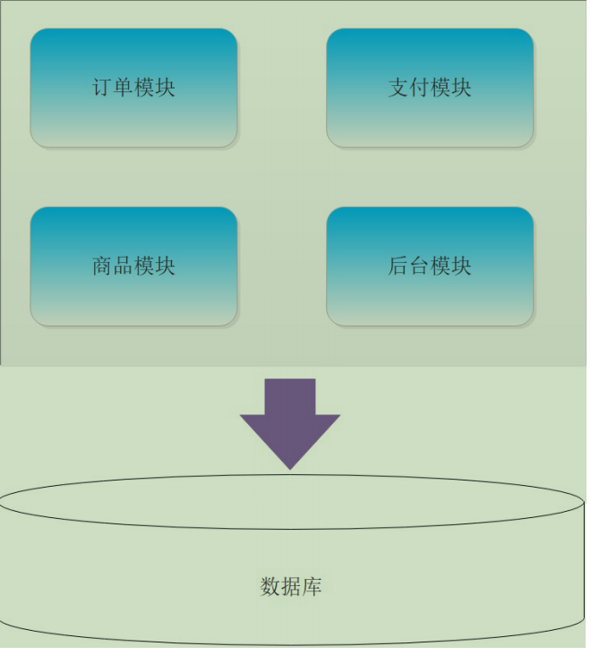
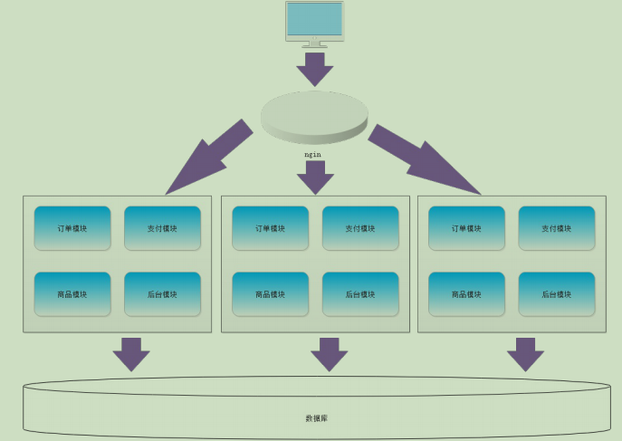
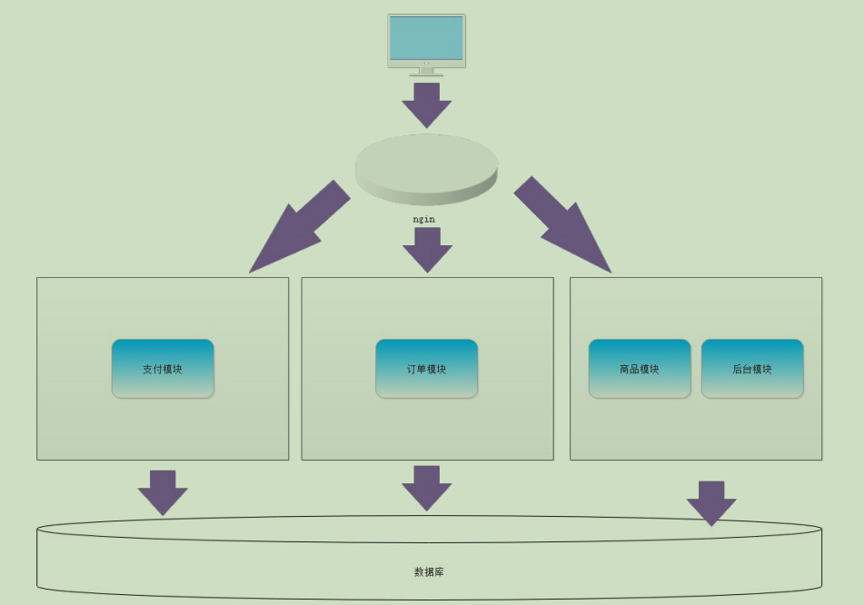
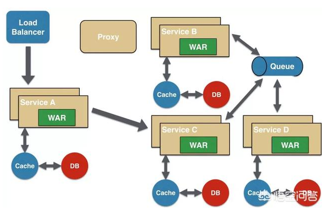
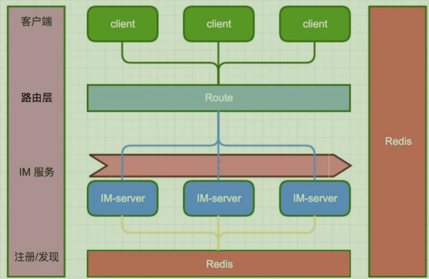
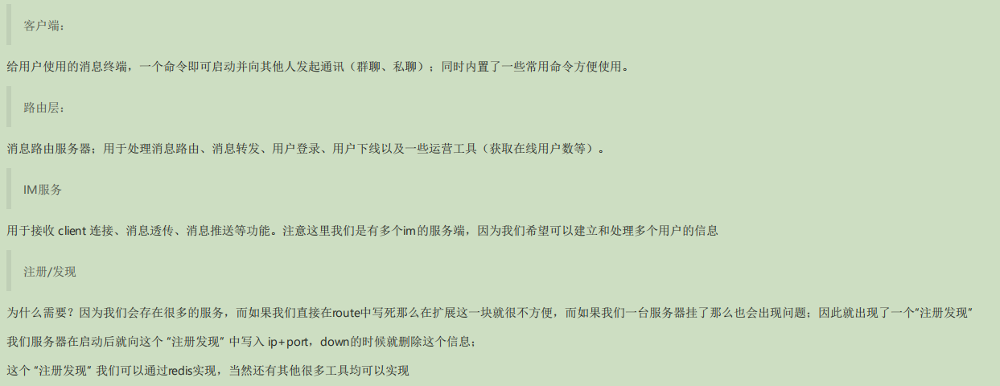
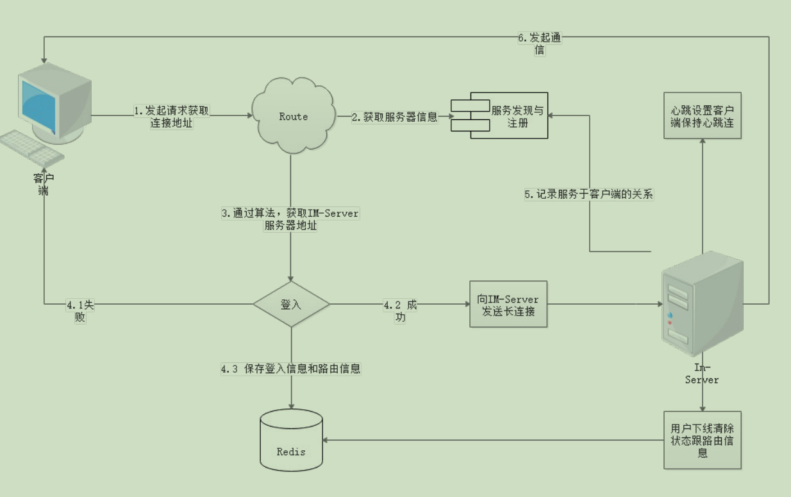
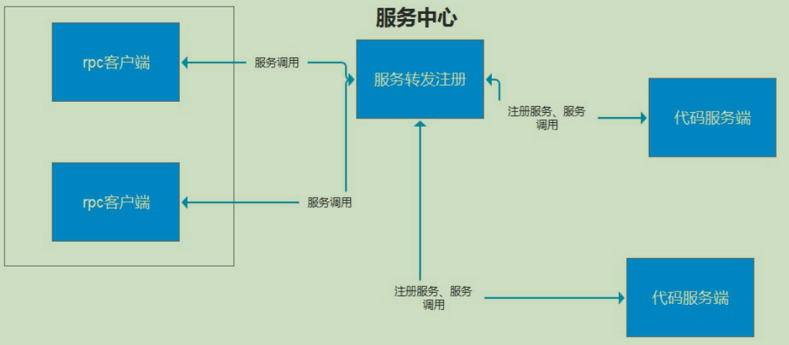

# IM及时通信概念
## 1. 即时通信与实时通信
- 本质: 是一样的,都是信息的交互
- 不同: 交互的时间关系,信息的要求

即时通信: 一般用于文字聊天,语音发送,文件传输,直播,在线音频视频..
>主要要求可靠,那么关键点就在于延迟(tcp)

实时通信: 群发通知,视频电话会议,打电话..
>延迟最低,但可靠性不高(udp)

## 2. 架构演变
### 2.1 单体架构

#### 如上就是单体架构的信息：
##### 特点：
- 在单体架构中，所有的模块会融合在一个项目中；
- 在项目部署k的时候直接部署整个项目到服务器中
##### 优点：
- 周期短，成本低，开发难点小，适合小型企业
##### 缺点：
- 全部的功能都集中在一个项目中完成,对于大型项目来说,开发难度高,不容易开发及扩展和维护.
### 2.2 集群

##### 特点：
- 单体架构的开发模式
- 项目以相同代码方式部署在不同的服务上
- 利用nginx进行负载均衡（通过随机，轮询法，最少连接，hash算法等）
##### 优点：
- 可以分担压力
- 可以起到备份以及容灾等故障处理
##### 缺点：
- 没有有效利用服务器的性能（一些模块是热点，而一些则冷的一匹)
### 2.3 分布式

##### 特点：
- 把完整的项目拆分成不同的单独模块并进行部署到不同的服务器上
- 项目可以不仅使用一种编程语言，可根据语言特点(不同编程语言)做对应的模块
##### 优点：
- 把模块拆分，使用接口通信，降低模块之间的耦合度。
- 把项目拆分成若干个子项目，不同的团队负责不同的子项目。
- 增加功能时只需要再增加一个子项目，调用其它系统的接口就可以。
- 可以灵活的进行分布式部署。
##### 缺点：
- 系统之间交互需要使用远程通信，接口开发增加工作量。 
- 各个模块有一些通用的业务逻辑无法共用
### 2.4 微服务
##### 特点
- 在实现分布式的时候基本可以算是微服务，``微服务不一定是分布式,但分布式一定是微服务``
- 把项目根据模块划分为单独细小的服务整体（有点类似面向对象中的职责单一）
- 部署可以部署在同一个服务器上，也可以采用分布式的方式部署
##### 优点:
- 微服务拆分更细,有利于资源的重复利用,提高开发效率  
- 可以更加精准针对某个服务做方案  
- 适应市场更容易,产品迭代周期更短.
##### 缺点:
- 微服务量多,服务治理成本高,不利于系统维护
### 2.5 [什么是 分布式 和 微服务 ](https://blog.csdn.net/zhonglunsheng/article/details/83153451)
简单的说，``微服务是架构设计方式``，``分布式是系统部署方式``，两者概念不同

微服务是啥？
>简单来说微服务就是很小的服务，小到一个服务只对应一个单一的功能，只做一件事。这个服务可以单独部署运行，服务之间可以通过RPC来相互交互，每个微服务都是由独立的小团队开发，测试，部署，上线，负责它的整个生命周期。

微服务架构又是啥？
>在做架构设计的时候，先做逻辑架构，再做物理架构，当你拿到需求后，估算过最大用户量和并发量后，计算单个应用服务器能否满足需求，如果用户量只有几百人的小应用，单体应用就能搞定，即所有应用部署在一个应用服务器里，如果是很大用户量，且某些功能会被频繁访问，或者某些功能计算量很大，建议将应用拆解为多个子系统，各自负责各自功能，这就是微服务架构。

那么分布式又是啥？
>分布式服务顾名思义服务是分散部署在不同的机器上的，一个服务可能负责几个功能，是一种面向SOA架构的，服务之间也是通过rpc来交互或者是webservice来交互的。逻辑架构设计完后就该做物理架构设计，系统应用部署在超过一台服务器或虚拟机上，且各分开部署的部分彼此通过各种通讯协议交互信息，就可算作分布式部署，生产环境下的微服务肯定是分布式部署的，分布式部署的应用不一定是微服务架构的，比如集群部署，它是把相同应用复制到不同服务器上，但是逻辑功能上还是单体应用

#### 总结:
微服务相比分布式服务来说，它的粒度更小，服务之间耦合度更低，由于每个微服务都由独立的小团队负责，因此它敏捷性更高，分布式服务最后都会向微服务架构演化，这是一种趋势， 不过服务微服务化后带来的挑战也是显而易见的，例如服务粒度小，数量大，后期运维将会很难

## 3. IM即时通信介绍

>这就是IM通信的架构方式，可以允许很多个客户端连接，同时服务端也会有很多并且可以允许服务端监听不同的端口或者不同的ip，然后通过route去进行解析请求转发,而redis则会在其中起到很关键型的作用，用来记录用于的信息和登入状态
### 3.1. 模块解释
>1.IM-Server服务端：
- 用于接收 Client 连接、消息推送等功能。支持集群部署。
- 检测客户端存活状态，心跳时间为300秒/500秒，心跳过快耗电过多，心跳过慢有可能被切断连接
- 设备/用户登录退出操作，更新Redis中的状态
- 消息进行双向确认/重传/去重。发送消息后，客户端必须回复ACK确认包，才认为已成功。否则进行重传，客户端对服务器推送的消息进行去重，避免收到重复的消息。

>2.Route消息路由服务器
- 检测IM-server的存活状态
- 支持权限认证
- 根据服务器的状态，按照一定的算法，计算出该客户端连接到哪台IM-server，返回给客户端，客户端再去连接到对应的服务端,保存客户端与IM-server的路由关系
- 如果 IM-server宕机，会自动从Redis中当中剔除
- IM-server上线后连接到Route，自动加 入 Redis
- 可以接受来自PHP代码、C++程序、Java程序的消息请求，转发给用户所在的IM-server
- 缓存服务器地址，多次查询redis

>3.redis
- 存储client的登入信息比如fd
- 绑定用户信息

>4.Client客户端
- 就是模拟websocket层
- 消息通讯，及消息应答ack
- 心跳保持及断开重连
### 3.2 根据分层解释

### 3.3 流程图

整体的流程也比较简单，流程图如上：
- 客户端向 Route 发起登录。
- 登录成功从 redis当中选择可用 im-server 返回给客户端，并保存登录、路由信息到 Redis。
- 客户端向 im-server 发起长连接，成功后保持心跳。
- 客户端下线时清除状态信息。
## 4. [RPC](http://www.ccutu.com/243972.html)
### 4.1. RPC介绍
RPC全称为Remote Procedure Call，翻译过来为“远程过程调用”。目前，主流的平台中都支持各种远程调用技术，以满足分布式系统架构中不同的系统之间的远程通信和相互调用，也是实现微服务当中的重要的环节。客户端通过发送一个规定的rpc协议，请求服务的注册中心，由服务注册中心检索可用服务，并且实现调用转发，服务内容由代码服务器在启动的时候，注册到服务中心。服务中心暂时利用redis存储内容。

>个人理解:RPC是对内部服务的接口,API是对外部的接口

- 通过redis方式存储代码服务器发送过来的注册服务利用redis集合进行存储服务
- 心跳维持、健康检查定时检测代码服务端健康状态，如果服务宕机，从服务列表当中删除
- 多端口混合协议监听接收rpc服务调用客户端如果是普通的网页端只需要，接收普通的http请求，但是是硬件设备需要接收tcp的协议，不同协议统一转换，同时查询可用服务发送到服务端
- 协议的统一转换将客户端的不同协议的请求在转发到代码服务端时，转换成统一的协议，去请求
- 负载均衡通过查看服务端的连接数、任务排队数、系统负载、内存状态，决定当前的rpc客户端请求会得到哪台机器的地址

### 4.2 Restful和RPC是什么关系
这两个不是互斥的，HTTP是不是RPC完全取决于client的具体形式。传统的RPC一般是基于二进制协议的，client发个二进制包过来（然后阻塞），server处理完回复一个包，client收到后醒来。在二进制协议中一般可以在包中加个id来指明回复和请求的对应关系，这样我们就能在一个tcp连接上同时发起多个请求和回复。HTTP这种文本协议也可以加id，但由于一些原因（Content-Length可能缺失），即使加了id也做不到一个连接上同时传多个HTTP消息，所以HTTP协议一般会和server保持多个连接，每个连接上同时最多只有一个HTTP消息。此种”连接池“方式即为HTTP中的”Keep-alive“。所以即使在HTTP上（或任何协议上），我们仍然可以做到高效地发送一个请求过去，阻塞，等待server处理完后，再醒来。这不就是RPC么。所以这儿的选择更多是平衡功能和性能。一般来说，面向终端用户的尽量用Restful HTTP。原因是认知广，直观，编程语言都支持HTTP（包括shell，这样调试起来方便），性能不是那么重要，方便用户share链接。而面向内部系统的话如果机器不多也可以考虑用Restful HTTP，如果机器很多还是尽量用二进制的RPC吧，毕竟性能差距还是很大的。

