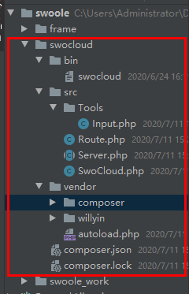
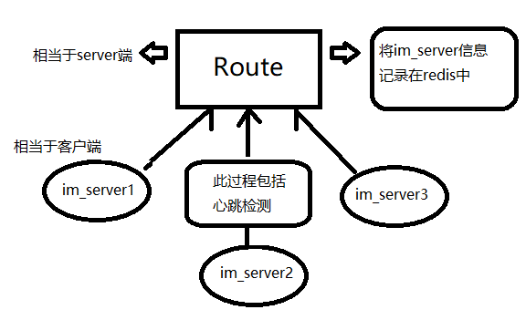
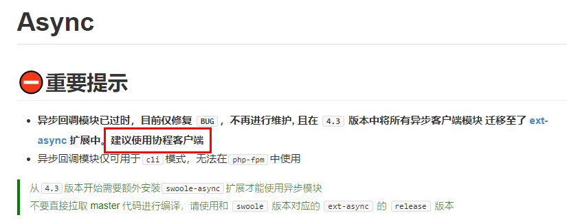
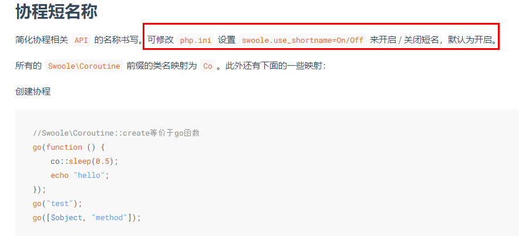
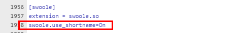
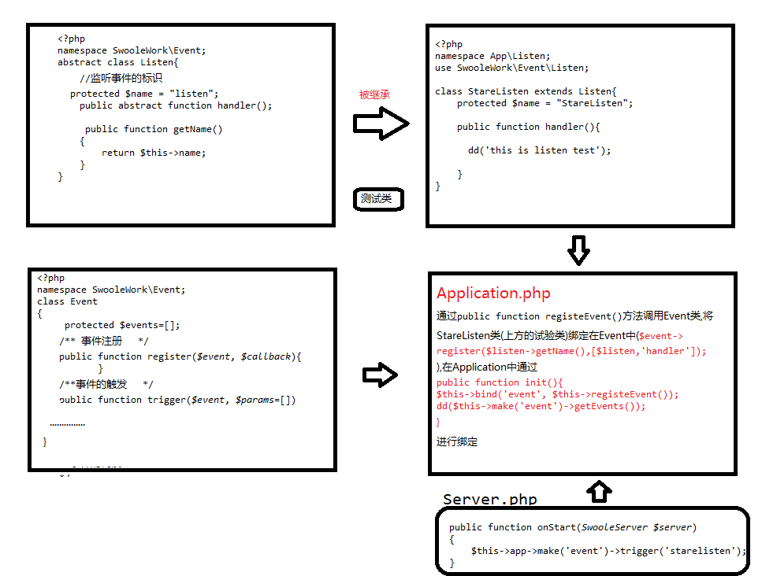
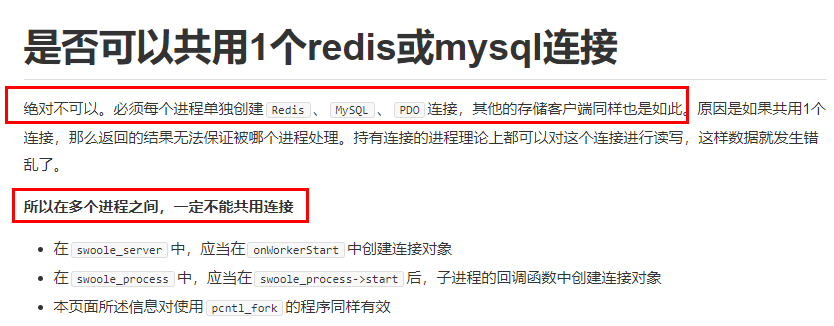
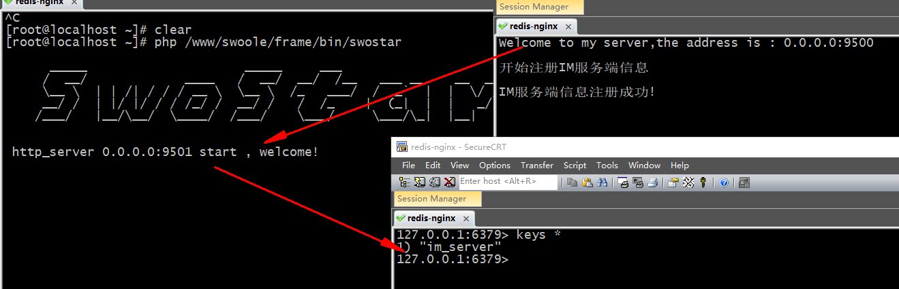
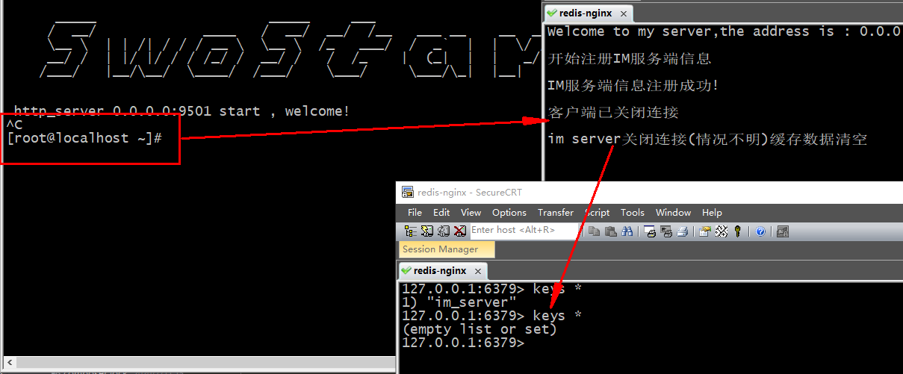

# IM通信之Route构建与server状态检测
目录结构


## 1.准备工作
````
------------------------------------------------------------composer.json-------------------------------------------------------------
{
    "name": "willyin/swocloud",
    "description": "this is IM frame",
    "type": "library",
    "authors": [
        {
            "name": "will",
            "email": "826895143@qq.com"
        }
    ],
    "require": {
        "willyin/swoole_work": "dev-master"
    },
    "repositories": {
        "will": {
            "type": "path",
            "url": "../swoole_work"
        }
    },
    "autoload": {
        "psr-4": {
            "SwoCloud\\":"src/"
        }
    }
}
执行  composer update
------------------------------------------------------------Server.php-------------------------------------------------------------
<?php
namespace SwoCloud;
use Swoole\Server as SwooleServer;
/**
 * 所有服务的父类， 写一写公共的操作
 */
abstract class Server
{
// 属性
    /**
     *
     * @var Swoole/Server
     */
    protected $swooleServer;
    protected $port = 9500;
    protected $host = "0.0.0.0";
    protected $watchFile = false;
    /**
     * 这是swoole服务的配置
     * @var [type]
     */
    protected $config = [
        'task_worker_num' => 0,
    ];
    /**
     * 注册的回调事件
     * [
     * // 这是所有服务均会注册的时间
     * "server" => [],
     * // 子类的服务
     * "sub" => [],
     * // 额外扩展的回调函数
     * "ext" => []
     * ]
     *
     * @var array
     */
    protected $event = [
    // 这是所有服务均会注册的时间
        "server" => [
    // 事件 =》 事件函数
            "start" => "onStart",
            "managerStart" => "onManagerStart",
            "managerStop" => "onManagerStop",
            "shutdown" => "onShutdown",
            "workerStart" => "onWorkerStart",
            "workerStop" => "onWorkerStop",
            "workerError" => "onWorkerError",
        ],
    // 子类的服务
        "sub" => [],
    // 额外扩展的回调函数
    // 如 ontart等
        "ext" => []
    ];
    public function __construct()
    {
    // 1. 创建 swoole server
        $this->createServer();
    // 3. 设置需要注册的回调函数
        $this->initEvent();
    // 4. 设置swoole的回调函数
        $this->setSwooleEvent();
    }
    /**
     * 创建服务
     */
    protected abstract function createServer();
    /**
     * 初始化监听的事件
     */
    protected abstract function initEvent();
    // 通用的方法
    public function start()
    {
    // 2. 设置配置信息
        $this->swooleServer->set($this->config);
    // 5. 启动
        $this->swooleServer->start();
    }
    /**
     * 设置swoole的回调事件
     */
    protected function setSwooleEvent()
    {
        foreach ($this->event as $type => $events) {
            foreach ($events as $event => $func) {
                $this->swooleServer->on($event, [$this, $func]);
            }
        }
    }
    // 回调方法
    public function onStart(SwooleServer $server)
    {
    }
    public function onManagerStart(SwooleServer $server)
    {
    }
    public function onManagerStop(SwooleServer $server)
    {
    }
    public function onShutdown(SwooleServer $server)
    {
    }
    public function onWorkerStart(SwooleServer $server, int $worker_id)
    {
    }
    public function onWorkerStop(SwooleServer $server, int $worker_id)
    {
    }
    public function onWorkerError(SwooleServer $server, int $workerId, int $workerPid, int $exitCode, int $signal)
    {
    }
    // GET | SET
    /**
     * @param array
     *
     * @return static
     */
    public function setEvent($type, $event)
    {
    // 暂时不支持直接设置系统的回调事件
        if ($type == "server") {
            return $this;
        }
        $this->event[$type] = $event;
        return $this;
    }
    /**
     * @return array
     */
    public function getConfig(): array
    {
        return $this->config;
    }
    /**
     * @param array $config
     *
     * @return static
     */
    public function setConfig($config)
    {
        $this->config = array_map($this->config, $config);
        return $this;
    }
    public function watchFile($watchFile)
    {
        $this->watchFile = $watchFile;
    }
}
------------------------------------------------------------Route.php-------------------------------------------------------------
这里的路由不是理解中的路由,实则就是一个服务

<?php
/**
 * Create By: Will Yin
 * Date: 2020/7/11
 * Time: 15:19
 **/
namespace SwoCloud;
use Swoole\Server as SwooleServer;
use Swoole\WebSocket\Server as SwooleWebSocketServer;
use Swoole\Http\Request as SwooleRequest;
use Swoole\Http\Response as SwooleResponse;
/**
 * 1. 检测IM-server的存活状态
 * 2. 支持权限认证
 * 3. 根据服务器的状态，按照一定的算法，计算出该客户端连接到哪台IM-server，返回给客户端，客户端再去连接到对应的服务端,保存客户端与IM-server的路由关系
 * 4. 如果 IM-server宕机，会自动从Redis中当中剔除
 * 5. IM-server上线后连接到Route，自动加 入Redis(im-server ip:port)
 * 6. 可以接受来自PHP代码、C++程序、Java程序的消息请求，转发给用户所在的IM-server
 * 7. 缓存服务器地址，多次查询redis
 *
 * 是一个websocket
 */
class Route extends Server
{
    public function onOpen(SwooleServer $server, $request) {
        dd("onOpen");
    }
    public function onMessage(SwooleServer $server, $frame) {
        dd('onMessage');
    }
    public function onClose(SwooleServer $ser, $fd) {
        dd("onClose");
    }
    public function onRequest(SwooleRequest $request, SwooleResponse $response){
    }
    protected function initEvent(){
        $this->setEvent('sub', [
            'request' => 'onRequest',
            'open' => "onOpen",
            'message' => "onMessage",
            'close' => "onClose",
        ]);
    }
    public function createServer()
    {
        $this->swooleServer = new SwooleWebSocketServer($this->host, $this->port);
        echo "Welcome to my server,the address is : ".$this->host.":".$this->port;
    }
}
------------------------------------------------------------SwoCloud.php-------------------------------------------------------------
类似于swoole_work中的application

namespace SwoCloud;
class SwoCloud
{
    public function run()
    {
        $routeServer = new Route();
        $routeServer->start();
    }
}
------------------------------------------------------------swoclou-------------------------------------------------------------
<?php
require_once dirname(__DIR__).'/vendor/autoload.php';
(new \SwoCloud\SwoCloud(dirname(__DIR__)))->run();
------------------------------------------------------------运行结果.-------------------------------------------------------------
[root@localhost bin]# php swocloud 
Welcome to my server,the address is : 0.0.0.0:9500
````
## 2. IM-Server启动自动连接Route
首先我们需要知道IM-Server如何主动去注册到Route服务器中，实际上就是在IM-Server中再启动swoole服务的时候就会请求Route的服务，并进行注册；那么这个IM-Server相对于Route来说就是一个客户端；同时还需要做的间断性的发送信息，以保持来接,这里就应该做成一个异步的任务；

### 2.1 关于[onStart](https://wiki.swoole.com/#/server/events?id=onstart) [onManagerStart](https://wiki.swoole.com/#/server/events?id=onmanagerstart)  [onWorkerStart](https://wiki.swoole.com/#/server/events?id=onworkerstart)
- onStart 启动后在主进程（master）的主线程回调此函数
- onManagerStart当管理进程启动时触发此事件
- onWorkerStart此事件在 Worker 进程 / Task 进程启动时发生，这里创建的对象可以在进程生命周期内使用。(每创建一个工作进程都会执行一次)



>以上过程我们选择在``onStart``中进行,因为要保持心跳的检测,所以此时的``onStart``过程就不应该是阻塞的



>所以这里我们需要借助[协程客户端](https://wiki.swoole.com/#/client_init)帮助我们实现功能




### 2.2 代码实现
````
[root@localhost ~]# vim server.php 
<?php
go(function () {
    co::sleep(0.5);
    echo "hello";
});
---------------------------------------
[root@localhost ~]# php server.php 
hello
````

加入服务端
````
------------------------------------------------------------Server.php-------------------------------------------------------------
<?php
namespace SwoCloud;
//借助swoole的协程客户端帮助我们完善服务端的异步请求任务
use Swoole\Coroutine;

abstract class Server
{
     public function onStart(SwooleServer $server)
     {
         Coroutine::create(function(){
             $cli = new \Swoole\Coroutine\Http\Client('0.0.0.0', 9500);
             $ret = $cli->upgrade("/");
             //向 WebSocket 服务器推送消息。
             $cli->push('1');
             $cli->close();
         });
     }
}
------------------------------------------------------------Route.php-------------------------------------------------------------
<?php
namespace SwoCloud;
class Route extends Server
{
    public function onOpen(SwooleServer $server, $request) {
        dd("onOpen");
    }
    public function onMessage(SwooleServer $server, $frame) {
        dd('onMessage');
    }
    public function onClose(SwooleServer $ser, $fd) {
        dd("onClose");
    }
}
------------------------------------------------------------结果-------------------------------------------------------------
[root@localhost swocloud]# php bin/swocloud 
Welcome to my server,the address is : 0.0.0.0:9500
======>>>  start
onOpen
======>>>  end
======>>>  start
onMessage
======>>>  end
======>>>  start
onClose
======>>>  end
````
## 3. swoole_work集成事件处理
事件本质：首先来一个事件对象用于记录事件，通过标识和方法的方式记录；而在框架中会在特定的地方写好事件的触

``swoole_work\src\Event\Event.php``
````
<?php
/**
 * Create By: Will Yin
 * Date: 2020/7/11
 * Time: 17:16
 **/
namespace SwooleWork\Event;
class Event
{
    /**
     * 事件的记录参数
     * [
     * 'event.flag' => [
     * 'callback' => Closure
     * ]
     * ]
     * @var array
     */
    protected $events=[];
    /**
     * 事件注册
     * @param string $event 事件标识
     * @param \Closure $callback 事件回调
     */
    public function register($event, $callback){
        $event=strtolower($event); //不区分大小写
    //var_dump($event,'注册');
        if(!isset($this->events[$event])){
            $this->events[$event]=[];
        }
        $this->events[$event]=['callback' => $callback];
    }
    /**
     * 事件的触发
     * @param string $event 事件标识
     * @param array $params 事件参数
     * @return boolean 执行结果
     */
    public function trigger($event, $params=[]){
        $event=strtolower($event);
        if(isset($this->events[$event])){
            ($this->events[$event]['callback'])(...$params);
            return true;
        }
        return false;
    }
    public function getEvents($event = null)
    {
        return empty($event) ? $this->events : $this->events[$event];
    }

}
------------------------------------------------------Listen/php-------------------------------------------------
封装一个父类,方便继承

<?php
namespace SwooleWork\Event;
abstract class Listen{
    //监听事件的标识
    protected $name = "listen";
    public abstract function handler();

    /**
     * [方法名: ]
     * @param
     * @return
     */
    public function getName()
    {
        return $this->name;
    }
}
------------------------------------------------------Listen/php-------------------------------------------------
测试类,继承上方的Listen.php

<?php
namespace App\Listen;
use SwooleWork\Event\Listen;

class StareListen extends Listen{
    protected $name = "StareListen";

    public function handler(){

      dd('this is listen test');

    }
}
------------------------------------------------------Application.php-------------------------------------------------
<?php
namespace SwooleWork\Foundation;
use SwooleWork\Container\Container;
use SwooleWork\Event\Event;

class Application extends Container
{   
    //初始化 (路由)
    public function init()
    {
        //将注册的路由绑定进来
        $this->bind('route', Route::getInstance()->registerRoute());
        $this->bind('event', $this->registeEvent());
        //进行打印测试
        //dd(Route::getInstance()->registerRoute()->getRoutes());
        dd($this->make('event')->getEvents());
    }
    /**设置event事件
     * [方法名: ]
     * @param
     * @return
     */
    public function registeEvent()
    {
        $event = new Event();
        $file = scandir($this->getBasePath()."/app/Listen");
        foreach ($file as $key => $val) {
            if($val === '.' || $val === '..'){
                  continue;
            }
            //$val = StareListen.php
            $class = 'App\\Listen\\'.explode('.',$val)[0];
            if(class_exists($class)){
                $listen = new $class;
                $event->register($listen->getName(),[$listen,'handler']);
            }
        }
        return $event;
    }
}
------------------------------------------------------结果-------------------------------------------------
[root@localhost ~]# php /www/swoole/frame/bin/swostar 
======>>>  start
array (
  'starelisten' => 
  array (
    'callback' => 
    array (
      0 => 
      App\Listen\StareListen::__set_state(array(
         'name' => 'StareListen',
      )),
      1 => 'handler',
    ),
  ),
)======>>>  end

      _____                     _____     ___
     /  __/             ____   /  __/  __/  /__   ___ __    __  __
     \__ \  | | /| / / / __ \  \__ \  /_   ___/  /  _`  |  |  \/ /
     __/ /  | |/ |/ / / /_/ /  __/ /   /  /_    |  (_|  |  |   _/
    /___/   |__/\__/  \____/  /___/    \___/     \___/\_|  |__|
    
http_server 0.0.0.0:9501 start
````
过程详解



## 4.Route实现对im-server的存活状态检测
>对于Route检测IM-server的存活状态，流程就是im-server启动-》请求route服务-》接收放到redis中；然后定时判断状态，不在了就清空redis

### 4.1 问题注意

````
$serv = new swoole_server("0.0.0.0", 9502);

//必须在onWorkerStart回调中创建redis/mysql连接
$serv->on('workerstart', function($serv, $id) {
    $redis = new redis;
    $redis->connect('127.0.0.1', 6379);
    $serv->redis = $redis;
});

$serv->on('receive', function (swoole_server $serv, $fd, $from_id, $data) { 
    $value = $serv->redis->get("key");
    $serv->send($fd, "Swoole: ".$value);
});

$serv->start();
````

### 4.2 完整代码
````
------------------------------------------------------App\ListenStareListen.php---------------------------------------------------------------------------

首先将 SwoCloud\Server onStart方法中的协程客户端摘除到 App\Listen\StareListen 被监听的文件中,当 swoole_work 中的服务端情动即可直接向 
SwoCloud\Server 中的 Route 直接发送协程客户端请求

<?php
/**
 * Create By: Will Yin
 * Date: 2020/7/11
 * Time: 21:36
 **/
namespace App\Listen;
use SwooleWork\Event\Listen;
use Swoole\Coroutine;

class StareListen extends Listen{

    protected $name = "StareListen";

//public function handler(){
//Coroutine::create(function(){
//$cli = new \Swoole\Coroutine\Http\Client('0.0.0.0', 9500);
// $ret = $cli->upgrade("/");
////向 WebSocket 服务器推送消息。
///*
//* PHP Warning:  Swoole\Coroutine\Http\Client::push(): websocket handshake failed, cannot push data in /www/swoole/frame/app/Listen/StareListen.php on line 28
//            Warning: Swoole\Coroutine\Http\Client::push(): websocket handshake failed, cannot push data in /www/swoole/frame/app/Listen/StareListen.php on line 28
//
//出现以上报错信息,是因为传递参数格式不正确,这里我们直接传递一个常量
//*/
//define("GREETING", "wiilyin");
//$cli->push(GREETING);
//$cli->close();
//});
//}

    public function handler()
    {
        Coroutine::create(function(){
            $cli = new \Swoole\Coroutine\Http\Client('0.0.0.0', 9500);
            $ret = $cli->upgrade("/"); //升级的websockt
            if ($ret) {
                $data=[
                    'method' =>'register', //方法
                    'serviceName'=>'IM_1',
                    'ip' =>'192.168.100.153',
                    'port' => 9000  //这里的端口可以随机填写,方便记录
                ];
                $cli->push(json_encode($data));
                //心跳处理
                swoole_timer_tick(3000,function ()use($cli){
                    if($cli->errCode==0){
                        $cli->push('',WEBSOCKET_OPCODE_PING); //
                    }
                });
            }
        });
    }
}
------------------------------------------------------SwoCloud\Route.php---------------------------------------------------------------------------

在Route.php中添加 protected $serverKey protected $redis protected $dispatcher 属性 添加 onWorkerStart getDispatcher getRedis 
getServerKey 方法,这里当 swoole_work 的协程客户端发送过来消息后,开启redis,将发送过来的data数据记录在redis中(这里为了简洁将所有关于
redis的操作全部放置在Dispatcher.php中执行)

<?php
/**
 * Create By: Will Yin
 * Date: 2020/7/11
 * Time: 15:19
 **/
namespace SwoCloud;
use Swoole\Server as SwooleServer;
use Swoole\WebSocket\Server as SwooleWebSocketServer;
use Swoole\Http\Request as SwooleRequest;
use Swoole\Http\Response as SwooleResponse;
use Redis;

class Route extends Server
{
    protected $serverKey = 'im_server';
    protected $redis = null;
    protected $dispatcher = null;

    public function onWorkerStart(SwooleServer $server, $worker_id)
    {
        $this->redis = new Redis;
        $this->redis->pconnect("172.10.0.2", 6379);
    }

    public function onOpen(SwooleServer $server, $request) {

    }
    public function onMessage(SwooleServer $server, $frame) {
       //  if(($frame->fd)!=1){
       //      echo "第".(($frame->fd)-1)."连接进来\n";
       //  }
        //dd($frame->fd);
        $data = \json_decode($frame->data, true);
        $fd = $frame->fd;
        $this->getDispatcher()->{$data['method']}($this, $server, ...[$fd, $data]);
    }
    public function onClose(SwooleServer $ser, $fd) {
        echo ("\n客户端已关闭连接\n");
    }
    public function onRequest(SwooleRequest $request, SwooleResponse $response){
    }
    protected function initEvent(){
        $this->setEvent('sub', [
            'request' => 'onRequest',
            'open' => "onOpen",
            'message' => "onMessage",
            'close' => "onClose",
        ]);
    }
    public function createServer()
    {
        $this->swooleServer = new SwooleWebSocketServer($this->host, $this->port);
        echo "Welcome to my server,the address is : ".$this->host.":".$this->port."\n";
    }

    public function getDispatcher()
    {
        if (empty($this->dispatcher)) {
            $this->dispatcher = new Dispatcher;
        }
        return $this->dispatcher;
    }

    public function getRedis()
    {
        return $this->redis;
    }
    public function getServerKey()
    {
        return $this->serverKey;
    }
}
------------------------------------------------------SwoCloud\Dispatcher.php---------------------------------------------------------------------------
<?php
/**
 * Create By: Will Yin
 * Date: 2020/7/12
 * Time: 20:55
 **/
namespace SwoCloud;
use Swoole\Server as SwooleServer;
use Redis;

class  Dispatcher
{
    public function register(Route $route,SwooleServer $server, $fd, $data)
    {
        echo "\n开始注册IM服务端信息\n";
        $serverKey = $route->getServerKey();
        // 把服务端的信息记录到redis中
        $redis = $route->getRedis();
        $value = \json_encode([
            'ip' => $data['ip'],
            'port' => $data['port'],
        ]);
       $res =  $redis->sadd($serverKey, $value);
       if($res){
           echo "\nIM服务端信息注册成功!\n";
       }
        // 这里是通过触发定时判断，不用heartbeat_check_interval 的方式检测
        // 是因为我们还需要主动清空，redis 数据
        //
        // $timer_id 定时器id
        $server->tick(3000, function($timer_id, Redis $redis,SwooleServer $server, $serverKey, $fd, $value){
        // 判断服务器是否正常运行，如果不是就主动清空
        // 并把信息从redis中移除
            if (!$server->exist($fd)) {
                $redis->srem($serverKey, $value);
                $server->clearTimer($timer_id);
                echo PHP_EOL;
                echo('im server关闭连接(情况不明)缓存数据清空');
                echo PHP_EOL;
            }
        }, $redis, $server, $serverKey, $fd, $value);
    }

}
````





