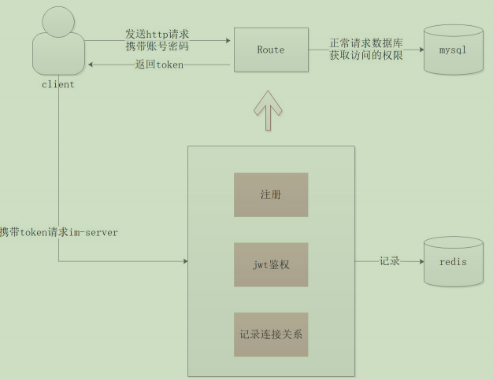
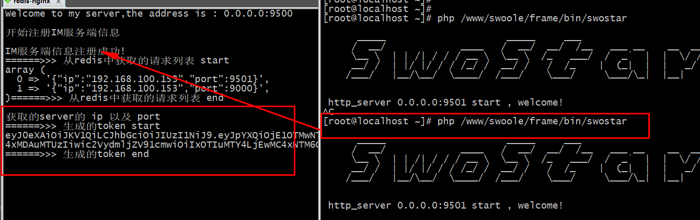
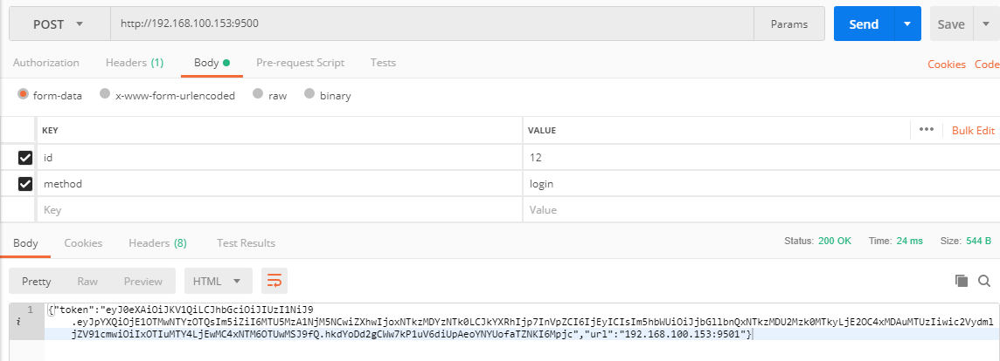
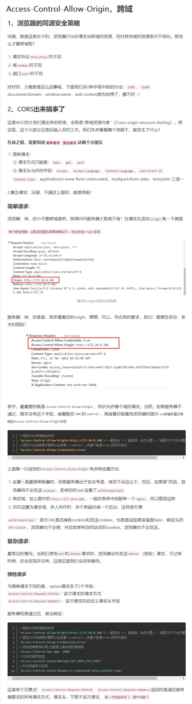
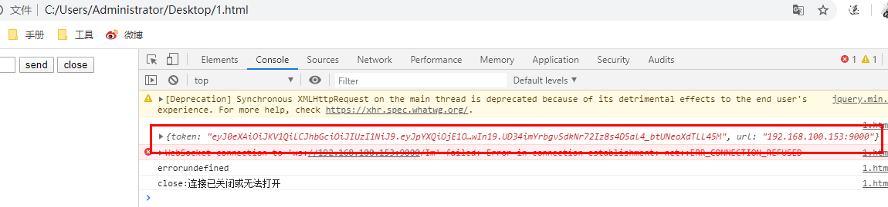
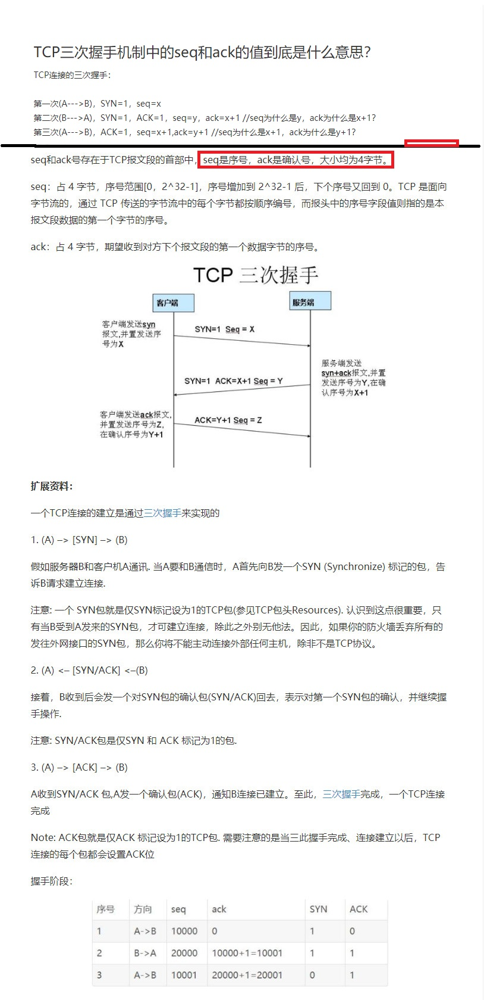

# IM通信之客户端认证
## 1.Route认证校验
Route主要是针对于客户端，客户端在访问Route之后可以等到一个token，然后呢；客户端根据这个token请求服务端，也就是im-server来进行token的权限认真(正常应该是请求mysql数据库，从数据库校验用户的密码和账号,这里我们省略)
### 1.1 流程说明

- Route服务先启动，IM-Server服务启动并加载信息到Route中
- 用户以http方式请求Route，去登入
- Route进行用户的信息校验，分发token给客户端
- 客户端根据token请求IM-Server服务器
- IM-Server会进行jwt的鉴定，如果ok就与客户端建立连接
### 1.2. Route构建login方法
因为对于用户端来说访问是根据http的方式访问，因此我们需要对于onrequest的回调函数进行完善
````
---------------------------------------------------SwoCloud/Route.php---------------------------------------------------

这里设置跨域请求头，因为我们的操作过程中可能会存在跨域的情况

class Route
{
    public function onRequest(SwooleRequest $swooleRequest, SwooleResponse $swooleResponse)
    {
        //解决Chrome两次请求的问题
        if ($request->server['path_info'] == '/favicon.ico' || $request->server['request_uri'] == '/favicon.ico') {
            $response->end();
            return;
        }

         //解决跨域请求的问题\
        //允许请求的地址
        $swooleResponse->header('Access-Control-Allow-Origin',"*");
        //允许的请求方式
        $swooleResponse->header('Access-Control-Allow-Methods',"GET,POST,OPTIONS");

        // 根据方法类型分发处理业务
        $this->getDispatcher()->{$swooleRequest->post['method']}($this, $swooleRequest, $swooleResponse);
    }
}
---------------------------------------------------SwoCloud/Dispatcher.php---------------------------------------------------
<?php
/**
 * Create By: Will Yin
 * Date: 2020/7/12
 * Time: 20:55
 **/
namespace SwoCloud;
use Swoole\Server as SwooleServer;
use Swoole\Http\Request as SwooleRequest;
use Swoole\Http\Response as SwooleResponse;
use Redis;

class  Dispatcher
{
    /**
     * 连接请求登入
     * @param Route $route
     * @param SwooleRequest $swooleRequest
     * @param SwooleResponse $swooleResponse
     */
    public function login(Route $route, SwooleRequest $swooleRequest, SwooleResponse $swooleResponse)
    {
        $data = $swooleRequest->post;
        // 用户账号和密码校验
        // 获取连接的服务器
        $server = \json_decode($this->getIMServer($route), true);
        dd($server, '获取的server');
        $url = $server['ip'].':'.$server['port'];
    }

    /**
     * 根据算法获取连接服务
     * @param Route $route
     * @return
     */
    protected function getIMServer(Route $route){
        // 从redis中读取信息
        $arr = $route->getRedis()->smembers($route->getServerKey());
        dd($arr, '从redis中获取的请求列表');
        if (!empty($arr)) {
        // 通过算法从中获取到连接的im-server
            return Arithmetic::{$route->getArithmetic()}($arr);
        }
        dd('获取服务器信息失败', 'getIMServer');
        return false;
    }
}
---------------------------------------------------SwoCloud\Tools\Arithmetic.php---------------------------------------------------

注意考虑到算法的扩展，因为实际上负载均衡的算法不止一个因此这里单独在扩展一个算法类

<?php
namespace SwoCloud\Tools;

//模拟轮询方式,进行一个负载均衡的算法(可自行添加其他算法如:hash)
class Arithmetic{

    //定义一个属性用于记忆每个服务端被访问的次数
    protected static $roundLastIndex = 0;

    /**
     * 轮询算法
     */
    public static function round(array $list){
        $currentIndex = self::$roundLastIndex;//当前index
        $url = $list[$currentIndex];
        if($currentIndex + 1 > count($list) - 1){
            self::$roundLastIndex=0;
        }else{
            self::$roundLastIndex++;
        }
        return $url; //返回当前url
    }
    /**
     * fun_name/fun_work:随机算法
     * @param
     * @param
     * @return
     */
    public function rand()
    {
        
    }
   //...其他算法
}
---------------------------------------------------SwoCloud\Route.php---------------------------------------------------
<?php
namespace SwoCloud;
use Swoole\Server as SwooleServer;
use Swoole\WebSocket\Server as SwooleWebSocketServer;
use Swoole\Http\Request as SwooleRequest;
use Swoole\Http\Response as SwooleResponse;
use Redis;
class Route extends Server
{
    protected $arithmetic = 'round';

    /**
     * fun_name/fun_work:获取负载均衡的算法
     * @param
     * @param
     * @return
     */
    public function getArithmetic()
    {
      return $this->arithmetic;
     }

    /**
     * fun_name/fun_work:设置负载负载均衡的算法
     * @param
     * @param
     * @return
     */
    public function setArithmetic($arithmetic)
    {
        if($arithmetic){
          $this->arithmetic = $arithmetic;
        }
         return $this;
    }
}

````
### 1.3 [jwt校验](https://www.cnblogs.com/cjsblog/p/9277677.html)
在swocloud中执行执行命令:``composer require firebase/php-jwt``

手册：https://github.com/firebase/php-jwt

````
---------------------------------------------------SwoCloud\Route.php---------------------------------------------------
public function onRequest(SwooleRequest $swooleRequest, SwooleResponse $swooleResponse){
        //解决Chrome两次请求的问题
        if ($swooleRequest->server['path_info'] == '/favicon.ico' || $swooleRequest->server['request_uri'] == '/favicon.ico') {
            $swooleResponse->end();
            return;
        }
        //解决跨域请求的问题\
        //允许请求的地址
        $swooleResponse->header('Access-Control-Allow-Origin',"*");
        //允许的请求方式
        $swooleResponse->header('Access-Control-Allow-Methods',"GET,POST,OPTIONS");

        // 根据方法类型分发处理业务
        $this->getDispatcher()->{$swooleRequest->post['method']}($this, $swooleRequest, $swooleResponse);
    }
---------------------------------------------------SwoCloud\Dispatcher.php---------------------------------------------------
<?php
namespace SwoCloud;
use SwoCloud\Tools\Arithmetic;
use Swoole\Server as SwooleServer;
use Swoole\Http\Request as SwooleRequest;
use Swoole\Http\Response as SwooleResponse;
use Redis;

class  Dispatcher
{
    /**
     * 连接请求登入
     * @param Route $route
     * @param SwooleRequest $swooleRequest
     * @param SwooleResponse $swooleResponse
     */
    public function login(Route $route, SwooleRequest $swooleRequest, SwooleResponse $swooleResponse)
    {
        //这里写死成post请求的方式
        $data = $swooleRequest->post;
        // 用户账号和密码校验
        // 获取连接的服务器
        $server = \json_decode($this->getIMServer($route), true);

       echo(PHP_EOL.'获取的server的 ip 以及 port'.PHP_EOL);

        $url = $server['ip'].':'.$server['port'];
        // 生成token
        $token = $this->getJwtToken($server['ip'], $data['id'], $url);
        dd($token, '生成的token');
        $swooleResponse->end(\json_encode(['token' => $token,'url' => $url]));
    }

    /**
     * 根据算法获取连接服务
     * @param Route $route
     * @return 返回通过负载均衡算法得到的服务端
     */
    protected function getIMServer(Route $route){
        // 从redis中读取信息
        $arr = $route->getRedis()->smembers($route->getServerKey());
        dd($arr, '从redis中获取的请求列表');
        if (!empty($arr)) {
        // 通过算法从中获取到连接的im-server
            return Arithmetic::{$route->getArithmetic()}($arr);
        }
        dd('获取服务器信息失败', 'getIMServer');
        return false;
    }

    /**
     * fun_name/fun_work:用户请求获取token字段
     * @param $sid 服务端id
     * @param $uid 用户id
     * @param $url 服务端地址
     * @return 用户表信息经过token的加密字段
     */
    protected function getJwtToken($sid = null, $uid = null, $url = null){
        // iss: jwt签发者
        // sub: jwt所面向的用户
        // aud: 接收jwt的一方
        // exp: jwt的过期时间，这个过期时间必须要大于签发时间
        // nbf: 定义在什么时间之前，该jwt都是不可用的
        // iat: jwt的签发时间
        // jti: jwt的唯一身份标识，主要用来作为一次性token,从而回避重放攻击
        $key = "swocloud";
        $time = time();
        $token = [
            //"iss" => "http://192.168.100.153",// 可选参数
            //"aud" => "http://192.168.100.146",// 可选参数
            "iat" => $time, //签发时间
            "nbf" => $time, //生效时间
            "exp" => $time + 7200, //过期时间2个小时
            'data' => [
                'uid' => $uid, //用户的id
                'name' => 'client'.$time.$sid,// 用户名
                'service_url' => $url //服务器的地址
            ]
        ];

        /*
         *这里省略了数据库的信息校验过程
        */

        return \Firebase\JWT\JWT::encode($token, $key);
    }
}
````




#### 1.3.1关于跨域


通过html页面请求
````
---------------------------------------------------SwoCloud\Route.php---------------------------------------------------
public function onRequest(SwooleRequest $swooleRequest, SwooleResponse $swooleResponse){
        //解决跨域请求的问题\
        //允许请求的地址
        $swooleResponse->header('Access-Control-Allow-Origin',"*");
        //允许的请求方式
        $swooleResponse->header('Access-Control-Allow-Methods',"GET,POST,OPTIONS");
    }
---------------------------------------------------SwoCloud\Route.php---------------------------------------------------
<!doctype html>
<html lang="en">
<head>
    <meta charset="UTF-8">
    <meta name="viewport" content="width=device-width,initial-scale=1, maximum-scale=1, user-scalable=no">
    <title>websocket</title>
    <script src="http://libs.baidu.com/jquery/2.0.0/jquery.min.js"></script>
</head>
<body>
<input id="text" value="">
<input type="submit" value="send" onclick="start()">
<input type="submit" value="close" onclick="close()">
<div id="msg"></div>
<script>
    // jquery的弹窗输入
    let id=prompt('输入id用于测试');
    let data;

    //设置为不为异步方式请求
    $.ajaxSettings.async = false;
    $.post('http://192.168.100.153:9500/',{method:'login',id:id},function(result){
        data=result;
        console.log(data);
    },"json");
</script>
````


检测负载均衡可以在本服务器中复制完成的代码,修改以下swoole_work中的端口,进行检测,这里就就不做测试了
## 2. IM通信之消息确认
### 2.1 消息确认
在当前的情况下我们无法直接确定是否消息可靠，因为消息在传输过程可能会存在这网络问题，因此我们就需要消息的确认机制、重试机制。
在消息发送给接收端的时候，如果消息接收端未确认，将进行有限重试，或者对于客户端允许主动重试，对于消息序号的记录使用共享内存的方式；
- 确认机制：用于对消息发送的结果进行确认
- 重试机制：对于没有发送成功的消息尝试重复; 有限重试：是指不会无限制的尝试重复发送可能是3次，4次；
- 消息序号：主要是因为相互之间消息可能会发送很多，所以会存在消息的序号来做标记；
### 2.2 swoole对worker进程任务投递的方式
需要清楚的是php的进程是隔离的，相互之间的内存是不共享的；但是有些时候也需要我们来了解一下swoole是如何对数据包投递给worker进程的
- 无状态：如果进程在当前连接与上一次连接没关系
- 有状态：如果进程在当前连接与上一次连接有关系，比如我们的框架因为我们做了一个上下文
### 2.3 [swoole table介绍](https://wiki.swoole.com/#/memory/table)
swoole对于共享内存的存储方式是类似于数据表的方式存储的，会设立相应的标识，类型，大小；值得注意的是table在创建之前也是需要分配大小；然后swoole就会通过c去内存空间申请空间；
## 3. 关于ack

## 4. 体验 [swoole_process](https://wiki.swoole.com/#/process)


用于代替用来替代 PHP 的 pcntl
````
use Swoole\Process;
for ($n = 1; $n <= 3; $n++) {
    $process = new Process(function () use ($n) {
        while(1){ }
        });
    //使用之前必须要执行启动命令
    $process->start();
}
while(1){ }
------------------------------------------------------------
结果:

[root@localhost ~]# pstree -apn | grep php
  |       |   `-php,71392 1.php
  |       |       |-php,71393 1.php
  |       |       |-php,71394 1.php
  |       |       `-php,71395 1.php
  |           `-grep,71397 --color=auto php
````
````
use Swoole\Process;

for ($n = 1; $n <= 3; $n++) {

    
    $process = new Process(function () use ($n) {
        //子进程空间
        echo 'Child #' . getmypid() . " start and sleep {$n}s" . PHP_EOL;
        sleep($n);
        echo 'Child #' . getmypid() . ' exit' . PHP_EOL;
    });

    //使用之前必须要执行启动命令
    $process->start();
}

//父进程空间
````

