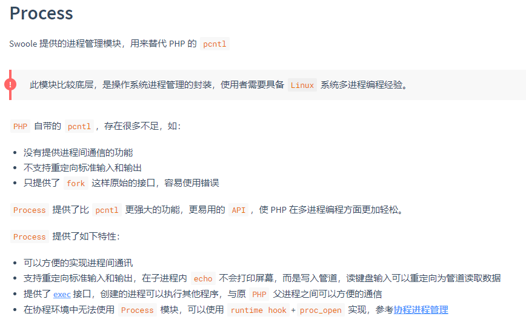
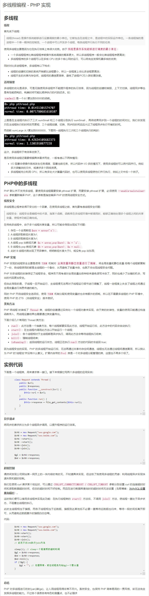
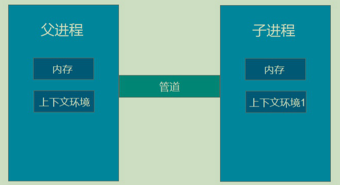
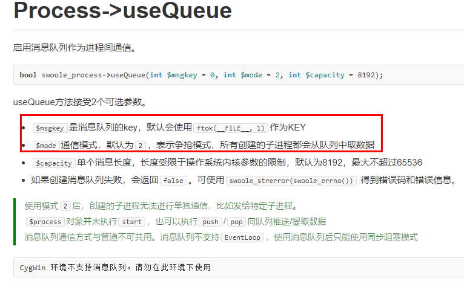
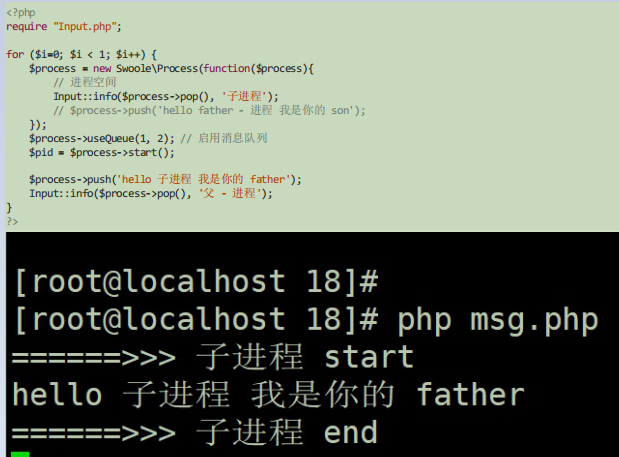
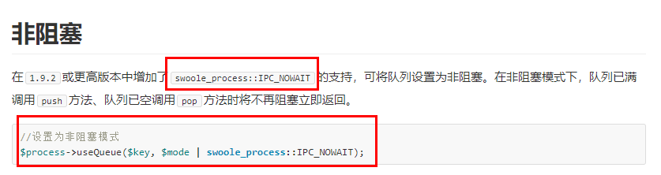
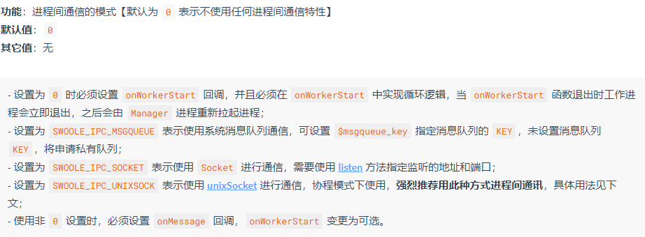
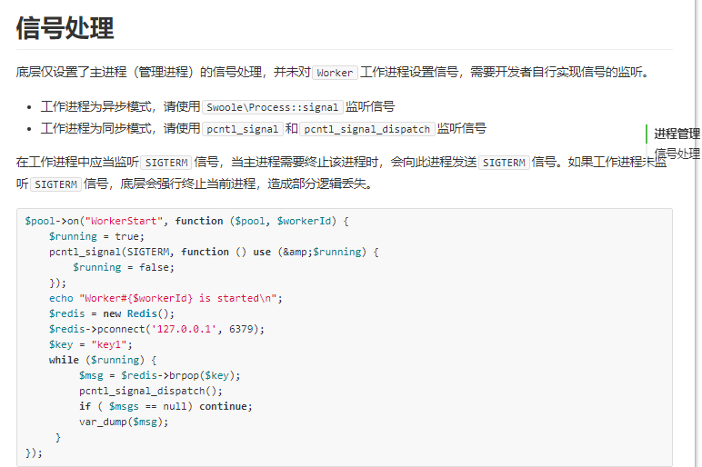

# 进程管理
- 主进程
>程序执行的入口，可以理解为常用的main 函数
- 父进程
>对于子进程而言， 子进程的创造者，可有多个子进程。 任何进程都有父进程，追根溯源是系统启动程序。对于我们一般写的程序，主进程是最初始的父进程。
## 1.process了解 [swoole_process](https://wiki.swoole.com/#/process)


用于代替用来替代 PHP 的 pcntl
### 1.1 语法
``Swoole\Process::__construct(callable $function, $redirect_stdin_stdout = false, $create_pipe = true)``
- $function，子进程创建成功后要执行的函数，底层会自动将函数保存到对象的callback属性上。如果希望更改执行的函数，可赋值新的函数到对象的callback属性
- $redirect_stdin_stdout，重定向子进程的标准输入和输出。启用此选项后，在子进程内输出内容将不是打印屏幕，而是写入到主进程管道。读取键盘输入将变为从管道中读取数据。默认为阻塞读取。
- $create_pipe，是否创建管道，启用$redirect_stdin_stdout后，此选项将忽略用户参数，强制为true。如果子进程内没有进程间通信，可以设置为 false

举例：
>假设前台给后台三组任务要求后台去执行，每个任务大概需要执行一秒的时间，我们利用多进程的形式去实现，让时间能够缩短

### 1.2 代码实现
````
use Swoole\Process;
for ($n = 1; $n <= 3; $n++) {
    $process = new Process(function () use ($n) {
        //子进程空间

        while(1){ }
        });

    //使用之前必须要执行启动命令
    $process->start();
    
    //父进程
}
while(1){ }
------------------------------------------------------------
结果:

[root@localhost ~]# pstree -apn | grep php
  |       |   `-php,71392 1.php
  |       |       |-php,71393 1.php
  |       |       |-php,71394 1.php
  |       |       `-php,71395 1.php
  |           `-grep,71397 --color=auto php
````
````
use Swoole\Process;

for ($n = 1; $n <= 3; $n++) {

    
    $process = new Process(function () use ($n) {
        //子进程空间
        echo 'Child #' . getmypid() . " start and sleep {$n}s" . PHP_EOL;
        sleep($n);
        echo 'Child #' . getmypid() . ' exit' . PHP_EOL;
    });

    //使用之前必须要执行启动命令
    $process->start();
}

//父进程空间
````
## 2. 进程间(process)通讯
### 2.1 说明
因为相对于进程来说线程实现的困难更大一些,而且会对内存造成加速现象,所以swoole对于线程没有过多的描述,这里我们也不过多的讨论,[关于线程](https://www.cnblogs.com/zhenbianshu/p/7978835.html)(感谢作者)


### 2.2 进程间的通讯
如果是非常``简单的多进程执行任务``，``那么进程间就不需要通讯了``，实际情况下，很多业务是需要通讯的，比如，发邮件，如果子进程发送失败了，那么是要通知主进程的等等，我们在之前在使用``task``的时候其实也是``使用了管道通讯``

swoole_process进程间支持2种通信方式：
- 管道通讯(pipe)
- 消息队列

### 2.3 进程间(process)管道通讯
- 半双工: 数据单向流动, 一端只读, 一端只写
- 同步 vs 异步: 默认为同步阻塞模式, 可以使用 swoole_event_add() 添加管道到 swoole 的 event loop 中, 实现异步IO



管道通信是swoole_process默认的一种通信方式。当然我们也可以在实例化的时候通过参数来设定：``$process = new Swoole\Process('callback_function', false, true);``
>如果我们打印$process会发现，每次创建一个进程后，就会随之创建一个管道，主进程想和哪一个进程通信，就向那个进程的管道写入/读取数据。


````
<?php
for ($i=0; $i < 3; $i++) {
    $process = new Swoole\Process(function(){
        // 进程空间
        while (true) {
            sleep(1);
        }
    }, false, true);

    $process->start();
    var_dump($process);
}

while (true) {
    sleep(1);
}
---------------------------------------------------结果------------------------------------
[root@localhost ~]# php test.php          
object(Swoole\Process)#1 (6) {
  ["pipe"]=>
  int(4)
  ["msgQueueId"]=>
  NULL
  ["msgQueueKey"]=>
  NULL
  ["pid"]=>
  int(72781)
  ["id"]=>
  NULL
  ["callback":"Swoole\Process":private]=>
  object(Closure)#2 (0) {
  }
}
object(Swoole\Process)#3 (6) {
  ["pipe"]=>
  int(6)
  ["msgQueueId"]=>
  NULL
  ["msgQueueKey"]=>
  NULL
  ["pid"]=>
  int(72782)
  ["id"]=>
  NULL
  ["callback":"Swoole\Process":private]=>
  object(Closure)#4 (0) {
  }
}
object(Swoole\Process)#1 (6) {
  ["pipe"]=>
  int(4)
  ["msgQueueId"]=>
  NULL
  ["msgQueueKey"]=>
  NULL
  ["pid"]=>
  int(72783)
  ["id"]=>
  NULL
  ["callback":"Swoole\Process":private]=>
  object(Closure)#2 (0) {
  }
}
````
#### 2.3.1 主进程向子进程中写入数据 write 与 read
````
<?php
function info($message, $description = null)
{
echo "======>>> ".$description." start\n";
if (\is_array($message)) {
echo \var_export($message, true);
} else if (\is_string($message)) {
echo $message."\n";
} else {
var_dump($message);
}
echo "======>>> ".$description." end\n";
}


for ($i=0; $i < 3; $i++) {
    $process = new Swoole\Process(function($process){
       info($process->read(), "读取到父进程传递的内容");
    }, false, true);

    $pid = $process->start();
    $process->write('hello 子进程'.$pid);
    info($process->read(), "读取到子进程内容");
}
while (true) {
sleep(1);
}
-----------------------------------------------------结果-------------------------------------
[root@localhost ~]# php test.php 
======>>> 读取到父进程传递的内容 start
hello 子进程72822
======>>> 读取到父进程传递的内容 end
````
注意默认数的读取是同步阻塞的，如果``子进程不写给父进程会阻塞``;
````
<?php
function info($message, $description = null)
{
echo "======>>> ".$description." start\n";
if (\is_array($message)) {
echo \var_export($message, true);
} else if (\is_string($message)) {
echo $message."\n";
} else {
var_dump($message);
}
echo "======>>> ".$description." end\n";
}

$worker = [];
for ($i=0; $i < 3; $i++) {
    $process = new Swoole\Process(function($process){
    // 进程空间
    info($process->read(), "读取到父进程传递的内容");
    }, false, true);

    $pid = $process->start();
    $worker[$pid] = $process;
    $process->write('hello 子进程'.$pid);
}

foreach ($worker as $key => $value) {
    info($process->read(), "读取到子进程内容");
}
------------------------------------------------------结果---------------------------------------
[root@localhost ~]# php test.php 
======>>> 读取到父进程传递的内容 start
hello 子进程72830
======>>> 读取到父进程传递的内容 end
======>>> 读取到父进程传递的内容 start
hello 子进程72831
======>>> 读取到父进程传递的内容 end
======>>> 读取到父进程传递的内容 start
hello 子进程72829
======>>> 读取到父进程传递的内容 end
````
#### 2.3.2 可以异步监听管道当中的数据，读事件的监听，当管道可读的时候触发
````
<?php
function info($message, $description = null)
{
echo "======>>> ".$description." start\n";
if (\is_array($message)) {
echo \var_export($message, true);
} else if (\is_string($message)) {
echo $message."\n";
} else {
var_dump($message);
}
echo "======>>> ".$description." end\n";
}

for ($i=0; $i < 3; $i++) {
    $process = new Swoole\Process(function($process){
        // 进程空间
        Input::info($process->read(), "读取到父进程传递的内容");
    }, false, true);

    $pid = $process->start();
    $worker[$pid] = $process;
    $process->write('hello 子进程'.$pid);

    swoole_event_add($process->pipe, function($pipe) use ($process){
         Input::info($process->read(), "读取到子进程内容");
    });
}
````
### 2.4 进程间(process)[消息队列](https://wiki.swoole.com/wiki/page/289.html)的通讯
>注意新版本的消息队列没有找到,文档来自于旧版本
>
>php中借助于``sysvmag``拓展来做的消息队列,再swoole中使用了``Process->useQueue``

消息队列:
- 一系列保存在内核中的消息链表
- 有一个 msgKey, 可以通过此访问不同的消息队列
- 有数据大小限制, 默认 8192 
- 阻塞 vs 非阻塞: 阻塞模式下 pop()空消息队列/push()满消息队列会阻塞, 非阻塞模式可以直接返回
swoole 中使用消息队列:
- 通信模式: 默认为``争抢模式``, ``无法将消息投递给指定子进程``
- ``新建消息队列后``, ``主进程就可以使用``
- ``消息队列不可和管道一起使用``, ``也无法使用 swoole event loop``


````
<?php
function info($message, $description = null)
{
echo "======>>> ".$description." start\n";
if (\is_array($message)) {
echo \var_export($message, true);
} else if (\is_string($message)) {
echo $message."\n";
} else {
var_dump($message);
}
echo "======>>> ".$description." end\n";
}


for ($i=0; $i < 1; $i++) {
    $process = new Swoole\Process(function($process){
        info($process->pop(), 'son');
        $process->push('this is son's space);
    });
    // 启用消息队列
    $process->useQueue(1, 2); 

    $process->push('this is father's space);

    //创建成功就可以输出子进程的pid
    $pid = $process->start();

    info($process->pop(),'father');
}
?>
----------------------------------------------------结果-----------------------------------
[root@localhost ~]# php test.php 
======>>> son start
this is fathers space
======>>> son end
======>>> father start
this is son space
======>>> father end
-------------------------------------------注意---------------------------------------------
[root@localhost ~]# php test.php 
======>>> son start
this is fathers space
======>>> son end
======>>> son start
this is son space
======>>> son end
======>>> father start
this is son space
======>>> father end
````
>这里有点需要注意的是，如果在父进程空间中，如果push在start之后那么 在父/子进程中的pop就会接收到自己push的内容,以为此时父/子进程读取的同一个消息队列

>另外在子进程数过多的时候读取内容也会因为读取同意消息队列发生混论的情况
````
for ($i=0; $i < 2; $i++) {
    $process = new Swoole\Process(function($process){
        info($process->pop(), 'son');
        $process->push('this is son's space);
    });
    // 启用消息队列
    $process->useQueue(1, 2); 

    $process->push('this is father's space);

    //创建成功就可以输出子进程的pid
    $pid = $process->start();

    info($process->pop(),'father');
}
------------------------------------------结果---------------------------------------
[root@localhost ~]# php test.php 
======>>> son start
this is fathers space
======>>> son end
======>>> son start
this is son space
======>>> son end
======>>> father start
this is son space
======>>> father end
======>>> father start
this is fathers space
======>>> father end
````
>解决办法,将父进程读取内容的时间延迟
````
for ($i=0; $i < 1; $i++) {
    $process = new Swoole\Process(function($process){
        $process->push("this is son's space");
        info($process->pop(), 'son');
    });
    // 启用消息队列
    $process->useQueue(1, 2); 

    $process->push("this is father's space");

    //创建成功就可以输出子进程的pid
    $pid = $process->start();

    sleep(2);
    info($process->pop(),'father');
}
--------------------------------------------------结果---------------------------------
[root@localhost ~]# php test.php 
======>>> father start
this is son space
======>>> father end
======>>> son start
this is fathers space
======>>> son end
````
>而如果在子进程中没有push则会在父进程中出现阻塞的情况；可以设置uesQueue为非阻塞``$process->useQueue(1, 2 | swoole_process::IPC_NOWAIT);``





#### 其次就是wait为[主进程回收子进程](https://wiki.swoole.com/#/process?id=wait)，创建几个子进程就需要回收几次
````
$workers = [];
$worker_num = 2;

for($i = 0; $i < $worker_num; $i++)
{
    $process = new swoole_process('callback_function', false, false);
    $process->useQueue();
    $pid = $process->start();
    $workers[$pid] = $process;
    //echo "Master: new worker, PID=".$pid."\n";
}

function callback_function(swoole_process $worker)
{
    //echo "Worker: start. PID=".$worker->pid."\n";
    //recv data from master
    $recv = $worker->pop();

    echo "From Master: $recv\n";

    sleep(2);
    $worker->exit(0);
}

foreach($workers as $pid => $process)
{
    $process->push("hello worker[$pid]\n");
}

for($i = 0; $i < $worker_num; $i++)
{
    $ret = swoole_process::wait();
    $pid = $ret['pid'];
    unset($workers[$pid]);
    echo "Worker Exit, PID=".$pid.PHP_EOL;
}
````
## 3. [进程池](https://wiki.swoole.com/#/process_pool)
进程池，基于Server的Manager模块实现。可管理多个工作进程。该模块的核心功能为进程管理，相比Process实现多进程，Process\Pool更加简单，封装层次更高，开发者无需编写过多代码即可实现进程管理功能。在实际项目中经常需要写一些长期运行的脚本，如基于redis、kafka、rabbitmq实现的多进程队列消费者，多进程爬虫...
### 3.1. 创建进程池
函数原型：
``function Process\Pool::__construct(int $worker_num, int $ipc_type = 0, int $msgqueue_key = 0)``

- $worker_num：指定工作进程的数量
- $ipc_type 进程间通信的模式，默认为0表示不使用任何进程间通信特性

- $msgqueue_key: 消息队列的 key
- $enable_coroutine: 是否开启协程支持【使用协程后将无法设置 onMessage 回调】

使用on方法设置WorkerStart即可在工作进程启动时执行指定的代码，可以在这里进行while(true)循环从redis队列中获取任务并处理。使用start方法启动所有进程，管理器开始进入wait状态。

设置进程池回调函数：``function Process\Pool::on(string $event, callable $function);``

``消息接收：这里需要注意处理，做拆包的处理，因为是一次连接投递一次消息可能会有粘包的问题``

### 3.2 体验进程池
````
<?php
$workerNum = 5;
$pool = new Swoole\Process\Pool($workerNum);
$pool->on('WorkerStart', function($pool, $workerId){
    Input::info($workerId, '执行 worker # '.$workerId);
});
$pool->on('WorkerStop', function($pool, $workerId){
    Input::info($workerId, '关闭 close worker # '.$workerId);
});
$pool->start();
````
在测试的效果中会不断地执行workerStart，以及workerStop因为对于pool老师一个进程创建之后就会执行workerStart，而结束的时候就会执行workerStop，并且会一直维持指定个数，一个进程结束就会有一个新的进程创建,``值得注意的是如果我们直接kill了主进程，子进程就会成为孤儿进程
``
### 3.3 [进程池的信号处理](https://wiki.swoole.com/wiki/page/908.html)
>以下为同步信号处理的例子



这个方式比较适合于消息队列；生产者 -》 redis（队列） -》消费者

消费者消费方式：
- 主动通知
- 主动轮询

而redis在项目中运用的时候可能会因为网络的关系断开连接我们可以进行异常捕获然后重新连接
````
<?php
require "Input.php";
$workerNum = 2;
$pool = new Swoole\Process\Pool($workerNum);

$pool->on('WorkerStart', function($pool, $workerId){
    Input::info($workerId, '执行 worker # '.$workerId);
    $running = true;
    pcntl_signal(SIGTERM, function () use (&$running) {
        $running = false;
    });
    $retryLimit = 3;
    $reties = 0;
    RETRY:{
        try {
            $redis = new Redis();
            $redis->pconnect('127.0.0.1', 6379);
            $key = "key1";
            while ($running) {
                $msg = $redis->brPop($key , 0);
                Input::info($msg, '$msg ');
                pcntl_signal_dispatch(); // 信号触发，打断
                if ( $msg == null) continue;
                Input::info( 'if ( $msg == null) continue ');
            }
        } catch (\Exception $e) {
            if ($reties == $retryLimit) {
                Input::info( '尝试次数上限 ');
            } else {
                sleep(1);
                $reties++;
                Input::info( '尝试次数 '.$reties);
                goto RETRY;
            }
        }
    }
});
$pool->on('WorkerStop', function($pool, $workerId){
    Input::info($workerId, '关闭 close worker # '.$workerId);
});
$pool->start();
````

