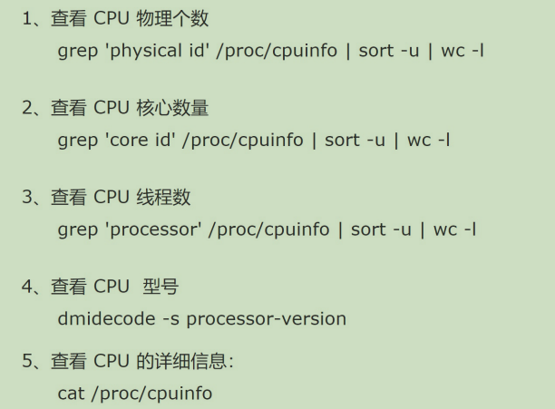
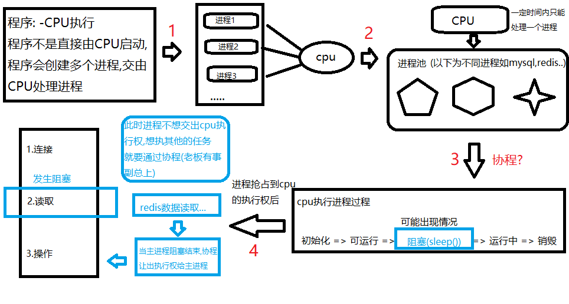
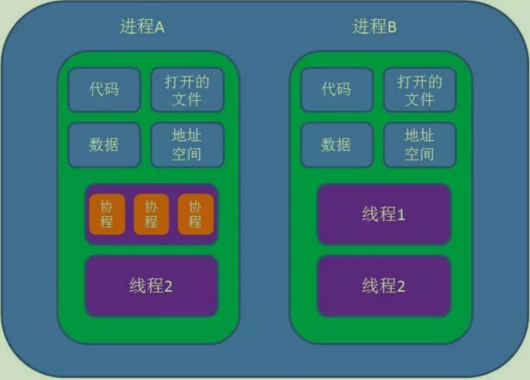
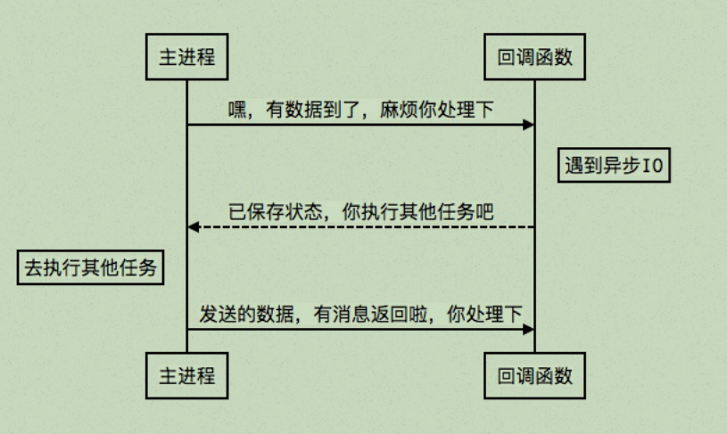
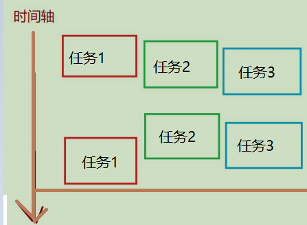
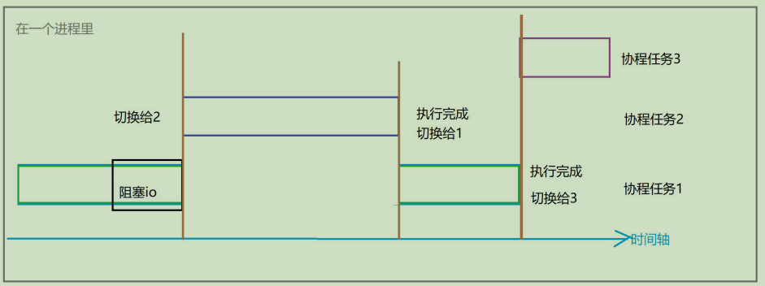
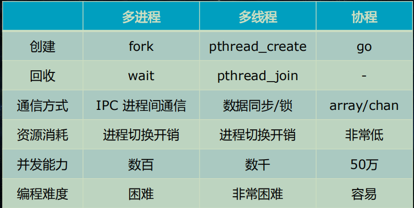
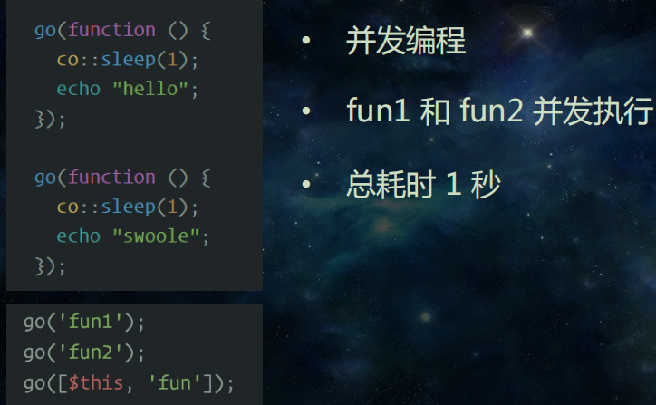
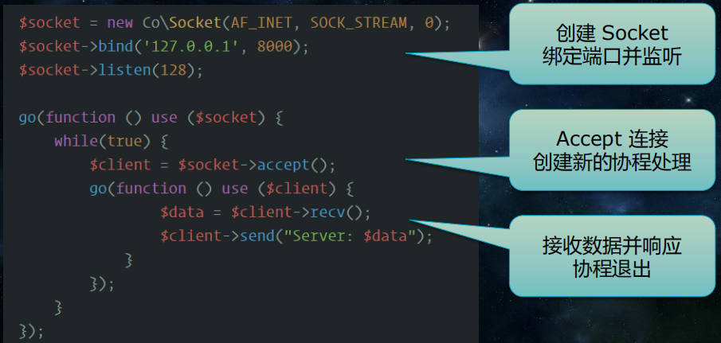
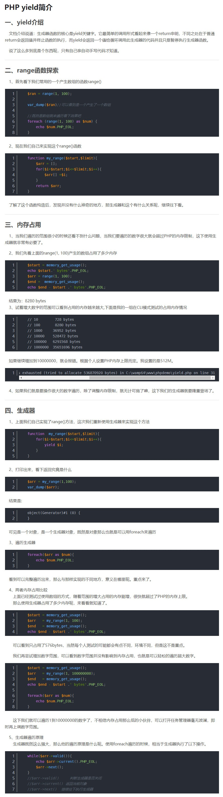

# 了解协程



## 1. 了解协程


swoole协程自带的睡眠函数,再sleep的基础上做了进一步封装``co::sleep(1)``
- 原生的``sleep``会改变进程的状态
- ``co::sleep``只是记录状态,但是不会真的改变进程的状态
````
------------------------------------test.php-------------------------------------
<?php
function index(){
sleep(1);
echo 'this is one';
}

function he(){
sleep(1);
echo 'this is two';
}

index();
he();
echo "this is master";
-----------------------------------结果(过程阻塞)-------------------------------------
[root@localhost ~]# time php test1.php 
this is one
this is two
this is master

real    0m2.027s  //执行时间为阻塞的时间和
user    0m0.017s
sys     0m0.006s
------------------------------------test.php-------------------------------------

协程风格

<?php
go(
function (){
  //swoole协程自带的睡眠函数,再sleep的基础上做了进一步封装
  co::sleep(1);
  echo 'work one'.PHP_EOL;
}
);

go(function(){
  co::sleep(1);
  echo 'work two'.PHP_EOL;
});
  
echo 'this is master'.PHP_EOL;
------------------------------------结果(过程非阻塞)--------------------------------------
[root@localhost ~]# time php test.php 
this is master
work one
work two

real    0m1.029s //是阻塞耗时最长的协程的执行时间(取最大值)
user    0m0.012s
sys     0m0.007s
````
### 1.1 什么是协程


协程，英文Coroutines,是一种比线程更加轻量级的存在。正如一个进程可以拥有多个线程一样，一个线程也可以拥有多个协程。最重要的是，``协程不是被操作系统内核所管理，而完全是由程序所控制(也就是在用户态执行)``。这样带来的好处就是性能得到了很大的提升，``不会像线程切换那样消耗资源``

### 1.2 任务的执行流程


#### 单核多进程执行是一种抢占模式,CPU快速的在各个进程间进行切换

#### 协程的执行流程

### 1.3 协程好处
- 开发者可以无感知的用同步的代码编写方式达到异步IO的效果和性能，避免了传统异步回调所带来的离散的代码逻辑和陷入多层回调中导致代码无法维护。
- 同时由于swoole是在底层封装了协程，所以对比传统的php层协程框架，开发者不需要使用yield关键词来标识一个协程IO操作，所以不再需要对yield的语义进
行深入理解以及对每一级的调用都修改为yield，这极大的提高了开发效率

注意：
- ``Swoole的协程在底层实现上是单线程``的，因此同一时间只有一个协程在工作，``协程的执行是串行的``。这与线程不同，多个线程会被操作系统调度到多个CPU并
行执行。
- ``协程遇到io才会切换``，单线程遇到io或执行时间过长就会被迫交出cpu执行权限，切换其他线程运行
- 当进程结束后,协程也随之结束,这是协程的缺点





## 2.模拟实现协程


(yield)这是一个生成器期对象，这个对象实现了Iterator迭代器，迭代器（可以遍历类）
那么为什么没有超过内存呢？实际上它每次返回的是一个值，通过yield借用迭代器的方法获取到我们需要的值，而没有一次性获取；

yield -》生成器 -》迭代器

迭代器的好处：
- 从容器类型中一个一个的取值，会把所有的值都取到
- 节省内存空间（迭代器并不会占用太大的空间，而是随着循环每次生成一个）

推荐文章： 
- [PHP设计模式之迭代器模式](https://juejin.im/post/5d5a3997e51d45620c1c53ba)
- [深入理解迭代器](https://segmentfault.com/a/1190000005710915)

### 2.1 任务切换
我们目前也是期望可以实现像swoole的协程那样遇到了阻塞就会切换到另一个协程，然后进行交替的执行；
````
<?php
function go1 (){
   for($i=0;$i<10;$i++){
        echo "协程1 go1 -->{$i}".PHP_EOL;
        sleep(1);
        yield;
   }
}
function go2 (){
   for($i=0;$i<10;$i++){
        echo "协程2 go1 -->{$i}".PHP_EOL;
        sleep(1);
        yield;
   }
}
$co1 = go1();//为一个对象
$co2 = go2();//为一个对象

while (true) {
    //类似于按下了暂停键
    $co1->current();
    $co2->current();
    $co1->next();
    $co2->next();
}
-------------------------------------------------结果--------------------------------
[root@localhost ~]# php test.php 
协程1 go1 -->0
协程2 go1 -->0
协程1 go1 -->1
协程2 go1 -->1
协程1 go1 -->2
协程2 go1 -->2
协程1 go1 -->3
协程2 go1 -->3
协程1 go1 -->4
协程2 go1 -->4
协程1 go1 -->5
协程2 go1 -->5  ...
````
就会出现循环执行, 对于while内容来说就是一个调度器；swoole也有；需要注意到的是我们只是做到任务切换，但是并不是减少时间；

如果希望真的减少，就比较难了，因为需要监控和异步执行；而直接用传统的方式去整呢，挺麻烦的还要自己去监听进程状态；这里我们以请求连接的方式实现以下：
### 2.2 协程实例体验
这里我们利用curl，因为``curl是支持异步操作``
- 初始化　curl_init();
- 设置相关变量　curl_setopt (resource $ch , int $option , mixed $value)
- 返回一个新curl批处理句柄  curl_multi_init
- 执行并获取结果　curl_exec(resource $mh , int &$still_running)
- 释放对象　curl_close()
````

<?php
$ch1 = curl_init();

//设定请求的RUL
curl_setopt($ch1, CURLOPT_URL, 'http://192.168.186.131/index.php');

//设定返回信息中包含响应信息头
// 用时会将头文件的信息作为数据流输出。 
//参数为1表示输出信息头,为0表示不输出
curl_setopt($ch, CURLOPT_HEADER, 0);

// 返回一个新cURL批处理句柄 resource
$mh = curl_multi_init(); 

// 向curl批处理会话中添加单独的curl句柄
curl_multi_add_handle($mh, $ch1); 

do {
    // 运行当前 cURL 句柄的子连接
    //$running一个用来判断操作是否仍在执行的标识的引用
    $mrc = curl_multi_exec($mh, $running);
    //执行返回int(1)否则返回int(0)
    var_dump($running);
} while ($running > 0);

var_dump(curl_multi_getcontent($ch1));
````
源码实现协程
````
-----------------------------------------------1.php---------------------------------------
[root@localhost php]# vim 1.php
<?php
sleep(5);
echo "睡上5秒钟";
-----------------------------------------------test.php----------------------------
<?php
function go1()
{
    $ch1 = curl_init();
    curl_setopt($ch1, CURLOPT_URL, 'http://192.168.186.131/index.php');
    curl_setopt($ch1, CURLOPT_HEADER, 0);
    $mh = curl_multi_init(); // 返回一个新cURL批处理句柄 resource
    curl_multi_add_handle($mh, $ch1); // 向curl批处理会话中添加单独的curl句柄
    do {
        // 运行当前 cURL 句柄的子连接
        //$running一个用来判断操作是否仍在执行的标识的引用
        $mrc = curl_multi_exec($mh, $running);
        yield false;
    } while ($running > 0);
    var_dump(curl_multi_getcontent($ch1));
    yield true;
}
function go2()
{
    $ch1 = curl_init();
    curl_setopt($ch1, CURLOPT_URL, 'http://192.168.186.131/index.php');
    curl_setopt($ch1, CURLOPT_HEADER, 0);
    $mh = curl_multi_init(); // 返回一个新cURL批处理句柄 resource
    curl_multi_add_handle($mh, $ch1); // 向curl批处理会话中添加单独的curl句柄
    do {
        // 运行当前 cURL 句柄的子连接
        $mrc = curl_multi_exec($mh, $running);
        yield false;
    } while ($running > 0);
    var_dump(curl_multi_getcontent($ch1));
    yield true;
}
$co1 = go1();
$co2 = go2();

while (true) {
    $res = $co1->current();
    $co2->current();
    $co1->next();
    $co2->next();
    if ($res) {
        break;
    }
}
-------------------------------------------结果-------------------------------------
[root@localhost ~]# time php test.php  
睡上5秒钟NULL

real    0m5.032s
user    0m2.482s
sys     0m2.145s
````
实质就是在某一个特定时间发生了阻塞的时候，就会中断执行，也就是中断while循环；然后就会进入到另一个方法中

