# 详解协程
## 1. 协程环境注意 及 与传统性能对比


>言外之意就是在支持协程的部分可以不使用``Co::creat``或者``go``创建

### 1.1 swoole的两种命名空间形式
Swoole支持两种形式的命名空间一种是Swoole\Coroutine，2.2.0以上可使用Co\命名空间短命名简化类名。
### 1.2 协程默认支持的位置
目前Swoole4仅有部分事件回调函数底层自动创建了协程，以下回调函数可以调用协程客户端，可以查看这里https://wiki.swoole.com/wiki/page/696.html在不支持协程的位置可以使用go或Co::create创建协程

如果我们不在协程的环境下使用协程的话，会出现如下错误
````
<?php
Co::sleep(2);
?>
````
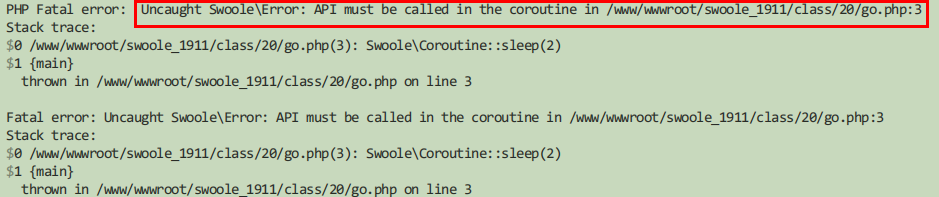
## 2.性能对比
````
mysql> select count(*) from user_info;
+----------+
| count(*) |
+----------+
|    99999 |
+----------+
1 row in set (0.09 sec)
````
我们通过原生的PHP连接测试看看速度如何
````
<?php
for ($i=0; $i < 100; $i++) {
    $pdo = new PDO('mysql:host=192.168.100.151;dbname=will', 'will', '123456');
    $pdo->query('SET NAMES UTF8');
    $pdo->query('select count(*) from user_info');
    $pdo = null;
}
--------------------------------------------结果-------------------------------------
[root@localhost ~]# time php 1.php

real    0m8.527s
user    0m0.026s
sys     0m0.092s
````
而使用swoole协程
````
for ($i=0; $i < 100; $i++) {
    go(function(){
        $mysql = new Swoole\Coroutine\MySQL();
        $res = $mysql->connect([
            'host' => '192.168.100.151',
            'user' => 'will',
            'password' => '123456',
            'database' => 'root',
        ]);
        if ($res == false) {
            return;
        }
        $ret = $mysql->query('select count(*) from user_info');
    });
}
--------------------------------------------结果-------------------------------------
[root@localhost ~]# time php 1.php

real    0m0.532s
user    0m0.030s
sys     0m0.076s
````
## 3.协程并发
``协程其实也是阻塞运行的``，如果，在一个执行中，比如同时查redis，再去查mysql，即使用了上面的协程，也是顺序执行的。

但是是可以实现几个协程并发执行的
>``通过延迟收包的形式获取``，遇到到IO 阻塞的时候，协程就挂起了，不会阻塞在那里等着网络回报，而是继续往下走,swoole当中可以用``setDefer()``方法声明延迟收包然后通过
``recv()``方法收包

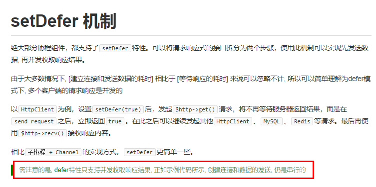
````
-------------------------------------------官方demo------------------------------------
<?php
$server = new Swoole\Http\Server("127.0.0.1", 9502, SWOOLE_BASE);

$server->set([
    'worker_num' => 1,
]);

$server->on('Request', function ($request, $response) {

    $tcpclient = new Swoole\Coroutine\Client(SWOOLE_SOCK_TCP);
    $tcpclient->connect('127.0.0.1', 9501, 0.5)
    $tcpclient->send("hello world\n");

    $redis = new Swoole\Coroutine\Redis();
    $redis->connect('127.0.0.1', 6379);
    $redis->setDefer();
    $redis->get('key');

    $mysql = new Swoole\Coroutine\MySQL();
    $mysql->connect([
        'host' => '127.0.0.1',
        'user' => 'user',
        'password' => 'pass',
        'database' => 'test',
    ]);
    $mysql->setDefer();
    $mysql->query('select sleep(1)');

    $httpclient = new Swoole\Coroutine\Http\Client('0.0.0.0', 9599);
    $httpclient->setHeaders(['Host' => "api.mp.qq.com"]);
    $httpclient->set([ 'timeout' => 1]);
    $httpclient->setDefer();
    $httpclient->get('/');

    $tcp_res  = $tcpclient->recv();
    $redis_res = $redis->recv();
    $mysql_res = $mysql->recv();
    $http_res  = $httpclient->recv();

    $response->end('Test End');
});
$server->start();
````
我们以同时连接连个mysql客户端为例
````
<?php
$http = new Swoole\Http\Server("0.0.0.0", 9501);
$http->on('request', function ($request, $response) {
    //解决两次请求问题
    if ($request->server['path_info'] == '/favicon.ico' || $request->server['request_uri'] == '/favicon.ico') {
            $response->end();
            return;
        }
    
    $newTime = time();

    //第一个连接
    $mysql1 = new Swoole\Coroutine\MySQL();
    $res1 = $mysql1->connect([
        'host' => '192.168.100.151',
        'user' => 'will',
        'password' => '123456',
        'database' => 'will',
    ]);

    if ($res1 == false) {
        return;
    }
    $ret1 = $mysql1->query('select sleep(1)');
 
    //第二次请求
    $mysql2 = new Swoole\Coroutine\MySQL();
    $res2 = $mysql2->connect([
        'host' => '192.168.100.151',
        'user' => 'will',
        'password' => '123456',
        'database' => 'will',
    ]);
    if ($res2 == false) {
        return;
    }
    $ret2 = $mysql2->query('select sleep(1)');
    $all_time = time()-$newTime;
    var_dump('完成需要的时间:'.$all_time);
    $response->end($all_time);
});

$http->start();
---------------------------------curl请求--------------------------------------
[root@localhost ~]# curl http://192.168.100.153:9501
2

[root@localhost ~]# time php 1.php
string(23) "完成需要的时间:2"
string(23) "完成需要的时间:2"
````
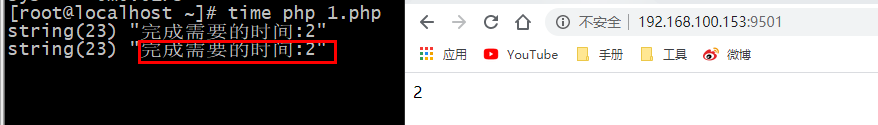

可以看到就是使用了协程的客户端,但是耗时还是两次连接的总时长,这是因为协程收包产生的问题；针对于这个问题我们可以通过``设置延迟收包解决``,即使用``setDefer()``
````
<?php
$http = new Swoole\Http\Server("0.0.0.0", 9501);
$http->on('request', function ($request, $response) {
    //解决两次请求问题
    if ($request->server['path_info'] == '/favicon.ico' || $request->server['request_uri'] == '/favicon.ico') {
            $response->end();
            return;
        }
    
    $newTime = time();

    //第一个连接
    $mysql1 = new Swoole\Coroutine\MySQL();
    $res1 = $mysql1->connect([
        'host' => '192.168.100.151',
        'user' => 'will',
        'password' => '123456',
        'database' => 'will',
    ]);

    if ($res1 == false) {
        return;
    }

    // 延迟收包
    $mysql1->setDefer();

    $ret1 = $mysql1->query('select sleep(1)');
 
    //第二次请求
    $mysql2 = new Swoole\Coroutine\MySQL();
    $res2 = $mysql2->connect([
        'host' => '192.168.100.151',
        'user' => 'will',
        'password' => '123456',
        'database' => 'will',
    ]);
    if ($res2 == false) {
        return;
    }

   // 延迟收包
   $mysql1->setDefer();

    $ret2 = $mysql2->query('select sleep(1)');
    $all_time = time()-$newTime;
    var_dump('完成需要的时间:'.$all_time);
    $response->end($all_time);
});

$http->start();
---------------------------------curl请求--------------------------------------
[root@localhost ~]# curl http://192.168.100.153:9501
1

[root@localhost ~]# time php 1.php
string(23) "完成需要的时间:1"
````
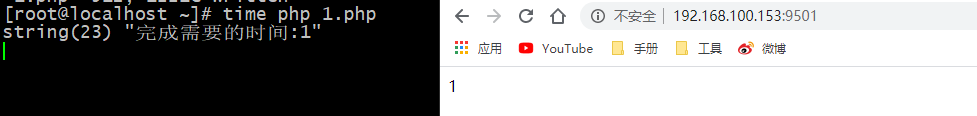


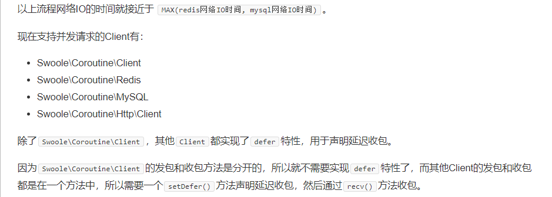
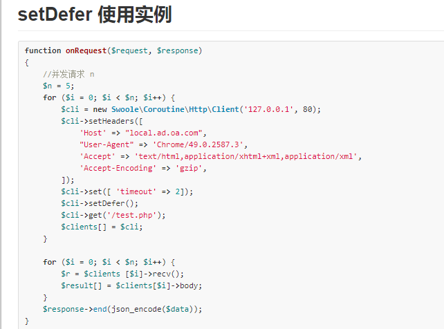

>发包：就是我们发送一个网络请求出去就是发包如 ``$mysql2 = new Swoole\Coroutine\MySQL()``; ``$mysql1->connect()`` 就是发包
>
>收包：就是接收结果 ```$mysql1->recv()```
## 4.协程间的通信
协程不允许通信；使用本地内存，不同的进程之间内存是隔离的。只能在同一进程的不同协程内进行push和pop操作

测试案例
````
这个案例适合早期的版本演示
<?php
$a = 1;
go(function() use ($a){
    $a = 'go';
});
go(function() use ($a){
    var_dump($a);
});
-----------------------------------效果-------------------------------
[root@localhost]# php test.php
int(1)
````
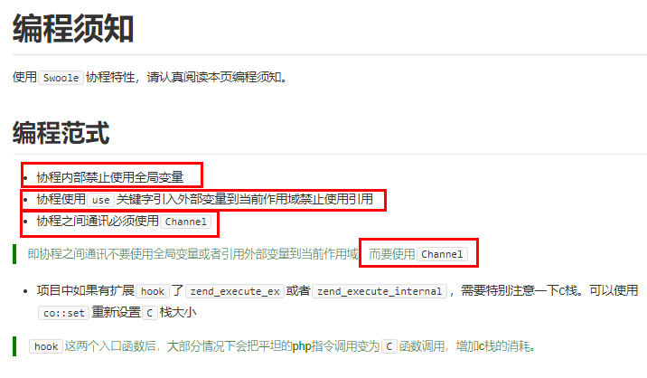
````
----------------------------------这种写法不推荐,只是为了演示,对于静态属性的支持不是很好--------------------------
class Test
{
    static $test = [];
}

$http = new Swoole\Http\Server("0.0.0.0", 9501);
$http->set([
    //设置一个进程方便演示效果
    'worker_num' => 1
]);
$http->on('request', function ($request, $response) {
    if ($request->server['path_info'] == '/favicon.ico' || $request->server['request_uri'] == '/favicon.ico') {
        $response->end();
        return;
    }

    $key = $request->get['key'];

    Test::$test = $key;
   
    //这里设置如果携带的参数key为will,则睡眠
    if ($key == 'will') {
        Co::sleep(5);
    }

    $response->end(Test::$test."\n");
});
$http->start();
----------------------------------------------正常请求结果----------------------------------
[root@localhost ~]# curl http://192.168.100.153:9501?key=123456  
123456
[root@localhost ~]# curl http://192.168.100.153:9501?key=sdfghj
sdfghj
````
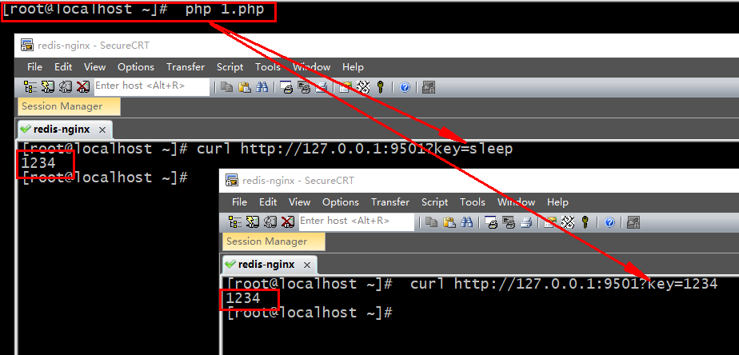

>这里出现的问题就是，上一个协程因为发生了阻塞，就被挂起；然后另一个请求进来之后把之前的$key就被切换了；所以当上一个进程进来的时候$key已经被修改了


[我们可以通过channel方式实现](https://wiki.swoole.com/#/coroutine/channel?id=push)
- 向通道中写入数据。``function Coroutine\Channel->push(mixed $data) : bool``
- 从通道中读取数据。``function Coroutine\Channel->pop() : mixed``

对协程调用场景，最常见的“生产者-消费者”事件驱动模型，一个协程负责生产产品并将它们加入队列，另一个负责从队列中取出产品并使用它
````
<?php
$chan = new chan(1);
go(function() use ($chan){
    $chan->push('this is channel');
});
go(function() use ($chan){
    var_dump($chan->pop());
});
----------------------------------结果--------------------------------
[root@localhost ~]#  php 1.php
string(15) "this is channel"
````
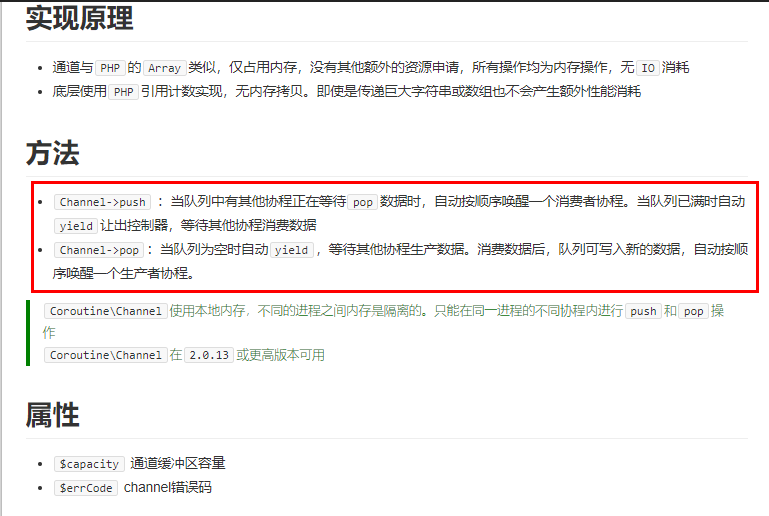

最终版使用
````
<?php
$http = new Swoole\Http\Server("0.0.0.0", 9501);
$http->on('request', function ($request, $response) {
    //解决两次请求问题
    if ($request->server['path_info'] == '/favicon.ico' || $request->server['request_uri'] == '/favicon.ico') {
            $response->end();
            return;
        }
    
    $newTime = time();
    
    //使用channel
    $chan = new chan(2);

    //第一个连接
    go(function() use ($chan){
        $mysql1 = new Swoole\Coroutine\MySQL();
        $res1 = $mysql1->connect([
            'host' => '192.168.100.151',
            'user' => 'will',
            'password' => '123456',
            'database' => 'will',
        ]);
    
        if ($res1 == false) {
            return;
        }
        // 延迟收包
        $mysql1->setDefer();
        $mysql1->query('select sleep(1)');
        // 把数据放到通道中
        $chan->push($mysql1->recv()) ;
      });

 
    //第二次请求
    go(function() use ($chan){
        $mysql2 = new Swoole\Coroutine\MySQL();
        $res2 = $mysql2->connect([
            'host' => '192.168.100.151',
            'user' => 'will',
            'password' => '123456',
            'database' => 'will',
        ]);
        // 延迟收包
        $mysql2->setDefer();
        // 把数据放到通道中
        $mysql2->query('select count(*) from user_info');
        $chan->push($mysql2->recv()) ;
    });

    
       $result = [];
       for ($i=0; $i < 2; $i++) {
            $result[] = $chan->pop();
       }
       var_dump($result);
        $all_time = time()-$newTime;
        var_dump('完成需要的时间:'.$all_time."\n");
});

$http->start();
---------------------------------------------结果----------------------------------
[root@localhost ~]# php 1.php 
array(2) {
  [0]=>
  array(1) {
    [0]=>
    array(1) {
      ["count(*)"]=>
      string(5) "99999"
    }
  }
  [1]=>
  array(1) {
    [0]=>
    array(1) {
      ["sleep(1)"]=>
      string(1) "0"
    }
  }
}
string(24) "完成需要的时间:1"

从结果上足以体现协程特点,任务一耗时,此时就先执行了任务的数据库查询
````
>消息的读取要依靠for循环来执行
````
$result = [];
for ($i=0; $i < 2; $i++) {
    $result[] = $chan->pop();
}
var_dump($result);
````
## 5.灵活处理可变通道个数
问题:
>我们以上的协程间通信还存在一定的问题,就是``chan(n)``中的n的个数怎么确定,因为在实际的工作中通道的个数可能就不止一个；是一个可变的方式；所以这里我们需要额外的调整和整理一下；

重点是记录下协程的个数
````
------------------------------------------------------------类的封装-----------------------------------------------
<?php
class ChanGroup
{
    private $chan;
    //记录协程的个数
    private $count;
   
    //先进行chan类的new
    public function __construct(){
      $this->chan = new chan();
    }
    
    //记录增加的协程的个数
    public function add_count(){
       $this->count++;
    }
    
   //消息的推送
    public function res_push($data){
       $this->chan->push($data);
    }

    //结果的输出
    public function res_pop(){
      $result = [];
      for($i = 0 ; $i < $this->count ; $i++){
          $result[]= $this->chan->pop();
      }
      return $result;
    }
}
--------------------------------------------------------------使用-----------------------------------------------------
$http = new Swoole\Http\Server("0.0.0.0", 9501);
$http->on('request', function ($request, $response) {
    //解决两次请求问题
    if ($request->server['path_info'] == '/favicon.ico' || $request->server['request_uri'] == '/favicon.ico') {
            $response->end();
            return;
        }
    
    $newTime = time();
    
    //使用封装的方法
    $chan = new ChanGroup;
    $chan->add_count();

    //第一个连接
    go(function() use ($chan){
        $mysql1 = new Swoole\Coroutine\MySQL();
        $res1 = $mysql1->connect([
            'host' => '192.168.100.151',
            'user' => 'will',
            'password' => '123456',
            'database' => 'will',
        ]);
    
        if ($res1 == false) {
            return;
        }
        // 延迟收包
        $mysql1->setDefer();
        $mysql1->query('select sleep(1)');
        // 把数据放到通道中
        //$chan->push($mysql1->recv()) ;
        $chan->res_push($mysql1->recv());
      });

 
    $chan->add_count();
    //第二次请求
    go(function() use ($chan){
        $mysql2 = new Swoole\Coroutine\MySQL();
        $res2 = $mysql2->connect([
            'host' => '192.168.100.151',
            'user' => 'will',
            'password' => '123456',
            'database' => 'will',
        ]);
        // 延迟收包
        $mysql2->setDefer();
        // 把数据放到通道中
        $mysql2->query('select count(*) from user_info');

        $chan->res_push($mysql2->recv()) ;
    });
     
     //使用封装方法输出结果
     $res = $chan->res_pop();
     var_dump($res);
    
    $all_time = time()-$newTime;
    var_dump('完成需要的时间:'.$all_time."\n");
});

$http->start();
````
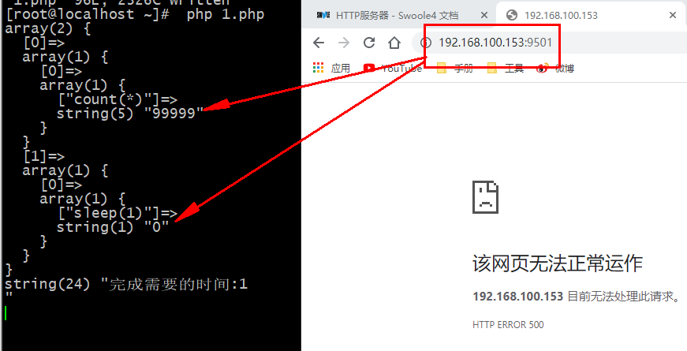

## 6. [一键协程化](https://wiki.swoole.com/#/runtime)
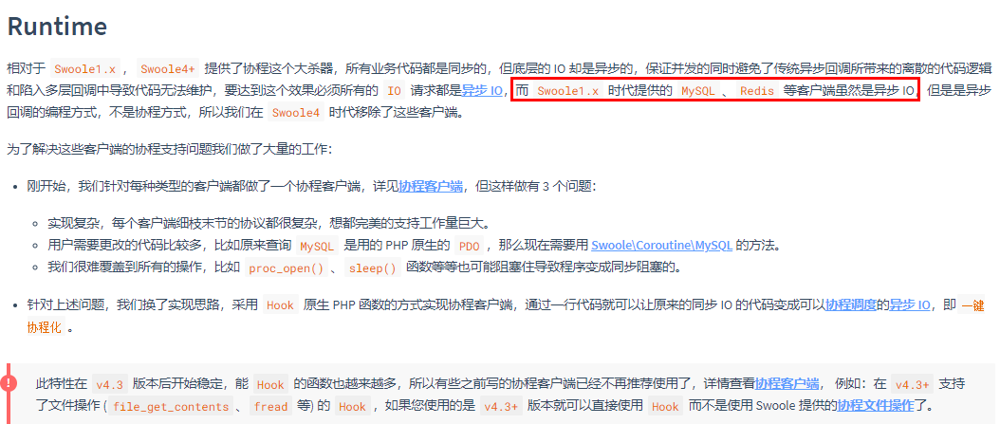
### 6.1 如下是协程的可用列表和不可用列表
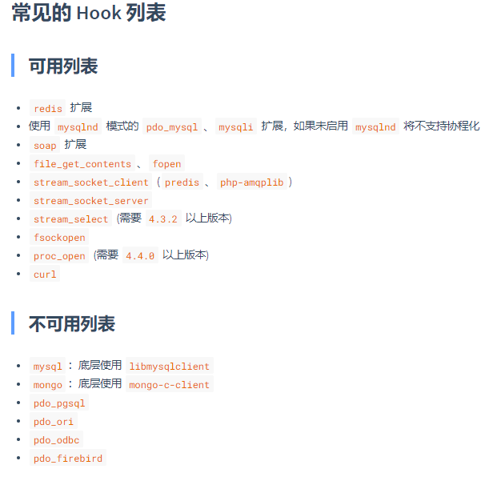
#### 6.2 使用及说明
一键协程化：让默认不支持协程原生组件支持协程；简单点说就是让我们不是使用swoole所提供的协程组件，而是用原生的组件比如pdo，redis这些操作，通过swoole的一键协程化，把他们转化为协程；也包括原生的sleep,值得注意的是curl是后期引入进来的如下测试案例

如上的代码是没有使用一键协程化；在代码的开始加上如下代码开启一键协程化``Swoole\Runtime::enableCoroutine(true);``调用方法后当前进程内全局生效，应该放在整个项目开始以获得 100% 覆盖的效果；
````
-----------------------------------------sleep的尝试----------------------------
<?php
//开启一键协程
Swoole\Runtime::enableCoroutine(true);

$http = new Swoole\Http\Server("0.0.0.0", 9501);
$http->on('request', function ($request, $response) {
    //防止浏览器二次访问的问题
    if ($request->server['request_uri'] == '/favicon.ico') {
        return ;
    }
     $newTime = time();
     $chan = new ChanGroup;
     $chan->add_count();
    
        //第一个连接
    go(function() use ($chan){
        // 把数据放到通道中
        sleep(1);
        $chan->res_push('2');
      });
    $chan->add_count();
    go(function() use ($chan){
        // 把数据放到通道中
        sleep(1);
        $chan->res_push('3');
      });
    $res = $chan->res_pop();
    var_dump($res);
    $all_time = time()-$newTime;
    var_dump('完成需要的时间:'.$all_time."\n");
    $response->end('');
});
$http->start();
--------------------------------------------------未开启一键协程------------------------------
[root@localhost ~]#  php 1.php
array(2) {
  [0]=>
  string(1) "2"
  [1]=>
  string(1) "3"
}
string(24) "完成需要的时间:2"
--------------------------------------------------开启一键协程------------------------------
[root@localhost ~]#  php 1.php
array(2) {
  [0]=>
  string(1) "2"
  [1]=>
  string(1) "3"
}
string(24) "完成需要的时间:1"
````
## 7.协程组件和与协程方法介绍
开启协程化的另一种方式

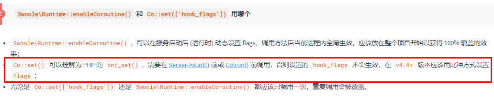

严格模式

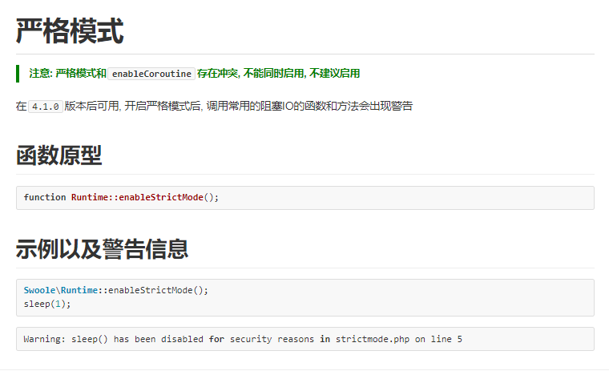

关注下[协程须知以及一些常见的问题](https://wiki.swoole.com/#/coroutine/notice)-- [旧版本地址](https://wiki.swoole.com/wiki/page/673.html)

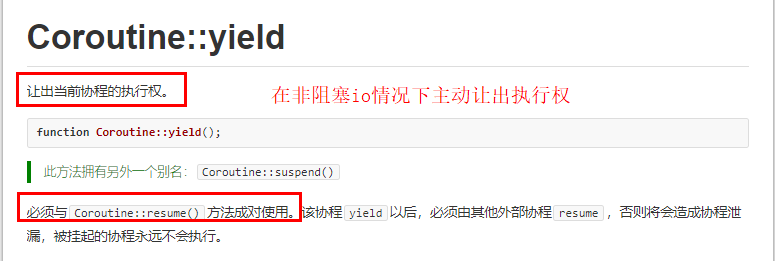
````
$cid = go(function () {
    echo "co 1 start\n";
    co::yield();
    echo "co 1 end\n";
});

go(function () use ($cid) {
    echo "co 2 start\n";
    co::sleep(0.5);
    co::resume($cid);
    echo "co 2 end\n";
});
--------------------------------------------结果------------------------------
[root@localhost ~]#  php 1.php
co 1 start
co 2 start
co 1 end
co 2 end
````
