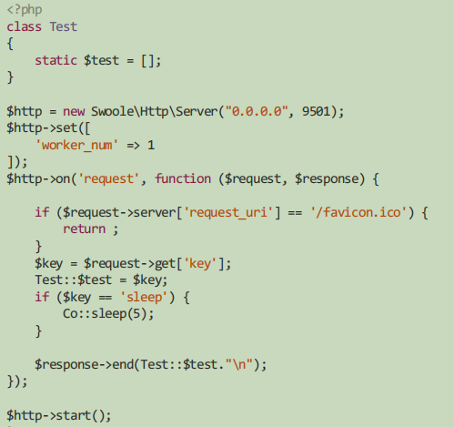
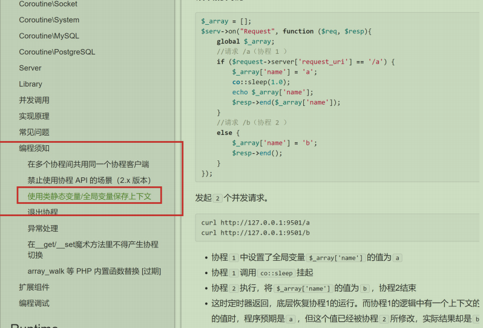
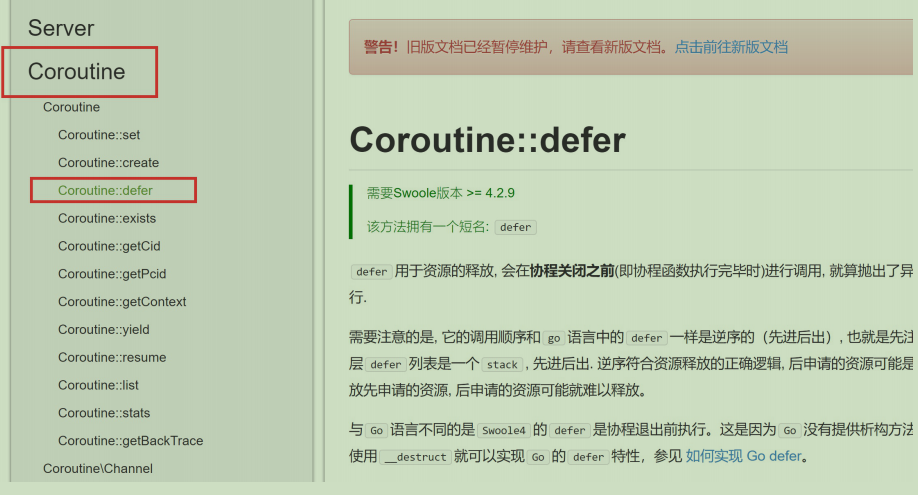
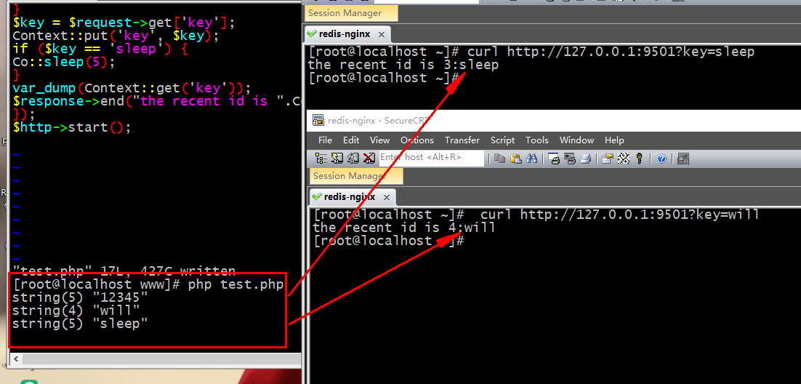
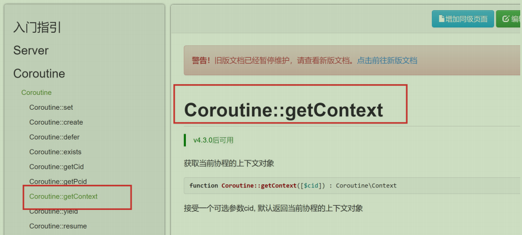
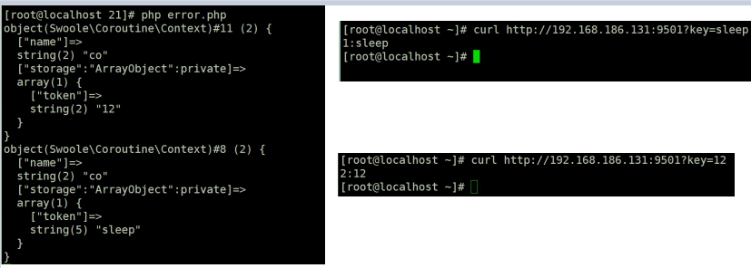
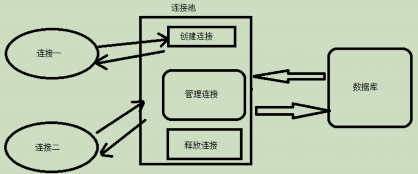
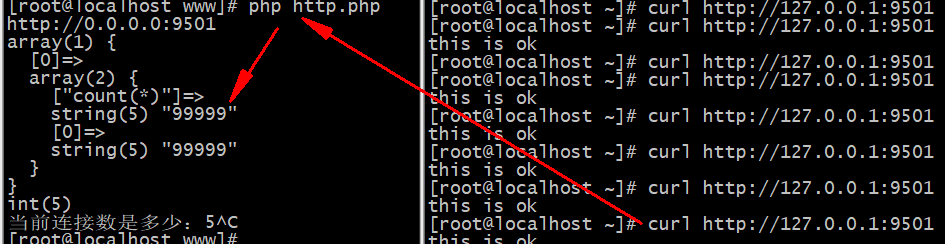

# 协程上下文与连接池
## 1. 协程上下文
[编程须知](https://wiki.swoole.com/wiki/page/851.html
)

在编程须知中有提到关于swoole在使用全局变量的时候所存在的问题，详情在[关于在协程中使用静态的全局变量，因为阻塞问题导致数据覆盖的问题](https://wiki.swoole.com/#/coroutine/notice?id=%e4%bd%bf%e7%94%a8%e7%b1%bb%e9%9d%99%e6%80%81%e5%8f%98%e9%87%8f%e5%85%a8%e5%b1%80%e5%8f%98%e9%87%8f%e4%bf%9d%e5%ad%98%e4%b8%8a%e4%b8%8b%e6%96%87)



>这里问题在于这个静态变量的复制,当协程在睡眠的时候,另一协程将复制,内容就会覆盖,当然在协程的局部环境中是没有什么问题
### 1.1 [自定义协程context](https://wiki.swoole.com/#/coroutine/notice?id=%e6%ad%a3%e7%a1%ae%e7%a4%ba%e4%be%8b%ef%bc%9a%e4%bd%bf%e7%94%a8context%e7%ae%a1%e7%90%86%e4%b8%8a%e4%b8%8b%e6%96%87)
对于上方叙述的问题问题协程提供了一个方式就是通过保存上下文的方式记录协程内容；



官方demo
````
----------------------------------------------Context.php----------------------------------------------
<?php
use Swoole\Coroutine;
class Context
{
     //这里pool就是用来保存每个协程中的变量
    //   'cid' =>[  这个就是协程的id
    //          保存全全局变量的信息
    //         $key => $val  
    //      ]
     protected static $pool = [];
     static function get($key)
     {
          //获取当前运行协程的id,他是在协程环境下的
         $cid = Coroutine::getuid();
         if ($cid < 0)
         {
            return null;
         }
         if(isset(self::$pool[$cid][$key])){
            return self::$pool[$cid][$key];
         }
         return null;
     }
     static function put($key, $item)
     {
         $cid = Coroutine::getuid();
         if ($cid > 0)
         {
            self::$pool[$cid][$key] = $item;
         }
     }
     static function delete($key = null)
     {
         $cid = Coroutine::getuid();
         if ($cid > 0)
         {
             if($key){
                unset(self::$pool[$cid][$key]);
             }else{
                unset(self::$pool[$cid]);
             }
         }
     }
 }
````
>以上类似于mysql中解决的脏读问题



defer用于资源的释放, 会在协程关闭之前(即协程函数执行完毕时)进行调用, 就算抛出了异常, 已注册的defer也会被执行

实例代码
````
----------------------------------------------test.php----------------------------------------------
<?php
use Swoole\Coroutin;
class Context
{
     //这里pool就是用来保存每个协程中的变量
    //   'cid' =>[  这个就是协程的id
    //          保存全全局变量的信息
    //         $key => $val  
    //      ]
     protected static $pool = [];
     static function get($key)
     {
          //获取当前运行协程的id,他是在协程环境下的
         $cid = Coroutine::getuid();
         if ($cid < 0)
         {
            return null;
         }
         if(isset(self::$pool[$cid][$key])){
            return self::$pool[$cid][$key];
         }
         return null;
     }
     static function put($key, $item)
     {
         $cid = Coroutine::getuid();
         if ($cid > 0)
         {
            self::$pool[$cid][$key] = $item;
         }
     }
     static function delete($key = null)
     {
         $cid = Coroutine::getuid();
         if ($cid > 0)
         {
             if($key){
                unset(self::$pool[$cid][$key]);
             }else{
                unset(self::$pool[$cid]);
             }
         }
     }
 }

<?php
include '/www/1.php';
$http = new Swoole\Http\Server("0.0.0.0", 9501);
$http->on('request', function ($request, $response) {
if ($request->server['request_uri'] == '/favicon.ico') {
  return ;
}
$key = $request->get['key'];
Context::put('key', $key);

if ($key == 'sleep') {
    Co::sleep(5);
}
defer(function(){
    Context::delete('name');
    var_dump('消耗数据');
});

$response->end("当前的协程为id".Co::getcid().":".Context::get('key')."\n");
});
$http->start();
````


>这里发现了即使出现了睡眠状况,也不会出现了混读的问题
### 1.2 [Co\Context](https://wiki.swoole.com/wiki/page/1075.html)


在文档中我们可以看到它做了一个操作就是 $context = new Co\Context(); ;而这个内容在手中没有太多的介绍
````
$http->on('request', function ($request, $response) {

    if ($request->server['request_uri'] == '/favicon.ico') {
        return ;
    }
    $key = $request->get['key'];

    // 也可以改为 Co::getContext();
    $context = new Co\Context;

    $context->name = 'co';
    $context['token'] =$key;
    // Context::put('key', $key);
    if ($key == 'sleep') {
        Co::sleep(5);
    }
    var_dump($context);

    $response->end(Co::getcid().":".$context['token']."\n");
});
````


支持的类型是数组和字符串，对象；并且只针对当前协程；同时我们可以根据效果可以看到，在当前协程执行完成之后就会把当前协程的内容进行清理

### 1.3 协程上下文在框架中的运用
扩展
## 2. mysql连接池介绍
### 2.1 什么是mysql连接池
数据库连接池（Connection pooling）是程序启动时建立足够的数据库连接，并将这些连接组成一个连接池，由程序动态地对池中的连接进行申请，使用，释放。
### 2.2 为什么需要mysql连接池
创建数据库连接是一个很耗时的操作，MySQL短连接每次请求操作数据库都需要建立与MySQL服务器建立TCP连接，这是需要时间开销的，TCP连接需要3次网络通信。这样就增加了一定的延时和额外的IO消耗，在并发量非常大的情况就会有影响

假设有100台PHP的应用服务器，每个机器需要启动100个apache或fpm工作进程，那每个进程都会产生一个长连接到MySQL。这一共会产生1万个My SQL连接。大家都知道MySQL是每个连接会占用1个线程。那MYSQL就需要创建1万个线程，这样大量的系统资源被浪费在线程间上下文切换上。而你的业务代码中并不是所有地方都在做数据库操作，所以这个就是浪费的。
### 2.3 如何解决
如果有连接池就不同了，如并发100个请求，实际上并不是每个请求的所有时间都在执行SQL查询。这样100个请求，共享20个MySQL连接就可以满足需求了。当一个请求操作完数据库后，开始进入模板渲染等流程，这时就会释放数据库连接给其他的请求使用。
### 2.4 适合场景
连接池仅在出现高并发的应用中才有价值，连接池并没有提高sql的查询速度，连接池是用来保护数据库的，不是用来提升性能的

当并发请求QPS达到数万或者数十万时，MySQL服务器就需要维持十万级的连接。这时数据库的压力就会非常大了。连接池技术就可以派上用场了，可以大大降低数据库连接数,减入服务器压力

>注意连接池是不会提高查询的速度和查询性能的,只是起到保护程序的作用,解决并发问题
## 3. 构建连接池
数据的连接池为维持若干个长连接，当新请求到达的时候，如果连接池有空闲连接，就分配给连接池去处理，否则，后面的数据库连接请求将被加入到等待队列中。
### 3.1. 数据库连接池的机制：
- 程序初始化时创建连接池
- 使用时向连接池申请可用连接
- 使用完毕，将连接返还给连接池
- 程序退出时，断开连接，并释放资源


### 3.2. 数据库连接池设计
- 创建连接：连接池启动后，初始化一定的空闲连接，指定为最少的连接min。当连接池为空，不够用时，创建新的连接放到池里，但不能超过指定的最大连接max数量。
- 连接释放：每次使用完连接，一定要调用释放方法，把连接放回池中，给其他程序或请求使用。
- 连接分配：连接池中用pop和push的方式对等入队和出队分配与回收。能实现阻塞分配，也就是在池空并且已创建数量大于max，阻塞一定时间等待其他请求的连接释放，超时则返回null。
- 连接管理：对连接池中的连接，定时检活和释放空闲连接等
### 3.3. 连接池设计
mysql查看最大连接
````
-------------------------------------------方式一-------------------------------------------
show VARIABLES LIKE "%max_conn%";

max_connections	1000
-------------------------------------------方式二-------------------------------------------
[root@localhost ~]# find / -name mysqladmin
/usr/local/mysql/bin/mysqladmin
[root@localhost ~]# vim /etc/profile (添加内容)
#MysqlAdmin
export PATH=$PATH:/usr/local/mysql/bin/mysqladmin
[root@localhost ~]# source /etc/profile
-------------------------------------------查询方式-------------------------------------------

默认支持6个连接

[root@localhost ~]# mysqladmin -uroot -proot processlist 
mysqladmin: [Warning] Using a password on the command line interface can be insecure.
+----+-----------------+-----------+----+---------+-------+------------------------+------------------+
| Id | User            | Host      | db | Command | Time  | State                  | Info             |
+----+-----------------+-----------+----+---------+-------+------------------------+------------------+
| 4  | event_scheduler | localhost |    | Daemon  | 45254 | Waiting on empty queue |                  |
| 43 | root            | localhost |    | Query   | 0     | starting               | show processlist |
+----+-----------------+-----------+----+---------+-------+------------------------+------------------+

[root@localhost ~]# mysqladmin -uroot -proot processlist | wc -l   
mysqladmin: [Warning] Using a password on the command line interface can be insecure.
6
````
查看mysql状态命令
- mysql> -- 查看mysql运行中的状态
>  mysql>show status;
- mysql> -- 查看mysql配置文件 支持模糊查询 like '%max_con%'
>  mysql>show variables;

建立连接池pool
````
---------------------------------------------pool.php---------------------------------------------
<?php
use Swoole\Coroutine\Channel;


class pool
{
    /**
     * 最大避免超标
     * @var [type]
     */
    protected $maxConnection = 10;
    /**
     * 最小连接个数，就是在初始化的时候事先创建多少个
     *
     * 创建太多也会消耗内存，也不一定用的了那么多
     * @var [type]
     */
    protected $minConnection = 5;
    /**
     * 会在协程中使用，保存创建的连接个数
     * @var
     */
    protected $channel;
    // 从连接池中获取连接的时候超时的时间
    protected $timeout = 3;

    protected $count = 0;
    // 允许空闲时间
    protected $idleTime = 10;

    protected static $instance = null;

    private function __construct()
    {
        // var_dump(1);
        $this->init();
        $this->gc();

    }
    /**
     * [getInstance description]
     * @return pool
     */
    public static function getInstance()
    {
        if (is_null(self::$instance)) {
            self::$instance = new static;
        }
        return self::$instance;
    }
    /**
     * 初始化
     *
     * 创建连接，并且把连接放在连接池中
     * @return [type] [description]
     */
    protected function init()
    {
        $this->channel = new Channel($this->maxConnection);
        for ($i=0; $i < $this->minConnection; $i++) {
            $this->count++;
            $connection = $this->createConnection();
            if ($connection) {
                $this->channel->push($connection);

            }
        }
    }

    public function call($conn, $method, $sql)
    {
        $arr = [];
        try {
            $res = $conn['db']->$method($sql);
           if($res){
               foreach ($res as $key => $val) {
                  $arr[] = $val;
               }
               return $arr;
           }

        } catch (\Exception $e) {

        }
    }
    // 创建连接
    protected function createConnection()
    {
        try {
            $pdo = new PDO('mysql:host=192.168.100.151;dbname=will', 'will', '123456');
            $pdo->setAttribute(PDO::ATTR_ERRMODE, PDO::ERRMODE_EXCEPTION);
            return [
                'last_used_time' => time(),
                'db' =>$pdo
            ];
        } catch (\Exception $e) {
            $this->count--;
            return false;
        }
    }
    /**
     * 获取连接并使用
     * @return PDO
     */
    public function getConnection()
    {
        $connection = null;
        if ($this->channel->isEmpty()) {
            // 表示没有连接可用
            // 没有连接就要创建
            if ($this->count < $this->maxConnection) {
                var_dump("创建新的连接");
                // 判断是否超过最大连接个数
                //
                // 一定要注意 记录和创建的顺序
                $this->count++;
                $connection = $this->createConnection();
            } else {
                var_dump("等待获取连接");
                $connection = $this->channel->pop($this->timeout);
            }
        } else {
            $connection = $this->channel->pop($this->timeout);
        }
        // 表示还有空余的连接
        // return $this->channel->pop($this->timeout);
        return $connection;

        // $connection;
        // var_dump("超时");
    }

    /**
     * 释放连接（重回连接池）
     * @param  [type] $connection [description]
     * @return [type]             [description]
     */
    public function freeConnection($connection)
    {
        $connection['last_used_time'] = time();
        $this->channel->push($connection);
    }
    /**
     * 回收空闲的连接
     */
    protected function gc()
    {
        // 定时检测连接
        swoole_timer_tick(2000, function(){
            $conns = [];// 记录可用的连接
            // 要检测的连接不止一个
            while (true) {
                if (!$this->channel->isEmpty() && $this->count > $this->minConnection) {
                    $connection = $this->channel->pop();
                    // var_dump($connection);
                    if (empty($connection)) {
                        continue;
                    }
                    // 检测是否空闲
                    if ((time()- $connection['last_used_time']) > $this->idleTime) {
                        $this->count--;
                        $connection['db'] = null;
                        echo "回收成功\n";
                    } else {
                        // 没有超过空闲时间就放回去
                        array_push($conns, $connection);
                    }
                } else {
                    break;
                }
            }
            foreach ($conns as $key => $value) {
                $this->channel->push($value);
            }
            var_dump($this->channel->length());
            echo "当前连接数是多少：".$this->count;
        });
    }
}
````
````
---------------------------------------------http.php---------------------------------------------
<?php
Swoole\Runtime::enableCoroutine(true);
require "pool.php";
$http = new Swoole\Http\Server("0.0.0.0", 9501);

$http->set(['worker_num' => 1]);

$http->on('request', function ($request, $response) {
    $pool = pool::getInstance();
    if ($request->server['request_uri'] == '/favicon.ico') {
        return ;
    }
    // // 在压测下 会出现短暂高峰期
    // $pdo = new PDO('mysql:host=localhost;dbname=swoole', 'root', '0000');
    // $pdo->query('select sleep(2)');

    // 会一直保持平稳状态

    $conn = $pool->getConnection();
    if (isset($conn) && $conn['db'] instanceof PDO) {
        $res = $pool->call($conn, 'query', "select count(*) from user_info");
        // $conn->query('select sleep(2)');
        var_dump($res);
        $response->end("this is ok"."\n");
        $pool->freeConnection($conn);
        // goto
    }
});
echo "http://0.0.0.0:9501\n";
$http->start();
````


